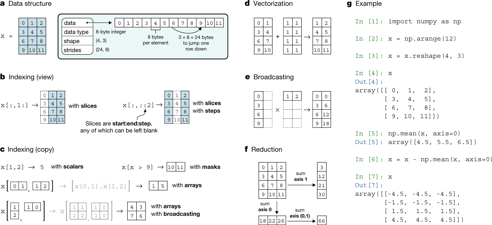
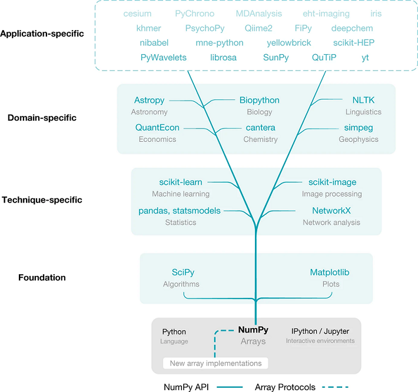
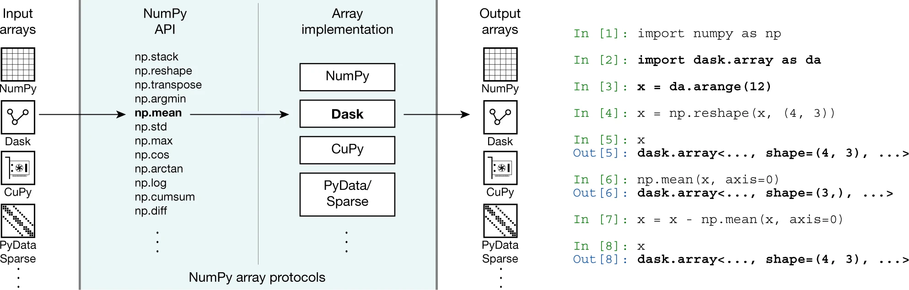

## Numpy Basics

####  █ The NumPy array incorporates several fundamental array concepts.

####  █ NumPy is the base of the scientific Python ecosystem.

####  █ NumPy’s API and array protocols expose new arrays to the ecosystem.

**References:**

- [Reshape numpy arrays in Python — a step-by-step pictorial tutorial](https://towardsdatascience.com/reshaping-numpy-arrays-in-python-a-step-by-step-pictorial-tutorial-aed5f471cf0b)
    - *https://www.nature.com/articles/s41586-020-2649-2/figures/1*
    - *https://www.nature.com/articles/s41586-020-2649-2/figures/2*
    - *https://www.nature.com/articles/s41586-020-2649-2/figures/3*
