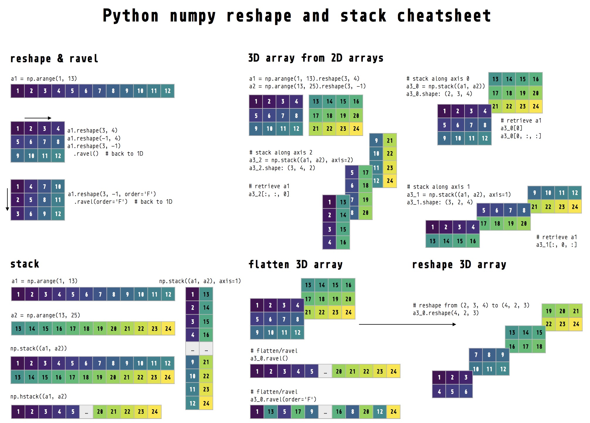

## Numpy Reshape Cheatsheet

References:

- [Array programming with NumPy](https://www.nature.com/articles/s41586-020-2649-2#Fig1)
- [Python Programming for Data Science: Chapter 5 Introduction to NumPy](https://www.tomasbeuzen.com/python-programming-for-data-science/chapters/chapter5-numpy.html)

