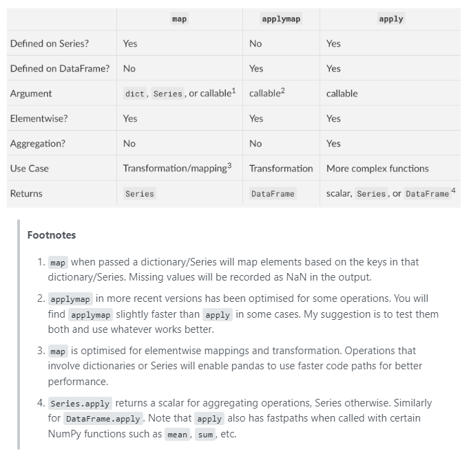
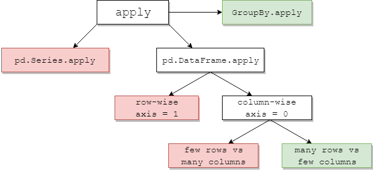
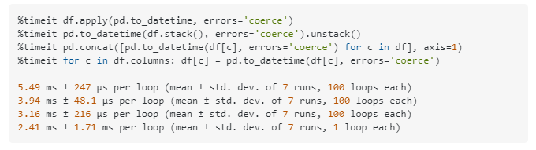

### apply, applymap, map


**Reference**: 
- [stackoverflow: Difference between map, applymap and apply methods in Pandas](https://stackoverflow.com/questions/19798153/difference-between-map-applymap-and-apply-methods-in-pandas)
- [stckoverflow: When should I (not) want to use pandas apply() in my code?](https://stackoverflow.com/questions/54432583/when-should-i-not-want-to-use-pandas-apply-in-my-code)


**Difference between apply, applymap, and map**

*the following table is copied from this [stackoverflow page](https://stackoverflow.com/questions/19798153/difference-between-map-applymap-and-apply-methods-in-pandas)*




**When to use apply**

*Note: the following are copied from this [stackoverflow page](https://stackoverflow.com/questions/54432583/when-should-i-not-want-to-use-pandas-apply-in-my-code)*




The following shows the performances of different approaches to converting a dataframe of 2 date columns stored in object (i.e. string) format into datetime format. 





```python
import pandas as pd
print(f'pandas version: {pd.__version__}')
```

    pandas version: 1.3.4
    


```python
##construct a dataframe
df = pd.DataFrame(data = {'abbr':['A', 'B', 'C'], 'val':[1, 2, 3]})
df
```


<div>
<style scoped>
    .dataframe tbody tr th:only-of-type {
        vertical-align: middle;
    }

    .dataframe tbody tr th {
        vertical-align: top;
    }

    .dataframe thead th {
        text-align: right;
    }
</style>
<table border="1" class="dataframe">
  <thead>
    <tr style="text-align: right;">
      <th></th>
      <th>abbr</th>
      <th>val</th>
    </tr>
  </thead>
  <tbody>
    <tr>
      <th>0</th>
      <td>A</td>
      <td>1</td>
    </tr>
    <tr>
      <th>1</th>
      <td>B</td>
      <td>2</td>
    </tr>
    <tr>
      <th>2</th>
      <td>C</td>
      <td>3</td>
    </tr>
  </tbody>
</table>
</div>


```python
#use map
map_dict = {'A':'Apple', 'B':'Banana', 'C': 'Cherry'}
df['fullname']=df['abbr'].map(map_dict)
df
```


<div>
<style scoped>
    .dataframe tbody tr th:only-of-type {
        vertical-align: middle;
    }

    .dataframe tbody tr th {
        vertical-align: top;
    }

    .dataframe thead th {
        text-align: right;
    }
</style>
<table border="1" class="dataframe">
  <thead>
    <tr style="text-align: right;">
      <th></th>
      <th>abbr</th>
      <th>val</th>
      <th>fullname</th>
    </tr>
  </thead>
  <tbody>
    <tr>
      <th>0</th>
      <td>A</td>
      <td>1</td>
      <td>Apple</td>
    </tr>
    <tr>
      <th>1</th>
      <td>B</td>
      <td>2</td>
      <td>Banana</td>
    </tr>
    <tr>
      <th>2</th>
      <td>C</td>
      <td>3</td>
      <td>Cherry</td>
    </tr>
  </tbody>
</table>
</div>


```python
#use apply
df['name_len']=df['fullname'].apply(lambda x:len(x))
df
```


<div>
<style scoped>
    .dataframe tbody tr th:only-of-type {
        vertical-align: middle;
    }

    .dataframe tbody tr th {
        vertical-align: top;
    }

    .dataframe thead th {
        text-align: right;
    }
</style>
<table border="1" class="dataframe">
  <thead>
    <tr style="text-align: right;">
      <th></th>
      <th>abbr</th>
      <th>val</th>
      <th>fullname</th>
      <th>name_len</th>
    </tr>
  </thead>
  <tbody>
    <tr>
      <th>0</th>
      <td>A</td>
      <td>1</td>
      <td>Apple</td>
      <td>5</td>
    </tr>
    <tr>
      <th>1</th>
      <td>B</td>
      <td>2</td>
      <td>Banana</td>
      <td>6</td>
    </tr>
    <tr>
      <th>2</th>
      <td>C</td>
      <td>3</td>
      <td>Cherry</td>
      <td>6</td>
    </tr>
  </tbody>
</table>
</div>


```python
#use apply
df['print_out'] = df[['abbr', 'val']].apply(lambda x:f'{x["abbr"]}:{x["val"]}', axis=1)
df
```


<div>
<style scoped>
    .dataframe tbody tr th:only-of-type {
        vertical-align: middle;
    }

    .dataframe tbody tr th {
        vertical-align: top;
    }

    .dataframe thead th {
        text-align: right;
    }
</style>
<table border="1" class="dataframe">
  <thead>
    <tr style="text-align: right;">
      <th></th>
      <th>abbr</th>
      <th>val</th>
      <th>fullname</th>
      <th>name_len</th>
      <th>print_out</th>
    </tr>
  </thead>
  <tbody>
    <tr>
      <th>0</th>
      <td>A</td>
      <td>1</td>
      <td>Apple</td>
      <td>5</td>
      <td>A:1</td>
    </tr>
    <tr>
      <th>1</th>
      <td>B</td>
      <td>2</td>
      <td>Banana</td>
      <td>6</td>
      <td>B:2</td>
    </tr>
    <tr>
      <th>2</th>
      <td>C</td>
      <td>3</td>
      <td>Cherry</td>
      <td>6</td>
      <td>C:3</td>
    </tr>
  </tbody>
</table>
</div>


```python
#use applymap
df['val_pow2']=df[['val']].applymap(lambda x: x**2)['val']
df
```


<div>
<style scoped>
    .dataframe tbody tr th:only-of-type {
        vertical-align: middle;
    }

    .dataframe tbody tr th {
        vertical-align: top;
    }

    .dataframe thead th {
        text-align: right;
    }
</style>
<table border="1" class="dataframe">
  <thead>
    <tr style="text-align: right;">
      <th></th>
      <th>abbr</th>
      <th>val</th>
      <th>fullname</th>
      <th>name_len</th>
      <th>print_out</th>
      <th>val_pow2</th>
    </tr>
  </thead>
  <tbody>
    <tr>
      <th>0</th>
      <td>A</td>
      <td>1</td>
      <td>Apple</td>
      <td>5</td>
      <td>A:1</td>
      <td>1</td>
    </tr>
    <tr>
      <th>1</th>
      <td>B</td>
      <td>2</td>
      <td>Banana</td>
      <td>6</td>
      <td>B:2</td>
      <td>4</td>
    </tr>
    <tr>
      <th>2</th>
      <td>C</td>
      <td>3</td>
      <td>Cherry</td>
      <td>6</td>
      <td>C:3</td>
      <td>9</td>
    </tr>
  </tbody>
</table>
</div>


