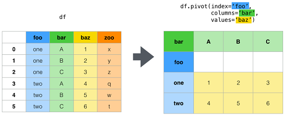
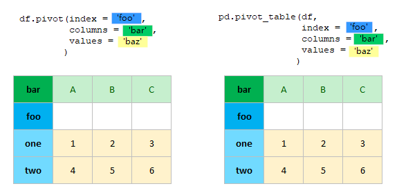
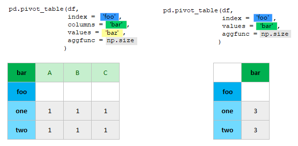
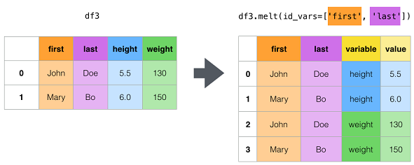
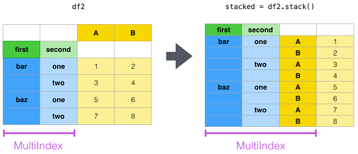
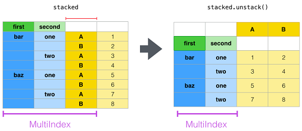
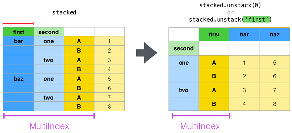
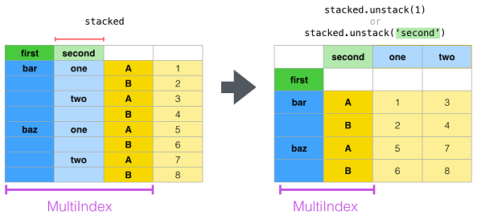
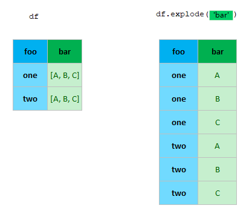

## Pandas reshaping data with pivot pivot_table melt unstack stack

**This is a Summary and Visual Explanation based on the [this page](https://pandas.pydata.org/docs/user_guide/reshaping.html)**

**Rferences**

- [ttps://pandas.pydata.org/docs/user_guide/reshaping.html](https://pandas.pydata.org/docs/user_guide/reshaping.html)

| name  | description  | example  |  
| ------------ | ------------ | ------------ | 
| [pivot](https://pandas.pydata.org/docs/reference/api/pandas.DataFrame.pivot.html)  | Return reshaped DataFrame organized by given index / column values. | df.pivot(index='foo', columns='bar', values='baz')  | 
| [pivot_table](https://pandas.pydata.org/docs/reference/api/pandas.DataFrame.pivot_table.html) | Create a spreadsheet-style pivot table as a DataFrame.  | pd.pivot_table(df, values='D', index=['A', 'B'], columns=['C'], aggfunc=np.sum)  |  
| [melt](https://pandas.pydata.org/docs/reference/api/pandas.DataFrame.melt.html)  | Unpivot a DataFrame from wide to long format, optionally leaving identifiers set. | df.melt(id_vars=['A'], value_vars=['B', 'C'])  |  
| [unstack](https://pandas.pydata.org/docs/reference/api/pandas.DataFrame.unstack.html) |  Pivot a level of the (necessarily hierarchical) index labels. | df.unstack()  |  
| [stack](https://pandas.pydata.org/docs/reference/api/pandas.DataFrame.stack.html) |Stack the prescribed level(s) from columns to index.| df.stack()  | 
| [explode](https://pandas.pydata.org/docs/reference/api/pandas.DataFrame.explode.html) |Transform each element of a list-like to a row, replicating index values.| df.explode('A')  |   

### █ pivot and pivot_table

- pivot does not do data aggregation such as min/max/mean
- pivot_table does data aggregation; when aggregation part is left empty in pivot_table, it is same as pivot

**pivot**

**pivot and pivot_table: same results**

**pivot_table with aggregation**

### █ melt

### █ stack and unstack

### █ explode

