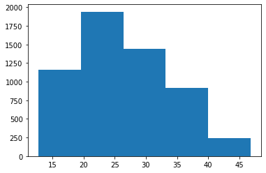
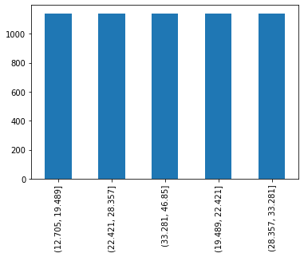
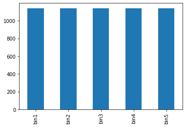
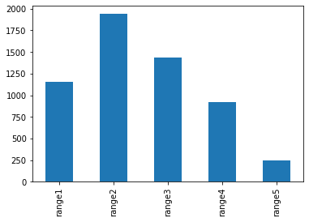
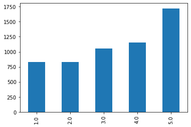

## Binning data with Pandas qcut and cut

- References:
    - [pandas.cut](https://pandas.pydata.org/docs/reference/api/pandas.cut.html)
    - [pandas.qcut](https://pandas.pydata.org/docs/reference/api/pandas.qcut.html)
    
- Binning data
    - The concept of binning data can be best illustrated by Histogram that put data into equal-distance buckets (or bins)
    - Any data series can be binned either by equal distance (i.e. each bin has same distance) or by equal size (i.e. each bin has same number of samples)
    - In Pandas, there are 2 functions help with the binning data task, and they are `qcut` and `cut`
        - `qcut`: bins data into equal size bins, namely, each bin has same number of samples
        - `cut`: bins data into equal distinace bins, namely, the distance in each bins is the same but number of samples in each bin may be different.
        
- Examples: the following script demostrates how to use qcut, cut, and combine these 2 functions with `rolling`
    - create equal size bins with `qcut` and plot bins in bar chart
    - create equal size bins with `qcut`, assign labels to each bin,  and plot bins in bar chart  
    - create equal-distance bins with `cut` and plot the bins (with bar chart)
    - create qual-distance bins with `cut` and `rolling` and plot the bins (with bar chart)
    - create equal-distance bins with `cut` and `rolling`, calculate the mean,  and plot the bins (with bar chart)
    - create 5 equal-distance bins on rolling normalized data with rolling `cut` and plot the bins (with bar chart)

### Load libraries and download data


```python
import pandas as pd
import numpy as np
import os
import gc
import copy
from pathlib import Path
from datetime import datetime, timedelta, time, date
```


```python
#this package is to download equity price data from yahoo finance
#the source code of this package can be found here: https://github.com/ranaroussi/yfinance/blob/main
import yfinance as yf
```

    c:\python37\lib\site-packages\requests\__init__.py:104: RequestsDependencyWarning: urllib3 (1.26.9) or chardet (5.0.0)/charset_normalizer (2.0.12) doesn't match a supported version!
      RequestsDependencyWarning)
    


```python
df = yf.Ticker('GSK').history(period="max", start='2000-01-01')
```


```python
df.head()
```


<div>
<style scoped>
    .dataframe tbody tr th:only-of-type {
        vertical-align: middle;
    }

    .dataframe tbody tr th {
        vertical-align: top;
    }

    .dataframe thead th {
        text-align: right;
    }
</style>
<table border="1" class="dataframe">
  <thead>
    <tr style="text-align: right;">
      <th></th>
      <th>Open</th>
      <th>High</th>
      <th>Low</th>
      <th>Close</th>
      <th>Volume</th>
      <th>Dividends</th>
      <th>Stock Splits</th>
    </tr>
    <tr>
      <th>Date</th>
      <th></th>
      <th></th>
      <th></th>
      <th></th>
      <th></th>
      <th></th>
      <th></th>
    </tr>
  </thead>
  <tbody>
    <tr>
      <th>1999-12-31</th>
      <td>19.986372</td>
      <td>20.053291</td>
      <td>19.897147</td>
      <td>19.941759</td>
      <td>136724</td>
      <td>0.0</td>
      <td>0.0</td>
    </tr>
    <tr>
      <th>2000-01-03</th>
      <td>19.964064</td>
      <td>20.097900</td>
      <td>19.629470</td>
      <td>19.830227</td>
      <td>545423</td>
      <td>0.0</td>
      <td>0.0</td>
    </tr>
    <tr>
      <th>2000-01-04</th>
      <td>19.830232</td>
      <td>19.830232</td>
      <td>19.272575</td>
      <td>19.317188</td>
      <td>360150</td>
      <td>0.0</td>
      <td>0.0</td>
    </tr>
    <tr>
      <th>2000-01-05</th>
      <td>19.584855</td>
      <td>19.964060</td>
      <td>19.451017</td>
      <td>19.964060</td>
      <td>472451</td>
      <td>0.0</td>
      <td>0.0</td>
    </tr>
    <tr>
      <th>2000-01-06</th>
      <td>19.763303</td>
      <td>19.807915</td>
      <td>19.272565</td>
      <td>19.674078</td>
      <td>837407</td>
      <td>0.0</td>
      <td>0.0</td>
    </tr>
  </tbody>
</table>
</div>


### Histogram


```python
df['Close'].hist(bins=5, figsize=(6, 4), grid=False)
```


    <AxesSubplot:>


    

    


### Create equal-sized bins (same number of samples in each bin) with `qcut`

#### create 5 equal-size bins and plot the bins (with bar chart)


```python
#create 10 equal-size bins
df['qcut'] = pd.qcut(df['Close'], q=5)
df['qcut']
```


    Date
    1999-12-31    (19.489, 22.421]
    2000-01-03    (19.489, 22.421]
    2000-01-04    (12.705, 19.489]
    2000-01-05    (19.489, 22.421]
    2000-01-06    (19.489, 22.421]
                        ...       
    2022-08-17     (33.281, 46.85]
    2022-08-18     (33.281, 46.85]
    2022-08-19     (33.281, 46.85]
    2022-08-22     (33.281, 46.85]
    2022-08-23     (33.281, 46.85]
    Name: qcut, Length: 5698, dtype: category
    Categories (5, interval[float64, right]): [(12.705, 19.489] < (19.489, 22.421] < (22.421, 28.357] < (28.357, 33.281] < (33.281, 46.85]]


```python
df['qcut'].value_counts()
```


    (12.705, 19.489]    1140
    (22.421, 28.357]    1140
    (33.281, 46.85]     1140
    (19.489, 22.421]    1139
    (28.357, 33.281]    1139
    Name: qcut, dtype: int64


```python
df['qcut'].value_counts().plot(kind='bar', figsize=(6, 4), grid=False)
```


    <AxesSubplot:>


    

    


#### create 5 equal-size bins, assign label to each bin and plot the bins (with bar chart)


```python
#create 10 equal-size bins
df['qcut'] = pd.qcut(df['Close'], q=5, labels = [f'bin{i+1}' for i in range(5)])
df['qcut']
```


    Date
    1999-12-31    bin2
    2000-01-03    bin2
    2000-01-04    bin1
    2000-01-05    bin2
    2000-01-06    bin2
                  ... 
    2022-08-17    bin5
    2022-08-18    bin5
    2022-08-19    bin5
    2022-08-22    bin5
    2022-08-23    bin5
    Name: qcut, Length: 5698, dtype: category
    Categories (5, object): ['bin1' < 'bin2' < 'bin3' < 'bin4' < 'bin5']


```python
df['qcut'].value_counts().sort_index()
```


    bin1    1140
    bin2    1139
    bin3    1140
    bin4    1139
    bin5    1140
    Name: qcut, dtype: int64


```python
df['qcut'].value_counts().sort_index().plot(kind='bar', figsize=(6, 4), grid=False)
```


    <AxesSubplot:>


    

    


### Create equal-distance bins (same distant but different number of samples in each bin) with `cut`

#### create 5 equal-distance bins and plot the bins (with bar chart)


```python
df['cut'] = pd.cut(df['Close'], bins=5, labels = [f'range{i+1}' for i in range(5)])
df['cut']
```


    Date
    1999-12-31    range2
    2000-01-03    range2
    2000-01-04    range1
    2000-01-05    range2
    2000-01-06    range2
                   ...  
    2022-08-17    range4
    2022-08-18    range4
    2022-08-19    range4
    2022-08-22    range4
    2022-08-23    range4
    Name: cut, Length: 5698, dtype: category
    Categories (5, object): ['range1' < 'range2' < 'range3' < 'range4' < 'range5']


```python
df['cut'].value_counts().sort_index().plot(kind='bar')
```


    <AxesSubplot:>


    

    


#### create 5 equal-distance bins with rolling and plot the bins (with bar chart)


```python
df['roll_cut'] = df['Close'].rolling(100, 100).apply(lambda x: pd.cut(x, bins=5, labels = [i+1 for i in range(5)])[-1])
```


```python
df['roll_cut'].value_counts().sort_index().plot(kind='bar')
```


    <AxesSubplot:>


    

    


#### create 5 equal-distance bins with rolling, calculate the mean,  and plot the bins (with bar chart)


```python
df['roll_cut_mean'] = df['Close'].rolling(100, 100).apply(lambda x: x[pd.cut(x, bins=5, labels = [i+1 for i in range(5)])==1].mean())
```


```python
df['roll_cut_mean'].value_counts().sort_index().plot(kind='bar')
```


    <AxesSubplot:>


#### create 5 equal-distance bins on rolling normalized data with rolling `cut` and plot the bins (with bar chart)


```python
df['roll_norm_close'] = df['Close'].rolling(100, 100).apply(lambda x: (x.mean()-x[-1])/x.std())
```


```python
df[['Close', 'roll_norm_close']].plot(figsize=(14, 6), secondary_y = ['roll_norm_close'], grid=True)
```


```python
df['roll_norm_close_cut'] = df['roll_norm_close'].rolling(100, 100).apply(lambda x: pd.cut(x, bins=5, labels = [i+1 for i in range(5)])[-1])
```


```python
df['roll_norm_close_cut'].value_counts().sort_index().plot(kind='bar', title='roll_norm_close_cut')
```


```python
df['Close'].plot(kind='hist', bins=5, title='Close')
```
