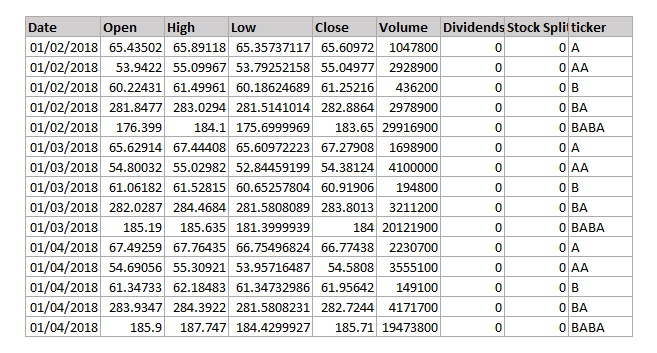
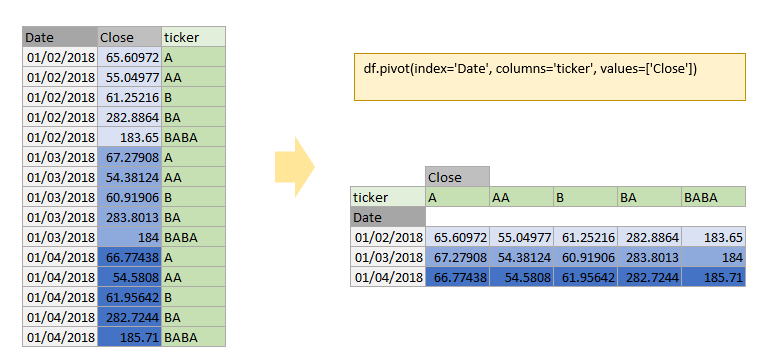
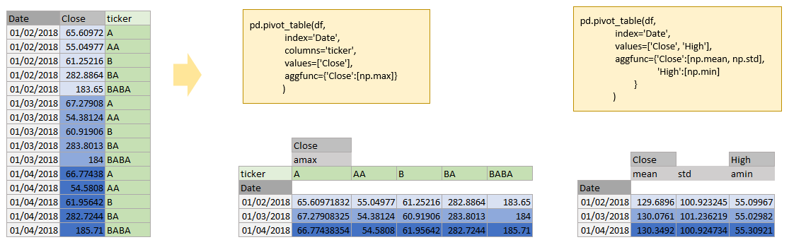
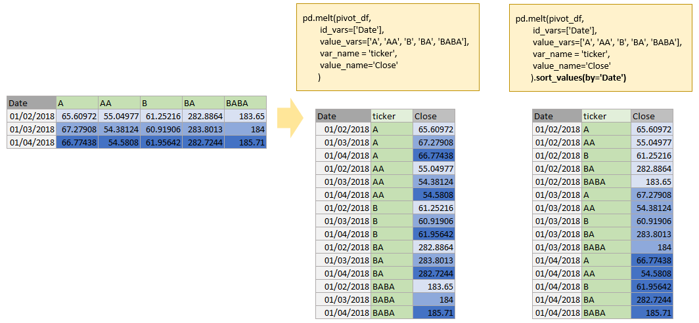
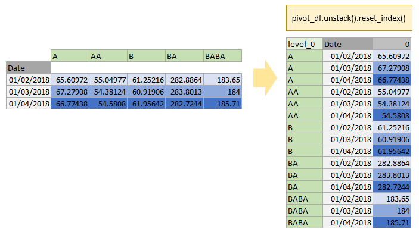
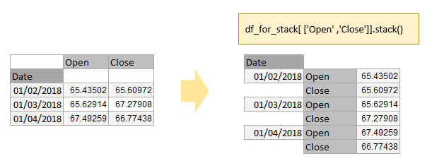

##  Reshaping data

### Reference:
- [https://pandas.pydata.org/Pandas_Cheat_Sheet.pdf](https://pandas.pydata.org/Pandas_Cheat_Sheet.pdf)
- [https://pandas.pydata.org/docs/reference/frame.html](https://pandas.pydata.org/docs/reference/frame.html)

[cheat sheet pdf](files/pandas cheatsheet - reshaping data.pdf)

### Load DataFrame

```python
import pandas as pd
```


```python
df = pd.read_csv('sample.csv')
df = df[df['Date']<='2018-01-04'].copy(deep=True)
```

```python
df
```

> 

### pivot:
- `reshape DataFrame by given index / column values`

```python
df.pivot(index='Date', columns='ticker', values=['Close'])
```

> 


### pivot_table
- `Create a spreadsheet-style pivot table as a DataFrame.`

```python
pd.pivot_table(df, 
               index='Date', 
               columns='ticker', 
               values=['Close'], 
               aggfunc={'Close':[np.max]}
              )
```


```python
pd.pivot_table(df, 
               index='Date', 
               values=['Close', 'High'], 
               aggfunc={'Close':[np.mean, np.std],
                        'High':[np.min]
                       }
              )
```

> 


### melt
-`Unpivot a DataFrame from wide to long format`

```python
#prepare data for melt operation
pivot_df = df.pivot(index='Date', columns='ticker', values=['Close']).reset_index()
pivot_df.columns = ['Date', 'A', 'AA', 'B', 'BA', 'BABA']
pivot_df
```


<div>
<style scoped>
    .dataframe tbody tr th:only-of-type {
        vertical-align: middle;
    }

    .dataframe tbody tr th {
        vertical-align: top;
    }

    .dataframe thead th {
        text-align: right;
    }
</style>
<table border="1" class="dataframe">
  <thead>
    <tr style="text-align: right;">
      <th></th>
      <th>Date</th>
      <th>A</th>
      <th>AA</th>
      <th>B</th>
      <th>BA</th>
      <th>BABA</th>
    </tr>
  </thead>
  <tbody>
    <tr>
      <th>0</th>
      <td>2018-01-02</td>
      <td>65.609718</td>
      <td>55.049774</td>
      <td>61.252163</td>
      <td>282.886414</td>
      <td>183.649994</td>
    </tr>
    <tr>
      <th>1</th>
      <td>2018-01-03</td>
      <td>67.279083</td>
      <td>54.381237</td>
      <td>60.919060</td>
      <td>283.801270</td>
      <td>184.000000</td>
    </tr>
    <tr>
      <th>2</th>
      <td>2018-01-04</td>
      <td>66.774384</td>
      <td>54.580803</td>
      <td>61.956425</td>
      <td>282.724426</td>
      <td>185.710007</td>
    </tr>
  </tbody>
</table>
</div>


```python
pd.melt(pivot_df, 
        id_vars=['Date'], 
        value_vars=['A', 'AA', 'B', 'BA', 'BABA'], 
        var_name = 'ticker', 
        value_name='Close'
       ).sort_values(by='Date')
```

> 


### unstack
- `Pivot a level of the (necessarily hierarchical) index labels.`
- similar to `melt`

```python
#prepare data  for unstack operation
pivot_df.set_index(keys=['Date'], inplace=True)
pivot_df
```

<div>
<style scoped>
    .dataframe tbody tr th:only-of-type {
        vertical-align: middle;
    }

    .dataframe tbody tr th {
        vertical-align: top;
    }

    .dataframe thead th {
        text-align: right;
    }
</style>
<table border="1" class="dataframe">
  <thead>
    <tr style="text-align: right;">
      <th></th>
      <th>A</th>
      <th>AA</th>
      <th>B</th>
      <th>BA</th>
      <th>BABA</th>
    </tr>
    <tr>
      <th>Date</th>
      <th></th>
      <th></th>
      <th></th>
      <th></th>
      <th></th>
    </tr>
  </thead>
  <tbody>
    <tr>
      <th>2018-01-02</th>
      <td>65.609718</td>
      <td>55.049774</td>
      <td>61.252163</td>
      <td>282.886414</td>
      <td>183.649994</td>
    </tr>
    <tr>
      <th>2018-01-03</th>
      <td>67.279083</td>
      <td>54.381237</td>
      <td>60.919060</td>
      <td>283.801270</td>
      <td>184.000000</td>
    </tr>
    <tr>
      <th>2018-01-04</th>
      <td>66.774384</td>
      <td>54.580803</td>
      <td>61.956425</td>
      <td>282.724426</td>
      <td>185.710007</td>
    </tr>
  </tbody>
</table>
</div>


```python
pivot_df.unstack().reset_index()
```
> 


### stack
- `Stack the prescribed level(s) from columns to index.`


```python
#prepare data for stack operation
df_for_stack = df.loc[df['ticker']=='A', ['Date','Open','Close']]
df_for_stack.set_index(keys=['Date'], inplace=True)
df_for_stack
```

```python
df_for_stack[ ['Open' ,'Close']].stack()
```
> 