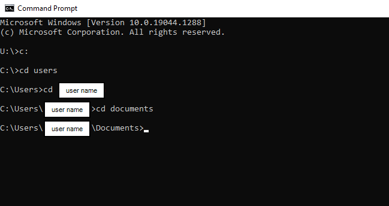
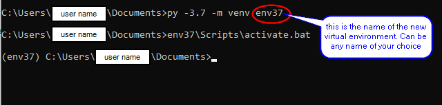
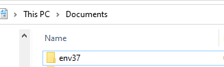
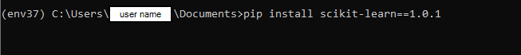
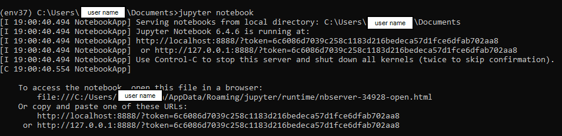
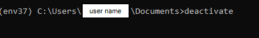
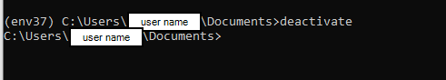

***

### How to set up a python virtual environment on a Windows machine

*Jun 30, 2022*

#### Reference:
[venv — Creation of virtual environments](https://docs.python.org/3/library/venv.html)

#### Steps:

##### 1. Navigate to the folder where you want to save the virtual environment

- Open command window
- Change to directory to destination folder. 
> For example, run a few lines of *cd* commands as shown in the following screenshot to navigate to the 'Documents' folder
> 

###### 2. Run command to create a virtual environment

- run command:  `py -3.7 -m venv env37`
>- *py -3.7* indicates creating a virtual enviroment in python verions 3.7. if you are working in python 3.9, then the command is  `py -3.9 -m venv env37`
>- env37 is the name of the new virtual environment. You can change it to whatever name of your choice, for example, it could be envaaa, and in this case the command is: `py -3.7 -m venv envaaa`
>- after this command is run successfully, a new folder is created in your destination folder. The name of the new folder is the same as the environment name.
> 
> 

3. Activate the virtual environment
- run command: `env37\Scripts\activate.bat`
> after activating the new environment, you can install packages. for example, run `pip install scikit-learn==1.0.1` to install *scikit learn* package version 1.0.1. 
> 
> or you can open *jupyter notebook*  by typing `jupyter notebook` in command line
> 

4. Deactivate the virtual environment
- run command: `deactivate`
> 
> 

