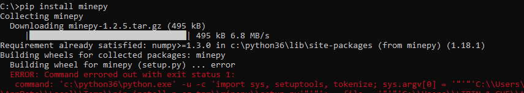
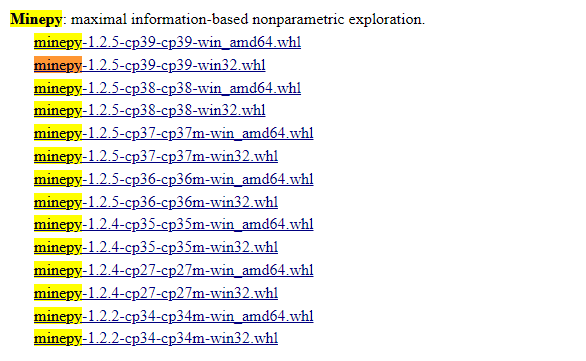
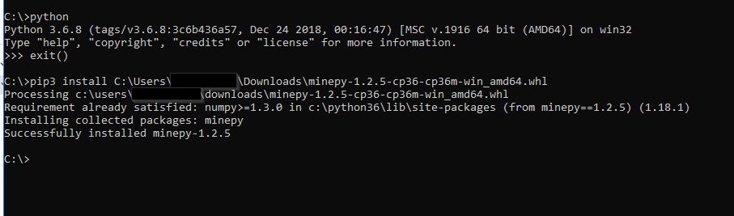
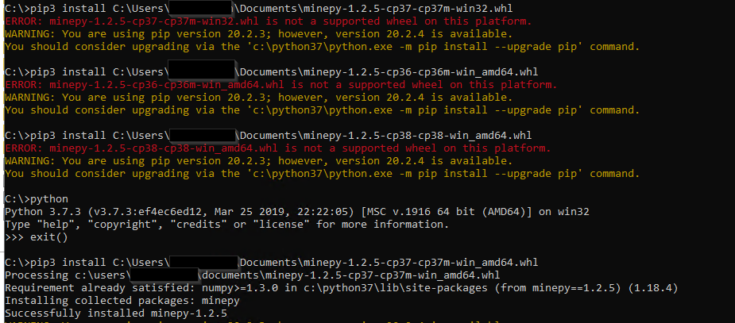

### How to install minepy pacakge for Max Information Coefficient (MIC)

- `minepy` package provides a library for the Maximal Information-based Nonparametric Exploration (MIC and MINE family).  
- the installation of `minepy` is a bit tricky in windows environment. 
- here is a quick guide on installing the package

Using the installation command `pip install minepy` gives error message.

My solution is to install using wheel file. The file can be downloaded here: https://www.lfd.uci.edu/~gohlke/pythonlibs/. 

It is very important to download a file that matches with your python version. Otherwise the installation will fail.
For example, my python version is 3.6, so I downloaded the whl file with 36 in file name. 

If you download the file that does not match with your python version, you will get error message. For example, I have Python 3.7 on another machine and I tried a few files.

