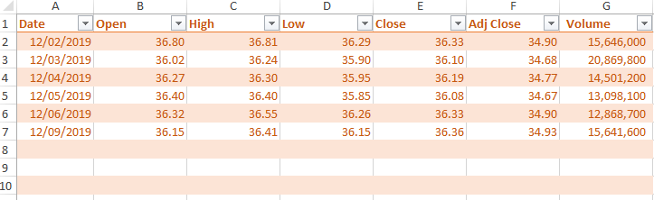
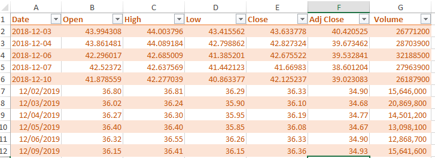
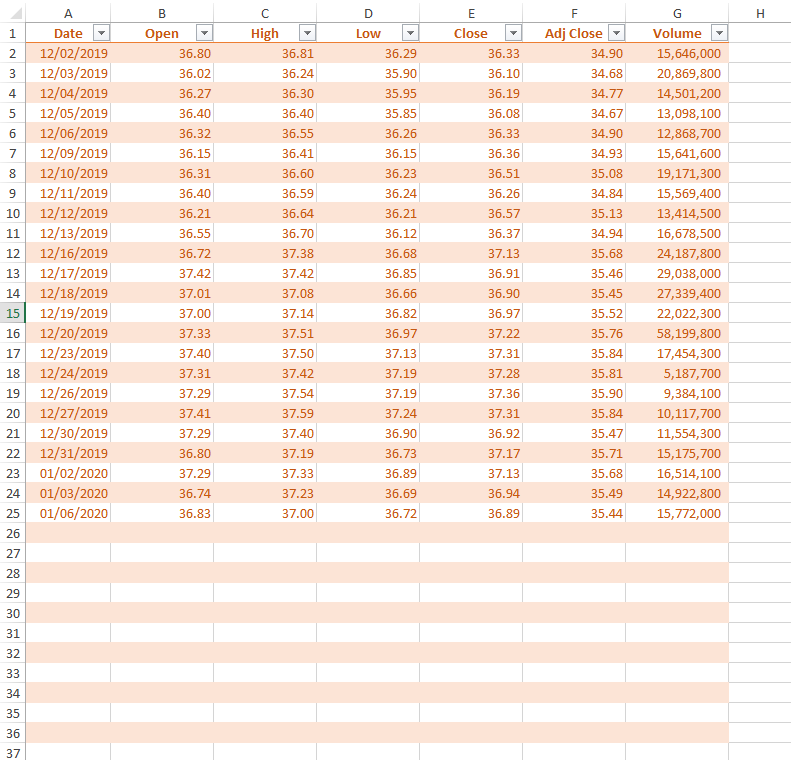
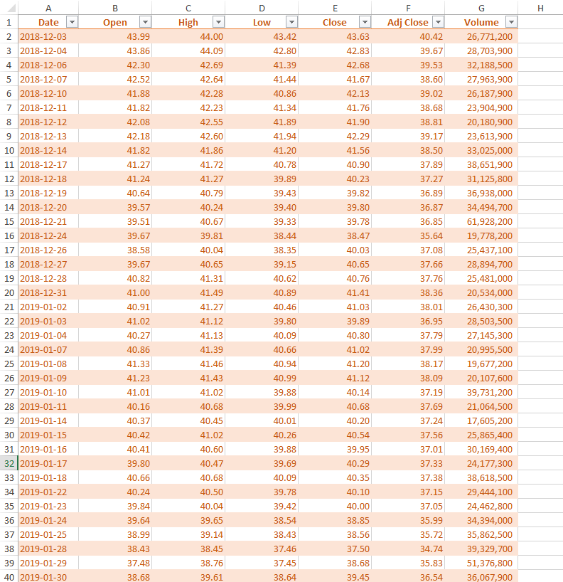

### How to work with openpyxl


A lot of times we need to use python to either create Excel reports with fancy formating and formulas or update existing reports with new data. Up to now there is no perfect python library that does a good job working with Excel files

### Introduction on openpyxl

#### Installation
- The installation is pretty straight forward: `pip install openpyxl`
- For more details, go to this page: [https://openpyxl.readthedocs.io/en/stable/index.html](https://openpyxl.readthedocs.io/en/stable/index.html)

#### Example setup
- `sample.xlsx` has two worksheets
- `PFC.csv` file is a csv file. Data in this file will be inserted into `sample.xlsx` file

#### Example 1: Insert rows
- This example shows how to insert rows into an existing worksheet.
- New rows will be inserted under the header row and on top of existing data rows.
- The screenshot before inserting new rows



- The screenshot after new rows are inserted



#### Example 2: Replace with new data
- This example shows how to first clear contents in an worksheet and then push new data to the worksheet
- First data in a worksheet will be cleared; Then new data will be pushed to the worksheet, but the formatting will be kept.
- The screenshot before replacing worksheet with new data



- The screenshot after replacing worksheet with new data



### Limitations
- one big limitation is this package can't read password protected Excel files though it can create password protected excel files


```python
#load libraries
import pandas as pd
from openpyxl import Workbook, load_workbook
from openpyxl.utils.dataframe import dataframe_to_rows
```


```python
#read sample excel file
wb = load_workbook(filename = 'sample.xlsx')
print(wb.sheetnames)
```


```python
#read new data file
df_new = pd.read_csv('PFE.csv')
df_new.shape
```


```python
df_new.head()
```

#### Example 1: Insert rows


```python
#demostrates how to insert new rows on top (below the header row)
ws = wb['PFE']
ws.insert_rows(idx=2, amount=5)
i = 0
for row in ws['A2:G6']:
    j = 0
    for cell in row:
        cell.value = df_new.iloc[i, j]
        j = j+1

    i = i+1
```

#### Example 2: Replace with new data


```python
#first clear contents 
#then assign values
ws = wb['PFE2']
print(ws.max_row, ws.max_column)
for row in ws['A2:G' + str(ws.max_row)]:
    for cell in row:
        cell.value = None

print(ws.max_row)

i = 0
for row in ws['A2:G' + str(df_new.shape[0])]:
    j = 0
    for cell in row:
        cell.value = df_new.iloc[i, j]
        j = j+1

    i = i+1

```


```python
wb.save(filename = 'sample.xlsx')
```


```python

```
