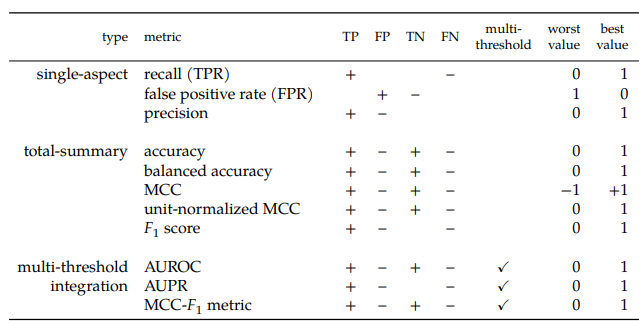
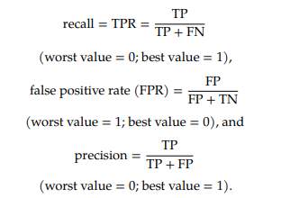
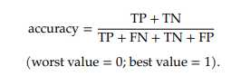
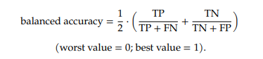
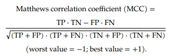
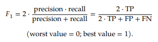
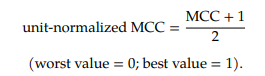
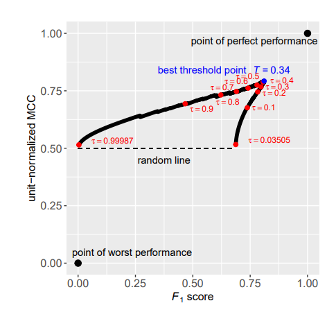
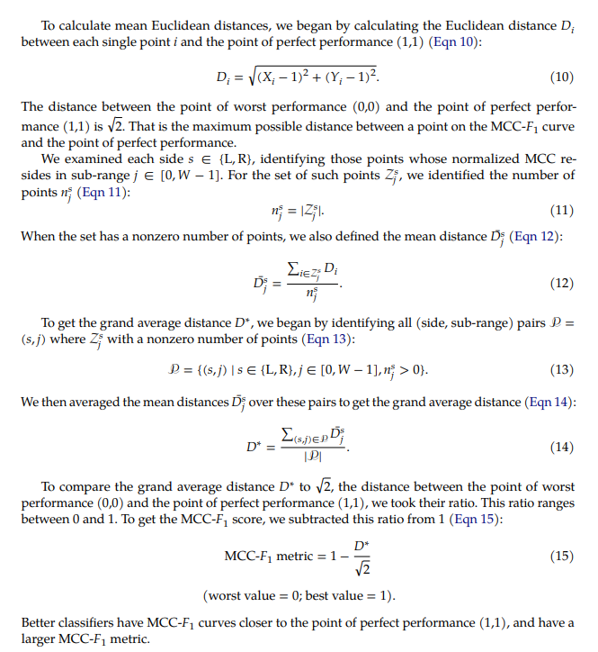
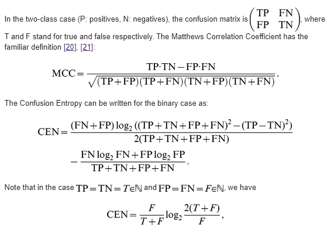

## Matthews correlation coefficient
*Jan 11, 2021*

The Matthews correlation coefficient (MCC) or phi coefficient is used in **machine learning** as a measure of the quality of binary (two-class) classifications...The MCC is defined identically to Pearson's phi coefficient...Despite these antecedents which predate Matthews's use by several decades, the term MCC is widely used in the field of bioinformatics and machine learning. [Definition by Wikipedia](https://en.wikipedia.org/wiki/Matthews_correlation_coefficient)

### Literature review:

1. Chicco, D., Jurman, G. The advantages of the Matthews correlation coefficient (MCC) over F1 score and accuracy in binary classification evaluation. BMC Genomics 21, 6 (2020). https://doi.org/10.1186/s12864-019-6413-7

> 1. Accuracy and F1 score computed on confusion matrices have been (and still are) among the most popular adopted metrics in binary classification tasks. However, these statistical measures can dangerously show overoptimistic inflated results, especially on imbalanced datasets.
> 1. The Matthews correlation coefficient (MCC), instead, is a more reliable statistical rate which produces a high score only if the prediction obtained good results in all of the four confusion matrix categories (true positives, false negatives, true negatives, and false positives), proportionally both to the size of positive elements and the size of negative elements in the dataset.
> 1. In this article, we show how MCC produces a more informative and truthful score in evaluating binary classifications than accuracy and F1 score, by first explaining the mathematical properties, and then the asset of MCC in six synthetic use cases and in a real genomics scenario. **We believe that the Matthews correlation coefficient should be preferred to accuracy and F1 score in evaluating binary classification tasks by all scientific communities.**
> 1. The current most popular and widespread metrics include Cohen’s kappa: originally developed to test inter-rater reliability, in the last decades Cohen’s kappa entered the machine learning community for comparing classifiers’ performances. Despite its popularity, in the learning context there are a number of issues causing the kappa measure to produce unreliable results (for instance, its high sensitivity to the distribution of the marginal totals), stimulating research for more reliable alternatives. Due to these issues, we chose not to include Cohen’s kappa in the present comparison study

2. Delgado R, Tibau X-A (2019) Why Cohen’s Kappa should be avoided as performance measure in classification. PLoS ONE 14(9): e0222916. https://doi.org/10.1371/journal.pone.0222916

> 1. We show that Cohen’s Kappa and Matthews Correlation Coefficient (MCC), both extended and contrasted measures of performance in multi-class classification, are correlated in most situations...although in the symmetric case both match, we consider different unbalanced situations in which Kappa exhibits an undesired behaviour, i.e. a worse classifier gets higher Kappa score, differing qualitatively from that of MCC. ... We carry on a comprehensive study that identifies an scenario in which the contradictory behaviour among MCC and Kappa emerges. Specifically, we find out that when there is a decrease to zero of the entropy of the elements out of the diagonal of the confusion matrix associated to a classifier, the discrepancy between Kappa and MCC rise, pointing to an anomalous performance of the former. **We believe that this finding disables Kappa to be used in general as a performance measure to compare classifiers.**

3. Chang Cao, Davide Chicco, Michael M. Hoffman. The MCC-F1 curve: a performance evaluation technique for binary classification. https://arxiv.org/ftp/arxiv/papers/2006/2006.11278.pdf

> 1. The MCC-𝐹1 curve combines two informative single-threshold metrics, Matthews correlation coefficient (MCC) and the 𝐹1 score. The MCC-𝐹1 curve more clearly differentiates good and bad classifiers, even with imbalanced ground truths. We also introduce the MCC-𝐹1 metric, which provides a single value that integrates many aspects of classifier performance across the whole range of classification thresholds.
> 1. Single-aspect metrics capture only one row or column of the confusion matrix. Total-summary metrics integrate multiple aspects of the confusion matrix. Multi-threshold integration metrics summarize a classifier’s performance across multiple thresholds. “+” (or “–”) means the metric increases (or decreases) with an increase in the number of true positives (TP), false positives (FP), true negatives (TN), or false negatives (FN). Blanks under TP, FP, TN, or FN indicate that the corresponding metric does not consider the corresponding cell of the confusion matrix. 
>  - 
> 1. Formulas 
>  -  
>  -  
>  -  
>  - 
>  - 
> 1. Calculate MCC-F1
>  - 
>  - 
> 1. Packages
>  - r package (created by authors of this paper): https://cran.r-project.org/web/packages/mccf1/index.html
>  - python: https://github.com/arthurcgusmao/py-mcc-f1
>  - another python: https://github.com/krishnanlab/MCC-F1-Curve-and-Metrics

4. Jurman G, Riccadonna S, Furlanello C (2012) A Comparison of MCC and CEN Error Measures in Multi-Class Prediction. PLoS ONE 7(8): e41882. https://doi.org/10.1371/journal.pone.0041882

> 1. For binary tasks, MCC has attracted the attention of the machine learning community as a method that summarizes into a single value the confusion matrix . Its use as a reference performance measure on unbalanced data sets is now common in other fields such as bioinformatics. Remarkably, **MCC was chosen as accuracy index in the US FDA-led initiative MAQC-II for comparing about 13000 different models, with the aim of reaching a consensus on the best practices for development and validation of predictive models based on microarray gene expression and genotyping data**. 
> 1. A second family of measures that have a natural definition for multiclass confusion matrices are the functions derived from the concept of (information) Entropy... Wei and colleagues recently introduced a novel multiclass measure under the name of **Confusion Entropy (CEN)**.
> 1. In our study, we investigate the intriguing similarity existing between CEN and MCC. In particular, we experimentally show that the two measures are strongly correlated, and that their relation is globally monotone and locally almost linear. Moreover, we provide a brief outline of the mathematical links between CEN and MCC with detailed examples in limit cases. Discriminancy and consistency ratios are discussed as comparative factors, together with functions of the number of classes, class imbalance, and behaviour on randomized labels.
> 1. Formulas
>  - 
> 1. We compared the Matthews Correlation Coefficient (MCC) and Confusion Entropy (CEN) as performance measures of a classifier in multiclass problems. We have shown, both analytically and empirically, that they have a consistent behaviour in practical cases. However each of them is better tailored to deal with different situations, and some care should be taken in presence of limit cases.
> 1.Both MCC and CEN improve over Accuracy (ACC), by far the simplest and widespread measure in the scientific literature. The point with ACC is that it poorly copes with unbalanced classes and it cannot distinguish among different misclassification distributions.
> 1. CEN has been recently proposed to provide an high level of discrimination even between very similar confusion matrices. However, we show that this feature is not always welcomed, as in the case of random dice rolling, for which , but a range of different values is found for CEN. This case is of practical interest because class labels are often randomized as a sanity check in complex classification studies, e.g., in medical diagnosis tasks such as cancer subtyping [33] or image classification problems (e.g., handwritten ZIP code identification or image scene classification examples) [34].
> 1. **Our analysis also shows that CEN should not be reliably used in the binary case**, as its definition attributes high entropy even in regimes of high accuracy and it even gets values larger than one.
> 1.**In the most general case, MCC is a good compromise among discriminancy, consistency and coherent behaviors with varying number of classes, unbalanced datasets, and randomization. Given the strong linear relation between CEN and a logarithmic function of MCC, they are exchangeable in a majority of practical cases. Furthermore, the behaviour of MCC remains consistent between binary and multiclass settings.**
> 1. Our analysis does not regard threshold classifiers; whenever a ROC curve can be drawn, generalized versions of the Area Under the Curve algorithm or other similar measures represent a more immediate choice. This given, for confusion matrix analysis, our results indicate that the MCC remains an optimal off-the-shelf tool in practical tasks, while refined measures such as CEN should be reserved for specific topic where high discrimination is crucial.