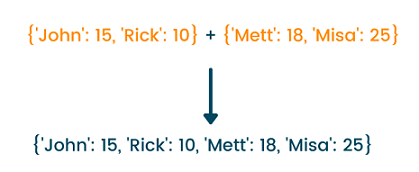

## How to merge/concatenate 

**Reference:**
- [Python Program to Merge Dictionaries (with Examples)](https://favtutor.com/blogs/merge-dictionaries-python)

**Methods of merging dictionaries:**





*the following content is copied from the reference page**


| #  |  method | code  | output  |
| :------------ | :------------ | :------------ | :------------ |
|  1 |  update | dict_1 = {'John': 15, 'Rick': 10, 'Misa' : 12 }<br>dict_2 = {'Bonnie': 18,'Rick': 20,'Matt' : 16 }<br>dict_1.update(dict_2)<br>print(dict_1)<br>   |  {'John': 15, 'Rick': 20, 'Misa': 12, 'Bonnie': 18, 'Matt': 16} |
|  **2** |  ` ** ` operator |  dict_1 = {'John': 15, 'Rick': 10, 'Misa' : 12 }<br>  dict_2 = {'Bonnie': 18,'Rick': 20,'Matt' : 16 }<br>  dict_3 = {`**`dict_1,`**`dict_2}<br>  print(dict_3) <br>  |  {'John': 15, 'Rick': 20, 'Misa': 12, 'Bonnie': 18, 'Matt': 16} |
|  3 |  ` ** ` operator |  dict_1={'John': 15, 'Rick': 10, 'Misa' : 12 }<br>  dict_2={'Bonnie': 18,'Rick': 20,'Matt' : 16 }<br>  dict_3=dict(dict_1,`**`dict_2)<br>  print (dict_3)<br>   |   {'John': 15, 'Rick': 20, 'Misa': 12, 'Bonnie': 18, 'Matt': 16}|
|4| ` ** ` operator| dict_1={'John': 15, 'Rick': 10, 'Misa' : 12 }<br>  dict_2={'Bonnie': 18,'Rick': 20,'Matt' : 16 }<br>  dict_3=dict(dict_2, `**`dict_1)<br>  print (dict_3) <br>  | {'Bonnie': 18, 'Rick': 10, 'Matt': 16, 'John': 15, 'Misa': 12} |
|5|`collection.ChainMap()`|from collections import ChainMap<br>dict_1={'John': 15, 'Rick': 10, 'Misa' : 12 }<br>dict_2={'Bonnie': 18,'Rick': 20,'Matt' : 16 }<br>dict_3 = ChainMap(dict_1, dict_2)<br>print(dict_3)<br>print(dict(dict_3))<br>|ChainMap({'John': 15, 'Rick': 10, 'Misa': 12}, {'Bonnie': 18, 'Rick': 20, 'Matt': 16})<br>{'Bonnie': 18, 'Rick': 10, 'Matt': 16, 'John': 15, 'Misa': 12}<br>|
|6|`itertools.chain()`|import itertools<br>dict_1={'John': 15, 'Rick': 10, 'Misa': 12}<br>dict_2={'Bonnie': 18, 'Rick': 20, 'Matt': 16}<br>dict_3=itertools.chain(dict_1.items(),dict_2.items())<br>print (dict_3)<br>print(dict(dict_3))<br>|`<itertools.chain object at 0x0000015CB1887588>`<br>{'John': 15, 'Rick': 20, 'Misa': 12, 'Bonnie': 18, 'Matt': 16}<br>|


```python
dict_1 = {'John': 15, 'Rick': 10, 'Misa' : 12 }
dict_2 = {'Bonnie': 18,'Rick': 20,'Matt' : 16 }
dict_1.update(dict_2)
print(dict_1)
```

    {'John': 15, 'Rick': 20, 'Misa': 12, 'Bonnie': 18, 'Matt': 16}
    


```python
dict_1 = {'John': 15, 'Rick': 10, 'Misa' : 12 }
dict_2 = {'Bonnie': 18,'Rick': 20,'Matt' : 16 }
dict_3 = {**dict_1,**dict_2}
print(dict_3)
```

    {'John': 15, 'Rick': 20, 'Misa': 12, 'Bonnie': 18, 'Matt': 16}
    


```python
dict_1={'John': 15, 'Rick': 10, 'Misa' : 12 }
dict_2={'Bonnie': 18,'Rick': 20,'Matt' : 16 }
dict_3=dict(dict_1,**dict_2)
print (dict_3)
```

    {'John': 15, 'Rick': 20, 'Misa': 12, 'Bonnie': 18, 'Matt': 16}
    


```python
dict_1={'John': 15, 'Rick': 10, 'Misa' : 12 }
dict_2={'Bonnie': 18,'Rick': 20,'Matt' : 16 }
dict_3=dict(dict_2, **dict_1)
print (dict_3)
```

    {'Bonnie': 18, 'Rick': 10, 'Matt': 16, 'John': 15, 'Misa': 12}
    


```python
from collections import ChainMap
dict_1={'John': 15, 'Rick': 10, 'Misa' : 12 }
dict_2={'Bonnie': 18,'Rick': 20,'Matt' : 16 }
dict_3 = ChainMap(dict_1, dict_2)
print(dict_3)
print(dict(dict_3))
```

    ChainMap({'John': 15, 'Rick': 10, 'Misa': 12}, {'Bonnie': 18, 'Rick': 20, 'Matt': 16})
    {'Bonnie': 18, 'Rick': 10, 'Matt': 16, 'John': 15, 'Misa': 12}
    


```python
import itertools
dict_1={'John': 15, 'Rick': 10, 'Misa': 12}
dict_2={'Bonnie': 18, 'Rick': 20, 'Matt': 16}
dict_3=itertools.chain(dict_1.items(),dict_2.items())
print (dict_3)
print(dict(dict_3))
```

    <itertools.chain object at 0x0000022EAF4603C8>
    {'John': 15, 'Rick': 20, 'Misa': 12, 'Bonnie': 18, 'Matt': 16}
    
