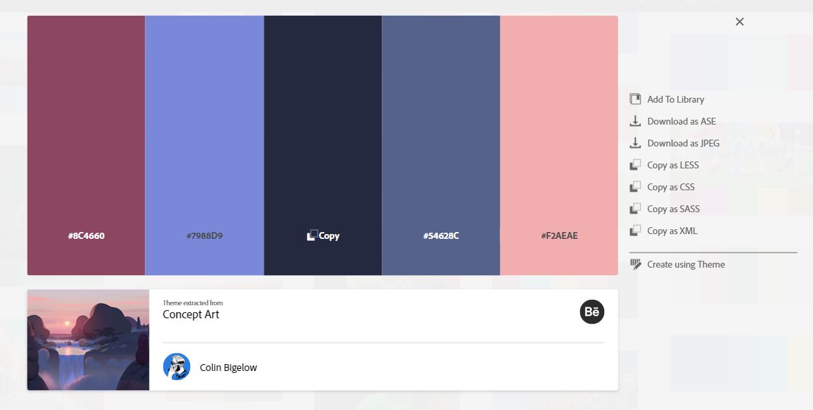
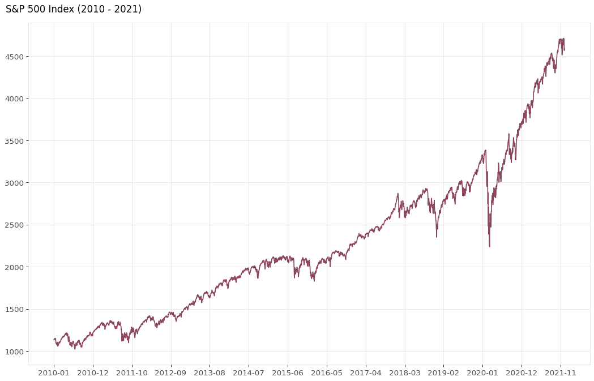
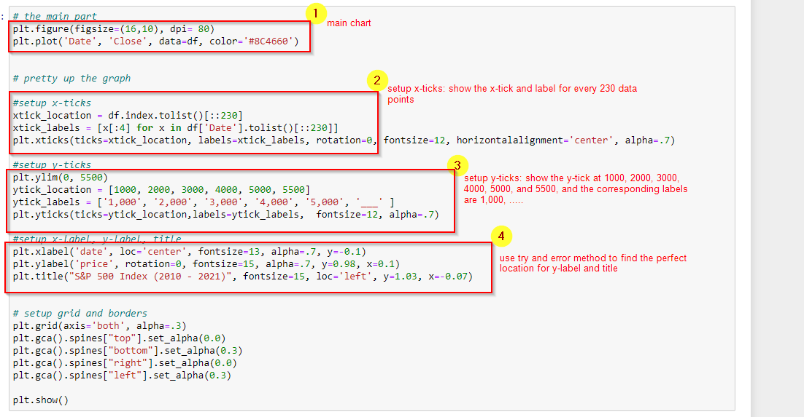
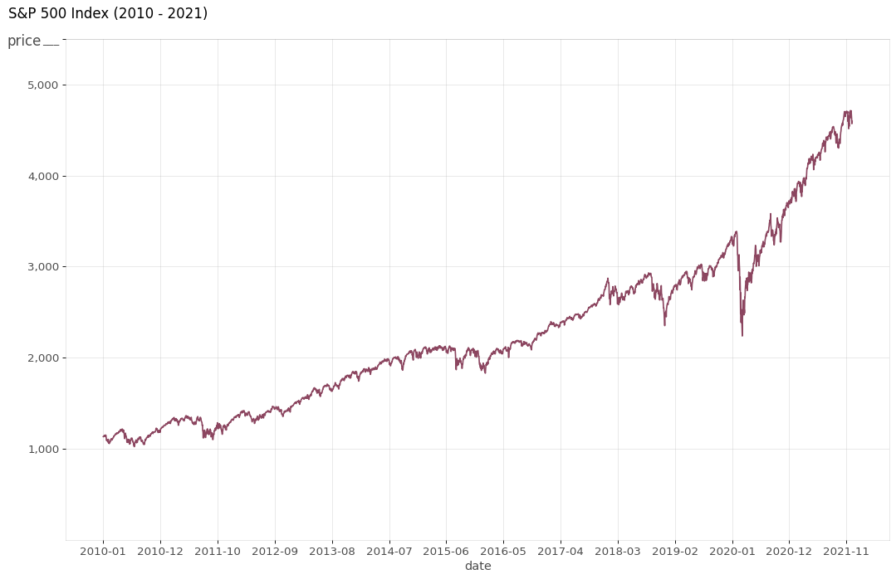

### Line Chart

**notebook setup:**

- Plot  S&P 500 price on a line chart
    - S&P 500 (^GSPC): data/^GSPC.csv

- color palette:
    - the palette is downloaded from [adobe](https://color.adobe.com/)
    - colors

   


|Hex |RGBA|HSLA|
| ------------ | ------------ | ------------ |
|#8C4660        |rgba(140,70,95, 1)   |hsla(337, 33, 41, 1)|
|#7988D9        |rgba(121,135,216, 1)|hsla(230, 55, 66, 1)|
|#252940        |rgba(36,40,63, 1)|hsla(230, 26, 19, 1)|
|#54628C        |rgba(84,98,140, 1)|hsla(225, 25, 44, 1)|
|#F2AEAE        |rgba(242,174,174, 1)|hsla(0, 72, 81, 1)|
    
    
**caution:**

 - it will take a long time to plot data with more than 5k samples (i.e. rows)
    
    
**reference:**

1. [top 50 matplotlib visualizations the master plots python](https://www.machinelearningplus.com/plots/top-50-matplotlib-visualizations-the-master-plots-python/#35.-Time-Series-Plot)
1. [matplotlib](https://matplotlib.org/stable/api/_as_gen/matplotlib.pyplot.title.html?highlight=title#matplotlib.pyplot.title)
    


```python
import pandas as pd
import numpy as np


import matplotlib as mpl
import matplotlib.pyplot as plt
import seaborn as sns
```


```python
print('pandas version: ', pd.__version__)
print('numpy version: ', np.__version__)
print('matplotlib version: ', mpl.__version__)
print('seaborn version: ', sns.__version__)
```

    pandas version:  1.3.4
    numpy version:  1.21.4
    matplotlib version:  3.5.0
    seaborn version:  0.11.2
    


```python
df=pd.read_csv('data/^GSPC.csv', sep='|')
```


```python
df.head(2)
```


<div>
<style scoped>
    .dataframe tbody tr th:only-of-type {
        vertical-align: middle;
    }

    .dataframe tbody tr th {
        vertical-align: top;
    }

    .dataframe thead th {
        text-align: right;
    }
</style>
<table border="1" class="dataframe">
  <thead>
    <tr style="text-align: right;">
      <th></th>
      <th>Date</th>
      <th>Open</th>
      <th>High</th>
      <th>Low</th>
      <th>Close</th>
      <th>Volume</th>
      <th>Dividends</th>
      <th>Stock Splits</th>
    </tr>
  </thead>
  <tbody>
    <tr>
      <th>0</th>
      <td>1950-01-03</td>
      <td>16.66</td>
      <td>16.66</td>
      <td>16.66</td>
      <td>16.66</td>
      <td>1260000</td>
      <td>0</td>
      <td>0</td>
    </tr>
    <tr>
      <th>1</th>
      <td>1950-01-04</td>
      <td>16.85</td>
      <td>16.85</td>
      <td>16.85</td>
      <td>16.85</td>
      <td>1890000</td>
      <td>0</td>
      <td>0</td>
    </tr>
  </tbody>
</table>
</div>


```python
df.info()
```

    <class 'pandas.core.frame.DataFrame'>
    RangeIndex: 18111 entries, 0 to 18110
    Data columns (total 8 columns):
     #   Column        Non-Null Count  Dtype  
    ---  ------        --------------  -----  
     0   Date          18111 non-null  object 
     1   Open          18111 non-null  float64
     2   High          18111 non-null  float64
     3   Low           18111 non-null  float64
     4   Close         18111 non-null  float64
     5   Volume        18111 non-null  int64  
     6   Dividends     18111 non-null  int64  
     7   Stock Splits  18111 non-null  int64  
    dtypes: float64(4), int64(3), object(1)
    memory usage: 1.1+ MB
    


```python
df=df.loc[df['Date']>='2010-01-01', ['Date', 'Close']].copy(deep=True)
df.shape
```


    (3014, 2)


```python
df.head(2)
```


<div>
<style scoped>
    .dataframe tbody tr th:only-of-type {
        vertical-align: middle;
    }

    .dataframe tbody tr th {
        vertical-align: top;
    }

    .dataframe thead th {
        text-align: right;
    }
</style>
<table border="1" class="dataframe">
  <thead>
    <tr style="text-align: right;">
      <th></th>
      <th>Date</th>
      <th>Close</th>
    </tr>
  </thead>
  <tbody>
    <tr>
      <th>15097</th>
      <td>2010-01-04</td>
      <td>1132.98999</td>
    </tr>
    <tr>
      <th>15098</th>
      <td>2010-01-05</td>
      <td>1136.52002</td>
    </tr>
  </tbody>
</table>
</div>


```python
df.reset_index(inplace=True)
```

**the following illustrates how to plot a line chart with customized labels**


```python
# the main part
plt.figure(figsize=(16,10), dpi= 80)
plt.plot('Date', 'Close', data=df, color='#8C4660')


# pretty up the graph
xtick_location = df.index.tolist()[::230]
xtick_labels = [x[:7] for x in df['Date'].tolist()[::230]]
plt.xticks(ticks=xtick_location, labels=xtick_labels, rotation=0, fontsize=12, horizontalalignment='center', alpha=.7)
plt.yticks(fontsize=12, alpha=.7)
plt.title("S&P 500 Index (2010 - 2021)", fontsize=15, loc='left', y=1.02, x=-0.04)
plt.grid(axis='both', alpha=.3)

# remove borders
plt.gca().spines["top"].set_alpha(0.1)    
plt.gca().spines["bottom"].set_alpha(0.1)
plt.gca().spines["right"].set_alpha(0.1)    
plt.gca().spines["left"].set_alpha(0.1)    

plt.show()
```


    

    


**the following illustrates how to add titles to x-axis and y-axis**




```python
# the main part
plt.figure(figsize=(16,10), dpi= 80)
plt.plot('Date', 'Close', data=df, color='#8C4660')


# pretty up the graph

#setup x-ticks
xtick_location = df.index.tolist()[::230]
xtick_labels = [x[:7] for x in df['Date'].tolist()[::230]]
plt.xticks(ticks=xtick_location, labels=xtick_labels, rotation=0, fontsize=12, horizontalalignment='center', alpha=.7)

#setup y-ticks
plt.ylim(0, 5500)
ytick_location = [1000, 2000, 3000, 4000, 5000, 5500]
ytick_labels = ['1,000', '2,000', '3,000', '4,000', '5,000', '___' ]
plt.yticks(ticks=ytick_location,labels=ytick_labels,  fontsize=12, alpha=.7)

#setup x-label, y-label, title
plt.xlabel('date', loc='center', fontsize=13, alpha=.7, y=-0.1)
plt.ylabel('price', rotation=0, fontsize=15, alpha=.7, y=0.98, x=0.1)
plt.title("S&P 500 Index (2010 - 2021)", fontsize=15, loc='left', y=1.03, x=-0.07)


# setup grid and borders
plt.grid(axis='both', alpha=.3)
plt.gca().spines["top"].set_alpha(0.1)    
plt.gca().spines["bottom"].set_alpha(0.1)
plt.gca().spines["right"].set_alpha(0.1)    
plt.gca().spines["left"].set_alpha(0.1)   

plt.show()
```


    

    

