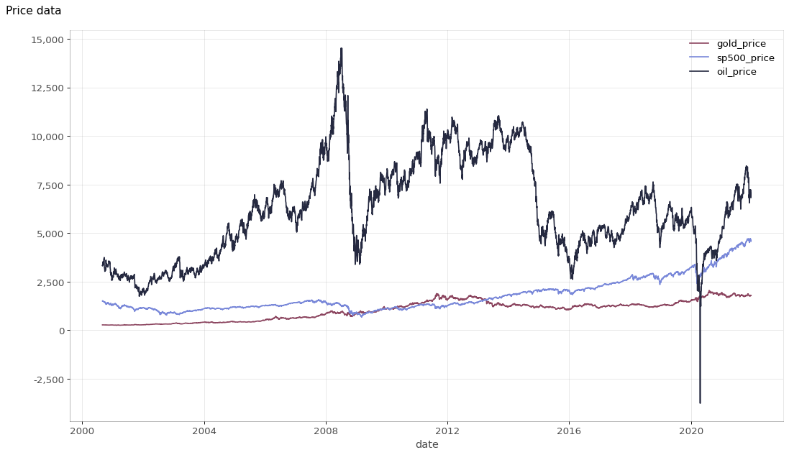

### Line Chart - Multiple Lines in One Chart


```python
import pandas as pd
import numpy as np


import matplotlib as mpl
import matplotlib.pyplot as plt
import seaborn as sns
```


```python
#from matplotlib.ticker import FormatStrFormatter, ScalarFormatter
from matplotlib.ticker import StrMethodFormatter
```


```python
print('pandas version: ', pd.__version__)
print('numpy version: ', np.__version__)
print('matplotlib version: ', mpl.__version__)
print('seaborn version: ', sns.__version__)
```

    pandas version:  1.3.4
    numpy version:  1.21.4
    matplotlib version:  3.5.0
    seaborn version:  0.11.2
    


```python
df_gold=pd.read_csv('data/GC=F.csv', sep='|')

df_sp500=pd.read_csv('data/^GSPC.csv', sep='|')

df_oil=pd.read_csv('data/CL=F.csv', sep='|')
```


```python
df_gold.head(2)
```


<div>
<style scoped>
    .dataframe tbody tr th:only-of-type {
        vertical-align: middle;
    }

    .dataframe tbody tr th {
        vertical-align: top;
    }

    .dataframe thead th {
        text-align: right;
    }
</style>
<table border="1" class="dataframe">
  <thead>
    <tr style="text-align: right;">
      <th></th>
      <th>Date</th>
      <th>Open</th>
      <th>High</th>
      <th>Low</th>
      <th>Close</th>
      <th>Volume</th>
      <th>Dividends</th>
      <th>Stock Splits</th>
    </tr>
  </thead>
  <tbody>
    <tr>
      <th>0</th>
      <td>2000-08-30</td>
      <td>273.899994</td>
      <td>273.899994</td>
      <td>273.899994</td>
      <td>273.899994</td>
      <td>0</td>
      <td>0</td>
      <td>0</td>
    </tr>
    <tr>
      <th>1</th>
      <td>2000-08-31</td>
      <td>274.799988</td>
      <td>278.299988</td>
      <td>274.799988</td>
      <td>278.299988</td>
      <td>0</td>
      <td>0</td>
      <td>0</td>
    </tr>
  </tbody>
</table>
</div>


```python
df_sp500.head(2)
```


<div>
<style scoped>
    .dataframe tbody tr th:only-of-type {
        vertical-align: middle;
    }

    .dataframe tbody tr th {
        vertical-align: top;
    }

    .dataframe thead th {
        text-align: right;
    }
</style>
<table border="1" class="dataframe">
  <thead>
    <tr style="text-align: right;">
      <th></th>
      <th>Date</th>
      <th>Open</th>
      <th>High</th>
      <th>Low</th>
      <th>Close</th>
      <th>Volume</th>
      <th>Dividends</th>
      <th>Stock Splits</th>
    </tr>
  </thead>
  <tbody>
    <tr>
      <th>0</th>
      <td>1950-01-03</td>
      <td>16.66</td>
      <td>16.66</td>
      <td>16.66</td>
      <td>16.66</td>
      <td>1260000</td>
      <td>0</td>
      <td>0</td>
    </tr>
    <tr>
      <th>1</th>
      <td>1950-01-04</td>
      <td>16.85</td>
      <td>16.85</td>
      <td>16.85</td>
      <td>16.85</td>
      <td>1890000</td>
      <td>0</td>
      <td>0</td>
    </tr>
  </tbody>
</table>
</div>


```python
#combine data
df=df_gold[['Date', 'Close']].merge(df_sp500[['Date', 'Close']], on=['Date'], how='inner')
df=df.merge(df_oil[['Date', 'Close']], on=['Date'], how='inner')
```


```python
df.head(2)
```


<div>
<style scoped>
    .dataframe tbody tr th:only-of-type {
        vertical-align: middle;
    }

    .dataframe tbody tr th {
        vertical-align: top;
    }

    .dataframe thead th {
        text-align: right;
    }
</style>
<table border="1" class="dataframe">
  <thead>
    <tr style="text-align: right;">
      <th></th>
      <th>Date</th>
      <th>Close_x</th>
      <th>Close_y</th>
      <th>Close</th>
    </tr>
  </thead>
  <tbody>
    <tr>
      <th>0</th>
      <td>2000-08-30</td>
      <td>273.899994</td>
      <td>1502.589966</td>
      <td>33.400002</td>
    </tr>
    <tr>
      <th>1</th>
      <td>2000-08-31</td>
      <td>278.299988</td>
      <td>1517.680054</td>
      <td>33.099998</td>
    </tr>
  </tbody>
</table>
</div>


```python
df.columns=['date', 'gold_price','sp500_price', 'oil_price']

df['oil_price']=100*df['oil_price']
```


```python
df['date']=pd.to_datetime(df['date'], infer_datetime_format=True)

```


```python
df.shape
```


    (5342, 4)


```python
df.head(2)
```


<div>
<style scoped>
    .dataframe tbody tr th:only-of-type {
        vertical-align: middle;
    }

    .dataframe tbody tr th {
        vertical-align: top;
    }

    .dataframe thead th {
        text-align: right;
    }
</style>
<table border="1" class="dataframe">
  <thead>
    <tr style="text-align: right;">
      <th></th>
      <th>date</th>
      <th>gold_price</th>
      <th>sp500_price</th>
      <th>oil_price</th>
    </tr>
  </thead>
  <tbody>
    <tr>
      <th>0</th>
      <td>2000-08-30</td>
      <td>273.899994</td>
      <td>1502.589966</td>
      <td>3340.000153</td>
    </tr>
    <tr>
      <th>1</th>
      <td>2000-08-31</td>
      <td>278.299988</td>
      <td>1517.680054</td>
      <td>3309.999847</td>
    </tr>
  </tbody>
</table>
</div>


```python
df.info()
```

    <class 'pandas.core.frame.DataFrame'>
    Int64Index: 5342 entries, 0 to 5341
    Data columns (total 4 columns):
     #   Column       Non-Null Count  Dtype         
    ---  ------       --------------  -----         
     0   date         5342 non-null   datetime64[ns]
     1   gold_price   5342 non-null   float64       
     2   sp500_price  5342 non-null   float64       
     3   oil_price    5342 non-null   float64       
    dtypes: datetime64[ns](1), float64(3)
    memory usage: 208.7 KB
    


```python
#colors = ['tab:red', 'tab:blue', 'tab:green', 'tab:orange']    
colors = ["#8C4660",  "#7988D9", "#252940",  "#54628C", "#F2AEAE"]

fig, ax = plt.subplots(1,1,figsize=(16, 9), dpi= 80)    

columns = df.columns[1:]  
for i, col in enumerate(columns):    
    plt.plot(df.date.values, df[col].values, lw=1.5, color=colors[i], label=col)
    #plt.text(df.shape[0]+1, df[column].values[-1], column, fontsize=14, color=mycolors[i])


plt.yticks(fontsize=12, alpha=.7)  
plt.xticks(fontsize=12, alpha=.7)   
#setup x-label, y-label, title
plt.xlabel('date', loc='center', fontsize=13, alpha=.7, y=-0.1)
#plt.ylabel('pnl', rotation=0, fontsize=13, alpha=.7, y=1.01, x=0.1)
plt.title("Price data", fontsize=14, loc='left', y=1.03, x=-0.09)

ax.yaxis.set_major_formatter(StrMethodFormatter('{x:,.0f}'))

# setup grid and borders
plt.grid(axis='both', alpha=.3)
plt.gca().spines["top"].set_alpha(0.1)    
plt.gca().spines["bottom"].set_alpha(0.3)
plt.gca().spines["right"].set_alpha(0.1)    
plt.gca().spines["left"].set_alpha(0.3)   

plt.legend(loc=0, fontsize=12, frameon=False)
plt.show()
```


    

    


```python

```
