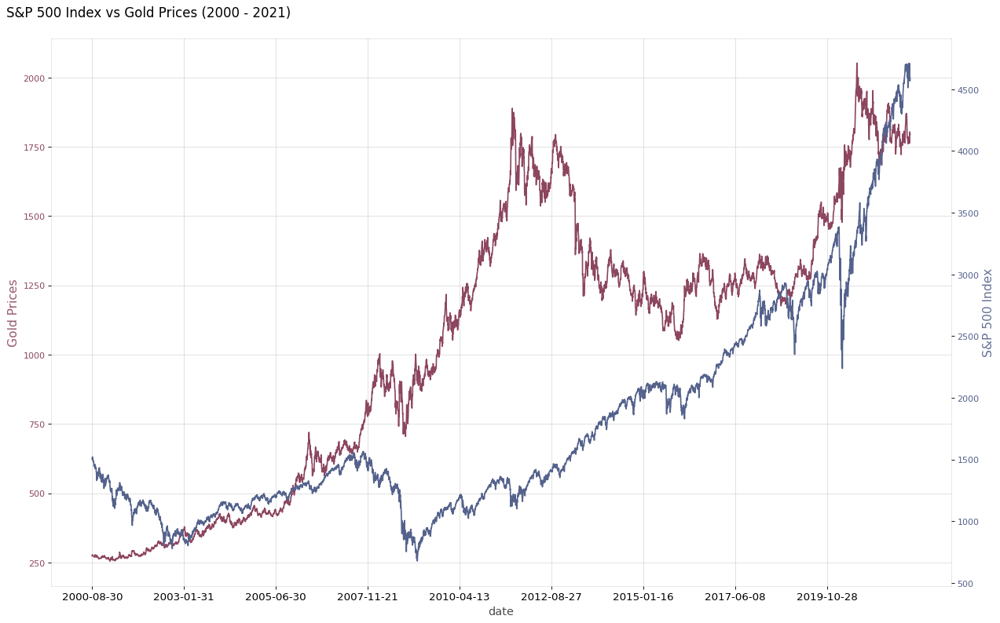
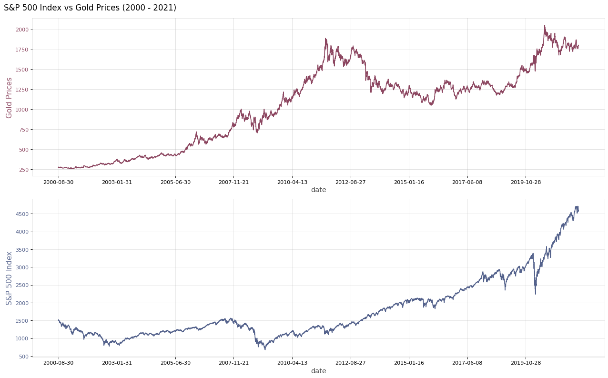
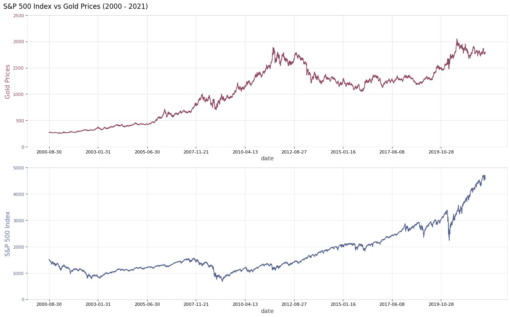
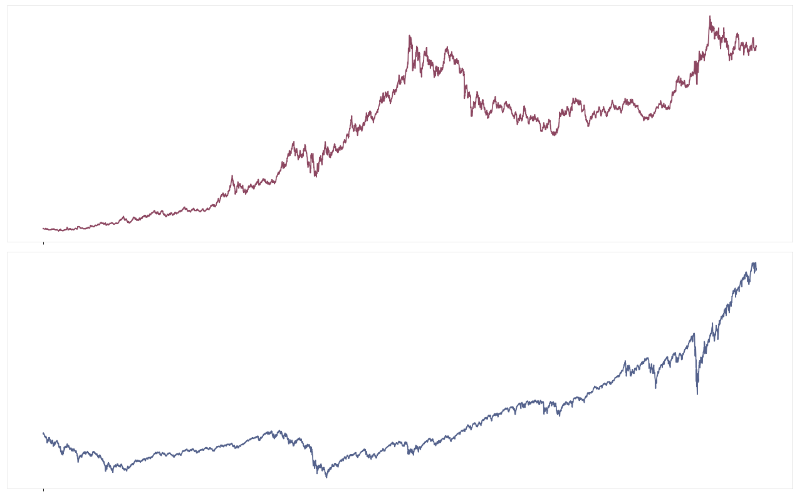

### Line Chart - Subplots


```python
import pandas as pd
import numpy as np


import matplotlib as mpl
import matplotlib.pyplot as plt
import seaborn as sns
```


```python
print('pandas version: ', pd.__version__)
print('numpy version: ', np.__version__)
print('matplotlib version: ', mpl.__version__)
print('seaborn version: ', sns.__version__)
```

    pandas version:  1.3.4
    numpy version:  1.21.4
    matplotlib version:  3.5.0
    seaborn version:  0.11.2
    


```python
df_gold=pd.read_csv('data/GC=F.csv', sep='|')
df_sp500=pd.read_csv('data/^GSPC.csv', sep='|')
```


```python
df_gold.head(2)
```


<div>
<style scoped>
    .dataframe tbody tr th:only-of-type {
        vertical-align: middle;
    }

    .dataframe tbody tr th {
        vertical-align: top;
    }

    .dataframe thead th {
        text-align: right;
    }
</style>
<table border="1" class="dataframe">
  <thead>
    <tr style="text-align: right;">
      <th></th>
      <th>Date</th>
      <th>Open</th>
      <th>High</th>
      <th>Low</th>
      <th>Close</th>
      <th>Volume</th>
      <th>Dividends</th>
      <th>Stock Splits</th>
    </tr>
  </thead>
  <tbody>
    <tr>
      <th>0</th>
      <td>2000-08-30</td>
      <td>273.899994</td>
      <td>273.899994</td>
      <td>273.899994</td>
      <td>273.899994</td>
      <td>0</td>
      <td>0</td>
      <td>0</td>
    </tr>
    <tr>
      <th>1</th>
      <td>2000-08-31</td>
      <td>274.799988</td>
      <td>278.299988</td>
      <td>274.799988</td>
      <td>278.299988</td>
      <td>0</td>
      <td>0</td>
      <td>0</td>
    </tr>
  </tbody>
</table>
</div>


```python
df_sp500.head(2)
```


<div>
<style scoped>
    .dataframe tbody tr th:only-of-type {
        vertical-align: middle;
    }

    .dataframe tbody tr th {
        vertical-align: top;
    }

    .dataframe thead th {
        text-align: right;
    }
</style>
<table border="1" class="dataframe">
  <thead>
    <tr style="text-align: right;">
      <th></th>
      <th>Date</th>
      <th>Open</th>
      <th>High</th>
      <th>Low</th>
      <th>Close</th>
      <th>Volume</th>
      <th>Dividends</th>
      <th>Stock Splits</th>
    </tr>
  </thead>
  <tbody>
    <tr>
      <th>0</th>
      <td>1950-01-03</td>
      <td>16.66</td>
      <td>16.66</td>
      <td>16.66</td>
      <td>16.66</td>
      <td>1260000</td>
      <td>0</td>
      <td>0</td>
    </tr>
    <tr>
      <th>1</th>
      <td>1950-01-04</td>
      <td>16.85</td>
      <td>16.85</td>
      <td>16.85</td>
      <td>16.85</td>
      <td>1890000</td>
      <td>0</td>
      <td>0</td>
    </tr>
  </tbody>
</table>
</div>


```python
#combine data
df=df_gold[['Date', 'Close']].merge(df_sp500[['Date', 'Close']], on=['Date'], how='inner')
```


```python
df.columns=['date', 'gold_price','sp500_price']
```


```python
df.shape
```


    (5343, 3)


```python
df.head(2)
```


<div>
<style scoped>
    .dataframe tbody tr th:only-of-type {
        vertical-align: middle;
    }

    .dataframe tbody tr th {
        vertical-align: top;
    }

    .dataframe thead th {
        text-align: right;
    }
</style>
<table border="1" class="dataframe">
  <thead>
    <tr style="text-align: right;">
      <th></th>
      <th>date</th>
      <th>gold_price</th>
      <th>sp500_price</th>
    </tr>
  </thead>
  <tbody>
    <tr>
      <th>0</th>
      <td>2000-08-30</td>
      <td>273.899994</td>
      <td>1502.589966</td>
    </tr>
    <tr>
      <th>1</th>
      <td>2000-08-31</td>
      <td>278.299988</td>
      <td>1517.680054</td>
    </tr>
  </tbody>
</table>
</div>


```python
x = df['date']
y1 = df['gold_price']
y2 = df['sp500_price']

# Plot Line1 (Left Y Axis)
fig, ax1 = plt.subplots(1,1,figsize=(16,10), dpi= 80)
ax1.plot(x, y1, color='#8C4660')

# Plot Line2 (Right Y Axis)
ax2 = ax1.twinx()  # instantiate a second axes that shares the same x-axis
ax2.plot(x, y2, color='#54628C')

# Decorations
# ax1 (left Y axis)
ax1.set_xlabel('date', fontsize=13, alpha=.7)
ax1.tick_params(axis='x', rotation=0, labelsize=12)
ax1.set_ylabel('Gold Prices', color='#8C4660', fontsize=14, alpha=.9)
ax1.tick_params(axis='y', rotation=0, labelcolor='#8C4660' )
ax1.grid(alpha=.4)

# ax2 (right Y axis)
ax2.set_ylabel("S&P 500 Index", color='#54628C', fontsize=14, alpha=.9)
ax2.tick_params(axis='y', labelcolor='#54628C')
ax2.set_xticks(np.arange(0, len(x), 600))
ax2.set_xticklabels(x[::600], rotation=90, fontdict={'fontsize':10})


plt.title("S&P 500 Index vs Gold Prices (2000 - 2021)", fontsize=15, loc='left', y=1.03, x=-0.05)


# setup grid and borders
#plt.grid(axis='both', alpha=.3)
ax1.spines["top"].set_alpha(0.1)    
ax1.spines["bottom"].set_alpha(0.1)
ax1.spines["right"].set_alpha(0.1)    
ax1.spines["left"].set_alpha(0.1)   
ax2.spines["top"].set_alpha(0.0)    
ax2.spines["bottom"].set_alpha(0.0)
ax2.spines["right"].set_alpha(0.0)    
ax2.spines["left"].set_alpha(0.0)   

fig.tight_layout()
plt.show()
```


    

    


```python
x = df['date']
y1 = df['gold_price']
y2 = df['sp500_price']

#initiate a subplot with 2 rows
fig, (ax1, ax2) = plt.subplots(2,1,figsize=(16,10), dpi= 80)

#the 1st graph
ax1.plot(x, y1, color='#8C4660')
#---set the x label---------------
ax1.set_xlabel('date', fontsize=13, alpha=.7)
ax1.tick_params(axis='x', rotation=0, labelsize=12)
ax1.set_xticks(np.arange(0, len(x), 600))
ax1.set_xticklabels(x[::600], rotation=0, fontdict={'fontsize':10})

ax1.set_ylabel('Gold Prices', color='#8C4660', fontsize=14, alpha=.9)
ax1.tick_params(axis='y', rotation=0, labelcolor='#8C4660' )
ax1.grid(alpha=.4)
# setup grid and borders
ax1.spines["top"].set_alpha(0.1)    
ax1.spines["bottom"].set_alpha(0.1)
ax1.spines["right"].set_alpha(0.1)    
ax1.spines["left"].set_alpha(0.1)   

ax1.set_title("S&P 500 Index vs Gold Prices (2000 - 2021)", fontsize=15, loc='left', y=1.03, x=-0.05)

#the 2nd graph
ax2.plot(x, y2, color='#54628C')
#---set the x label---------------
ax2.set_xlabel('date', fontsize=13, alpha=.7)
ax2.tick_params(axis='x', rotation=0, labelsize=12)
ax2.set_xticks(np.arange(0, len(x), 600))
ax2.set_xticklabels(x[::600], rotation=0, fontdict={'fontsize':10})

ax2.set_ylabel("S&P 500 Index", color='#54628C', fontsize=14, alpha=.9)
ax2.tick_params(axis='y', labelcolor='#54628C')
ax2.grid(axis='both', alpha=.3) 
ax2.spines["top"].set_alpha(0.1)    
ax2.spines["bottom"].set_alpha(0.1)
ax2.spines["right"].set_alpha(0.1)    
ax2.spines["left"].set_alpha(0.1)   

#ax2.set_title("S&P 500 Index vs Gold Prices (2000 - 2021)", fontsize=15, loc='left', y=1.03, x=-0.05)


fig.tight_layout()
plt.show()
```


    

    


```python
x = df['date']
y1 = df['gold_price']
y2 = df['sp500_price']

#initiate a subplot with 2 rows
fig, (ax1, ax2) = plt.subplots(2,1,figsize=(16,10), dpi= 80)

#the 1st graph
ax1.plot(x, y1, color='#8C4660')
#---set the x label---------------
ax1.set_xlabel('date', fontsize=13, alpha=.7)
ax1.tick_params(axis='x', rotation=0, labelsize=12)
ax1.set_xticks(np.arange(0, len(x), 600))
ax1.set_xticklabels(x[::600], rotation=0, fontdict={'fontsize':10})

ax1.set_ylabel('Gold Prices', color='#8C4660', fontsize=14, alpha=.9)
ax1.tick_params(axis='y', rotation=0, labelcolor='#8C4660' )
ax1.set_yticks(range(0, 3000, 500))
ax1.set_yticklabels(range(0, 3000, 500), rotation=0, fontdict={'fontsize':10})
ax1.grid(alpha=.4)
# setup grid and borders
ax1.spines[:].set_alpha(0.1)
"""
ax1.spines["top"].set_alpha(0.1)    
ax1.spines["bottom"].set_alpha(0.1)
ax1.spines["right"].set_alpha(0.1)    
ax1.spines["left"].set_alpha(0.1)  
"""

ax1.set_title("S&P 500 Index vs Gold Prices (2000 - 2021)", fontsize=15, loc='left', y=1.03, x=-0.05)

#the 2nd graph
ax2.plot(x, y2, color='#54628C')
#---set the x label---------------
ax2.set_xlabel('date', fontsize=13, alpha=.7)
ax2.tick_params(axis='x', rotation=0, labelsize=12)
ax2.set_xticks(np.arange(0, len(x), 600))
ax2.set_xticklabels(x[::600], rotation=0, fontdict={'fontsize':10})

ax2.set_ylabel("S&P 500 Index", color='#54628C', fontsize=14, alpha=.9)
ax2.tick_params(axis='y', labelcolor='#54628C')
ax2.set_yticks(range(0, 6000, 1000))
ax2.set_yticklabels(range(0, 6000, 1000), rotation=0, fontdict={'fontsize':10})
ax2.grid(axis='both', alpha=.3) 
ax2.spines["top"].set_alpha(0.1)    
ax2.spines["bottom"].set_alpha(0.2)
ax2.spines["right"].set_alpha(0.1)    
ax2.spines["left"].set_alpha(0.2)   

#ax2.set_title("S&P 500 Index vs Gold Prices (2000 - 2021)", fontsize=15, loc='left', y=1.03, x=-0.05)


fig.tight_layout()
plt.show()
```


    

    


```python
x = df['date']
y1 = df['gold_price']
y2 = df['sp500_price']

#initiate a subplot with 2 rows
fig, (ax1, ax2) = plt.subplots(2,1,figsize=(16,10), dpi= 80)

#the 1st graph
ax1.plot(x, y1, color='#8C4660')
#---set the x label---------------
ax1.set_xticks([0], alpha=.0)
ax1.set_xticklabels([''], rotation=0, fontdict={'fontsize':10}, alpha=.0)
ax1.set_yticks([0], alpha=.0)
ax1.set_yticklabels([''], rotation=0, fontdict={'fontsize':10}, alpha=.0)

ax1.grid(alpha=.0)
ax1.spines[:].set_alpha(0.1) #set_visible(False)  


#the 2nd graph
ax2.plot(x, y2, color='#54628C')
#---set the x label---------------
ax2.set_xticks([0], alpha=.0)
ax2.set_xticklabels([''], rotation=0, fontdict={'fontsize':10}, alpha=.0)
ax2.set_yticks([0], alpha=.0)
ax2.set_yticklabels([''], rotation=0, fontdict={'fontsize':10}, alpha=.0)

ax2.grid(alpha=.0)
ax2.spines[:].set_alpha(0.1) #set_visible(False) 

fig.tight_layout()
plt.show()
```


    

    

