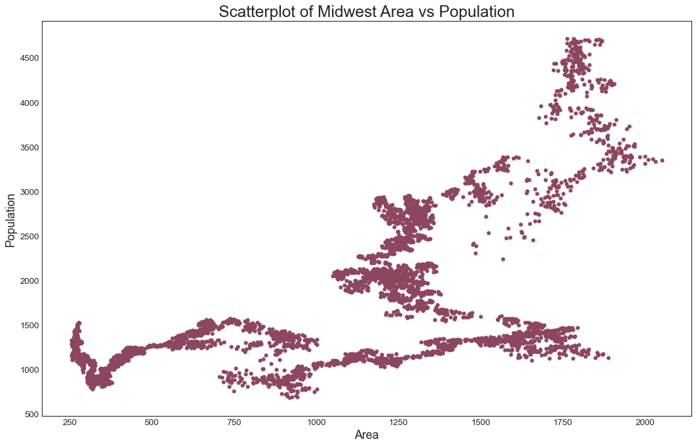

### Scatter plot


```python
import pandas as pd
import numpy as np


#import matplotlib as mpl
import matplotlib.pyplot as plt
import seaborn as sns

```


```python
import warnings; warnings.filterwarnings(action='once')

large = 22; med = 16; small = 12
params = {'axes.titlesize': large,
          'legend.fontsize': med,
          'figure.figsize': (16, 10),
          'axes.labelsize': med,
          'axes.titlesize': med,
          'xtick.labelsize': med,
          'ytick.labelsize': med,
          'figure.titlesize': large}
plt.rcParams.update(params)
plt.style.use('seaborn-whitegrid')
sns.set_style("white")
%matplotlib inline
```

### load data


```python
df_gold=pd.read_csv('data/GC=F.csv', sep='|')
df_sp500=pd.read_csv('data/^GSPC.csv', sep='|')
```


```python
df_gold.head(2)
```


<div>
<style scoped>
    .dataframe tbody tr th:only-of-type {
        vertical-align: middle;
    }

    .dataframe tbody tr th {
        vertical-align: top;
    }

    .dataframe thead th {
        text-align: right;
    }
</style>
<table border="1" class="dataframe">
  <thead>
    <tr style="text-align: right;">
      <th></th>
      <th>Date</th>
      <th>Open</th>
      <th>High</th>
      <th>Low</th>
      <th>Close</th>
      <th>Volume</th>
      <th>Dividends</th>
      <th>Stock Splits</th>
    </tr>
  </thead>
  <tbody>
    <tr>
      <th>0</th>
      <td>2000-08-30</td>
      <td>273.899994</td>
      <td>273.899994</td>
      <td>273.899994</td>
      <td>273.899994</td>
      <td>0</td>
      <td>0</td>
      <td>0</td>
    </tr>
    <tr>
      <th>1</th>
      <td>2000-08-31</td>
      <td>274.799988</td>
      <td>278.299988</td>
      <td>274.799988</td>
      <td>278.299988</td>
      <td>0</td>
      <td>0</td>
      <td>0</td>
    </tr>
  </tbody>
</table>
</div>


```python
df_sp500.head(2)
```


<div>
<style scoped>
    .dataframe tbody tr th:only-of-type {
        vertical-align: middle;
    }

    .dataframe tbody tr th {
        vertical-align: top;
    }

    .dataframe thead th {
        text-align: right;
    }
</style>
<table border="1" class="dataframe">
  <thead>
    <tr style="text-align: right;">
      <th></th>
      <th>Date</th>
      <th>Open</th>
      <th>High</th>
      <th>Low</th>
      <th>Close</th>
      <th>Volume</th>
      <th>Dividends</th>
      <th>Stock Splits</th>
    </tr>
  </thead>
  <tbody>
    <tr>
      <th>0</th>
      <td>1950-01-03</td>
      <td>16.66</td>
      <td>16.66</td>
      <td>16.66</td>
      <td>16.66</td>
      <td>1260000</td>
      <td>0</td>
      <td>0</td>
    </tr>
    <tr>
      <th>1</th>
      <td>1950-01-04</td>
      <td>16.85</td>
      <td>16.85</td>
      <td>16.85</td>
      <td>16.85</td>
      <td>1890000</td>
      <td>0</td>
      <td>0</td>
    </tr>
  </tbody>
</table>
</div>


```python
#combine data
combine=df_gold[['Date', 'Close']].merge(df_sp500[['Date', 'Close']], on=['Date'], how='inner')
```


```python
combine.head()
```


<div>
<style scoped>
    .dataframe tbody tr th:only-of-type {
        vertical-align: middle;
    }

    .dataframe tbody tr th {
        vertical-align: top;
    }

    .dataframe thead th {
        text-align: right;
    }
</style>
<table border="1" class="dataframe">
  <thead>
    <tr style="text-align: right;">
      <th></th>
      <th>Date</th>
      <th>Close_x</th>
      <th>Close_y</th>
    </tr>
  </thead>
  <tbody>
    <tr>
      <th>0</th>
      <td>2000-08-30</td>
      <td>273.899994</td>
      <td>1502.589966</td>
    </tr>
    <tr>
      <th>1</th>
      <td>2000-08-31</td>
      <td>278.299988</td>
      <td>1517.680054</td>
    </tr>
    <tr>
      <th>2</th>
      <td>2000-09-01</td>
      <td>277.000000</td>
      <td>1520.770020</td>
    </tr>
    <tr>
      <th>3</th>
      <td>2000-09-05</td>
      <td>275.799988</td>
      <td>1507.079956</td>
    </tr>
    <tr>
      <th>4</th>
      <td>2000-09-06</td>
      <td>274.200012</td>
      <td>1492.250000</td>
    </tr>
  </tbody>
</table>
</div>


```python
combine.columns=['date', 'gold_price','sp500_price']
```


```python
combine.head(2)
```


<div>
<style scoped>
    .dataframe tbody tr th:only-of-type {
        vertical-align: middle;
    }

    .dataframe tbody tr th {
        vertical-align: top;
    }

    .dataframe thead th {
        text-align: right;
    }
</style>
<table border="1" class="dataframe">
  <thead>
    <tr style="text-align: right;">
      <th></th>
      <th>date</th>
      <th>gold_price</th>
      <th>sp500_price</th>
    </tr>
  </thead>
  <tbody>
    <tr>
      <th>0</th>
      <td>2000-08-30</td>
      <td>273.899994</td>
      <td>1502.589966</td>
    </tr>
    <tr>
      <th>1</th>
      <td>2000-08-31</td>
      <td>278.299988</td>
      <td>1517.680054</td>
    </tr>
  </tbody>
</table>
</div>


```python
x=combine['gold_price']
y=combine['sp500_price']
```

### Plot the graph


```python
plt.figure(figsize=(16,10), dpi= 80)
plt.scatter(x=x, y=y,s=20, c='#8C4660')

# Decorations
plt.gca().set(#xlim=(0.0, 0.1), ylim=(0, 90000),
              xlabel='Area', ylabel='Population')

plt.xticks(fontsize=12); plt.yticks(fontsize=12)
plt.title("Scatterplot of Midwest Area vs Population", fontsize=22) 
plt.show()  
```


    

    


```python

```
