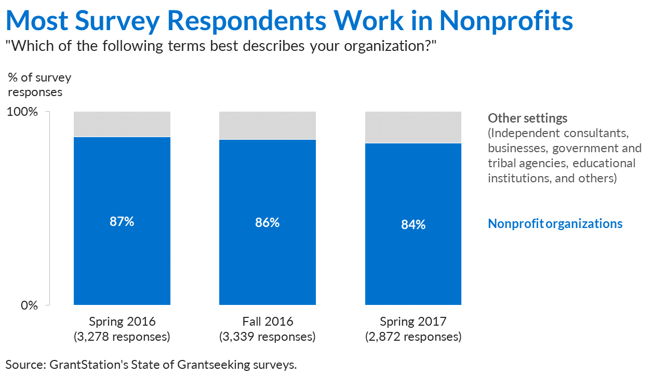

## Data visualization and analysis handbook (Apr 2019 v2)
###  Examples of visualizations: 10. Stacked Column Chart

### [Index](../Data visualization and analysis handbook.md)

1. [Data visualization check list](1_checklist.md)
1. [Chart selection](2_chartselection.md)
1. [Examples of visualizations](3_chartindex.md)
1. [Examples of makeovers – from bad to good](4_makeover.md)
1. [How to develop a story with visualizations](5_story.md)
1. [Resources](6_resources.md)

***

#### 10. Stacked Column Chart

Part-to-whole patterns over time.

We often need to display patterns over time. In those situations, the first idea that probably comes to mind is the classic line graph. But sometimes we also need to display part-to-whole patterns through stacked graphs like pie charts or stacked bar graphs. For patterns over time and part-to-whole comparisons, the traditional option is a stacked area chart or a stacked column chart. Stacked area graphs are tricky to label (I’ll save that rant for later), so I usually opt for stacked column charts when I need to display part-to-whole patterns over time.

Example 1

***

Source: [https://depictdatastudio.com/charts/stacked-column/](https://depictdatastudio.com/charts/stacked-column/)

