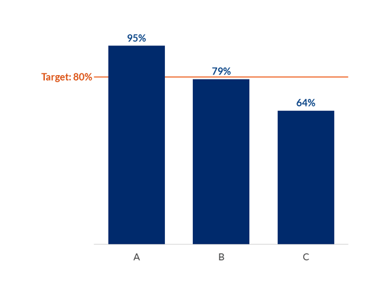
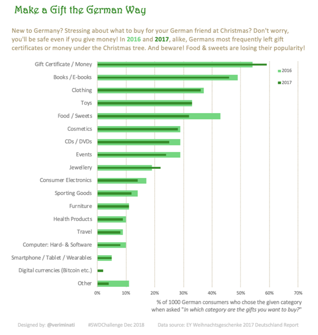

## Data visualization and analysis handbook (Apr 2019 v2)
###  Examples of visualizations: 11. Overlapping Bar Chart

### [Index](../Data visualization and analysis handbook.md)

1. [Data visualization check list](1_checklist.md)
1. [Chart selection](2_chartselection.md)
1. [Examples of visualizations](3_chartindex.md)
1. [Examples of makeovers – from bad to good](4_makeover.md)
1. [How to develop a story with visualizations](5_story.md)
1. [Resources](6_resources.md)

***

#### 11. Overlapping Bar Chart

Visualize progress towards goals with overlapping bars. Use overlapping bars when every bar/column has a different goal. Use a target line when every bar/column has the same goal. 

[https://depictdatastudio.com/charts/overlapping-bars/](https://depictdatastudio.com/charts/overlapping-bars/)

Example 1

***

Source: [twitter](https://twitter.com/mirkolorenz/status/964473694969040896)

Target Lines on Bar Charts 

Progress towards a goal.
Visualize progress towards goals with a target line. Use a target line when every bar/column has the same goal. Use overlapping bars when every bar/column has a different goal.

Example 2

***

Source: [https://depictdatastudio.com/charts/target-lines-on-bar-charts/](https://depictdatastudio.com/charts/target-lines-on-bar-charts/)

Example 3

***

Source: [http://www.storytellingwithdata.com/blog/2018/12/17/happy-holidays](http://www.storytellingwithdata.com/blog/2018/12/17/happy-holidays)

