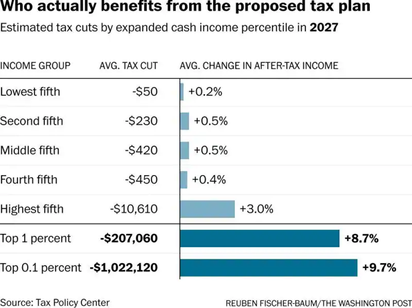

## Data visualization and analysis handbook (Apr 2019 v2)
###  Examples of visualizations: 12. Deviation Chart

### [Index](../Data visualization and analysis handbook.md)

1. [Data visualization check list](1_checklist.md)
1. [Chart selection](2_chartselection.md)
1. [Examples of visualizations](3_chartindex.md)
1. [Examples of makeovers – from bad to good](4_makeover.md)
1. [How to develop a story with visualizations](5_story.md)
1. [Resources](6_resources.md)

***

#### 12. Deviation Chart

Display the differences between two things.
In a deviation graph, you just display the differences between two things (rather than a traditional bar or column in which you graph the frequency or average).

[https://depictdatastudio.com/charts/deviation-graph/](https://depictdatastudio.com/charts/deviation-graph/)

Example 1

***

Source: [washingtonpost](https://www.washingtonpost.com/news/wonk/wp/2017/09/29/gop-tax-plan-would-provide-major-gains-for-richest-1-percent-and-uneven-benefits-for-the-middle-class-report-says/?%3Ftid%3D=sm_pg&utm_term=.170efd76bb0b)

Example 2

***

Source: [pewresearch](https://www.pewresearch.org/fact-tank/2018/01/18/naturalization-rate-among-u-s-immigrants-up-since-2005-with-india-among-the-biggest-gainers/)

