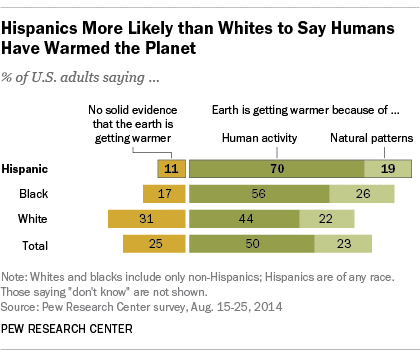
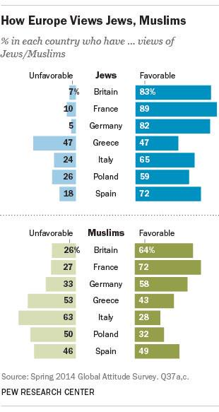

## Data visualization and analysis handbook (Apr 2019 v2)
###  Examples of visualizations: 13. Diverging Stacked Bar Chart

### [Index](../Data visualization and analysis handbook.md)

1. [Data visualization check list](1_checklist.md)
1. [Chart selection](2_chartselection.md)
1. [Examples of visualizations](3_chartindex.md)
1. [Examples of makeovers – from bad to good](4_makeover.md)
1. [How to develop a story with visualizations](5_story.md)
1. [Resources](6_resources.md)

***

#### 13. Diverging Stacked Bar Chart

An invisible y-axis separates the good/bad, positive/negative, or agree/disagree categories.

[https://depictdatastudio.com/charts/diverging-stacked-bar/](https://depictdatastudio.com/charts/diverging-stacked-bar/)

Example 1

***

70% of Hispanics say earth is getting warmer due to human activity--compared w/ 44% of whites.

Source: [twitter](https://twitter.com/PewHispanic/status/571416500055228417)

Example 2

***

The French held more favorable views of both Jews & Muslims than many other Europeans

Source: [twitter](https://twitter.com/pewresearch/status/555358420032049152)

