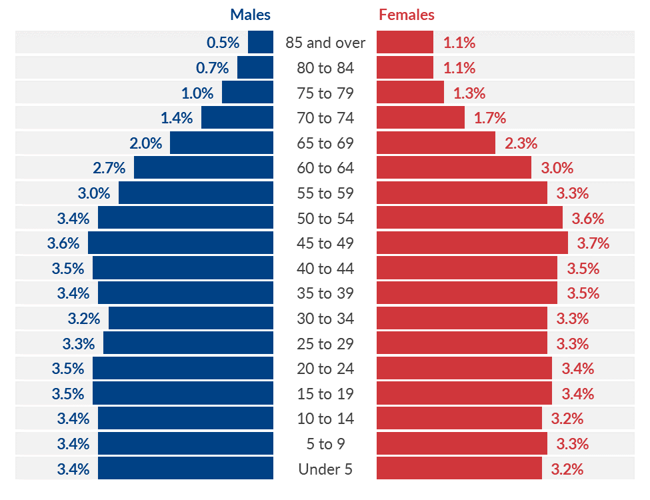
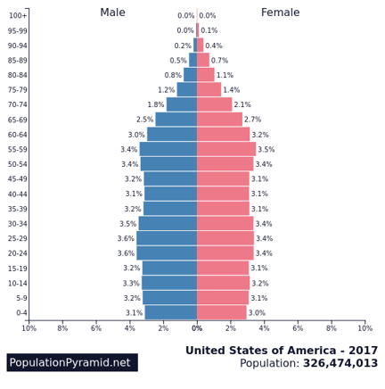

## Data visualization and analysis handbook (Apr 2019 v2)
###  Examples of visualizations: 14. Population Pyramids

### [Index](../Data visualization and analysis handbook.md)

1. [Data visualization check list](1_checklist.md)
1. [Chart selection](2_chartselection.md)
1. [Examples of visualizations](3_chartindex.md)
1. [Examples of makeovers – from bad to good](4_makeover.md)
1. [How to develop a story with visualizations](5_story.md)
1. [Resources](6_resources.md)

***

#### 14. Population Pyramids

A back-to-back histogram for comparing two categories at once, like the distribution of males and females across different age groups.

[https://depictdatastudio.com/charts/population-pyramids/](https://depictdatastudio.com/charts/population-pyramids/)

Example 1

***

Example 2

***

Source: [https://www.populationpyramid.net/](https://www.populationpyramid.net/)

