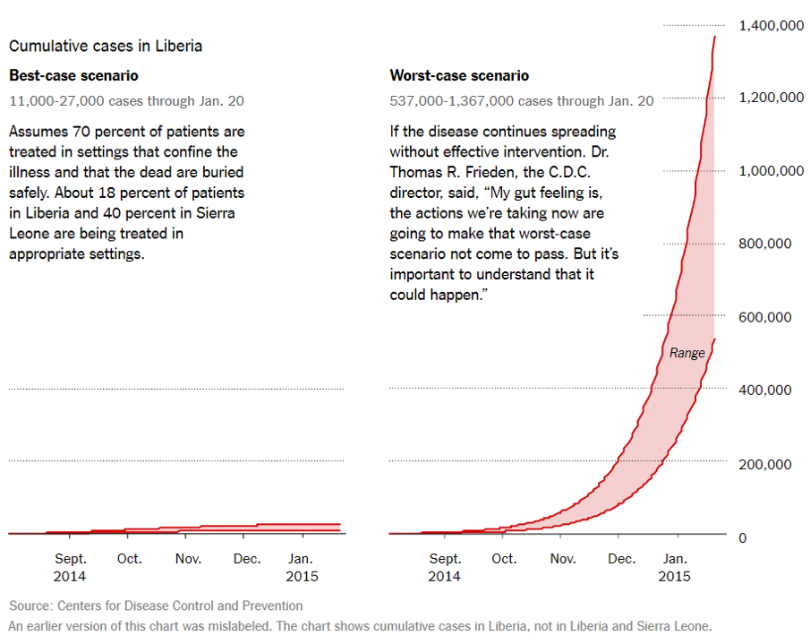
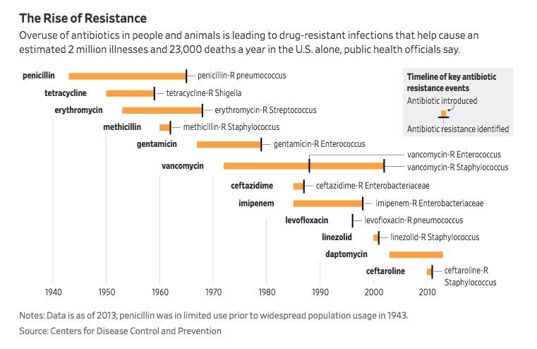

## Data visualization and analysis handbook (Apr 2019 v2)
###  Examples of visualizations: 15. Span Chart

### [Index](../Data visualization and analysis handbook.md)

1. [Data visualization check list](1_checklist.md)
1. [Chart selection](2_chartselection.md)
1. [Examples of visualizations](3_chartindex.md)
1. [Examples of makeovers – from bad to good](4_makeover.md)
1. [How to develop a story with visualizations](5_story.md)
1. [Resources](6_resources.md)

***

#### 15. Span Chart

Example 1

***

**How Many People Could Become Infected? **

The W.H.O. reported on Oct. 14 that the number of new Ebola cases could reach 10,000 per week by December. The C.D.C. published a report in September that outlined a worst-case situation, in which the total number of cases could reach 1.4 million in four months. The C.D.C.’s model is based on data from August and includes cases in Liberia and Sierra Leone, but not Guinea (where counts have been unreliable). It also projects further into the future and adds ranges to account for underreporting of cases.

[nytimes](https://www.nytimes.com/interactive/2014/07/31/world/africa/ebola-virus-outbreak-qa.html#model)

Use span charts when you’ve only got the min and max (not a median, mean, or frequency count).

[https://depictdatastudio.com/charts/span/](https://depictdatastudio.com/charts/span/)

Example 2

***

Common ‘superbug’ found to disguise resistance to potent antibiotic 

Source: [twitter](https://twitter.com/WSJGraphics/status/971423769095999488)

