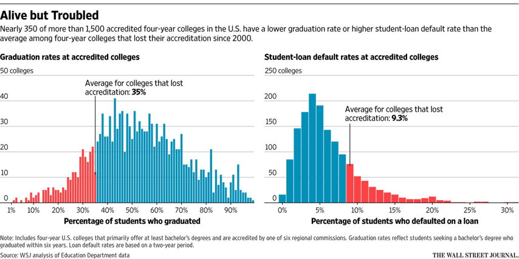

## Data visualization and analysis handbook (Apr 2019 v2)
###  Examples of visualizations: 17. Histograms

### [Index](../Data visualization and analysis handbook.md)

1. [Data visualization check list](1_checklist.md)
1. [Chart selection](2_chartselection.md)
1. [Examples of visualizations](3_chartindex.md)
1. [Examples of makeovers – from bad to good](4_makeover.md)
1. [How to develop a story with visualizations](5_story.md)
1. [Resources](6_resources.md)

***

#### 17. Histograms

Designed to show a dataset’s distribution or spread.
On the surface, histograms look similar to vertical column charts. A primary difference is that histograms group multiple columns into bins. For example, a column chart might show age 10, 11, 12, 13, and so on as separate bars. A histogram would group ages into age categories, like ages 10-19, ages 20-29, ages 30-39, and so on.
Histograms are designed to show a dataset’s distribution or spread. If you’ve taken a high school or college statistics course, then you recognize these graphs from your normal distribution and binomial distribution lessons.

[https://depictdatastudio.com/charts/histograms/](https://depictdatastudio.com/charts/histograms/)

Example 1

***

Source: [wsj](http://si.wsj.net/public/resources/images/P1-BU058_ACCRED_16U_20150617181212.jpg)

Example 2

***

AFTER two years of Republican government, Americans will go to the polls on November 6th to elect a new Congress. In addition to 35 seats in the Senate, all 435 seats in the lower chamber—the House of Representatives—are up for election. On current data our statistical model of the electiongives the Democrats about a nine-in-ten/span> chance of gaining a majority in the House. On average, we expect the Democrats to win  a 25-seat majority.

Source: [economist](https://www.economist.com/graphic-detail/2018/05/24/whos-ahead-in-the-mid-term-race)

Example 3

***

Source: [journalism](https://www.journalism.org/essay/searching-for-news/)

