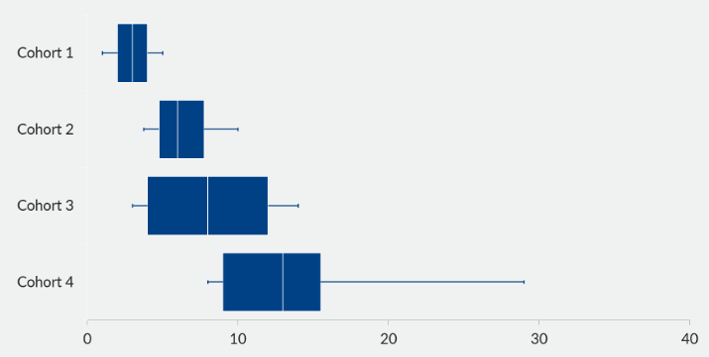

## Data visualization and analysis handbook (Apr 2019 v2)
###  Examples of visualizations: 18. Boxplot

### [Index](../Data visualization and analysis handbook.md)

1. [Data visualization check list](1_checklist.md)
1. [Chart selection](2_chartselection.md)
1. [Examples of visualizations](3_chartindex.md)
1. [Examples of makeovers – from bad to good](4_makeover.md)
1. [How to develop a story with visualizations](5_story.md)
1. [Resources](6_resources.md)

***

#### 18. Boxplot

Box and Whisker
Display the min, max, mean or median, and quartiles 1 and 3.
Common in high school statistics courses, but not so common in the real world. These graphs display the min, max, mean or median, and quartiles 1 and 3.

[https://depictdatastudio.com/charts/box-and-whisker/
](https://depictdatastudio.com/charts/box-and-whisker/
)

Example 1

***

Source: [peltiertech](https://peltiertech.com/excel-box-and-whisker-diagrams-box-plots/)

