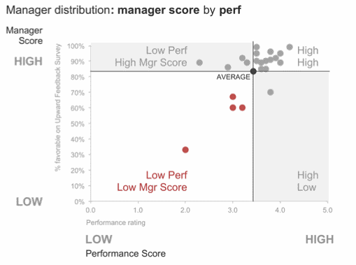
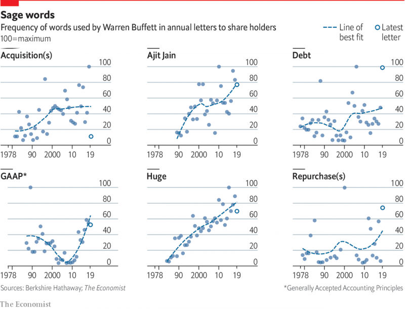
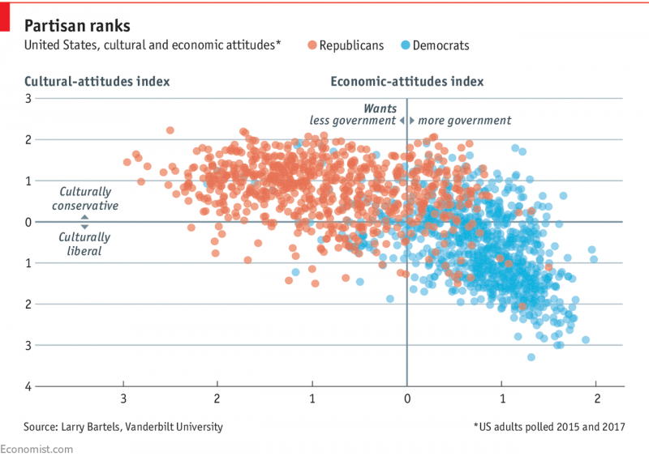
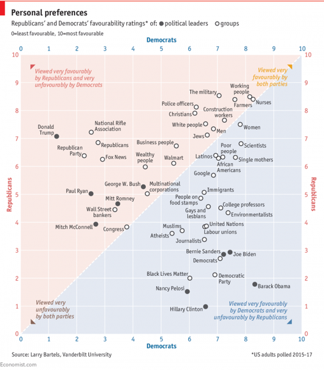

## Data visualization and analysis handbook (Apr 2019 v2)
###  Examples of visualizations: 19. Scatterplot

### [Index](../Data visualization and analysis handbook.md)

1. [Data visualization check list](1_checklist.md)
1. [Chart selection](2_chartselection.md)
1. [Examples of visualizations](3_chartindex.md)
1. [Examples of makeovers – from bad to good](4_makeover.md)
1. [How to develop a story with visualizations](5_story.md)
1. [Resources](6_resources.md)

***

#### 19. Scatterplot

Display correlations between two continuous variables.
For example, you could display heights and weights or grade point averages and standardized test scores. Scatter plots are a staple from your college statistics course, but they tend to be less recognizable among everyday people who haven’t taken those same statistics courses.

[https://depictdatastudio.com/charts/scatter-plots/](https://depictdatastudio.com/charts/scatter-plots/)

Example 1

***

Source: [storytellingwithdata](http://www.storytellingwithdata.com/blog/2015/04/the-power-of-categorization)

Example 2

***

Source: [economist](https://www.economist.com/graphic-detail/2019/03/04/warren-buffetts-letters-illuminate-berkshire-hathaways-trajectory)

Example 3

***

**Republicans are less divided on cultural issues than Democrats are**

The party turned Trumpy before the 2016 election, not after

Source: [economist](https://www.economist.com/graphic-detail/2018/04/16/republicans-are-less-divided-on-cultural-issues-than-democrats-are)

Example 4

***

**What do Democrats and Republicans both like?**

Members of both parties hate Congress equally

Source: [economist](https://www.economist.com/graphic-detail/2018/03/23/what-do-democrats-and-republicans-both-like)

