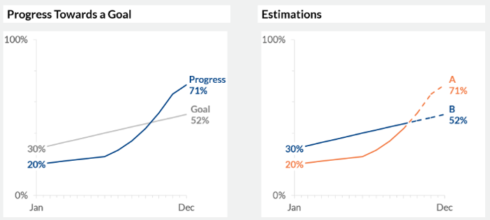
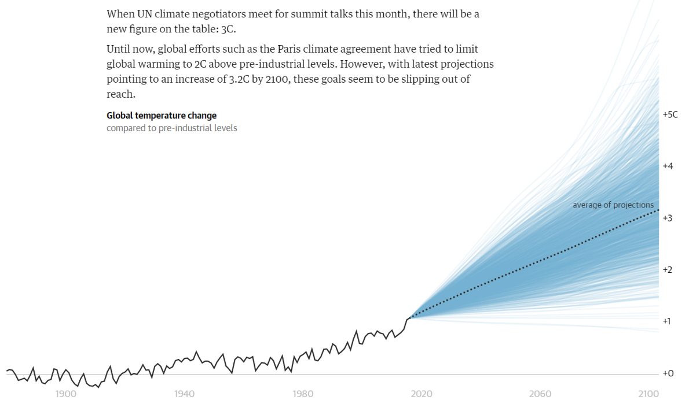

## Data visualization and analysis handbook (Apr 2019 v2)
###  Examples of visualizations: 1. Line Chart – Estimations Chart, Target Lines

### [Index](../Data visualization and analysis handbook.md)

1. [Data visualization check list](1_checklist.md)
1. [Chart selection](2_chartselection.md)
1. [Examples of visualizations](3_chartindex.md)
1. [Examples of makeovers – from bad to good](4_makeover.md)
1. [How to develop a story with visualizations](5_story.md)
1. [Resources](6_resources.md)

***

#### 1. Line Chart – Estimations Chart, Target Lines 

**Target Lines on Line Charts**

Visualize progress towards a goal over time by adding a light target line to your graph.

Source: [https://depictdatastudio.com/charts/target-lines-on-line-charts/](https://depictdatastudio.com/charts/target-lines-on-line-charts/)

**Estimations**
 
Visualize estimations or projections with dotted lines.

Source: [https://depictdatastudio.com/charts/estimations/](https://depictdatastudio.com/charts/estimations/)

Example 1

***

***

Target Lines

Example 2

***

Source: [https://www.theguardian.com/cities/ng-interactive/2017/nov/03/three-degree-world-cities-drowned-global-warming](https://www.theguardian.com/cities/ng-interactive/2017/nov/03/three-degree-world-cities-drowned-global-warming)

***

