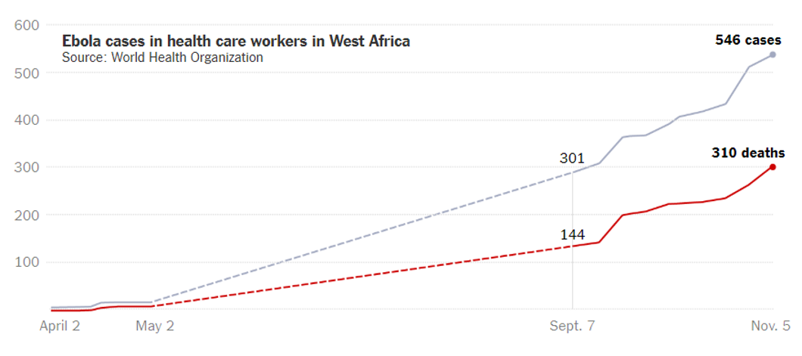
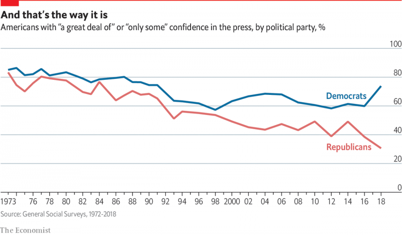
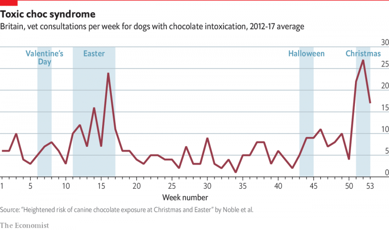
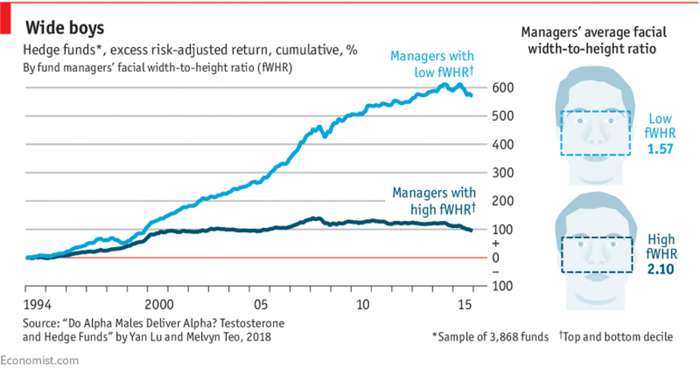
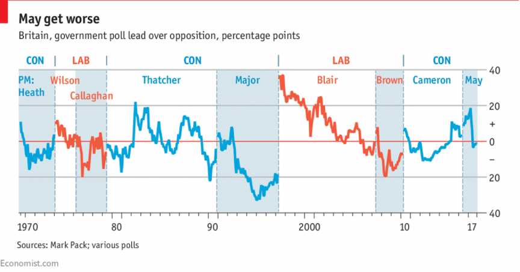

## Data visualization and analysis handbook (Apr 2019 v2)
###  Examples of visualizations: 1. Line Chart – Estimations Chart, Target Lines

### [Index](../Data visualization and analysis handbook.md)

1. [Data visualization check list](1_checklist.md)
1. [Chart selection](2_chartselection.md)
1. [Examples of visualizations](3_chartindex.md)
1. [Examples of makeovers – from bad to good](4_makeover.md)
1. [How to develop a story with visualizations](5_story.md)
1. [Resources](6_resources.md)

***

#### 1. Line Chart – Estimations Chart, Target Lines 

Example 1

***

**How Many Health Care Workers Have Contracted Ebola?**

More than 500 health care workers in West Africa have been infected with Ebola during the current outbreak, and 310 had died as of Nov. 5. The W.H.O. said that the high rates of infection among medical workers could be attributed to shortages or improper use of protective equipment; not enough medical personnel; and long working hours in isolation wards.

Source: [nytimes](https://www.nytimes.com/interactive/2014/07/31/world/africa/ebola-virus-outbreak-qa.html#model)

Example 2

***

Source: [economist](https://www.economist.com/graphic-detail/2019/04/03/for-americans-trusting-the-media-has-become-a-partisan-issue)

Example 3

***

Source: [economist](https://www.economist.com/graphic-detail/2019/04/19/at-easter-beware-chocolate-scoffing-dogs)

Example 4

***

**Are alpha males worse investors?**

New research suggests high-testosterone traders earn lower returns

A [paper](https://editorialexpress.com/cgi-bin/conference/download.cgi?db_name=AFA2019&paper_id=188) recently published by researchers at the University of Central Florida and Singapore Management University looks at the relationship between testosterone (a hormone associated with competitiveness and risk-taking) and investment performance. Using over twenty years of data on hedge-fund returns and thousands of images collected from Google, the authors find that *fund managers with wider faces*, a proxy for testosterone levels, tend to trade more frequently, *invest in riskier securities and hold onto losing bets longer*. As a result, between 1994 and 2015, *high-testosterone fund managers* (with an average facial width-to-height ratio of 2.10) *underperformed low-testosterone ones* (with an average ratio of 1.57) *by 5.8% per year.*

Source: [economist](https://www.economist.com/graphic-detail/2018/02/20/are-alpha-males-worse-investors)

Example 5

***

**Theresa May’s record-breaking plunge**

No recent prime minister has swooned so spectacularly in the polls

No prime minister in half a century has suffered as steep a drop in popularity as Theresa May did this summer. In three months the Conservatives’ share in the polls fell by 22 percentage points. It took voters five months to turn so strongly against John Major, and eight months to grow so weary of Gordon Brown. But whereas those two leaders eventually fell further, Mrs May seems to have pulled out of her nosedive. Faced with the alternative of Jeremy Corbyn, voters may reckon they can live with her. Another year of Brexit talks—the next one much harder than the last—may yet make them think again.

Source: [economist](https://www.economist.com/graphic-detail/2017/12/27/theresa-mays-record-breaking-plunge)

