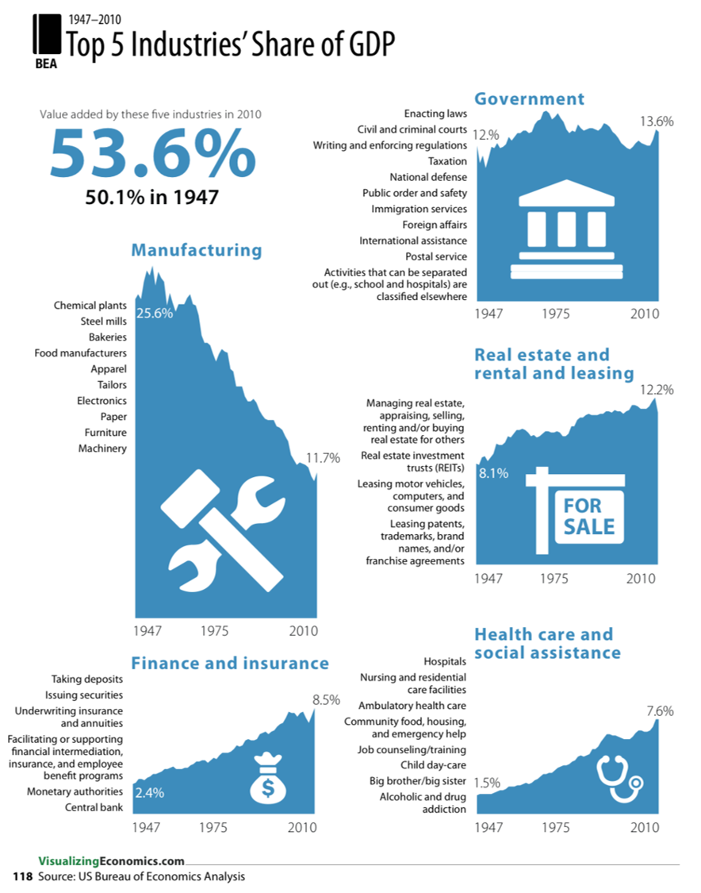
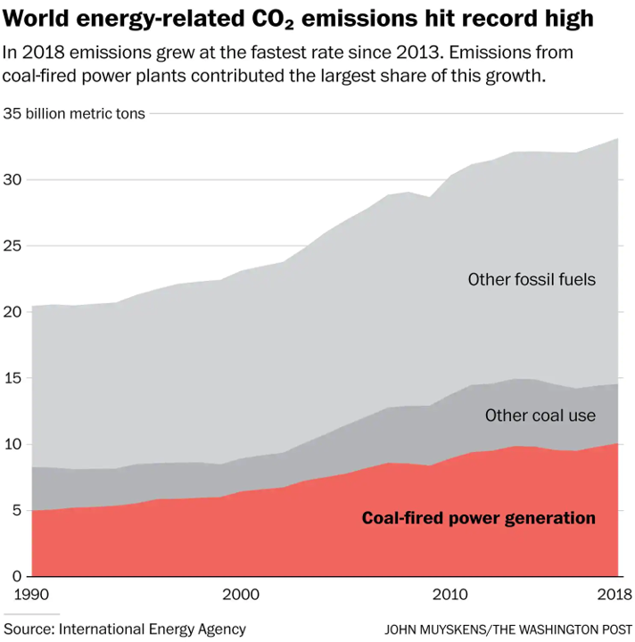
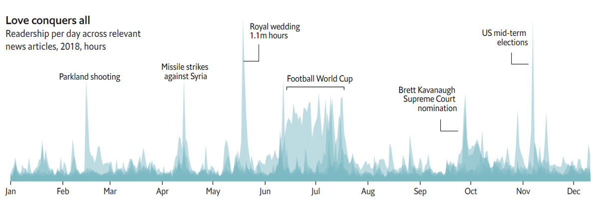
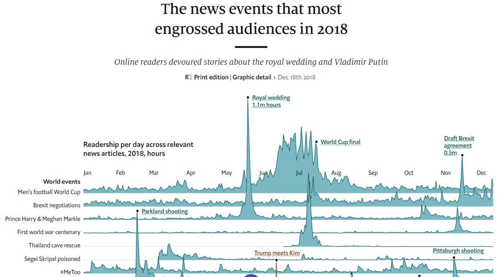
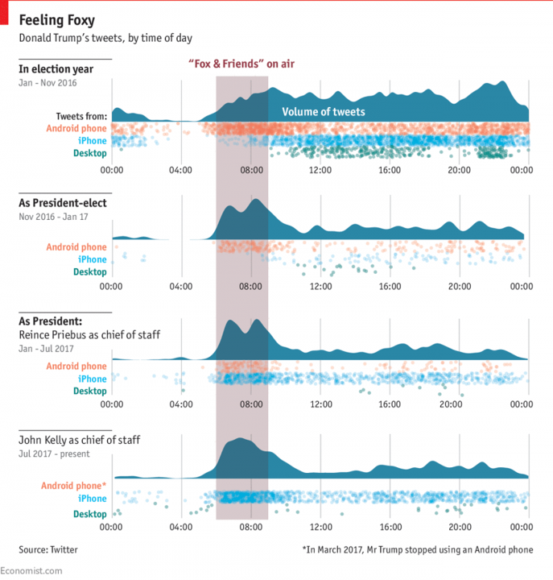

## Data visualization and analysis handbook (Apr 2019 v2)
###  Examples of visualizations: 2. Area Chart

### [Index](../Data visualization and analysis handbook.md)

1. [Data visualization check list](1_checklist.md)
1. [Chart selection](2_chartselection.md)
1. [Examples of visualizations](3_chartindex.md)
1. [Examples of makeovers – from bad to good](4_makeover.md)
1. [How to develop a story with visualizations](5_story.md)
1. [Resources](6_resources.md)

***

#### 2. Area Chart 

A great option when you only need to display a single line on the graph.

Area charts are like line charts with the area underneath the line shaded in. Line charts are a great option when you need to display two, three, or more series (lines) on a single graph. Area charts, on the other hand, are a great option when you only need to display a single line on the graph.

[https://depictdatastudio.com/charts/area/](https://depictdatastudio.com/charts/area/)
 
Example 1

***

{:height="80%" width="80%"}

Source:[squarespace](https://static1.squarespace.com/static/50060e33c4aa3dba773634ec/50fb4b60e4b01072fd2e3349/50fb4cf8e4b0dcfb3cb2ebbe/1358646523366/IncomeGuide_2013_Jan17_RGB_page+118_118.png)

Example 2

***

{:height="80%" width="80%"}

Source:[washingtonpost](https://www.washingtonpost.com/climate-environment/2019/03/26/blow-climate-coal-plants-emitted-more-than-ever/?noredirect=on&utm_term=.0e979ba46c6b)

Example 3

***

{:height="100%" width="100%"}

Source:[economist](https://www.economist.com/graphic-detail/2018/12/18/the-news-events-that-most-engrossed-audiences-in-2018)

Example 4

***

{:height="100%" width="100%"}

Source:[economist](https://www.economist.com/graphic-detail/2018/12/18/the-news-events-that-most-engrossed-audiences-in-2018)

Example 5

***

**All the president’s tweets**

Fox News enjoys considerable influence over the world’s most important Twitter account

{:height="100%" width="100%"}

Source:[economist](https://www.economist.com/graphic-detail/2018/01/15/all-the-presidents-tweets)

