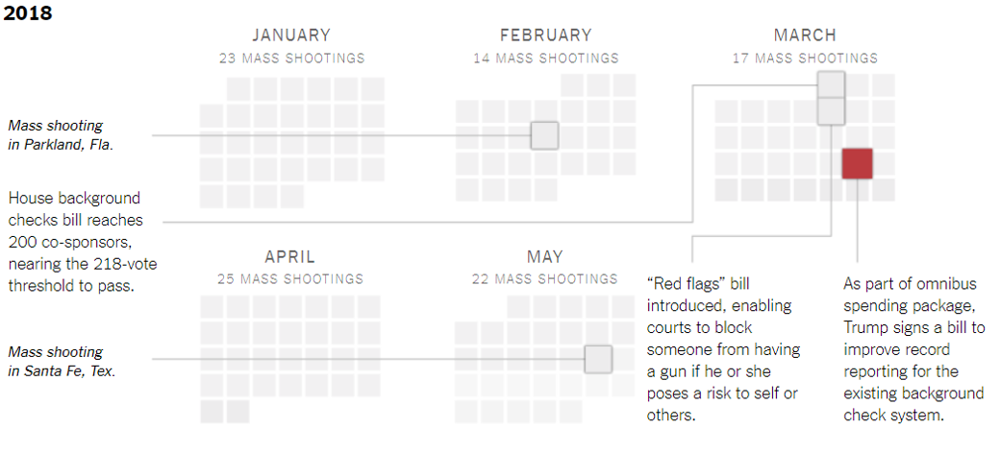
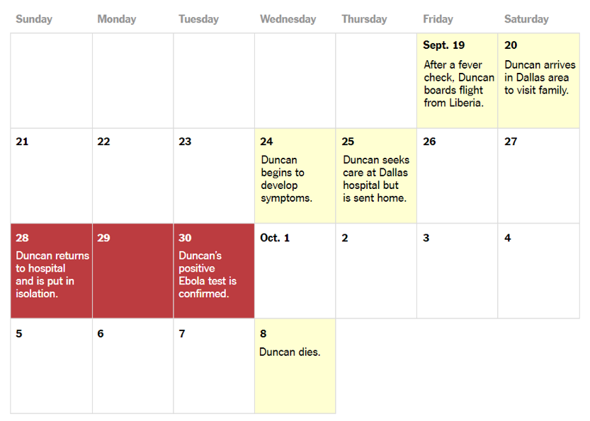
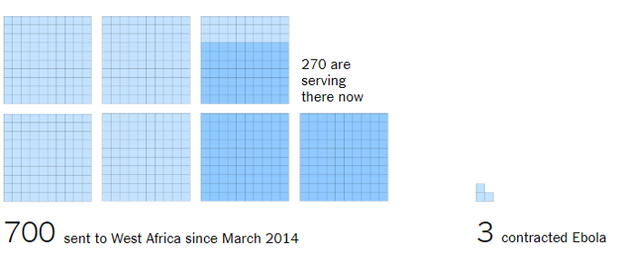

## Data visualization and analysis handbook (Apr 2019 v2)
###  Examples of visualizations: 22. Calendars

### [Index](../Data visualization and analysis handbook.md)

1. [Data visualization check list](1_checklist.md)
1. [Chart selection](2_chartselection.md)
1. [Examples of visualizations](3_chartindex.md)
1. [Examples of makeovers – from bad to good](4_makeover.md)
1. [How to develop a story with visualizations](5_story.md)
1. [Resources](6_resources.md)

***

#### 22. Calendars

Visualize key milestones that took place over the past month(s).

[https://depictdatastudio.com/charts/calendars/](https://depictdatastudio.com/charts/calendars/)

Example 1

***

Source: [nytimes](https://www.nytimes.com/interactive/2018/02/15/opinion/congress-gun-progress.html)

Example 2

***

**When Did Ebola Arrive and Spread at a Dallas Hospital?**

Thomas Eric Duncan, a Liberian who traveled to Dallas, began developing symptoms for Ebola on Sept. 19 and tested positive for Ebola six days later. Two nurses, Nina Pham and Amber Joy Vinson, were caring for Mr. Duncan during what federal health officials have called the highest risk period, when he was vomiting and experiencing diarrhea. Both nurses tested positive for Ebola after Mr. Duncan died.

Ms. Pham and Ms. Vinson were transported to special isolation units in Atlanta and Maryland. Both have since recovered from the disease.

Source: [nytimes](https://www.nytimes.com/interactive/2014/07/31/world/africa/ebola-virus-outbreak-qa.html#model)

Example 3

***

**How Many People Have Been Sent to Countries With Ebola by Doctors Without Borders?**

Doctors Without Borders has sent 700 doctors and aid workers from around the world to Ebola-stricken countries. Of those, 270 are currently working there. Only three have contracted Ebola: a doctor from Norway, another from France, and now, an American.

Source: [nytimes](https://www.nytimes.com/interactive/2014/07/31/world/africa/ebola-virus-outbreak-qa.html#model)

