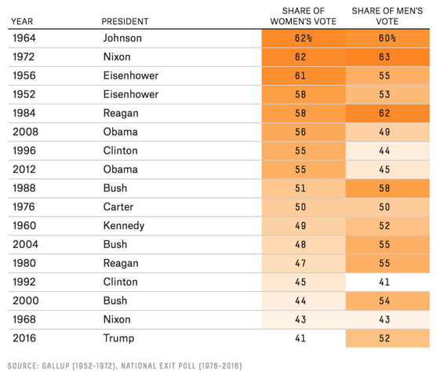
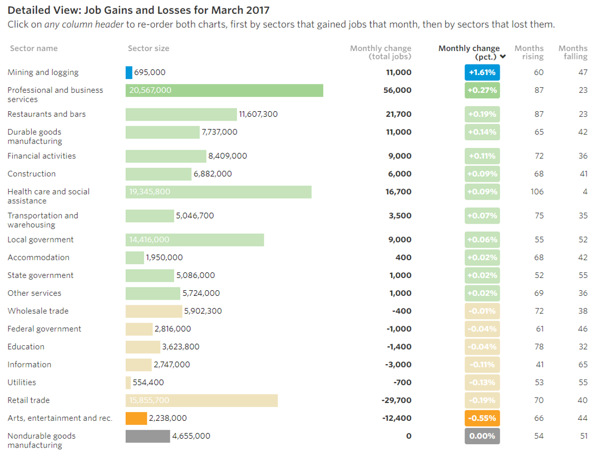

## Data visualization and analysis handbook (Apr 2019 v2)
###  Examples of visualizations: 24. Heat Tables

### [Index](../Data visualization and analysis handbook.md)

1. [Data visualization check list](1_checklist.md)
1. [Chart selection](2_chartselection.md)
1. [Examples of visualizations](3_chartindex.md)
1. [Examples of makeovers – from bad to good](4_makeover.md)
1. [How to develop a story with visualizations](5_story.md)
1. [Resources](6_resources.md)

***

#### 24. Heat Tables 

Higher numbers get darker colors and lower numbers get lighter colors.
Heat tables, a.k.a. density tables, are an excellent alternative or addition to a report full of traditional black and white tables. Higher numbers get darker colors and lower numbers get lighter colors, so your viewers’ eyes are automatically drawn to higher numbers. We can’t help but notice patterns in the data instantly.

[https://depictdatastudio.com/charts/heat-tables/](https://depictdatastudio.com/charts/heat-tables/)

Example 1

***

Trump got elected with only 41% of the women's vote, which is likely the smallest share since women's suffrage. Here's the data since 1952.

Source: [twitter](Source: https://twitter.com/NateSilver538/status/846396898915299328)

Example 2

***

Source: [WSJ](Source: http://graphics.wsj.com/job-market-tracker/)

