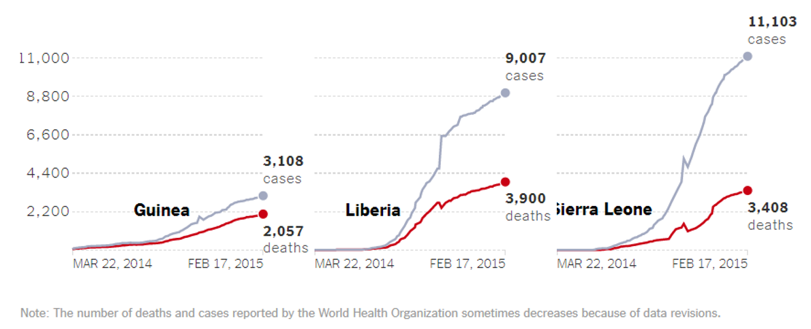

## Data visualization and analysis handbook (Apr 2019 v2)
###  Examples of visualizations: 28. Small Multiples Line

### [Index](../Data visualization and analysis handbook.md)

1. [Data visualization check list](1_checklist.md)
1. [Chart selection](2_chartselection.md)
1. [Examples of visualizations](3_chartindex.md)
1. [Examples of makeovers – from bad to good](4_makeover.md)
1. [How to develop a story with visualizations](5_story.md)
1. [Resources](6_resources.md)

***

#### 28. Small Multiples Line 

A small multiples layout with several line charts of the same shape, size, and proportions aligned in a 2×1, 3×1, 4×1, or larger grid.

Source: [https://depictdatastudio.com/charts/small-multiples-line/](https://depictdatastudio.com/charts/small-multiples-line/)

Example 1

***

Source: [washingtonpost](https://www.washingtonpost.com/news/checkpoint/wp/2017/01/27/draft-executive-order-shows-how-trump-wants-to-grow-the-u-s-military-significantly/?postshare=4211485551649063&utm_term=.1908dd1d8b89)

Example 2

***

***

#### How Many People Have Been Infected in Africa? 

More than 23,200 people in Guinea, Liberia, Mali, Nigeria, Senegal and Sierra Leone have contracted Ebola since March, according to the World Health Organization, making this the biggest outbreak on record. **More than 9,300 people** have died.

The organization declared outbreaks in Nigeria and Senegal were over. The two countries registered a combined 21 contracted cases and eight deaths.

Source: [NYTimes](https://www.nytimes.com/interactive/2014/07/31/world/africa/ebola-virus-outbreak-qa.html#model)

