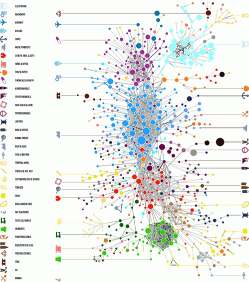

## Data visualization and analysis handbook (Apr 2019 v2)
###  Examples of visualizations: 29. Social Network

### [Index](../Data visualization and analysis handbook.md)

1. [Data visualization check list](1_checklist.md)
1. [Chart selection](2_chartselection.md)
1. [Examples of visualizations](3_chartindex.md)
1. [Examples of makeovers – from bad to good](4_makeover.md)
1. [How to develop a story with visualizations](5_story.md)
1. [Resources](6_resources.md)

***

#### 29. Social Network

Social network maps are for visualizing relationships or connections between people or between organizations.
Each dot or node represents one person (e.g., a Twitter handle).

Each line or edge represents their relationship or connection (e.g., whether someone retweeted another person).

[https://depictdatastudio.com/charts/social-network-maps/](https://depictdatastudio.com/charts/social-network-maps/)

Example 1

***

Source: [analytics-magazine.org](http://analytics-magazine.org/data-visualization-the-future-of-data-visualization/)

