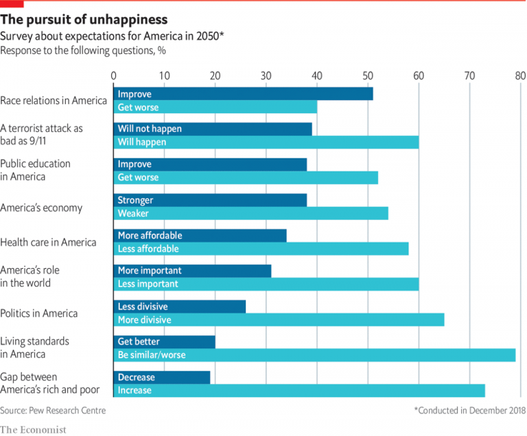
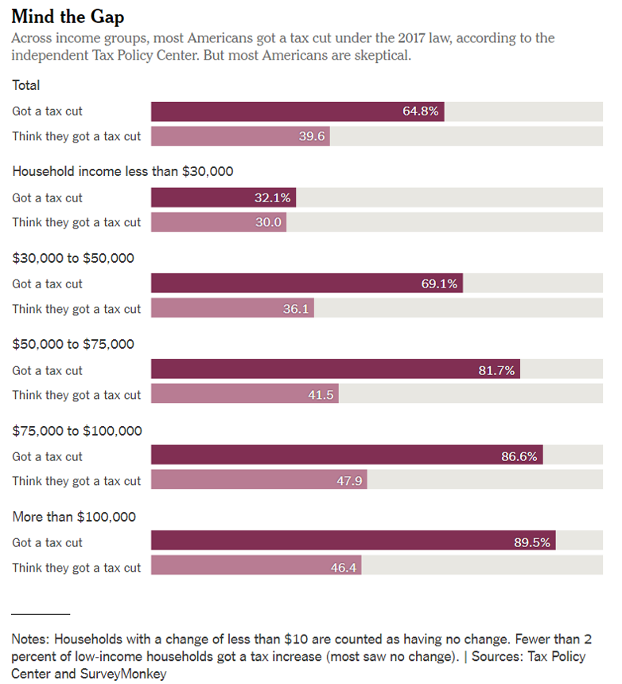

## Data visualization and analysis handbook (Apr 2019 v2)
###  Examples of visualizations: 38. Multi-set Bar Chart

### [Index](../Data visualization and analysis handbook.md)

1. [Data visualization check list](1_checklist.md)
1. [Chart selection](2_chartselection.md)
1. [Examples of visualizations](3_chartindex.md)
1. [Examples of makeovers – from bad to good](4_makeover.md)
1. [How to develop a story with visualizations](5_story.md)
1. [Resources](6_resources.md)

***

#### 38. Multi-set Bar Chart

Example 1

***

Source: [economist](https://www.economist.com/graphic-detail/2019/04/08/most-americans-expect-life-to-get-worse-by-2050)

Example 2

***

Source: [NYTimes](https://www.nytimes.com/2019/04/14/business/economy/income-tax-cut.html?&moduleDetail=section-news-2&action=click&contentCollection=Business%20Day&region=Footer&module=MoreInSection&version=WhatsNext&contentID=WhatsNext&pgtype=article)

