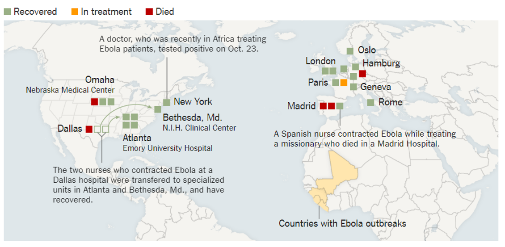

## Data visualization and analysis handbook (Apr 2019 v2)
###  Examples of visualizations: 45. Choropleth Map

### [Index](../Data visualization and analysis handbook.md)

1. [Data visualization check list](1_checklist.md)
1. [Chart selection](2_chartselection.md)
1. [Examples of visualizations](3_chartindex.md)
1. [Examples of makeovers – from bad to good](4_makeover.md)
1. [How to develop a story with visualizations](5_story.md)
1. [Resources](6_resources.md)

***

#### 45. Choropleth Map

Example 1

***

At least 24 cases have been treated in Europe and the United States. Many were health and aid workers who contracted Ebola in West Africa and were transported back to their home countries for treatment. The latest patient in the United States to have the disease arrived on Nov. 15 and died three days later while being treated in a biocontainment center in Omaha. Cases shown below are compiled from reports by the C.D.C., the World Health Organization, Doctors Without Borders and other agencies.

Source: [NYTimes](https://www.nytimes.com/interactive/2014/07/31/world/africa/ebola-virus-outbreak-qa.html#model)

