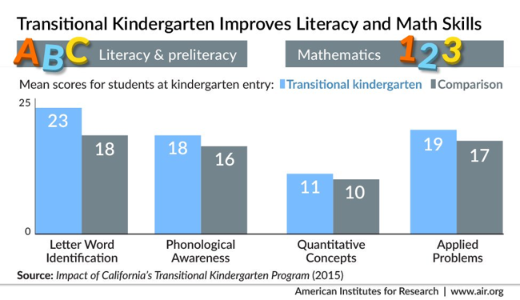

## Data visualization and analysis handbook (Apr 2019 v2)
###  Examples of visualizations: 6. Column (Clustered) Bar Chart 

### [Index](../Data visualization and analysis handbook.md)

1. [Data visualization check list](1_checklist.md)
1. [Chart selection](2_chartselection.md)
1. [Examples of visualizations](3_chartindex.md)
1. [Examples of makeovers – from bad to good](4_makeover.md)
1. [How to develop a story with visualizations](5_story.md)
1. [Resources](6_resources.md)

***

#### 6. Column (Clustered) Bar Chart 

Use this cautiously. When there are more than 3 categories, explore other chart options.

[https://depictdatastudio.com/charts/clustered-bar/](https://depictdatastudio.com/charts/clustered-bar/)

Example 1

***

Source: [https://twitter.com/Education_AIR/status/824624235133935616](https://twitter.com/Education_AIR/status/824624235133935616)

