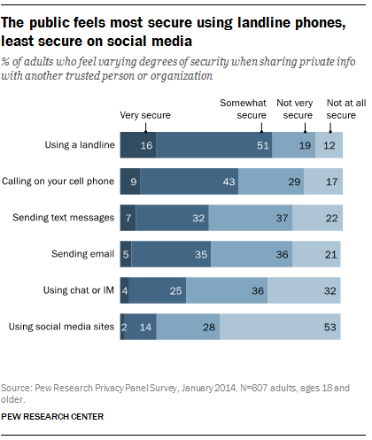
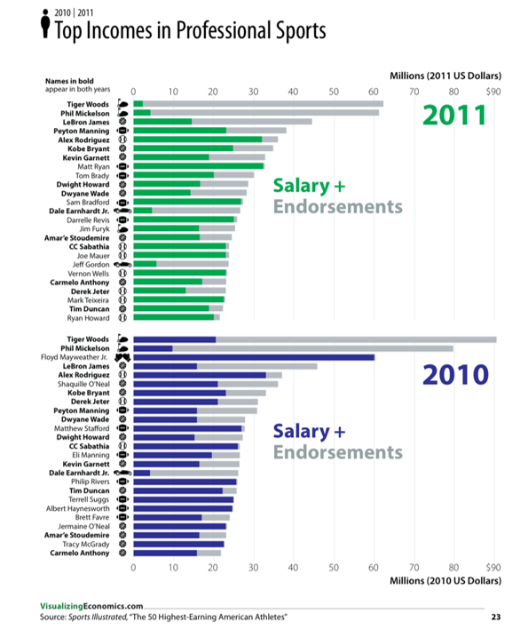

## Data visualization and analysis handbook (Apr 2019 v2)
###  Examples of visualizations: 9. Stacked Bar Chart

### [Index](../Data visualization and analysis handbook.md)

1. [Data visualization check list](1_checklist.md)
1. [Chart selection](2_chartselection.md)
1. [Examples of visualizations](3_chartindex.md)
1. [Examples of makeovers – from bad to good](4_makeover.md)
1. [How to develop a story with visualizations](5_story.md)
1. [Resources](6_resources.md)

***

#### 9. Stacked Bar Chart

Stacked bar charts show how parts add up to a whole. 

[https://depictdatastudio.com/charts/stacked-bar/](https://depictdatastudio.com/charts/stacked-bar/)

Example 1

***

9% of US adults feel “very secure” about sharing info while making a call on their mobile phone

Source: [pewresearch](https://twitter.com/pewresearch/status/532565377143033857)

Example 2

***

Source: [https://static1.squarespace.com/static/50060e33c4aa3dba773634ec/50fb4b60e4b01072fd2e3349/50fb4bd5e4b01072fd2e3583/1358646232030/IncomeGuide_2013_Jan17_RGB_page+23_23.png](https://static1.squarespace.com/static/50060e33c4aa3dba773634ec/50fb4b60e4b01072fd2e3349/50fb4bd5e4b01072fd2e3583/1358646232030/IncomeGuide_2013_Jan17_RGB_page+23_23.png)

