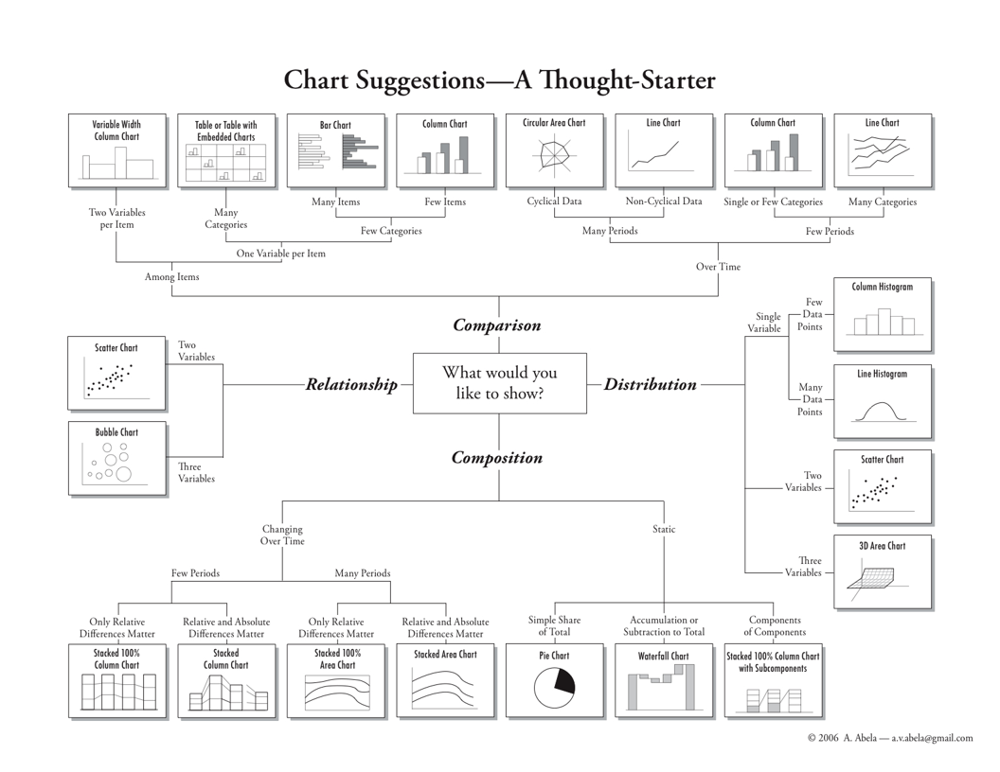

## Data Visualization and Analysis Handbook (2022)

###  Chart selection

### [Index](../Data visualization and analysis handbook2022.md)

1. [Data visualization check list](1_checklist.md)
1. [Chart selection](2_chartselection.md)
1. [Examples of visualizations](3_chartindex.md)
1. [Examples of makeovers – from bad to good](4_makeover.md)
1. [How to develop a story with visualizations](5_story.md)
1. [Resources](6_resources.md)

***

Source: [chart suggestions - a thought starter](https://extremepresentation.typepad.com/.a/6a00d8341bfd2e53ef00e553577fea8833-pi)

#### The general data insight that corresponds to each data classification

| Data | Example | Insight | Chart type|
| ------ | ------ | ------ | ------ |  
| Categorical | Non-numeric data such as types of movies, books, or authors.  | Comparisons, proportions | Vertical bar, column bar, horizontal bar, and bullet charts Pie, stacked bar, stacked 100% bar, stacked area, stacked 100% area, and a tree map |
| Univariate  | One numeric variable, such as book price | Distributions, proportions, frequencies  | Histogram, density plot, and a boxplot  |
| Geospatial  |Specific locations marked by the latitude and longitude, regions coded by zip code, city, state, country, or county boundaries |Locations, comparisons, trends |Choropleth filled-map, bubble map, point map, connection map, and isopleth map  |
| Multivariate  |Two or more numeric variables, for example, weight, height, and IQ |Relationships, proportions, comparisons  |Scatterplot, scatterplot matrix, bubble, parallel coordinates, radar, bullet, and a heat map.  |
| Time series  |Years, months, days, hours, minutes, seconds, or date |Trends, comparisons, cycles |Line chart, sparkline, area, stream graph, as well as bubble, stacked-area, and vertical bar charts.  |
| Text  |Single words or phrases, such as keywords from restaurant reviews on Yelp |Sentiment, comparisons, frequency  |Word cloud, proportional area chart using size bubbles or squares, histogram, and bar chart  |
| Edge lists or adjacency matrices  |Who contacts whom or who knows whom in a network |Connections, relationships, tie strength, centrality, interactions  |Undirected network diagram and directed network diagram |

Source: Sosulski, Kristen. Data Visualization Made Simple (Page 46). Taylor and Francis.

