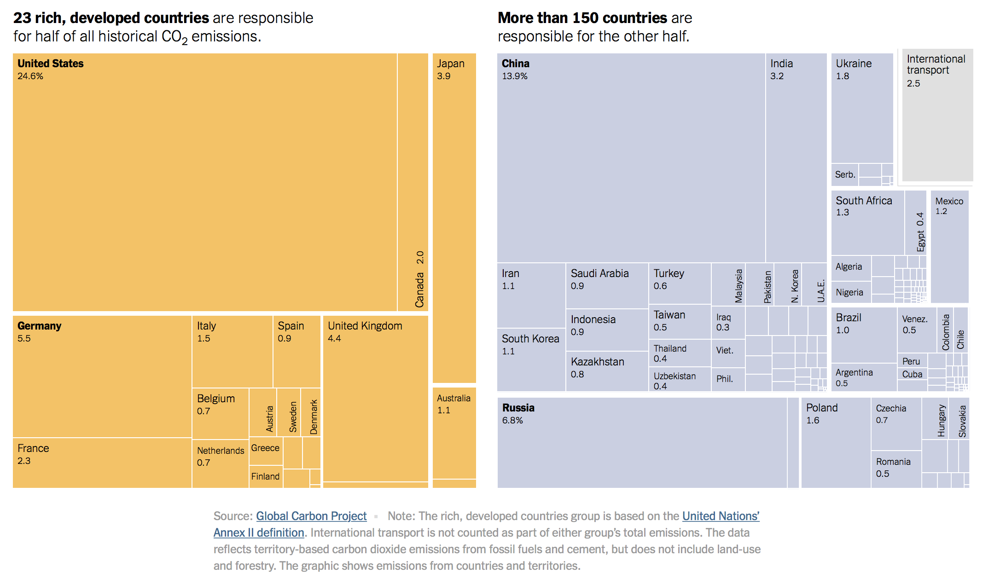

## Data Visualization and Analysis Handbook (2022)

###  Examples of visualizations: 1. Heatmap

### [Index](../../Data visualization and analysis handbook2022.md)

1. [Data visualization check list](../1_checklist.md)
1. [Chart selection](../2_chartselection.md)
1. [Examples of visualizations](../3_chartindex.md)
1. [Examples of makeovers – from bad to good](../4_makeover.md)
1. [How to develop a story with visualizations](../5_story.md)
1. [Resources](../6_resources.md)

***

#### 6. Heatmap 

***

Source: [NYTimes](https://www.nytimes.com/interactive/2021/11/12/climate/cop26-emissions-compensation.html)

***

