## Mayo Clinic - STRIP AI - Exploratory data analysis and Image processing with Pillow (PIL)

*Jul 26, 2022*


### 1. Understand the train data

#### 1.1. descriptions of the train data

- data file: train.csv
- fields:
    - features
        -  image_id - A unique identifier for this instance having the form {patient_id}_{image_num}. Corresponds to the image {image_id}.tif.
        -  center_id - Identifies the medical center where the slide was obtained.
        -  patient_id - Identifies the patient from whom the slide was obtained.
        -  image_num - Enumerates images of clots obtained from the same patient.
    - target
        -  label - The etiology of the clot, either CE or LAA. This field is the classification target.
        
#### 1.2. summary of the train data

- train data has 754 samples for 632 unique patients:
    - the majority have only 1 image
    - some patients have as many as 5 images thus 5 samples in the training data
    - despite a patient may have more than 1 image, one patient has only one category of etiology (CE or LAA)  and only one center_id
    
- there are total of 11 centers
    - most samples are from center 11: 257 out of 754
    - center 4 has the 2nd most samples: 114 out of 754

- label
    - 72.5% samples are `CE` category; 27.5% are `LAA`
    - 457 patients are `CE` category, accounts for 72% of all patients.   
    - similar to the overall distribution, the majority are `CE` category per center_id except center_id = 3
    - there are about equal number of samples in `CE` and `LAA`  categories   
    
#### 1.3. understand the images

- files sizes:

    - most files are less than 500MB; however, there are a few files more than 2GB
    - file sizes do not differ much between the 2 categories of clot `CE` and `LAA`
    - large files are mostly from center 11
    
- images:
    - explore if images for the same patient can be vastly different
    - explore if images for different etiology of the clots look very different
        - based on images of two patients, 2 different type of clots look different


### 2. A bit exploration of the other data

- other.csv - Annotations for images in the other/ folder. 
    - Has the same fields as train.csv. 
    - The center_id is unavailable for these images however.
    - label - The etiology of the clot, either Unknown or Other.
    - other_specified - The specific etiology, when known, in case the etiology is labeled as Other.


### 3. Image processing with Pillow (PIL)

- the `Pillow` package (`from PIL import Image`) offers to resize images in 2 ways: resize and thumbnail
    - resize images: 
        - [https://pillow.readthedocs.io/en/stable/reference/Image.html?highlight=resize#PIL.Image.Image.resize](https://pillow.readthedocs.io/en/stable/reference/Image.html?highlight=resize#PIL.Image.Image.resize)
        - when using resize, you need to calculate the original image height-width ratio and make sure the resized image retains the same ratio. 
    - Create thumbnails: 
        - [https://pillow.readthedocs.io/en/stable/reference/Image.html?highlight=thumbnail#create-thumbnails](https://pillow.readthedocs.io/en/stable/reference/Image.html?highlight=thumbnail#create-thumbnails)
        - using thumbnail does not have to deal with the hassle of keeping original image ratio. 
    - addtional examples and explanations: [stackoverflow: How do I resize an image using PIL and maintain its aspect ratio?](https://stackoverflow.com/questions/273946/how-do-i-resize-an-image-using-pil-and-maintain-its-aspect-ratio)

- Both thumnail and resize require defining the 'resample' filter. 
    - [https://pillow.readthedocs.io/en/stable/handbook/concepts.html#concept-filters](https://pillow.readthedocs.io/en/stable/handbook/concepts.html#concept-filters)
    - for best quality: choose resampling filter `PIL.Image.LANCZOS`
    - for fastest resizing: choose resampling filter `PIL.Image.NEAREST`
- Addtional notes
    - Rotate image: when the height of the image is much larger than the width of the image, it may be worthwhile to rotate the image in 90 degrees.
        - the rotate method: `transpose`(https://pillow.readthedocs.io/en/stable/reference/Image.html?highlight=resize#PIL.Image.Image.resize)
        - **!!! need to assign the transposed image to a new object to make the `transpose` work.**
        - use `transpose(PIL.Image.Transpose.ROTATE_90)` to rotate image in 90 degrees
    - close image to release memory
        - use **`close()`** to destroy the image object and release memory: e.g. `img.close()`
        - for the image object, using `del img` and `gc.collect()` to recycle memory do not help much in releasing the memory
    - image attributes
        - `img.size` returns *(width, height)* of the image, not *(height, width)*.
        -  to get the height or width, use `img.height` and `img.width`
    - max pixels to display:
        - set `Image.MAX_IMAGE_PIXELS = None`  to disabled the upper limit of pixels to display.

##### Load packages


```python
#basic libs

import pandas as pd
import numpy as np
import os
from pathlib import Path

from datetime import datetime, timedelta
import time
from dateutil.relativedelta import relativedelta

import gc
import copy

#additional data processing

import pyarrow.parquet as pq
import pyarrow as pa

from sklearn.preprocessing import StandardScaler, MinMaxScaler


#visualization
import seaborn as sns
import matplotlib.pyplot as plt

#load images
import matplotlib.image as mpimg
import PIL
from PIL import Image


#settings
pd.options.display.max_rows = 100
pd.options.display.max_columns = 100

Image.MAX_IMAGE_PIXELS = None

import warnings
warnings.filterwarnings("ignore")

import pytorch_lightning as pl
random_seed=1234
pl.seed_everything(random_seed)
```


    1234


```python
import os

next(os.walk('/kaggle/input/mayo-clinic-strip-ai'))
```


    ('/kaggle/input/mayo-clinic-strip-ai',
     ['other', 'test', 'train'],
     ['sample_submission.csv', 'train.csv', 'test.csv', 'other.csv'])


### Understanding the train data


```python
train_df = pd.read_csv('/kaggle/input/mayo-clinic-strip-ai/train.csv')

print(train_df.shape)
train_df.head(2)
```

    (754, 5)
    


<div>
<style scoped>
    .dataframe tbody tr th:only-of-type {
        vertical-align: middle;
    }

    .dataframe tbody tr th {
        vertical-align: top;
    }

    .dataframe thead th {
        text-align: right;
    }
</style>
<table border="1" class="dataframe">
  <thead>
    <tr style="text-align: right;">
      <th></th>
      <th>image_id</th>
      <th>center_id</th>
      <th>patient_id</th>
      <th>image_num</th>
      <th>label</th>
    </tr>
  </thead>
  <tbody>
    <tr>
      <th>0</th>
      <td>006388_0</td>
      <td>11</td>
      <td>006388</td>
      <td>0</td>
      <td>CE</td>
    </tr>
    <tr>
      <th>1</th>
      <td>008e5c_0</td>
      <td>11</td>
      <td>008e5c</td>
      <td>0</td>
      <td>CE</td>
    </tr>
  </tbody>
</table>
</div>


##### patient_id


- most patients have only one image;
- some have as many as 5 iamges.


```python
# check unique number of patients
print(train_df.shape, train_df['patient_id'].nunique())
```

    (754, 5) 632
    


```python
train_df['patient_id'].value_counts().hist(bins=10)
```


    <AxesSubplot:>


    
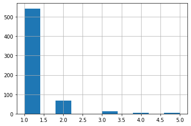
    


##### image_num: 

- range from 0 to 4, indicating the 1st to the 5th image for a patient
- nearly 84% of samples have image_num=0; less than 5% samples have image_num>=2     


```python
a = train_df['image_num'].value_counts().sort_index()

t = pd.concat([a, 100*a/train_df.shape[0]], axis=1)
t.columns = ['# samples', '% of samples']
t.index.name = 'image_num'
display(t)
del a, t
gc.collect()
```


<div>
<style scoped>
    .dataframe tbody tr th:only-of-type {
        vertical-align: middle;
    }

    .dataframe tbody tr th {
        vertical-align: top;
    }

    .dataframe thead th {
        text-align: right;
    }
</style>
<table border="1" class="dataframe">
  <thead>
    <tr style="text-align: right;">
      <th></th>
      <th># samples</th>
      <th>% of samples</th>
    </tr>
    <tr>
      <th>image_num</th>
      <th></th>
      <th></th>
    </tr>
  </thead>
  <tbody>
    <tr>
      <th>0</th>
      <td>632</td>
      <td>83.819629</td>
    </tr>
    <tr>
      <th>1</th>
      <td>89</td>
      <td>11.803714</td>
    </tr>
    <tr>
      <th>2</th>
      <td>21</td>
      <td>2.785146</td>
    </tr>
    <tr>
      <th>3</th>
      <td>8</td>
      <td>1.061008</td>
    </tr>
    <tr>
      <th>4</th>
      <td>4</td>
      <td>0.530504</td>
    </tr>
  </tbody>
</table>
</div>


    245


```python
train_df['image_num'].value_counts().plot(kind='bar')
```


    <AxesSubplot:>


    
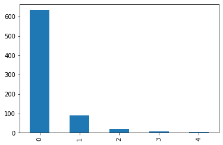
    


##### center_id:

- about 1/3 of samples from center 11


```python
#the center id

a = train_df['center_id'].value_counts().sort_index()

t = pd.concat([a, 100*a/train_df.shape[0]], axis=1)
t.columns = ['# samples', '% of samples']
t.index.name = 'center_id'
display(t)
del a, t
gc.collect()
```


<div>
<style scoped>
    .dataframe tbody tr th:only-of-type {
        vertical-align: middle;
    }

    .dataframe tbody tr th {
        vertical-align: top;
    }

    .dataframe thead th {
        text-align: right;
    }
</style>
<table border="1" class="dataframe">
  <thead>
    <tr style="text-align: right;">
      <th></th>
      <th># samples</th>
      <th>% of samples</th>
    </tr>
    <tr>
      <th>center_id</th>
      <th></th>
      <th></th>
    </tr>
  </thead>
  <tbody>
    <tr>
      <th>1</th>
      <td>54</td>
      <td>7.161804</td>
    </tr>
    <tr>
      <th>2</th>
      <td>29</td>
      <td>3.846154</td>
    </tr>
    <tr>
      <th>3</th>
      <td>49</td>
      <td>6.498674</td>
    </tr>
    <tr>
      <th>4</th>
      <td>114</td>
      <td>15.119363</td>
    </tr>
    <tr>
      <th>5</th>
      <td>38</td>
      <td>5.039788</td>
    </tr>
    <tr>
      <th>6</th>
      <td>38</td>
      <td>5.039788</td>
    </tr>
    <tr>
      <th>7</th>
      <td>99</td>
      <td>13.129973</td>
    </tr>
    <tr>
      <th>8</th>
      <td>16</td>
      <td>2.122016</td>
    </tr>
    <tr>
      <th>9</th>
      <td>16</td>
      <td>2.122016</td>
    </tr>
    <tr>
      <th>10</th>
      <td>44</td>
      <td>5.835544</td>
    </tr>
    <tr>
      <th>11</th>
      <td>257</td>
      <td>34.084881</td>
    </tr>
  </tbody>
</table>
</div>


    23


```python
p_center = pd.pivot_table(train_df, 
               index='patient_id', 
               columns='center_id', 
               values=['image_id'], 
               aggfunc={'image_id':[np.size]}
              )
p_center.columns = [f'{c}' for _, _, c in p_center.columns]
p_center.isna().sum(axis=1).nunique()
```


    1


```python
p_center.sort_values(by=['1', '2', '3', '4', '5', '6', '7', '8', '9', '10', '11'], inplace=True)

plt.figure(figsize=(12,12))

sns.heatmap(p_center, annot=False, cbar=False)
```


    <AxesSubplot:ylabel='patient_id'>


    

    


##### target varialbe: label

- label
    - 72.5% samples are `CE` category; 27.5% are `LAA`
    - 457 patients are `CE` category, accounts for 72% of all patients.   
- label v center_id
    - similar to the overall distribution, the majority are `CE` category per center_id except center_id = 3
    - there are about equal number of samples in `CE` and `LAA`  categories


```python
#label

a = train_df['label'].value_counts().sort_index()

t = pd.concat([a, 100*a/train_df.shape[0]], axis=1)
t.columns = ['# samples', '% of samples']
t.index.name = 'label'
display(t)
del a, t
gc.collect()
```


<div>
<style scoped>
    .dataframe tbody tr th:only-of-type {
        vertical-align: middle;
    }

    .dataframe tbody tr th {
        vertical-align: top;
    }

    .dataframe thead th {
        text-align: right;
    }
</style>
<table border="1" class="dataframe">
  <thead>
    <tr style="text-align: right;">
      <th></th>
      <th># samples</th>
      <th>% of samples</th>
    </tr>
    <tr>
      <th>label</th>
      <th></th>
      <th></th>
    </tr>
  </thead>
  <tbody>
    <tr>
      <th>CE</th>
      <td>547</td>
      <td>72.546419</td>
    </tr>
    <tr>
      <th>LAA</th>
      <td>207</td>
      <td>27.453581</td>
    </tr>
  </tbody>
</table>
</div>


    38


```python
train_df['label'].value_counts().plot(kind='bar', figsize=(4,4))
```


    <AxesSubplot:>


    
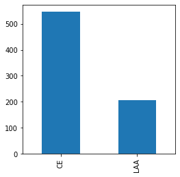
    


```python
#label

a = train_df[['patient_id', 'label']].drop_duplicates(keep='first')['label'].value_counts().sort_index()

t = pd.concat([a, 100*a/train_df['patient_id'].nunique()], axis=1)
t.columns = ['# unique patients', '% of unique patients']
t.index.name = 'label'
display(t)
del a, t
gc.collect()
```


<div>
<style scoped>
    .dataframe tbody tr th:only-of-type {
        vertical-align: middle;
    }

    .dataframe tbody tr th {
        vertical-align: top;
    }

    .dataframe thead th {
        text-align: right;
    }
</style>
<table border="1" class="dataframe">
  <thead>
    <tr style="text-align: right;">
      <th></th>
      <th># unique patients</th>
      <th>% of unique patients</th>
    </tr>
    <tr>
      <th>label</th>
      <th></th>
      <th></th>
    </tr>
  </thead>
  <tbody>
    <tr>
      <th>CE</th>
      <td>457</td>
      <td>72.310127</td>
    </tr>
    <tr>
      <th>LAA</th>
      <td>175</td>
      <td>27.689873</td>
    </tr>
  </tbody>
</table>
</div>


    23


```python
p_label = pd.pivot_table(train_df, 
               index='patient_id', 
               columns='label', 
               values=['image_id'], 
               aggfunc={'image_id':[np.size]}
              )
p_label.columns = [f'{c}' for _, _, c in p_label.columns]
# p_label.fillna(value = 0, inplace=True)
p_label['label_cnt'] =2-p_label.isna().sum(axis=1)
```


```python
p_label['label_cnt'].value_counts()
```


    1    632
    Name: label_cnt, dtype: int64


```python
p_label
```


<div>
<style scoped>
    .dataframe tbody tr th:only-of-type {
        vertical-align: middle;
    }

    .dataframe tbody tr th {
        vertical-align: top;
    }

    .dataframe thead th {
        text-align: right;
    }
</style>
<table border="1" class="dataframe">
  <thead>
    <tr style="text-align: right;">
      <th></th>
      <th>CE</th>
      <th>LAA</th>
      <th>label_cnt</th>
    </tr>
    <tr>
      <th>patient_id</th>
      <th></th>
      <th></th>
      <th></th>
    </tr>
  </thead>
  <tbody>
    <tr>
      <th>006388</th>
      <td>1.0</td>
      <td>NaN</td>
      <td>1</td>
    </tr>
    <tr>
      <th>008e5c</th>
      <td>1.0</td>
      <td>NaN</td>
      <td>1</td>
    </tr>
    <tr>
      <th>00c058</th>
      <td>NaN</td>
      <td>1.0</td>
      <td>1</td>
    </tr>
    <tr>
      <th>01adc5</th>
      <td>NaN</td>
      <td>1.0</td>
      <td>1</td>
    </tr>
    <tr>
      <th>026c97</th>
      <td>1.0</td>
      <td>NaN</td>
      <td>1</td>
    </tr>
    <tr>
      <th>...</th>
      <td>...</td>
      <td>...</td>
      <td>...</td>
    </tr>
    <tr>
      <th>fe0cca</th>
      <td>1.0</td>
      <td>NaN</td>
      <td>1</td>
    </tr>
    <tr>
      <th>fe9645</th>
      <td>1.0</td>
      <td>NaN</td>
      <td>1</td>
    </tr>
    <tr>
      <th>fe9bec</th>
      <td>NaN</td>
      <td>1.0</td>
      <td>1</td>
    </tr>
    <tr>
      <th>ff14e0</th>
      <td>1.0</td>
      <td>NaN</td>
      <td>1</td>
    </tr>
    <tr>
      <th>ffec5c</th>
      <td>NaN</td>
      <td>2.0</td>
      <td>1</td>
    </tr>
  </tbody>
</table>
<p>632 rows × 3 columns</p>
</div>


```python
p_label['total']= p_label.sum(axis=1)
```


```python
p_center = pd.pivot_table(train_df[['center_id', 'label', 'patient_id']].drop_duplicates(keep='first'), 
               index='center_id', 
               columns='label', 
               values=['patient_id'], 
               aggfunc={'patient_id':[np.size]}
              )
p_center.columns = [f'{c}' for _, _, c in p_center.columns]

```


```python
p_center.plot(kind='bar', figsize=(12, 5), 
              title='unique num of patients by target category and center')
```


    <AxesSubplot:title={'center':'unique num of patients by target category and center'}, xlabel='center_id'>


    
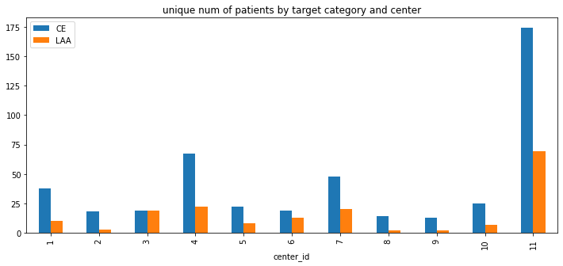
    


### Explore the images

- files sizes:

    - most files are less than 500MB; however, there are a few files more than 2GB
    - file sizes do not differ much between the 2 categories of clot `CE` and `LAA`
    - large files are mostly from center 11
    
- image info:
    - image width and height distribution
    - image ratio (height/width) distribution
    - image mode/compression/dpi
    
- images:
    - explore if images for the same patient can be vastly different
    - explore if images for different etiology of the clots look very different
        - based on images of two patients, 2 different type of clots look different


```python
%%time
#train file sizes

train_pic_folder = '/kaggle/input/mayo-clinic-strip-ai/train'
train_pics = next(os.walk(train_pic_folder))[2]
#
pic_stats = []
for pic in train_pics:
    p = Path(f'{train_pic_folder}/{pic}')
    img = Image.open(f'{train_pic_folder}/{pic}')
    pic_stats.append([pic.split('.')[0], pic, p.stat().st_size/(1024**2), img.width, img.height, img.mode, img.info['compression'], img.info['dpi'] ])
    img.close()
    del img
    gc.collect()
    
pic_stats_df = pd.DataFrame(data = pic_stats, columns = ['image_id', 'image_name', 'size', 'width', 'height', 'mode', 'compression', 'dpi'])
```

    CPU times: user 4min 8s, sys: 667 ms, total: 4min 8s
    Wall time: 4min 9s
    


```python
pic_stats_df.head(2)
```


<div>
<style scoped>
    .dataframe tbody tr th:only-of-type {
        vertical-align: middle;
    }

    .dataframe tbody tr th {
        vertical-align: top;
    }

    .dataframe thead th {
        text-align: right;
    }
</style>
<table border="1" class="dataframe">
  <thead>
    <tr style="text-align: right;">
      <th></th>
      <th>image_id</th>
      <th>image_name</th>
      <th>size</th>
      <th>width</th>
      <th>height</th>
      <th>mode</th>
      <th>compression</th>
      <th>dpi</th>
    </tr>
  </thead>
  <tbody>
    <tr>
      <th>0</th>
      <td>a4c7df_0</td>
      <td>a4c7df_0.tif</td>
      <td>428.342426</td>
      <td>30732</td>
      <td>55283</td>
      <td>RGB</td>
      <td>tiff_adobe_deflate</td>
      <td>(25.4, 25.4)</td>
    </tr>
    <tr>
      <th>1</th>
      <td>f9fc6b_0</td>
      <td>f9fc6b_0.tif</td>
      <td>284.580299</td>
      <td>38398</td>
      <td>65388</td>
      <td>RGB</td>
      <td>tiff_adobe_deflate</td>
      <td>(25.4, 25.4)</td>
    </tr>
  </tbody>
</table>
</div>


```python
pic_stats_df.sort_values(by='size', ascending=False)
```


<div>
<style scoped>
    .dataframe tbody tr th:only-of-type {
        vertical-align: middle;
    }

    .dataframe tbody tr th {
        vertical-align: top;
    }

    .dataframe thead th {
        text-align: right;
    }
</style>
<table border="1" class="dataframe">
  <thead>
    <tr style="text-align: right;">
      <th></th>
      <th>image_id</th>
      <th>image_name</th>
      <th>size</th>
      <th>width</th>
      <th>height</th>
      <th>mode</th>
      <th>compression</th>
      <th>dpi</th>
    </tr>
  </thead>
  <tbody>
    <tr>
      <th>88</th>
      <td>6fce60_0</td>
      <td>6fce60_0.tif</td>
      <td>2697.881285</td>
      <td>77765</td>
      <td>39386</td>
      <td>RGB</td>
      <td>tiff_adobe_deflate</td>
      <td>(50497.015703125, 50497.015703125)</td>
    </tr>
    <tr>
      <th>183</th>
      <td>b07b42_0</td>
      <td>b07b42_0.tif</td>
      <td>2665.971151</td>
      <td>83747</td>
      <td>47916</td>
      <td>RGB</td>
      <td>tiff_adobe_deflate</td>
      <td>(50497.015703125, 50497.015703125)</td>
    </tr>
    <tr>
      <th>173</th>
      <td>b894f4_0</td>
      <td>b894f4_0.tif</td>
      <td>2641.991510</td>
      <td>91723</td>
      <td>45045</td>
      <td>RGB</td>
      <td>tiff_adobe_deflate</td>
      <td>(50497.015703125, 50497.015703125)</td>
    </tr>
    <tr>
      <th>410</th>
      <td>f05449_0</td>
      <td>f05449_0.tif</td>
      <td>2302.191586</td>
      <td>69789</td>
      <td>33982</td>
      <td>RGB</td>
      <td>tiff_adobe_deflate</td>
      <td>(50497.015703125, 50497.015703125)</td>
    </tr>
    <tr>
      <th>332</th>
      <td>288156_0</td>
      <td>288156_0.tif</td>
      <td>2130.034624</td>
      <td>97705</td>
      <td>31890</td>
      <td>RGB</td>
      <td>tiff_adobe_deflate</td>
      <td>(50497.015703125, 50497.015703125)</td>
    </tr>
    <tr>
      <th>...</th>
      <td>...</td>
      <td>...</td>
      <td>...</td>
      <td>...</td>
      <td>...</td>
      <td>...</td>
      <td>...</td>
      <td>...</td>
    </tr>
    <tr>
      <th>76</th>
      <td>fd3079_0</td>
      <td>fd3079_0.tif</td>
      <td>11.506842</td>
      <td>17073</td>
      <td>22523</td>
      <td>RGB</td>
      <td>tiff_adobe_deflate</td>
      <td>(25.4, 25.4)</td>
    </tr>
    <tr>
      <th>381</th>
      <td>65fe16_0</td>
      <td>65fe16_0.tif</td>
      <td>11.114744</td>
      <td>14695</td>
      <td>20414</td>
      <td>RGB</td>
      <td>tiff_adobe_deflate</td>
      <td>(25.4, 25.4)</td>
    </tr>
    <tr>
      <th>522</th>
      <td>70c523_1</td>
      <td>70c523_1.tif</td>
      <td>10.166765</td>
      <td>5181</td>
      <td>20246</td>
      <td>RGB</td>
      <td>tiff_adobe_deflate</td>
      <td>(25.4, 25.4)</td>
    </tr>
    <tr>
      <th>224</th>
      <td>c31442_0</td>
      <td>c31442_0.tif</td>
      <td>9.499516</td>
      <td>11212</td>
      <td>31634</td>
      <td>RGB</td>
      <td>tiff_adobe_deflate</td>
      <td>(25.4, 25.4)</td>
    </tr>
    <tr>
      <th>151</th>
      <td>4ded24_0</td>
      <td>4ded24_0.tif</td>
      <td>7.027174</td>
      <td>7220</td>
      <td>32815</td>
      <td>RGB</td>
      <td>tiff_adobe_deflate</td>
      <td>(25.4, 25.4)</td>
    </tr>
  </tbody>
</table>
<p>754 rows × 8 columns</p>
</div>


```python
pic_stats_df['size'].plot(kind='hist', bins=50, figsize = (8, 5),
                          title='distribution of images by file size (MB)')

```


    <AxesSubplot:title={'center':'distribution of images by file size (MB)'}, ylabel='Frequency'>


    
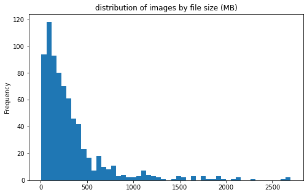
    


```python
pic_stats_df.shape, train_df.shape
```


    ((754, 8), (754, 5))


```python
train_df = train_df.merge(pic_stats_df, on='image_id', how='left')
train_df.shape
```


    (754, 12)


```python
train_df.head(2)
```


<div>
<style scoped>
    .dataframe tbody tr th:only-of-type {
        vertical-align: middle;
    }

    .dataframe tbody tr th {
        vertical-align: top;
    }

    .dataframe thead th {
        text-align: right;
    }
</style>
<table border="1" class="dataframe">
  <thead>
    <tr style="text-align: right;">
      <th></th>
      <th>image_id</th>
      <th>center_id</th>
      <th>patient_id</th>
      <th>image_num</th>
      <th>label</th>
      <th>image_name</th>
      <th>size</th>
      <th>width</th>
      <th>height</th>
      <th>mode</th>
      <th>compression</th>
      <th>dpi</th>
    </tr>
  </thead>
  <tbody>
    <tr>
      <th>0</th>
      <td>006388_0</td>
      <td>11</td>
      <td>006388</td>
      <td>0</td>
      <td>CE</td>
      <td>006388_0.tif</td>
      <td>1252.114786</td>
      <td>34007</td>
      <td>60797</td>
      <td>RGB</td>
      <td>tiff_adobe_deflate</td>
      <td>(25.4, 25.4)</td>
    </tr>
    <tr>
      <th>1</th>
      <td>008e5c_0</td>
      <td>11</td>
      <td>008e5c</td>
      <td>0</td>
      <td>CE</td>
      <td>008e5c_0.tif</td>
      <td>104.495459</td>
      <td>5946</td>
      <td>29694</td>
      <td>RGB</td>
      <td>tiff_adobe_deflate</td>
      <td>(25.4, 25.4)</td>
    </tr>
  </tbody>
</table>
</div>


```python
train_df[['label', 'size']].groupby('label').plot(kind='hist', bins=50, figsize = (8, 5),
                          title='distribution of images by file size (MB)')

```


    label
    CE     AxesSubplot(0.125,0.125;0.775x0.755)
    LAA    AxesSubplot(0.125,0.125;0.775x0.755)
    dtype: object


    

    


    
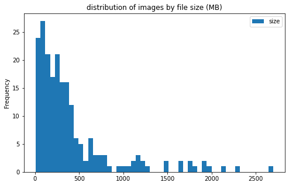
    


```python
train_df['center_id'] = train_df['center_id'].astype('category')
train_df[['center_id', 'size']].groupby('center_id').plot(kind='hist', bins=50, figsize = (8, 5),
                          title='distribution of images by file size (MB)')


```


    center_id
    1     AxesSubplot(0.125,0.125;0.775x0.755)
    2     AxesSubplot(0.125,0.125;0.775x0.755)
    3     AxesSubplot(0.125,0.125;0.775x0.755)
    4     AxesSubplot(0.125,0.125;0.775x0.755)
    5     AxesSubplot(0.125,0.125;0.775x0.755)
    6     AxesSubplot(0.125,0.125;0.775x0.755)
    7     AxesSubplot(0.125,0.125;0.775x0.755)
    8     AxesSubplot(0.125,0.125;0.775x0.755)
    9     AxesSubplot(0.125,0.125;0.775x0.755)
    10    AxesSubplot(0.125,0.125;0.775x0.755)
    11    AxesSubplot(0.125,0.125;0.775x0.755)
    dtype: object


    
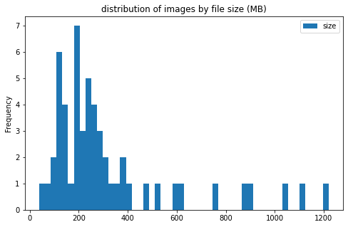
    


    
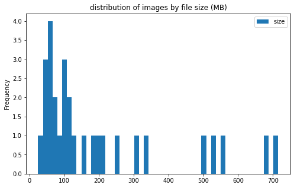
    


    
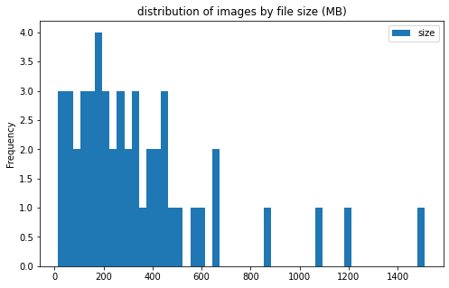
    


    
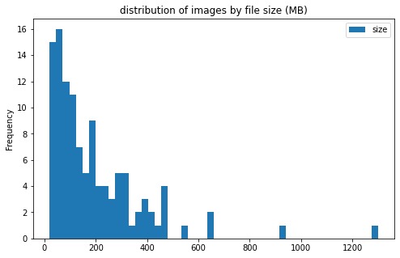
    


    

    


    
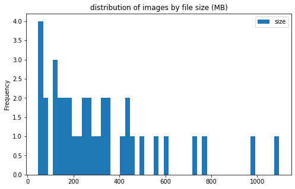
    


    
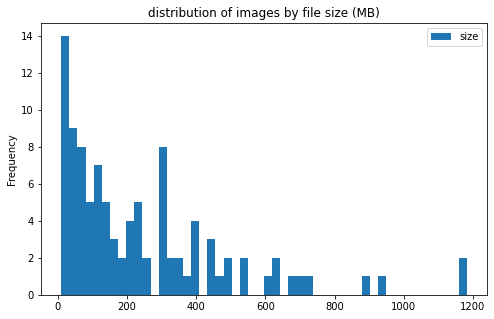
    


    
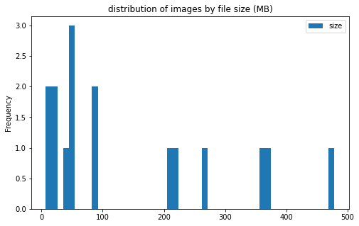
    


    
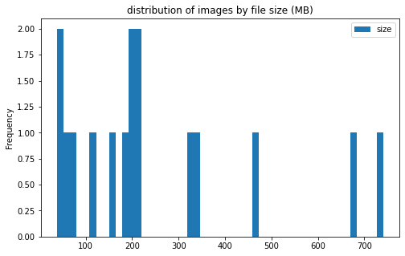
    


    
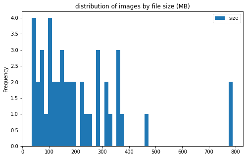
    


    
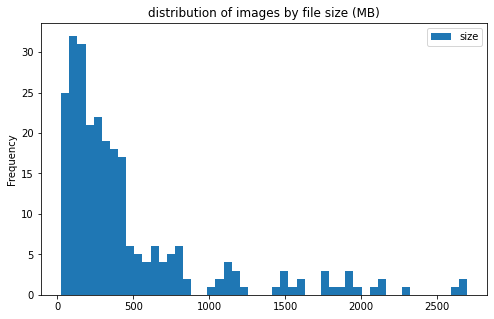
    


#### image info

- some images are extremely large (in width and height)
- all images are in `RGB` mode and in `tiff_adobe_deflate` format
- only 2 Dots per inches (dpi): (25.4, 25.4)  and (50497.015703125, 50497.015703125) 


```python
train_df['ratio'] = train_df['height']/train_df['width']
```


```python
train_df[['height', 'width', 'ratio']].describe()
```


<div>
<style scoped>
    .dataframe tbody tr th:only-of-type {
        vertical-align: middle;
    }

    .dataframe tbody tr th {
        vertical-align: top;
    }

    .dataframe thead th {
        text-align: right;
    }
</style>
<table border="1" class="dataframe">
  <thead>
    <tr style="text-align: right;">
      <th></th>
      <th>height</th>
      <th>width</th>
      <th>ratio</th>
    </tr>
  </thead>
  <tbody>
    <tr>
      <th>count</th>
      <td>754.000000</td>
      <td>754.000000</td>
      <td>754.000000</td>
    </tr>
    <tr>
      <th>mean</th>
      <td>37622.196286</td>
      <td>22988.594164</td>
      <td>2.037926</td>
    </tr>
    <tr>
      <th>std</th>
      <td>18058.750676</td>
      <td>15653.642619</td>
      <td>1.137743</td>
    </tr>
    <tr>
      <th>min</th>
      <td>4470.000000</td>
      <td>4417.000000</td>
      <td>0.134461</td>
    </tr>
    <tr>
      <th>25%</th>
      <td>25402.500000</td>
      <td>13215.250000</td>
      <td>1.259669</td>
    </tr>
    <tr>
      <th>50%</th>
      <td>34981.500000</td>
      <td>18700.000000</td>
      <td>1.924946</td>
    </tr>
    <tr>
      <th>75%</th>
      <td>48919.750000</td>
      <td>26376.750000</td>
      <td>2.612830</td>
    </tr>
    <tr>
      <th>max</th>
      <td>118076.000000</td>
      <td>99699.000000</td>
      <td>8.336422</td>
    </tr>
  </tbody>
</table>
</div>


```python
for c in ['height', 'width', 'ratio']:
    train_df[[c]].plot(kind='hist', bins=50)
```


    
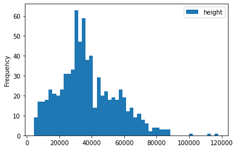
    


    
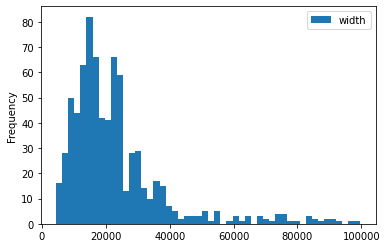
    


    

    


```python
train_df['mode'].value_counts()
```


    RGB    754
    Name: mode, dtype: int64


```python
train_df['compression'].value_counts()
```


    tiff_adobe_deflate    754
    Name: compression, dtype: int64


```python
train_df['dpi'].value_counts()
```


    (25.4, 25.4)                          688
    (50497.015703125, 50497.015703125)     66
    Name: dpi, dtype: int64


#### images

- explore if images for the same patient can be vastly different
- explore if images for different etiology of the clots look very different
    - based on images of two patients, 2 different type of clots look different


```python
#find a patient with at 5 small images
train_df[(train_df['size']<500) & (train_df['image_num']==4)]
```


<div>
<style scoped>
    .dataframe tbody tr th:only-of-type {
        vertical-align: middle;
    }

    .dataframe tbody tr th {
        vertical-align: top;
    }

    .dataframe thead th {
        text-align: right;
    }
</style>
<table border="1" class="dataframe">
  <thead>
    <tr style="text-align: right;">
      <th></th>
      <th>image_id</th>
      <th>center_id</th>
      <th>patient_id</th>
      <th>image_num</th>
      <th>label</th>
      <th>image_name</th>
      <th>size</th>
      <th>width</th>
      <th>height</th>
      <th>mode</th>
      <th>compression</th>
      <th>dpi</th>
      <th>ratio</th>
    </tr>
  </thead>
  <tbody>
    <tr>
      <th>29</th>
      <td>09644e_4</td>
      <td>10</td>
      <td>09644e</td>
      <td>4</td>
      <td>CE</td>
      <td>09644e_4.tif</td>
      <td>104.865501</td>
      <td>9913</td>
      <td>27715</td>
      <td>RGB</td>
      <td>tiff_adobe_deflate</td>
      <td>(25.4, 25.4)</td>
      <td>2.795824</td>
    </tr>
    <tr>
      <th>188</th>
      <td>3d10be_4</td>
      <td>4</td>
      <td>3d10be</td>
      <td>4</td>
      <td>CE</td>
      <td>3d10be_4.tif</td>
      <td>33.698559</td>
      <td>7645</td>
      <td>9954</td>
      <td>RGB</td>
      <td>tiff_adobe_deflate</td>
      <td>(25.4, 25.4)</td>
      <td>1.302027</td>
    </tr>
    <tr>
      <th>272</th>
      <td>56d177_4</td>
      <td>7</td>
      <td>56d177</td>
      <td>4</td>
      <td>CE</td>
      <td>56d177_4.tif</td>
      <td>31.267582</td>
      <td>15375</td>
      <td>28006</td>
      <td>RGB</td>
      <td>tiff_adobe_deflate</td>
      <td>(25.4, 25.4)</td>
      <td>1.821528</td>
    </tr>
    <tr>
      <th>437</th>
      <td>91b9d3_4</td>
      <td>3</td>
      <td>91b9d3</td>
      <td>4</td>
      <td>LAA</td>
      <td>91b9d3_4.tif</td>
      <td>281.747829</td>
      <td>27573</td>
      <td>23032</td>
      <td>RGB</td>
      <td>tiff_adobe_deflate</td>
      <td>(25.4, 25.4)</td>
      <td>0.835310</td>
    </tr>
  </tbody>
</table>
</div>


```python
patient_id='3d10be'
label = 'CE'
train_df[train_df['patient_id']==patient_id]
```


<div>
<style scoped>
    .dataframe tbody tr th:only-of-type {
        vertical-align: middle;
    }

    .dataframe tbody tr th {
        vertical-align: top;
    }

    .dataframe thead th {
        text-align: right;
    }
</style>
<table border="1" class="dataframe">
  <thead>
    <tr style="text-align: right;">
      <th></th>
      <th>image_id</th>
      <th>center_id</th>
      <th>patient_id</th>
      <th>image_num</th>
      <th>label</th>
      <th>image_name</th>
      <th>size</th>
      <th>width</th>
      <th>height</th>
      <th>mode</th>
      <th>compression</th>
      <th>dpi</th>
      <th>ratio</th>
    </tr>
  </thead>
  <tbody>
    <tr>
      <th>184</th>
      <td>3d10be_0</td>
      <td>4</td>
      <td>3d10be</td>
      <td>0</td>
      <td>CE</td>
      <td>3d10be_0.tif</td>
      <td>63.952255</td>
      <td>11088</td>
      <td>12038</td>
      <td>RGB</td>
      <td>tiff_adobe_deflate</td>
      <td>(25.4, 25.4)</td>
      <td>1.085678</td>
    </tr>
    <tr>
      <th>185</th>
      <td>3d10be_1</td>
      <td>4</td>
      <td>3d10be</td>
      <td>1</td>
      <td>CE</td>
      <td>3d10be_1.tif</td>
      <td>49.803545</td>
      <td>9961</td>
      <td>16650</td>
      <td>RGB</td>
      <td>tiff_adobe_deflate</td>
      <td>(25.4, 25.4)</td>
      <td>1.671519</td>
    </tr>
    <tr>
      <th>186</th>
      <td>3d10be_2</td>
      <td>4</td>
      <td>3d10be</td>
      <td>2</td>
      <td>CE</td>
      <td>3d10be_2.tif</td>
      <td>49.052773</td>
      <td>17696</td>
      <td>13857</td>
      <td>RGB</td>
      <td>tiff_adobe_deflate</td>
      <td>(25.4, 25.4)</td>
      <td>0.783058</td>
    </tr>
    <tr>
      <th>187</th>
      <td>3d10be_3</td>
      <td>4</td>
      <td>3d10be</td>
      <td>3</td>
      <td>CE</td>
      <td>3d10be_3.tif</td>
      <td>84.386835</td>
      <td>10533</td>
      <td>16787</td>
      <td>RGB</td>
      <td>tiff_adobe_deflate</td>
      <td>(25.4, 25.4)</td>
      <td>1.593753</td>
    </tr>
    <tr>
      <th>188</th>
      <td>3d10be_4</td>
      <td>4</td>
      <td>3d10be</td>
      <td>4</td>
      <td>CE</td>
      <td>3d10be_4.tif</td>
      <td>33.698559</td>
      <td>7645</td>
      <td>9954</td>
      <td>RGB</td>
      <td>tiff_adobe_deflate</td>
      <td>(25.4, 25.4)</td>
      <td>1.302027</td>
    </tr>
  </tbody>
</table>
</div>


```python

fig, axes = plt.subplots(nrows=1, ncols=5, figsize=(20, 6))

print(f'patient_id = {patient_id}, label={label}')
for i in range(5):
    img_path = f'/kaggle/input/mayo-clinic-strip-ai/train/{patient_id}_{i}.tif'
    img = Image.open(img_path)
    fac = int(max(img.size)/224)
    h, w = img.size
    
    axes[i].imshow(img.resize((int(h/fac), int(w/fac))))
    axes[i].set_title(f'{patient_id}_{i}')
    
    img.close()
    del img, fac
    gc.collect()

```

    patient_id = 3d10be, label=CE
    


    

    


```python
patient_id='91b9d3'
label = 'LAA'
train_df[train_df['patient_id']==patient_id]
```


<div>
<style scoped>
    .dataframe tbody tr th:only-of-type {
        vertical-align: middle;
    }

    .dataframe tbody tr th {
        vertical-align: top;
    }

    .dataframe thead th {
        text-align: right;
    }
</style>
<table border="1" class="dataframe">
  <thead>
    <tr style="text-align: right;">
      <th></th>
      <th>image_id</th>
      <th>center_id</th>
      <th>patient_id</th>
      <th>image_num</th>
      <th>label</th>
      <th>image_name</th>
      <th>size</th>
      <th>width</th>
      <th>height</th>
      <th>mode</th>
      <th>compression</th>
      <th>dpi</th>
      <th>ratio</th>
    </tr>
  </thead>
  <tbody>
    <tr>
      <th>433</th>
      <td>91b9d3_0</td>
      <td>3</td>
      <td>91b9d3</td>
      <td>0</td>
      <td>LAA</td>
      <td>91b9d3_0.tif</td>
      <td>20.182018</td>
      <td>20047</td>
      <td>7254</td>
      <td>RGB</td>
      <td>tiff_adobe_deflate</td>
      <td>(25.4, 25.4)</td>
      <td>0.361850</td>
    </tr>
    <tr>
      <th>434</th>
      <td>91b9d3_1</td>
      <td>3</td>
      <td>91b9d3</td>
      <td>1</td>
      <td>LAA</td>
      <td>91b9d3_1.tif</td>
      <td>87.481073</td>
      <td>13081</td>
      <td>46312</td>
      <td>RGB</td>
      <td>tiff_adobe_deflate</td>
      <td>(25.4, 25.4)</td>
      <td>3.540402</td>
    </tr>
    <tr>
      <th>435</th>
      <td>91b9d3_2</td>
      <td>3</td>
      <td>91b9d3</td>
      <td>2</td>
      <td>LAA</td>
      <td>91b9d3_2.tif</td>
      <td>65.516409</td>
      <td>28704</td>
      <td>14715</td>
      <td>RGB</td>
      <td>tiff_adobe_deflate</td>
      <td>(25.4, 25.4)</td>
      <td>0.512646</td>
    </tr>
    <tr>
      <th>436</th>
      <td>91b9d3_3</td>
      <td>3</td>
      <td>91b9d3</td>
      <td>3</td>
      <td>LAA</td>
      <td>91b9d3_3.tif</td>
      <td>411.783207</td>
      <td>27426</td>
      <td>50676</td>
      <td>RGB</td>
      <td>tiff_adobe_deflate</td>
      <td>(25.4, 25.4)</td>
      <td>1.847736</td>
    </tr>
    <tr>
      <th>437</th>
      <td>91b9d3_4</td>
      <td>3</td>
      <td>91b9d3</td>
      <td>4</td>
      <td>LAA</td>
      <td>91b9d3_4.tif</td>
      <td>281.747829</td>
      <td>27573</td>
      <td>23032</td>
      <td>RGB</td>
      <td>tiff_adobe_deflate</td>
      <td>(25.4, 25.4)</td>
      <td>0.835310</td>
    </tr>
  </tbody>
</table>
</div>


```python

fig, axes = plt.subplots(nrows=1, ncols=5, figsize=(20, 6))

print(f'patient_id = {patient_id}, label={label}')
for i in range(5):
    img_path = f'/kaggle/input/mayo-clinic-strip-ai/train/{patient_id}_{i}.tif'
    img = Image.open(img_path)
    fac = int(max(img.size)/224)
    h, w = img.size
    
    axes[i].imshow(img.resize((int(h/fac), int(w/fac))))
    axes[i].set_title(f'{patient_id}_{i}')
    img.close()
    del img, fac
    gc.collect()

```

    patient_id = 91b9d3, label=LAA
    


    

    


```python
%%time
fig, axes = plt.subplots(nrows=1, ncols=2, figsize=(20, 10))
pic_id = '037300_0.tif'
img = Image.open(f"/kaggle/input/mayo-clinic-strip-ai/train/{pic_id}")
print(img.height, img.width)
img.thumbnail((500, 500), resample=Image.Resampling.LANCZOS, reducing_gap=10)
img2 = img.transpose(PIL.Image.Transpose.ROTATE_90)
axes[0].imshow(img)
axes[0].set_title(f'{pic_id} - thumbnail (500, 500)')
axes[1].imshow(img2)
axes[1].set_title(f'{pic_id} - thumbnail (500, 500) rotate 90 degrees')

img.close()
img2.close()

del img, img2
gc.collect()
```

    70968 27346
    CPU times: user 12.6 s, sys: 7.24 s, total: 19.8 s
    Wall time: 25.3 s
    


    14548


    

    


### Others


```python
other_df = pd.read_csv('/kaggle/input/mayo-clinic-strip-ai/other.csv')

print(other_df.shape)
other_df.head(2)
```

    (396, 5)
    


<div>
<style scoped>
    .dataframe tbody tr th:only-of-type {
        vertical-align: middle;
    }

    .dataframe tbody tr th {
        vertical-align: top;
    }

    .dataframe thead th {
        text-align: right;
    }
</style>
<table border="1" class="dataframe">
  <thead>
    <tr style="text-align: right;">
      <th></th>
      <th>image_id</th>
      <th>patient_id</th>
      <th>image_num</th>
      <th>other_specified</th>
      <th>label</th>
    </tr>
  </thead>
  <tbody>
    <tr>
      <th>0</th>
      <td>01f2b3_0</td>
      <td>01f2b3</td>
      <td>0</td>
      <td>NaN</td>
      <td>Unknown</td>
    </tr>
    <tr>
      <th>1</th>
      <td>01f2b3_1</td>
      <td>01f2b3</td>
      <td>1</td>
      <td>NaN</td>
      <td>Unknown</td>
    </tr>
  </tbody>
</table>
</div>


```python
other_df['label'].value_counts()
```


    Unknown    331
    Other       65
    Name: label, dtype: int64


```python
#train file sizes

other_pic_folder = '/kaggle/input/mayo-clinic-strip-ai/other'
other_pics = next(os.walk(other_pic_folder))[2]
#
pic_stats = []
for pic in other_pics:
    p = Path(f'{other_pic_folder}/{pic}')
    img = Image.open(f'{other_pic_folder}/{pic}')
    pic_stats.append([pic.split('.')[0], pic, p.stat().st_size/(1024**2), img.width, img.height, img.mode, img.info['compression'], img.info['dpi'] ])
    
    img.close()
    del img
    gc.collect()
    
other_pic_stats_df = pd.DataFrame(data = pic_stats, columns = ['image_id', 'image_name', 'size', 'width', 'height', 'mode', 'compression', 'dpi'])
```


```python
print(other_df.shape, other_pic_stats_df.shape)
other_df = other_df.merge(other_pic_stats_df, on='image_id', how='left')
print(other_df.shape, other_pic_stats_df.shape)
del other_pic_stats_df
gc.collect()
```

    (396, 5) (396, 8)
    (396, 12) (396, 8)
    


    23


```python
other_df['other_specified'].value_counts()
```


    Dissection             27
    Hypercoagulable        14
    PFO                    10
    Stent thrombosis        3
    Catheter                2
    Trauma                  2
    Takayasu vasculitis     2
    tumor embolization      1
    Endocarditis            1
    Name: other_specified, dtype: int64


```python
other_df[other_df['other_specified']=='Hypercoagulable']
```


<div>
<style scoped>
    .dataframe tbody tr th:only-of-type {
        vertical-align: middle;
    }

    .dataframe tbody tr th {
        vertical-align: top;
    }

    .dataframe thead th {
        text-align: right;
    }
</style>
<table border="1" class="dataframe">
  <thead>
    <tr style="text-align: right;">
      <th></th>
      <th>image_id</th>
      <th>patient_id</th>
      <th>image_num</th>
      <th>other_specified</th>
      <th>label</th>
      <th>image_name</th>
      <th>size</th>
      <th>width</th>
      <th>height</th>
      <th>mode</th>
      <th>compression</th>
      <th>dpi</th>
    </tr>
  </thead>
  <tbody>
    <tr>
      <th>4</th>
      <td>04414e_0</td>
      <td>04414e</td>
      <td>0</td>
      <td>Hypercoagulable</td>
      <td>Other</td>
      <td>04414e_0.tif</td>
      <td>19.079559</td>
      <td>12656</td>
      <td>29356</td>
      <td>RGB</td>
      <td>tiff_adobe_deflate</td>
      <td>(25.4, 25.4)</td>
    </tr>
    <tr>
      <th>18</th>
      <td>0b5827_0</td>
      <td>0b5827</td>
      <td>0</td>
      <td>Hypercoagulable</td>
      <td>Other</td>
      <td>0b5827_0.tif</td>
      <td>329.594318</td>
      <td>30721</td>
      <td>57126</td>
      <td>RGB</td>
      <td>tiff_adobe_deflate</td>
      <td>(25.4, 25.4)</td>
    </tr>
    <tr>
      <th>19</th>
      <td>0b5827_1</td>
      <td>0b5827</td>
      <td>1</td>
      <td>Hypercoagulable</td>
      <td>Other</td>
      <td>0b5827_1.tif</td>
      <td>132.289120</td>
      <td>11005</td>
      <td>31401</td>
      <td>RGB</td>
      <td>tiff_adobe_deflate</td>
      <td>(25.4, 25.4)</td>
    </tr>
    <tr>
      <th>20</th>
      <td>0b5827_2</td>
      <td>0b5827</td>
      <td>2</td>
      <td>Hypercoagulable</td>
      <td>Other</td>
      <td>0b5827_2.tif</td>
      <td>436.645355</td>
      <td>20804</td>
      <td>56247</td>
      <td>RGB</td>
      <td>tiff_adobe_deflate</td>
      <td>(25.4, 25.4)</td>
    </tr>
    <tr>
      <th>21</th>
      <td>0b5827_3</td>
      <td>0b5827</td>
      <td>3</td>
      <td>Hypercoagulable</td>
      <td>Other</td>
      <td>0b5827_3.tif</td>
      <td>19.248291</td>
      <td>4841</td>
      <td>22945</td>
      <td>RGB</td>
      <td>tiff_adobe_deflate</td>
      <td>(25.4, 25.4)</td>
    </tr>
    <tr>
      <th>22</th>
      <td>0b5827_4</td>
      <td>0b5827</td>
      <td>4</td>
      <td>Hypercoagulable</td>
      <td>Other</td>
      <td>0b5827_4.tif</td>
      <td>186.556791</td>
      <td>14304</td>
      <td>30459</td>
      <td>RGB</td>
      <td>tiff_adobe_deflate</td>
      <td>(25.4, 25.4)</td>
    </tr>
    <tr>
      <th>49</th>
      <td>222acf_0</td>
      <td>222acf</td>
      <td>0</td>
      <td>Hypercoagulable</td>
      <td>Other</td>
      <td>222acf_0.tif</td>
      <td>203.122671</td>
      <td>15420</td>
      <td>27688</td>
      <td>RGB</td>
      <td>tiff_adobe_deflate</td>
      <td>(25.4, 25.4)</td>
    </tr>
    <tr>
      <th>68</th>
      <td>2e3078_0</td>
      <td>2e3078</td>
      <td>0</td>
      <td>Hypercoagulable</td>
      <td>Other</td>
      <td>2e3078_0.tif</td>
      <td>154.715866</td>
      <td>18672</td>
      <td>36887</td>
      <td>RGB</td>
      <td>tiff_adobe_deflate</td>
      <td>(25.4, 25.4)</td>
    </tr>
    <tr>
      <th>84</th>
      <td>3aa5ad_0</td>
      <td>3aa5ad</td>
      <td>0</td>
      <td>Hypercoagulable</td>
      <td>Other</td>
      <td>3aa5ad_0.tif</td>
      <td>179.102180</td>
      <td>19282</td>
      <td>65462</td>
      <td>RGB</td>
      <td>tiff_adobe_deflate</td>
      <td>(25.4, 25.4)</td>
    </tr>
    <tr>
      <th>96</th>
      <td>419f30_0</td>
      <td>419f30</td>
      <td>0</td>
      <td>Hypercoagulable</td>
      <td>Other</td>
      <td>419f30_0.tif</td>
      <td>175.525644</td>
      <td>15408</td>
      <td>33227</td>
      <td>RGB</td>
      <td>tiff_adobe_deflate</td>
      <td>(25.4, 25.4)</td>
    </tr>
    <tr>
      <th>123</th>
      <td>54334d_0</td>
      <td>54334d</td>
      <td>0</td>
      <td>Hypercoagulable</td>
      <td>Other</td>
      <td>54334d_0.tif</td>
      <td>132.995121</td>
      <td>19792</td>
      <td>76006</td>
      <td>RGB</td>
      <td>tiff_adobe_deflate</td>
      <td>(25.4, 25.4)</td>
    </tr>
    <tr>
      <th>197</th>
      <td>8ed18f_0</td>
      <td>8ed18f</td>
      <td>0</td>
      <td>Hypercoagulable</td>
      <td>Other</td>
      <td>8ed18f_0.tif</td>
      <td>59.638159</td>
      <td>10533</td>
      <td>49771</td>
      <td>RGB</td>
      <td>tiff_adobe_deflate</td>
      <td>(25.4, 25.4)</td>
    </tr>
    <tr>
      <th>296</th>
      <td>bde458_0</td>
      <td>bde458</td>
      <td>0</td>
      <td>Hypercoagulable</td>
      <td>Other</td>
      <td>bde458_0.tif</td>
      <td>60.039425</td>
      <td>10193</td>
      <td>31296</td>
      <td>RGB</td>
      <td>tiff_adobe_deflate</td>
      <td>(25.4, 25.4)</td>
    </tr>
    <tr>
      <th>373</th>
      <td>efead4_0</td>
      <td>efead4</td>
      <td>0</td>
      <td>Hypercoagulable</td>
      <td>Other</td>
      <td>efead4_0.tif</td>
      <td>53.005348</td>
      <td>15969</td>
      <td>29272</td>
      <td>RGB</td>
      <td>tiff_adobe_deflate</td>
      <td>(25.4, 25.4)</td>
    </tr>
  </tbody>
</table>
</div>


```python
%%time
fig, axes = plt.subplots(nrows=1, ncols=2, figsize=(20, 10))
pic_id = '54334d_0.tif'
img = Image.open(f"/kaggle/input/mayo-clinic-strip-ai/other/{pic_id}")
print(img.height, img.width)
img.thumbnail((500, 500), resample=Image.Resampling.LANCZOS, reducing_gap=10)
img2 = img.transpose(PIL.Image.Transpose.ROTATE_90)
axes[0].imshow(img)
axes[0].set_title(f'{pic_id} - thumbnail (500, 500)')
axes[1].imshow(img2)
axes[1].set_title(f'{pic_id} - thumbnail (500, 500) rotate 90 degrees')

img.close()
img2.close()

del img, img2
gc.collect()
```

    76006 19792
    CPU times: user 7.69 s, sys: 5.1 s, total: 12.8 s
    Wall time: 14 s
    


    5899


    
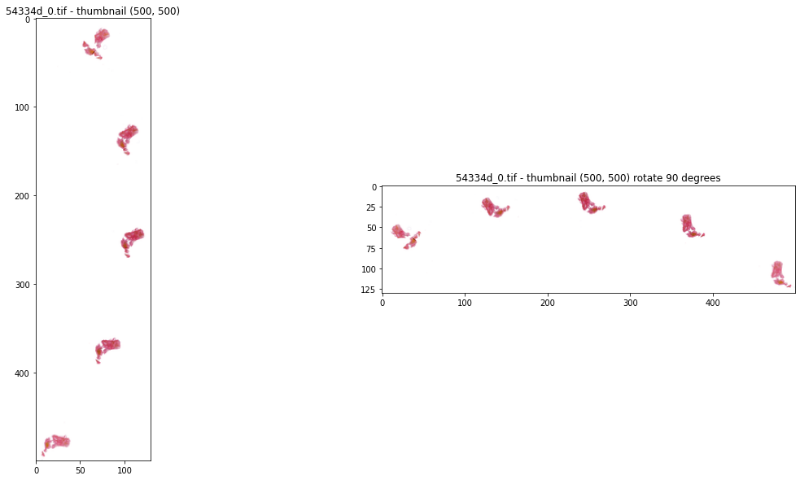
    


```python

```
