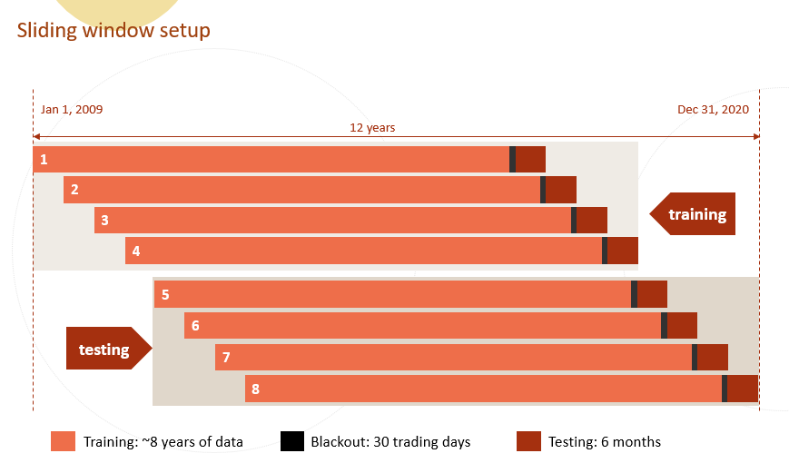
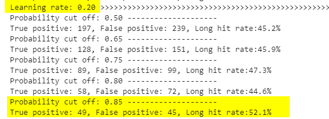

## Simple LightGBM model with tsfresh features

*Jan 9, 2021*

This notebook continues with the `tsfresh` [feature engineering notebooks](https://xxxxyyyy80008.github.io/python_notes/tsfresh/) and starts a simple LightGBM modeling to demostrate model training process with `tsfresh` features.

### Outline of this notebook

1. read data from the csv file that is generated [here](https://xxxxyyyy80008.github.io/python_notes/tsfresh/2020-12-31-tsfresh3.html)
1. select a few features
1. create a sliding window list
1. setup simple light gbm model training

### load data

In the **tsfresh package introduction** notebooks, I created a few hundred features as well as a target variable and saved the data into a compressed csv file.

In this notebook, I am using the file created there and set the `Date` feature as index. Since `id` is a categorical (two values, i.e. PFE and GSK), I am creating a new feature called `ticker`. The `ticker` feature is numerical.

The purpose of this notebook is to demostrate how I can use `tsfresh` features in my model training process, so I randomly select a few features from the several hundred candiate features to simply the process. 


```python
import pandas as pd
import numpy as np
```


```python
df = pd.read_csv('data/PFE_GSK_final.csv', sep='|', compression='gzip', index_col=1)
```


```python
print(df.shape)
df.head()
```

    (5937, 291)
    


<div>
<style scoped>
    .dataframe tbody tr th:only-of-type {
        vertical-align: middle;
    }

    .dataframe tbody tr th {
        vertical-align: top;
    }

    .dataframe thead th {
        text-align: right;
    }
</style>
<table border="1" class="dataframe">
  <thead>
    <tr style="text-align: right;">
      <th></th>
      <th>id</th>
      <th>target</th>
      <th>delta_pct</th>
      <th>Volume__cwt_coefficients__coeff_11__w_20__widths_(2, 5, 10, 20)</th>
      <th>Volume__change_quantiles__f_agg_"mean"__isabs_True__qh_1.0__ql_0.8</th>
      <th>Adj Close__change_quantiles__f_agg_"mean"__isabs_False__qh_0.6__ql_0.2</th>
      <th>Volume__cwt_coefficients__coeff_0__w_10__widths_(2, 5, 10, 20)</th>
      <th>Adj Close__sum_values</th>
      <th>Adj Close__cwt_coefficients__coeff_13__w_20__widths_(2, 5, 10, 20)</th>
      <th>Adj Close__cwt_coefficients__coeff_5__w_10__widths_(2, 5, 10, 20)</th>
      <th>...</th>
      <th>Adj Close__cwt_coefficients__coeff_1__w_20__widths_(2, 5, 10, 20)</th>
      <th>Adj Close__cwt_coefficients__coeff_2__w_10__widths_(2, 5, 10, 20)</th>
      <th>Adj Close__minimum</th>
      <th>Adj Close__cwt_coefficients__coeff_0__w_10__widths_(2, 5, 10, 20)</th>
      <th>Volume__fft_coefficient__attr_"abs"__coeff_0</th>
      <th>Volume__cwt_coefficients__coeff_1__w_20__widths_(2, 5, 10, 20)</th>
      <th>Adj Close__cwt_coefficients__coeff_1__w_10__widths_(2, 5, 10, 20)</th>
      <th>Volume__cwt_coefficients__coeff_5__w_5__widths_(2, 5, 10, 20)</th>
      <th>Volume__mean</th>
      <th>Adj Close__linear_trend__attr_"slope"</th>
    </tr>
    <tr>
      <th>Date</th>
      <th></th>
      <th></th>
      <th></th>
      <th></th>
      <th></th>
      <th></th>
      <th></th>
      <th></th>
      <th></th>
      <th></th>
      <th></th>
      <th></th>
      <th></th>
      <th></th>
      <th></th>
      <th></th>
      <th></th>
      <th></th>
      <th></th>
      <th></th>
      <th></th>
    </tr>
  </thead>
  <tbody>
    <tr>
      <th>2009-02-03</th>
      <td>GSK</td>
      <td>0</td>
      <td>2.778513</td>
      <td>6.827091e+06</td>
      <td>320000.0</td>
      <td>-0.007189</td>
      <td>3.020586e+06</td>
      <td>431.952223</td>
      <td>66.731853</td>
      <td>57.753059</td>
      <td>...</td>
      <td>41.004967</td>
      <td>44.522909</td>
      <td>18.374868</td>
      <td>33.597595</td>
      <td>40175100.0</td>
      <td>3.762778e+06</td>
      <td>39.161548</td>
      <td>3.142434e+06</td>
      <td>1.826141e+06</td>
      <td>-0.084799</td>
    </tr>
    <tr>
      <th>2009-02-04</th>
      <td>GSK</td>
      <td>0</td>
      <td>2.020719</td>
      <td>6.985642e+06</td>
      <td>320000.0</td>
      <td>-0.007189</td>
      <td>3.318212e+06</td>
      <td>431.763572</td>
      <td>66.577759</td>
      <td>57.531978</td>
      <td>...</td>
      <td>40.883390</td>
      <td>44.542326</td>
      <td>18.374868</td>
      <td>33.716539</td>
      <td>41702400.0</td>
      <td>4.073276e+06</td>
      <td>39.240166</td>
      <td>3.307973e+06</td>
      <td>1.895564e+06</td>
      <td>-0.079756</td>
    </tr>
    <tr>
      <th>2009-02-05</th>
      <td>GSK</td>
      <td>0</td>
      <td>-0.642376</td>
      <td>7.174840e+06</td>
      <td>320000.0</td>
      <td>-0.007189</td>
      <td>3.409041e+06</td>
      <td>432.291793</td>
      <td>66.449007</td>
      <td>57.307191</td>
      <td>...</td>
      <td>40.775041</td>
      <td>44.568357</td>
      <td>18.374868</td>
      <td>33.882053</td>
      <td>43462500.0</td>
      <td>4.166172e+06</td>
      <td>39.343889</td>
      <td>3.367270e+06</td>
      <td>1.975568e+06</td>
      <td>-0.073900</td>
    </tr>
    <tr>
      <th>2009-02-06</th>
      <td>GSK</td>
      <td>0</td>
      <td>-0.350249</td>
      <td>7.169289e+06</td>
      <td>320000.0</td>
      <td>-0.007189</td>
      <td>3.342175e+06</td>
      <td>431.946830</td>
      <td>66.285479</td>
      <td>56.923968</td>
      <td>...</td>
      <td>40.472563</td>
      <td>44.302650</td>
      <td>18.374868</td>
      <td>33.782529</td>
      <td>43458600.0</td>
      <td>4.187145e+06</td>
      <td>39.172730</td>
      <td>3.347535e+06</td>
      <td>1.975391e+06</td>
      <td>-0.060515</td>
    </tr>
    <tr>
      <th>2009-02-09</th>
      <td>GSK</td>
      <td>0</td>
      <td>-1.649038</td>
      <td>7.119553e+06</td>
      <td>320000.0</td>
      <td>-0.007189</td>
      <td>3.444576e+06</td>
      <td>431.105962</td>
      <td>66.161002</td>
      <td>56.431948</td>
      <td>...</td>
      <td>40.151743</td>
      <td>43.869923</td>
      <td>18.374868</td>
      <td>33.495014</td>
      <td>43092500.0</td>
      <td>4.247352e+06</td>
      <td>38.794135</td>
      <td>3.383350e+06</td>
      <td>1.958750e+06</td>
      <td>-0.042041</td>
    </tr>
  </tbody>
</table>
<p>5 rows × 291 columns</p>
</div>


```python
df['ticker'] = 1
df.loc[df['id']=='PFE', 'ticker'] = 2
df['ticker'].value_counts(), df['id'].value_counts()
```


    (1    2969
     2    2968
     Name: ticker, dtype: int64,
     GSK    2969
     PFE    2968
     Name: id, dtype: int64)


```python
y_col = 'target'
```

### select a few features

- I randomly select **8** features. And by adding `ticker` features, there are total of **9** selected features. 
- Since `LightGBM` might reject feature names with speical characters, features with long names are renamed.


```python
#randomly select 8 features (making it 9 by adding ticker feature)
x_cols = ['ticker',
          'Adj Close', 
          'Volume__quantile__q_0.2', 
          'Volume__change_quantiles__f_agg_"var"__isabs_False__qh_0.8__ql_0.0', 
          'Volume__linear_trend__attr_"stderr"', 
          'Volume__spkt_welch_density__coeff_2', 
          'Volume__cwt_coefficients__coeff_9__w_5__widths_(2, 5, 10, 20)', 
          'Volume__change_quantiles__f_agg_"mean"__isabs_True__qh_0.2__ql_0.0', 
          'Adj Close__fft_aggregated__aggtype_"centroid"']

df[x_cols + [y_col]].corr()[y_col]
```


    ticker                                                                0.119438
    Adj Close                                                            -0.219065
    Volume__quantile__q_0.2                                               0.144642
    Volume__change_quantiles__f_agg_"var"__isabs_False__qh_0.8__ql_0.0    0.071635
    Volume__linear_trend__attr_"stderr"                                   0.094966
    Volume__spkt_welch_density__coeff_2                                   0.038302
    Volume__cwt_coefficients__coeff_9__w_5__widths_(2, 5, 10, 20)         0.098239
    Volume__change_quantiles__f_agg_"mean"__isabs_True__qh_0.2__ql_0.0    0.079475
    Adj Close__fft_aggregated__aggtype_"centroid"                         0.122701
    target                                                                1.000000
    Name: target, dtype: float64


```python
X = df[x_cols].copy(deep=True)
y = df[y_col].copy(deep=True)

print(X.shape, y.shape, X.index.min(), X.index.max())
```

    (5937, 9) (5937,) 2009-02-03 2020-11-16
    


```python
#rename features as LightGBM might reject names with special characters
X.columns = ['ticker',
              'Adj Close', 
              'Volume_1', 
              'Volume_2', 
              'Volume_3', 
              'Volume_4', 
              'Volume_5', 
              'Volume_6', 
              'Adj Close_7']
```


```python
X.head(2)
```


<div>
<style scoped>
    .dataframe tbody tr th:only-of-type {
        vertical-align: middle;
    }

    .dataframe tbody tr th {
        vertical-align: top;
    }

    .dataframe thead th {
        text-align: right;
    }
</style>
<table border="1" class="dataframe">
  <thead>
    <tr style="text-align: right;">
      <th></th>
      <th>ticker</th>
      <th>Adj Close</th>
      <th>Volume_1</th>
      <th>Volume_2</th>
      <th>Volume_3</th>
      <th>Volume_4</th>
      <th>Volume_5</th>
      <th>Volume_6</th>
      <th>Adj Close_7</th>
    </tr>
    <tr>
      <th>Date</th>
      <th></th>
      <th></th>
      <th></th>
      <th></th>
      <th></th>
      <th></th>
      <th></th>
      <th></th>
      <th></th>
    </tr>
  </thead>
  <tbody>
    <tr>
      <th>2009-02-03</th>
      <td>1</td>
      <td>19.593031</td>
      <td>1380540.0</td>
      <td>1.743136e+11</td>
      <td>17865.337022</td>
      <td>7.399496e+11</td>
      <td>2.647673e+06</td>
      <td>194700.0</td>
      <td>0.176508</td>
    </tr>
    <tr>
      <th>2009-02-04</th>
      <td>1</td>
      <td>19.738565</td>
      <td>1436900.0</td>
      <td>1.958834e+11</td>
      <td>16687.108757</td>
      <td>9.301968e+11</td>
      <td>2.509066e+06</td>
      <td>194700.0</td>
      <td>0.175579</td>
    </tr>
  </tbody>
</table>
</div>


```python
y.head(2)
```


    Date
    2009-02-03    0
    2009-02-04    0
    Name: target, dtype: int64


```python
del df
```

### create a sliding window list

- the setup is as the following image shows.



- I manually create the cut-off dates and then use the dates to create slide list. Sliding window list can be done in a more elegent way.


```python
#set up sliding window cut-off dates. this can be done in a more elegent way.
date_list = [['2009-01-01', '2016-11-16','2017-01-01', '2017-07-01'], 
             ['2009-07-01', '2017-05-18','2017-07-01', '2018-01-01'], 
             ['2010-01-01', '2017-11-15','2018-01-01', '2018-07-01'], 
             ['2010-07-01', '2018-05-17','2018-07-01', '2019-01-01'], 
             ['2011-01-01', '2018-11-14','2019-01-01', '2019-07-01'], 
             ['2011-07-01', '2019-05-16','2019-07-01', '2020-01-01'], 
             ['2012-01-01', '2019-11-15','2020-01-01', '2020-07-01'], 
             ['2012-07-01', '2020-05-18','2020-07-01', '2021-01-01']]
```


```python
slide_list = []
for d1, d2, d3, d4 in date_list:
    slide_list.append([X[(X.index>=d1) & (X.index<=d2)].copy(deep=True), 
                       y[(y.index>=d1) & (y.index<=d2)].copy(deep=True), 
                       X[(X.index>=d3) & (X.index<d4)].copy(deep=True),
                       y[(y.index>=d3) & (y.index<d4)].copy(deep=True) ])
```


```python
for i, (x1_, y1_, x2_, y2_) in enumerate(slide_list):
    print(i+1, x1_.shape, y1_.shape, x2_.shape, x1_.index.min(), x1_.index[-1], x1_.index.max(), x2_.index.min(), x2_.index.max())
    
```

    1 (3926, 9) (3926,) (250, 9) 2009-02-03 2016-11-16 2016-11-16 2017-01-03 2017-06-30
    2 (3970, 9) (3970,) (252, 9) 2009-07-01 2017-05-18 2017-05-18 2017-07-03 2017-12-29
    3 (3966, 9) (3966,) (250, 9) 2010-01-04 2017-11-15 2017-11-15 2018-01-02 2018-06-29
    4 (3968, 9) (3968,) (252, 9) 2010-07-01 2018-05-17 2018-05-17 2018-07-02 2018-12-31
    5 (3964, 9) (3964,) (248, 9) 2011-01-03 2018-11-14 2018-11-14 2019-01-02 2019-06-28
    6 (3962, 9) (3962,) (256, 9) 2011-07-01 2019-05-16 2019-05-16 2019-07-01 2019-12-31
    7 (3964, 9) (3964,) (250, 9) 2012-01-03 2019-11-15 2019-11-15 2020-01-02 2020-06-30
    8 (3964, 9) (3964,) (193, 9) 2012-07-02 2020-05-18 2020-05-18 2020-07-01 2020-11-16
    

### setup simple light gbm model

1. create a simple function that returns predictions from LightGBM models
2. iterate through a simple `learning rate` list to show how to adjust hyperparameters
 - set the boosting rounds at 600: `num_boost_round= 600`
 - set the `learning rate` iterating through a list `[0.05, 0.1, 0.15, 0.2, 0.25, 0.3]`

Given the trading strategy is "buy a stock when the prediciton says the *the price is going to increase at least 5% in the next 30 trading days*", the best result - described as "how many times when my prediction tells me to buy and the price indeed increases 5% or more in the following 30 trading days" - is 52% when `learning rate` is 0.2 and predicted label is set as 1 when the predicted probability is `>0.85`.



```python
import lightgbm as lgb

def get_tree_preds(X_train, y_train, X_test, y_test, params,
                   num_round=2000, verbose=False):
    """
    X_train, X_test: Pandas dataframe
    y_train, y_test: list, numpy array, Pandas dataframe, or Pandas series
    params: a dictionary. hyperparamter set. 
    num_round: number of boosting rounds
   

    """


    dtrain = lgb.Dataset(X_train, y_train)
    
    tree_model = lgb.train(params,
                dtrain,
                num_boost_round=num_round,
                valid_sets=None,
                fobj=None,
                feval=None,
                verbose_eval=verbose,
                early_stopping_rounds=None)

    y_preds = tree_model.predict(X_test, num_iteration=tree_model.best_iteration)

    return y_preds, tree_model

```


```python
from sklearn.metrics import roc_auc_score, confusion_matrix
```


```python
num_boost_round= 600

for lr in [0.05, 0.1, 0.15, 0.2, 0.25, 0.3]: 
    params = {
              'boosting':'gbdt', 
              'objective': 'binary',
              'metric': 'auc', 
              'learning_rate': lr, 'feature_fraction':0.65,'max_depth':15, 'lambda_l1':5, 'lambda_l2':5, 
              'bagging_fraction':0.65, 'bagging_freq': 1}


    all_preds = []
    for i, (X_train_, y_train_, X_test_, y_test_) in enumerate(slide_list):
        y_preds, _ = get_tree_preds(X_train_, y_train_, X_test_, y_test_, params,
                                             num_round=num_boost_round, verbose=False)
        df_pred = y_test_.to_frame()
        df_pred['pred'] = y_preds
        all_preds.append(df_pred)

    df_pred_all = pd.concat(all_preds)

    test_true = df_pred_all['target']
    test_pred = df_pred_all['pred']
    
    print("Learning rate: {:.2f}".format(lr), '>'*100)
    for prob_cut in [0.5, 0.65, 0.75, 0.8, 0.85, 0.9]:
        pred_labels = np.zeros(len(test_pred))
        pred_labels[test_pred>prob_cut]=1

        tn, fp, fn, tp = confusion_matrix(test_true, pred_labels).ravel()
        print("Probability cut off: {:.2f}".format(prob_cut), '-'*20)
        #print(tn, fp, fn, tp)
        print("True positive: {:d}, False positive: {:d}, Long hit rate:{:.1%}".format(tp, fp, tp/(fp+tp)))
    
```

    Learning rate: 0.05 >>>>>>>>>>>>>>>>>>>>>>>>>>>>>>>>>>>>>>>>>>>>>>>>>>>>>>>>>>>>>>>>>>>>>>>>>>>>>>>>>>>>>>>>>>>>>>>>>>>>
    Probability cut off: 0.50 --------------------
    True positive: 187, False positive: 209, Long hit rate:47.2%
    Probability cut off: 0.65 --------------------
    True positive: 112, False positive: 125, Long hit rate:47.3%
    Probability cut off: 0.75 --------------------
    True positive: 67, False positive: 71, Long hit rate:48.6%
    Probability cut off: 0.80 --------------------
    True positive: 37, False positive: 49, Long hit rate:43.0%
    Probability cut off: 0.85 --------------------
    True positive: 10, False positive: 25, Long hit rate:28.6%
    Probability cut off: 0.90 --------------------
    True positive: 3, False positive: 7, Long hit rate:30.0%
    Learning rate: 0.10 >>>>>>>>>>>>>>>>>>>>>>>>>>>>>>>>>>>>>>>>>>>>>>>>>>>>>>>>>>>>>>>>>>>>>>>>>>>>>>>>>>>>>>>>>>>>>>>>>>>>
    Probability cut off: 0.50 --------------------
    True positive: 194, False positive: 229, Long hit rate:45.9%
    Probability cut off: 0.65 --------------------
    True positive: 129, False positive: 139, Long hit rate:48.1%
    Probability cut off: 0.75 --------------------
    True positive: 79, False positive: 87, Long hit rate:47.6%
    Probability cut off: 0.80 --------------------
    True positive: 59, False positive: 63, Long hit rate:48.4%
    Probability cut off: 0.85 --------------------
    True positive: 29, False positive: 43, Long hit rate:40.3%
    Probability cut off: 0.90 --------------------
    True positive: 10, False positive: 21, Long hit rate:32.3%
    Learning rate: 0.15 >>>>>>>>>>>>>>>>>>>>>>>>>>>>>>>>>>>>>>>>>>>>>>>>>>>>>>>>>>>>>>>>>>>>>>>>>>>>>>>>>>>>>>>>>>>>>>>>>>>>
    Probability cut off: 0.50 --------------------
    True positive: 200, False positive: 237, Long hit rate:45.8%
    Probability cut off: 0.65 --------------------
    True positive: 125, False positive: 152, Long hit rate:45.1%
    Probability cut off: 0.75 --------------------
    True positive: 84, False positive: 97, Long hit rate:46.4%
    Probability cut off: 0.80 --------------------
    True positive: 66, False positive: 73, Long hit rate:47.5%
    Probability cut off: 0.85 --------------------
    True positive: 40, False positive: 46, Long hit rate:46.5%
    Probability cut off: 0.90 --------------------
    True positive: 18, False positive: 26, Long hit rate:40.9%
    Learning rate: 0.20 >>>>>>>>>>>>>>>>>>>>>>>>>>>>>>>>>>>>>>>>>>>>>>>>>>>>>>>>>>>>>>>>>>>>>>>>>>>>>>>>>>>>>>>>>>>>>>>>>>>>
    Probability cut off: 0.50 --------------------
    True positive: 197, False positive: 239, Long hit rate:45.2%
    Probability cut off: 0.65 --------------------
    True positive: 128, False positive: 151, Long hit rate:45.9%
    Probability cut off: 0.75 --------------------
    True positive: 89, False positive: 99, Long hit rate:47.3%
    Probability cut off: 0.80 --------------------
    True positive: 58, False positive: 72, Long hit rate:44.6%
    Probability cut off: 0.85 --------------------
    True positive: 49, False positive: 45, Long hit rate:52.1%
    Probability cut off: 0.90 --------------------
    True positive: 18, False positive: 27, Long hit rate:40.0%
    Learning rate: 0.25 >>>>>>>>>>>>>>>>>>>>>>>>>>>>>>>>>>>>>>>>>>>>>>>>>>>>>>>>>>>>>>>>>>>>>>>>>>>>>>>>>>>>>>>>>>>>>>>>>>>>
    Probability cut off: 0.50 --------------------
    True positive: 199, False positive: 242, Long hit rate:45.1%
    Probability cut off: 0.65 --------------------
    True positive: 135, False positive: 165, Long hit rate:45.0%
    Probability cut off: 0.75 --------------------
    True positive: 99, False positive: 109, Long hit rate:47.6%
    Probability cut off: 0.80 --------------------
    True positive: 70, False positive: 82, Long hit rate:46.1%
    Probability cut off: 0.85 --------------------
    True positive: 52, False positive: 61, Long hit rate:46.0%
    Probability cut off: 0.90 --------------------
    True positive: 20, False positive: 37, Long hit rate:35.1%
    Learning rate: 0.30 >>>>>>>>>>>>>>>>>>>>>>>>>>>>>>>>>>>>>>>>>>>>>>>>>>>>>>>>>>>>>>>>>>>>>>>>>>>>>>>>>>>>>>>>>>>>>>>>>>>>
    Probability cut off: 0.50 --------------------
    True positive: 202, False positive: 239, Long hit rate:45.8%
    Probability cut off: 0.65 --------------------
    True positive: 147, False positive: 157, Long hit rate:48.4%
    Probability cut off: 0.75 --------------------
    True positive: 83, False positive: 115, Long hit rate:41.9%
    Probability cut off: 0.80 --------------------
    True positive: 63, False positive: 88, Long hit rate:41.7%
    Probability cut off: 0.85 --------------------
    True positive: 50, False positive: 59, Long hit rate:45.9%
    Probability cut off: 0.90 --------------------
    True positive: 31, False positive: 38, Long hit rate:44.9%
    


```python

```
