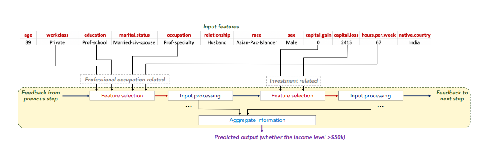
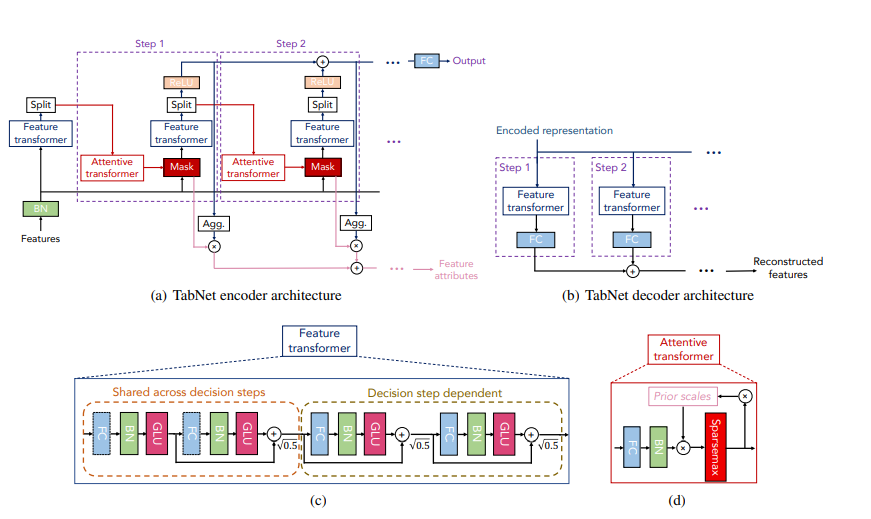

#### TabNet -  Deep Neural Network Learning package based on pytorch

#### Reference:
 - https://dreamquark-ai.github.io/tabnet/generated_docs/README.html
 - https://github.com/dreamquark-ai/tabnet/blob/develop/census_example.ipynb
 - https://arxiv.org/pdf/1908.07442.pdf

#### TabNet:
> TabNet is a deep learning end-to-end model that performed well across several datasets (Arik and Pfister, 2019). In its encoder, sequential decision steps encode features using sparse learned masks and select relevant features using the mask (with attention) for each row. Using sparsemax layers, the encoder forces the selection of a small set of features. The advantage of learning masks is that features need not be all-or-nothing. Rather than using a hard threshold on a feature, a learnable mask can make a soft decision, thus providing a relaxation of classical (non-differentiable) feature selection methods. 

*the above is excerpt from* [here](https://arxiv.org/pdf/2106.03253.pdf)

According to TabNet original paper [here](https://arxiv.org/pdf/1908.07442.pdf), TabNet incorporates *feature selection* into its learning process and offers interpretability by producing feature importance that is similar to tree-based models such as LightGBM and XGBoost. 

>  1. TabNet inputs raw tabular data without any preprocessing and is trained using gradient descent-based optimization, enabling flexible integration into end-to-end learning.

>  2. TabNet uses sequential attention to choose which features to reason from at each decision step, enabling interpretability and better learning as the learning capacity is used for the most salient features. This **feature selection** is instance-wise, e.g. it can be different for each input, and TabNet employs a single deep learning architecture for feature selection and reasoning.
>  3. Above design choices lead to two valuable properties: (i) TabNet outperforms or is on par with other tabular learning models on various datasets for classification and regression problems from different domains; and (ii) TabNet enables two kinds of interpretability: local interpretability that visualizes the importance of features and how they are combined, and global interpretability which quantifies the contribution of each feature to the trained model.

#### Interesting notes:

while in the TabNet original paper ([TabNet: Attentive Interpretable Tabular Learning](https://arxiv.org/pdf/1908.07442.pdf), the authors claimed that TabNet outperformed other learning algorithms such as XGBoost, the authors in this paper [Tabular Data: Deep Learning is Not All You Need](https://arxiv.org/pdf/2106.03253.pdf) said otherwise: 
    - In most cases, the models perform worse on unseen datasets than do the datasets' original models.
    - The XGBoost model generally outperformed the deep models.
    - No deep model consistently outperformed the others. The 1D-CNN model performance may seem to perform better, since all the datasets were new for it.
    - **The ensemble of deep models and XGBoost outperforms the other models in most cases.**
- Ensemble of deep models and XGBoost
    - Ensemble of deep neural networks and tree-based gradient boosting models (XGBoost and LightGBM) has proved to be very powerful in several Kaggle competitions.
    - For example, in a recent competitin [Optiver Realized Volatility Prediction](https://www.kaggle.com/c/optiver-realized-volatility-prediction), some leading solutions (as of Nov 2021) are using the ensembel of Neural networks + Tree-based gradient boosting. 
         - ensemble of TabNet and LightGBM models: [kaggle url](https://www.kaggle.com/eduardopeynetti/tentative-second-place-solution)
         - NN with Keras and LighGBM models: [kaggle url](https://www.kaggle.com/jacobyjaeger/15th-place)