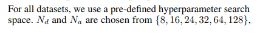
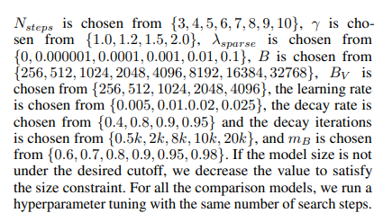
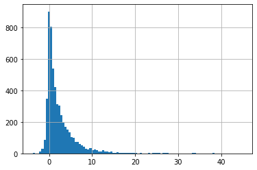
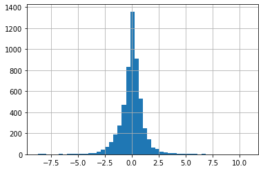

### Tabnet hyperparamter tuning with hyperopt - regression

reference: 

- https://github.com/dreamquark-ai/tabnet/blob/develop/regression_example.ipynb
- https://arxiv.org/pdf/1908.07442.pdf
- http://hyperopt.github.io/hyperopt/


#### steps:
1. download market data using yfinance: download S&P 500 ('^GSPC')
1. create target variable: calculate return 20-day max return (i.e. target in supervised learning problem).
   - for each date (T):
      - calculate the max price change in next 20 trading dates: price_change = (max{close price in T+1 to T+20} - {close price on T})/({close price on T})
1. feature engineering: engineer a few features
    - lag21: previous 21 day target
    - lag31: previous 31 day target
    - lag41: previous 41 day target
    - day price change: the difference between open and closing prices
        - (Close - Open)/Open
    - day max price change: the difference between high and low prices
        - (High-Low)/Open
    - one day close price change: day T close price versus day T-1 close price.
        - 100*({Close on T} - {Close on T-1})/{Close on T-1}
    - 10 day close price change: day T close price versus day T-10 close price.
        - 100*({Close on T} - {Close on T-10})/{Close on T-10}
    - 20 day close price change: day T close price versus day T-20 close price.
        - 100*({Close on T} - {Close on T-20})/{Close on T-20}
    - one day/10day/20day volume change
1. processing data and split data into training and testing subsets
1. setup the hyperparamter search space. 
  - the search space is defined based on 1) hyperparamters defined on [this page](https://dreamquark-ai.github.io/tabnet/generated_docs/README.html#model-parameters) and the search space described in TabNet original [paper](https://arxiv.org/pdf/1908.07442.pdf)
  - 
  - 
  - I also added max number of epoches to search space, and I am not using any early stop (the early stop parametr in TabNet is `patience` - Number of consecutive epochs without improvement before performing early stopping.
1. use hyperopt to run the tuning process
  - I use tpe algorithm  - it is a Baysian search process with certain number of initial random trials.
  - here is a full walkthrough of hyperopt [pdf](https://iopscience.iop.org/article/10.1088/1749-4699/8/1/014008)
1. save trials and results 
- dump trials into a pickle file. this file can be helpful if I later want to run more trials of hyperparamter tuning.  


```python
import numpy as np
import pandas as pd

from datetime import datetime, timedelta
import yfinance as yf #to download stock price data
```


```python
from pytorch_tabnet.tab_model import TabNetClassifier

import torch
from sklearn.preprocessing import LabelEncoder
from sklearn.metrics import accuracy_score
import pandas as pd
import numpy as np


import os
from pathlib import Path
import shutil
```


```python
#initiate random seed
rand_seed=568
import random
def init_seed(random_seed):
    
    random.seed(random_seed)
    os.environ['PYTHONHASHSEED'] = str(random_seed)
    np.random.seed(random_seed)
    torch.manual_seed(random_seed)
    
    if torch.cuda.is_available():
        torch.cuda.manual_seed(random_seed)
        torch.cuda.manual_seed_all(random_seed)
        torch.backends.cudnn.deterministic = True
        torch.backends.cudnn.benchmark = False
        
init_seed(rand_seed)
```


```python
import plotly.express as px
import plotly.graph_objects as go
from plotly.subplots import make_subplots
```

#### download S&P 500 price data


```python
ticker = '^GSPC'
cur_data = yf.Ticker(ticker)
hist = cur_data.history(period="max")
print(ticker, hist.shape, hist.index.min())
```

    ^GSPC (19721, 7) 1927-12-30 00:00:00
    


```python
df=hist[hist.index>='2000-01-01'].copy(deep=True)
df.head()
```


<div>
<style scoped>
    .dataframe tbody tr th:only-of-type {
        vertical-align: middle;
    }

    .dataframe tbody tr th {
        vertical-align: top;
    }

    .dataframe thead th {
        text-align: right;
    }
</style>
<table border="1" class="dataframe">
  <thead>
    <tr style="text-align: right;">
      <th></th>
      <th>Open</th>
      <th>High</th>
      <th>Low</th>
      <th>Close</th>
      <th>Volume</th>
      <th>Dividends</th>
      <th>Stock Splits</th>
    </tr>
    <tr>
      <th>Date</th>
      <th></th>
      <th></th>
      <th></th>
      <th></th>
      <th></th>
      <th></th>
      <th></th>
    </tr>
  </thead>
  <tbody>
    <tr>
      <th>2000-01-03</th>
      <td>1469.250000</td>
      <td>1478.000000</td>
      <td>1438.359985</td>
      <td>1455.219971</td>
      <td>931800000</td>
      <td>0</td>
      <td>0</td>
    </tr>
    <tr>
      <th>2000-01-04</th>
      <td>1455.219971</td>
      <td>1455.219971</td>
      <td>1397.430054</td>
      <td>1399.420044</td>
      <td>1009000000</td>
      <td>0</td>
      <td>0</td>
    </tr>
    <tr>
      <th>2000-01-05</th>
      <td>1399.420044</td>
      <td>1413.270020</td>
      <td>1377.680054</td>
      <td>1402.109985</td>
      <td>1085500000</td>
      <td>0</td>
      <td>0</td>
    </tr>
    <tr>
      <th>2000-01-06</th>
      <td>1402.109985</td>
      <td>1411.900024</td>
      <td>1392.099976</td>
      <td>1403.449951</td>
      <td>1092300000</td>
      <td>0</td>
      <td>0</td>
    </tr>
    <tr>
      <th>2000-01-07</th>
      <td>1403.449951</td>
      <td>1441.469971</td>
      <td>1400.729980</td>
      <td>1441.469971</td>
      <td>1225200000</td>
      <td>0</td>
      <td>0</td>
    </tr>
  </tbody>
</table>
</div>


#### create the target variable: calcualte max return in next 20 trading days


```python
#for each stock_id, get the max close in next 20 trading days
price_col = 'Close'
roll_len=20
new_col = 'next_20day_max'
target_list = []

df.sort_index(ascending=True, inplace=True)
df.head(3)
```


<div>
<style scoped>
    .dataframe tbody tr th:only-of-type {
        vertical-align: middle;
    }

    .dataframe tbody tr th {
        vertical-align: top;
    }

    .dataframe thead th {
        text-align: right;
    }
</style>
<table border="1" class="dataframe">
  <thead>
    <tr style="text-align: right;">
      <th></th>
      <th>Open</th>
      <th>High</th>
      <th>Low</th>
      <th>Close</th>
      <th>Volume</th>
      <th>Dividends</th>
      <th>Stock Splits</th>
    </tr>
    <tr>
      <th>Date</th>
      <th></th>
      <th></th>
      <th></th>
      <th></th>
      <th></th>
      <th></th>
      <th></th>
    </tr>
  </thead>
  <tbody>
    <tr>
      <th>2000-01-03</th>
      <td>1469.250000</td>
      <td>1478.000000</td>
      <td>1438.359985</td>
      <td>1455.219971</td>
      <td>931800000</td>
      <td>0</td>
      <td>0</td>
    </tr>
    <tr>
      <th>2000-01-04</th>
      <td>1455.219971</td>
      <td>1455.219971</td>
      <td>1397.430054</td>
      <td>1399.420044</td>
      <td>1009000000</td>
      <td>0</td>
      <td>0</td>
    </tr>
    <tr>
      <th>2000-01-05</th>
      <td>1399.420044</td>
      <td>1413.270020</td>
      <td>1377.680054</td>
      <td>1402.109985</td>
      <td>1085500000</td>
      <td>0</td>
      <td>0</td>
    </tr>
  </tbody>
</table>
</div>


```python
df_next20dmax=df[[price_col]].shift(1).rolling(roll_len).max()
df_next20dmax.columns=[new_col]
df = df.merge(df_next20dmax, right_index=True, left_index=True, how='inner')

df.dropna(how='any', inplace=True)
df['target']= 100*(df[new_col]-df[price_col])/df[price_col]  
```


```python
df['target'].describe()
```


    count    5479.000000
    mean        2.450897
    std         4.077561
    min        -3.743456
    25%         0.135604
    50%         1.130147
    75%         3.318523
    max        44.809803
    Name: target, dtype: float64


```python
df['target'].hist(bins=100)
```


    <AxesSubplot:>


    

    


#### engineer features

- lag21: previous 21 day target
- lag31: previous 31 day target
- lag41: previous 41 day target
- day price change: the difference between open and closing prices
    - (Close - Open)/Open
- day max price change: the difference between high and low prices
    - (High-Low)/Open
- one day close price change: day T close price versus day T-1 close price.
    - 100*({Close on T} - {Close on T-1})/{Close on T-1}
- 10 day close price change: day T close price versus day T-10 close price.
    - 100*({Close on T} - {Close on T-10})/{Close on T-10}
- 20 day close price change: day T close price versus day T-20 close price.
    - 100*({Close on T} - {Close on T-20})/{Close on T-20}
- one day/10day/20day volume change
    
  


```python
df['lag21']=df['target'].shift(21)
df['lag31']=df['target'].shift(31)
df['lag41']=df['target'].shift(41)

df['open_close_diff'] = df['Close'] - df['Open']
df['day_change']=(100*df['open_close_diff']/df['Open']).round(2)
df['day_max_change'] = (100*(df['High'] - df['Low'])/df['Open']).round(2)

#create a binary feature: 1 day change
#0: decrease; 1: increase
df['oneday_change']=(df['Close'].diff()>0)+1-1

df['10day_change']=df['Close'].diff(10)
df['20day_change']=df['Close'].diff(20)


df['oneday_volchange']=(df['Volume'].diff()>0)+1-1

df['10day_volchange']=df['Volume'].diff(10)
df['20day_volchange']=df['Volume'].diff(20)


df.head(3)
```


<div>
<style scoped>
    .dataframe tbody tr th:only-of-type {
        vertical-align: middle;
    }

    .dataframe tbody tr th {
        vertical-align: top;
    }

    .dataframe thead th {
        text-align: right;
    }
</style>
<table border="1" class="dataframe">
  <thead>
    <tr style="text-align: right;">
      <th></th>
      <th>Open</th>
      <th>High</th>
      <th>Low</th>
      <th>Close</th>
      <th>Volume</th>
      <th>Dividends</th>
      <th>Stock Splits</th>
      <th>next_20day_max</th>
      <th>target</th>
      <th>lag21</th>
      <th>...</th>
      <th>lag41</th>
      <th>open_close_diff</th>
      <th>day_change</th>
      <th>day_max_change</th>
      <th>oneday_change</th>
      <th>10day_change</th>
      <th>20day_change</th>
      <th>oneday_volchange</th>
      <th>10day_volchange</th>
      <th>20day_volchange</th>
    </tr>
    <tr>
      <th>Date</th>
      <th></th>
      <th></th>
      <th></th>
      <th></th>
      <th></th>
      <th></th>
      <th></th>
      <th></th>
      <th></th>
      <th></th>
      <th></th>
      <th></th>
      <th></th>
      <th></th>
      <th></th>
      <th></th>
      <th></th>
      <th></th>
      <th></th>
      <th></th>
      <th></th>
    </tr>
  </thead>
  <tbody>
    <tr>
      <th>2000-02-01</th>
      <td>1394.459961</td>
      <td>1412.489990</td>
      <td>1384.790039</td>
      <td>1409.280029</td>
      <td>981000000</td>
      <td>0</td>
      <td>0</td>
      <td>1465.150024</td>
      <td>3.964435</td>
      <td>NaN</td>
      <td>...</td>
      <td>NaN</td>
      <td>14.820068</td>
      <td>1.06</td>
      <td>1.99</td>
      <td>0</td>
      <td>NaN</td>
      <td>NaN</td>
      <td>0</td>
      <td>NaN</td>
      <td>NaN</td>
    </tr>
    <tr>
      <th>2000-02-02</th>
      <td>1409.280029</td>
      <td>1420.609985</td>
      <td>1403.489990</td>
      <td>1409.119995</td>
      <td>1038600000</td>
      <td>0</td>
      <td>0</td>
      <td>1465.150024</td>
      <td>3.976243</td>
      <td>NaN</td>
      <td>...</td>
      <td>NaN</td>
      <td>-0.160034</td>
      <td>-0.01</td>
      <td>1.21</td>
      <td>0</td>
      <td>NaN</td>
      <td>NaN</td>
      <td>1</td>
      <td>NaN</td>
      <td>NaN</td>
    </tr>
    <tr>
      <th>2000-02-03</th>
      <td>1409.119995</td>
      <td>1425.780029</td>
      <td>1398.520020</td>
      <td>1424.969971</td>
      <td>1146500000</td>
      <td>0</td>
      <td>0</td>
      <td>1465.150024</td>
      <td>2.819712</td>
      <td>NaN</td>
      <td>...</td>
      <td>NaN</td>
      <td>15.849976</td>
      <td>1.12</td>
      <td>1.93</td>
      <td>1</td>
      <td>NaN</td>
      <td>NaN</td>
      <td>1</td>
      <td>NaN</td>
      <td>NaN</td>
    </tr>
  </tbody>
</table>
<p>3 rows × 21 columns</p>
</div>


```python
df['day_change'].hist(bins=50)
```


    <AxesSubplot:>


    

    


```python
#convert day_change into categorical feature
#above 2- class 1; below -2 - class -1, in the middle - class0
df['day_change_cat']=0
df.loc[df['day_change']<=-2, 'day_change_cat']=-1
df.loc[df['day_change']>=2, 'day_change_cat']=1
df['day_change_cat'].value_counts()
```


     0    5095
    -1     210
     1     174
    Name: day_change_cat, dtype: int64


```python
df.dropna(how='any', inplace=True)
print(df.shape, df.index.min())
df.head(3)
```

    (5438, 22) 2000-03-30 00:00:00
    


<div>
<style scoped>
    .dataframe tbody tr th:only-of-type {
        vertical-align: middle;
    }

    .dataframe tbody tr th {
        vertical-align: top;
    }

    .dataframe thead th {
        text-align: right;
    }
</style>
<table border="1" class="dataframe">
  <thead>
    <tr style="text-align: right;">
      <th></th>
      <th>Open</th>
      <th>High</th>
      <th>Low</th>
      <th>Close</th>
      <th>Volume</th>
      <th>Dividends</th>
      <th>Stock Splits</th>
      <th>next_20day_max</th>
      <th>target</th>
      <th>lag21</th>
      <th>...</th>
      <th>open_close_diff</th>
      <th>day_change</th>
      <th>day_max_change</th>
      <th>oneday_change</th>
      <th>10day_change</th>
      <th>20day_change</th>
      <th>oneday_volchange</th>
      <th>10day_volchange</th>
      <th>20day_volchange</th>
      <th>day_change_cat</th>
    </tr>
    <tr>
      <th>Date</th>
      <th></th>
      <th></th>
      <th></th>
      <th></th>
      <th></th>
      <th></th>
      <th></th>
      <th></th>
      <th></th>
      <th></th>
      <th></th>
      <th></th>
      <th></th>
      <th></th>
      <th></th>
      <th></th>
      <th></th>
      <th></th>
      <th></th>
      <th></th>
      <th></th>
    </tr>
  </thead>
  <tbody>
    <tr>
      <th>2000-03-30</th>
      <td>1508.520020</td>
      <td>1517.380005</td>
      <td>1474.630005</td>
      <td>1487.920044</td>
      <td>1193400000</td>
      <td>0</td>
      <td>0</td>
      <td>1527.459961</td>
      <td>2.657395</td>
      <td>4.533823</td>
      <td>...</td>
      <td>-20.599976</td>
      <td>-1.37</td>
      <td>2.83</td>
      <td>0</td>
      <td>29.450073</td>
      <td>106.160034</td>
      <td>1</td>
      <td>-288900000.0</td>
      <td>-5200000.0</td>
      <td>0</td>
    </tr>
    <tr>
      <th>2000-03-31</th>
      <td>1487.920044</td>
      <td>1519.810059</td>
      <td>1484.380005</td>
      <td>1498.579956</td>
      <td>1227400000</td>
      <td>0</td>
      <td>0</td>
      <td>1527.459961</td>
      <td>1.927158</td>
      <td>4.339390</td>
      <td>...</td>
      <td>10.659912</td>
      <td>0.72</td>
      <td>2.38</td>
      <td>1</td>
      <td>34.109985</td>
      <td>89.409912</td>
      <td>1</td>
      <td>-67700000.0</td>
      <td>77100000.0</td>
      <td>0</td>
    </tr>
    <tr>
      <th>2000-04-03</th>
      <td>1498.579956</td>
      <td>1507.189941</td>
      <td>1486.959961</td>
      <td>1505.969971</td>
      <td>1021700000</td>
      <td>0</td>
      <td>0</td>
      <td>1527.459961</td>
      <td>1.426987</td>
      <td>2.309865</td>
      <td>...</td>
      <td>7.390015</td>
      <td>0.49</td>
      <td>1.35</td>
      <td>1</td>
      <td>49.339966</td>
      <td>114.689941</td>
      <td>0</td>
      <td>100900000.0</td>
      <td>-7300000.0</td>
      <td>0</td>
    </tr>
  </tbody>
</table>
<p>3 rows × 22 columns</p>
</div>


####  categorical data processing for TabNet


```python
target='target'
```


```python
df.dropna(how='any', inplace=True)
train = df.copy(deep=True)
```


```python
categorical_columns = ['day_change_cat']
categorical_dims =  {}
for col in categorical_columns:
    print(col, train[col].nunique())
    l_enc = LabelEncoder()
    train[col] = l_enc.fit_transform(train[col].values)
    
    categorical_dims[col] = len(l_enc.classes_)

categorical_dims
```

    day_change_cat 3
    


    {'day_change_cat': 3}


```python
categorical_columns, categorical_dims
```


    (['day_change_cat'], {'day_change_cat': 3})


#####  Define categorical features for categorical embeddings


```python
unused_feat = ['Dividends', 'Stock Splits', 'next_20day_max',
               'open_close_diff', 'day_change' ]

features = [ col for col in train.columns if col not in unused_feat+[target]] 

cat_idxs = [ i for i, f in enumerate(features) if f in categorical_columns]

cat_dims = [ categorical_dims[f] for i, f in enumerate(features) if f in categorical_columns]

```


```python
print(features, len(features))
```

    ['Open', 'High', 'Low', 'Close', 'Volume', 'lag21', 'lag31', 'lag41', 'day_max_change', 'oneday_change', '10day_change', '20day_change', 'oneday_volchange', '10day_volchange', '20day_volchange', 'day_change_cat'] 16
    


```python
cat_idxs
```


    [15]


```python
cat_dims
```


    [3]


#### Split data from training


```python
train.shape
```


    (5438, 22)


```python
X_train = train[features].values[:-1000,:]
y_train = train[target].values[:-1000]


X_test = train[features].values[-950:, ]
y_test = train[target].values[-950:]
```


```python
X_train.shape, X_test.shape
```


    ((4438, 16), (950, 16))


####  hyperopt setup - define search space and score function


```python
from hyperopt import hp
from hyperopt import fmin, tpe, hp, STATUS_OK, Trials, anneal, rand
```


```python
search_space = { 
    
                 'n_d': hp.choice('n_d',[8, 16, 24, 32, 64, 128]), #Nd and Na are chosen from {8, 16, 24, 32, 64, 128},
                 'n_steps': hp.choice('n_steps',[3,4,5,6,7,8,9,10]),#Nsteps is chosen from {3, 4, 5, 6, 7, 8, 9, 10}
                 'gamma':hp.choice('gamma', [1.0, 1.2, 1.5, 2.0]),#γ is chosen from {1.0, 1.2, 1.5, 2.0}
                 'n_independent':hp.choice('n_independent', [1,2,3,4,5] ),
                 'n_shared':hp.choice('n_shared', [1,2,3,4,5]),
                 'momentum':  hp.choice('momentum', np.round(np.arange(0.01, 0.4, 0.01),3)), #Momentum for batch normalization, typically ranges from 0.01 to 0.4 (default=0.02)
                 #momentum mB., and mB is chosen from {0.6, 0.7, 0.8, 0.9, 0.95, 0.98}. 
                 'lambda_sparse': hp.choice('lambda_sparse', [0, 0.000001, 0.0001, 0.001, 0.01, 0.1]), #λsparse is chosen from {0, 0.000001, 0.0001, 0.001, 0.01, 0.1}
                 'optimizer_fn': hp.choice('optimizer_fn', ['Adam', 'RMSprop', 'SGD']),
                 'lr': hp.choice('lr', [0.005, 0.01, 0.02, 0.025]), #optimizer. the learning rateis chosen from {0.005, 0.01.0.02, 0.025}, 
                 'optimizer_momentum': hp.choice('optimizer_momentum', [0.4, 0.8, 0.9, 0.95]),#optimizer ????
                 #the decay rate is chosen from {0.4, 0.8, 0.9, 0.95} and the decay iterations is chosen from {0.5k, 2k, 8k, 10k, 20k}
                 'weight_decay':hp.choice('weight_decay', [0, 0.5, 0.001, 0.0001] ),#optimizer.  the decay rate is chosen from {0.4, 0.8, 0.9, 0.95} a
                 'scheduler_fn':hp.choice('scheduler_fn', ['StepLR', 'CosineAnnealingWarmRestarts', 'ReduceLROnPlateau']),
                 'fn_step_size':hp.choice('fn_step_size', [3, 5, 10, 15]), 
                 'fn_gamma':hp.choice('fn_gamma', np.round(np.arange(0.1, 0.95, 0.01),3)),
                 'fn_T_0':hp.choice('fn_T_0', [3, 5, 10, 15]), 
                 'fn_eta_min':hp.choice('fn_eta_min', np.round(np.arange(0.0001, 0.001, 0.0001),4)),
                 'max_epochs':hp.choice('max_epochs', range(30, 201, 1)),
                 'batch_size':hp.choice('batch_size', [256, 512, 1024, 2048, 4096, 8192, 16384, 32768]),#B is chosen from {256, 512, 1024, 2048, 4096, 8192, 16384, 32768}
                 'virtual_batch_size':hp.choice('virtual_batch_size', [256, 512, 1024, 2048, 4096]),#BV is chosen from {256, 512, 1024, 2048, 4096}
                 'patience':hp.choice('patience', [0]),
                  }

n_trials = 100
n_random_trials = 30
```


```python
from pytorch_tabnet.tab_model import TabNetRegressor
import torch
from sklearn.preprocessing import LabelEncoder
from sklearn.preprocessing import label_binarize
from sklearn.metrics import mean_squared_error
import copy

def score(params):
    
    tab_params = {}
    tab_params['n_d'] = params['n_d']
    tab_params['n_a'] = params['n_d'] #set n_a equals n_d according to official document
    tab_params['seed']= rand_seed #set random seed for reproduciablity
    tab_params['gamma'] = params['gamma']
    tab_params['n_independent'] = params['n_independent']
    tab_params['n_shared'] = params['n_shared']
    tab_params['momentum'] = params['momentum']
    tab_params['lambda_sparse'] = params['lambda_sparse']
    tab_params['cat_idxs']=cat_idxs #no categorical features
    tab_params['cat_dims']=cat_dims
    tab_params['cat_emb_dim']=1,
    
    lr =params['lr']
    weight_decay =params['weight_decay']
    optimizer_momentum =params['optimizer_momentum']
    optimizer_fn=params['optimizer_fn']
    
    if optimizer_fn=='Adam':
        tab_params['optimizer_params'] = dict(lr=lr, weight_decay=weight_decay)
        tab_params['optimizer_fn'] = torch.optim.Adam
    elif optimizer_fn == 'RMSprop':
        tab_params['optimizer_params'] = dict(lr=lr, momentum=optimizer_momentum, weight_decay=weight_decay)
        tab_params['optimizer_fn'] = torch.optim.RMSprop
    elif optimizer_fn == 'SGD':
        tab_params['optimizer_params'] = dict(lr=lr, momentum=optimizer_momentum, weight_decay=weight_decay)
        tab_params['optimizer_fn'] = torch.optim.SGD
   
    scheduler_fn = params['scheduler_fn']
    fn_step_size = params['fn_step_size']
    fn_gamma = params['fn_gamma']
    fn_T_0 = params['fn_T_0']
    fn_eta_min = params['fn_eta_min']
    
    if scheduler_fn== 'StepLR':
        tab_params['scheduler_params'] ={'gamma':fn_gamma, 'step_size':fn_step_size}
        tab_params['scheduler_fn'] = torch.optim.lr_scheduler.StepLR
    elif scheduler_fn== 'CosineAnnealingWarmRestarts':
        tab_params['scheduler_params'] ={'T_0':fn_T_0, 'eta_min':fn_eta_min}
        tab_params['scheduler_fn'] = torch.optim.lr_scheduler.CosineAnnealingWarmRestarts
    elif scheduler_fn== 'ReduceLROnPlateau':
        tab_params['scheduler_params'] ={'mode':'min', 'min_lr':fn_eta_min}
        tab_params['scheduler_fn'] = torch.optim.lr_scheduler.ReduceLROnPlateau
        
    tab_params['epsilon']=1e-15 #default. leave untouched
    tab_params['verbose']=0 #no verbose
    
    batch_size=params['batch_size'] 
    mini_batch_size=params['virtual_batch_size'] 
    if mini_batch_size>batch_size:
        mini_batch_size=batch_size
    
    #--add fit params---
    full_params = copy.deepcopy(tab_params)
    
    max_epochs = params['max_epochs']
    patience = params['patience']
    full_params['max_epochs'] = max_epochs
    full_params['batch_size'] = batch_size
    full_params['virtual_batch_size'] = mini_batch_size
    full_params['patience'] = patience
    
    params_list.append(copy.deepcopy(full_params)) 
    
    #-----------------------------------------------------
    #---start training: this part can easily be replaced with k-fold list----
    
    i = len(params_list)
    
    
    #initiate classifier - need to re-initiate for each Train-Test pair
    clf = TabNetRegressor(**tab_params)
    clf.fit(
        X_train=X_train, y_train=y_train.reshape(-1,1),
        eval_set=[(X_train, y_train.reshape(-1,1))],
        eval_name=['train'],
        eval_metric=['mse'],
        max_epochs=max_epochs, patience=patience,
        batch_size=batch_size, virtual_batch_size=mini_batch_size,
        num_workers=0,
        drop_last=False
    ) 

    preds = clf.predict(X_test).flatten()
    #print(preds)
    loss = mean_squared_error(y_pred=preds, y_true=y_test)

    
        
    df_pred = pd.DataFrame({'y_true':y_test, 'y_pred':preds})
    
    metric_list.append([i, full_params, loss] )
    df_pred.to_csv(save_dir.joinpath(f'trial_{i}'), sep='|', index=False, compression='bz2')
    
    
    return {'loss': loss, 'status': STATUS_OK}
```


```python
from functools import partial
def optimize(space, evals, cores, trials, optimizer=tpe.suggest, random_state=1234, n_startup_jobs=50):
    space['seed']= random_state
    algo = partial(optimizer, n_startup_jobs=n_startup_jobs)
    best = fmin(score, space, algo=algo, max_evals=evals, trials = trials)
    return best
```

#### run hyperparamter tuning


```python
params_list = []
metric_list = []
trials = Trials()
```


```python
save_dir=Path('hyper_tune/tabnet')
```


```python
optimize(search_space,
          evals = 10,
          optimizer=tpe.suggest,
          cores = 4,
          trials = trials, random_state=rand_seed, 
          n_startup_jobs=5)
```

    No early stopping will be performed, last training weights will be used.                                               
    No early stopping will be performed, last training weights will be used.                                               
    No early stopping will be performed, last training weights will be used.                                               
    No early stopping will be performed, last training weights will be used.                                               
    No early stopping will be performed, last training weights will be used.                                               
    No early stopping will be performed, last training weights will be used.                                               
    No early stopping will be performed, last training weights will be used.                                               
    No early stopping will be performed, last training weights will be used.                                               
    No early stopping will be performed, last training weights will be used.                                               
    No early stopping will be performed, last training weights will be used.                                               
    100%|███████████████████████████████████████████████| 10/10 [25:39<00:00, 153.91s/trial, best loss: 11.542633152981768]
    


    {'batch_size': 6,
     'fn_T_0': 0,
     'fn_eta_min': 7,
     'fn_gamma': 5,
     'fn_step_size': 0,
     'gamma': 3,
     'lambda_sparse': 0,
     'lr': 1,
     'max_epochs': 30,
     'momentum': 38,
     'n_d': 1,
     'n_independent': 1,
     'n_shared': 3,
     'n_steps': 4,
     'optimizer_fn': 1,
     'optimizer_momentum': 0,
     'patience': 0,
     'scheduler_fn': 2,
     'virtual_batch_size': 3,
     'weight_decay': 1}


##### save trials and results 

- dump trials into a pickle file. this file can be helpful if I later want to run more trials of hyperparamter tuning.


```python
save_dir.parent
```


    WindowsPath('hyper_tune')


```python
import joblib
joblib.dump(trials, save_dir.parent.joinpath('tabnet.pkl'))
```


    ['hyper_tune\\tabnet.pkl']


```python
pd.DataFrame(metric_list, columns=['trial_id', 'params', 'loss']).to_excel(save_dir.parent.joinpath('tabnet.xlsx'))
```
