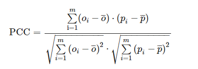

***

### Temporal Convolutional Networks for the Advance Prediction of ENSO 
[Accessed on Jan 2, 2021](https://www.nature.com/articles/s41598-020-65070-5)

- citation:
 > Yan, J., Mu, L., Wang, L. et al. Temporal Convolutional Networks for the Advance Prediction of ENSO. Sci Rep 10, 8055 (2020). https://doi.org/10.1038/s41598-020-65070-5 

- notes from a blog [here - accessed on Jan 2, 2021](https://blog.csdn.net/m0_37859875/article/details/110732360). The following are copied from the blog:
 > **motivation - the paper selected the following two indicators for predictions**
 > 1. The **Niño 3.4 index** as an indicator of ENSO events in the ocean.
 > 1. The **SOI(southern oscillation index )** as a measure of ENSO events in the atmosphere.
 
 > **existing approaches in prediction the aforementioned indicators:**
 > 1. Statistics-based methods: Holt-Winters (HW) method and ARIMA method(poor ftting)
 > 1. ML-based methods: SVR, ANNs, LSTM (complex and computationally time-consuming)
 > 1. Hybrid approach: ARIMA-ANNs and ensemble empirical mode decomposition (EEMD)-convolutional long short-term memory (ConvLSTM). (depend largely on the statistical decomposition model)
 
 > **models proposed by the authors:**
 > EEMD-TCN: ensemble empirical mode decomposition-temporal convolutional network
 

- my takeaways:
  1. this paper seems to be an application of the models described in *Bai, Shaojie & Kolter, J. & Koltun, Vladlen. (2018). An Empirical Evaluation of Generic Convolutional and Recurrent Networks for Sequence Modeling.*
  1. the authors used PCC (Pearson correlation coefficient) as a model evaluation metric. 
   * Pearson correlation coefficient (PCC): a measure of the linear correlation between the predicted value and the actual value
   * The formulas for calculating the PCC is as follows:
   * 
   > where m is the length of the time-series, p is the prediction results and p¯¯¯ is its mean value, o represents the actual value and o¯¯¯ represents its mean value.
