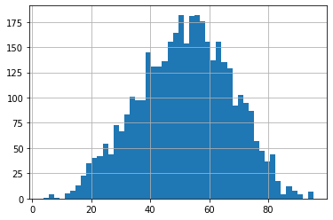
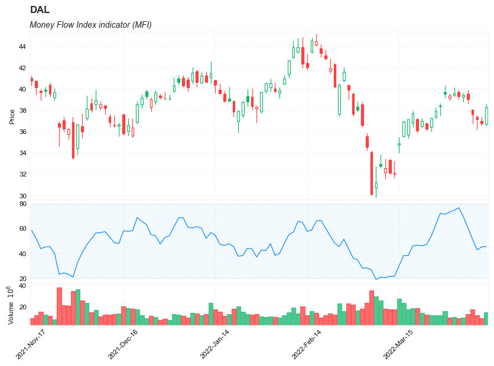

## Money Flow Index (MFI)

**References**

- [tradingview: money flow index](https://www.tradingview.com/support/solutions/43000502348-money-flow-mfi/)
- [fidelity: Money Flow Index (MFI)](https://www.fidelity.com/learning-center/trading-investing/technical-analysis/technical-indicator-guide/MFI)
- [fidelity: money flow](https://www.fidelity.com/learning-center/trading-investing/technical-analysis/technical-indicator-guide/money-flow)


**Definition**

The Money Flow Index indicator (MFI) is a tool used in technical analysis for measuring buying and selling pressure. This is done through analyzing both price and volume. The MFI's calculation generates a value that is then plotted as a line that moves within a range of 0-100, making it an oscillator. When the MFI rises, this indicates an increase in buying pressure. When it falls, this indicates an increase in selling pressure. The Money Flow Index can generate several signals, most notably: overbought and oversold conditions, divergences, and failure swings.

The Money Flow Index indicator (MFI) was created by Gene Quong and Avrum Soudack.

The Money Flow Index (MFI) is actually quite similar to The Relative Strength Index (RSI). The RSI is a leading indicator used to measure momentum. The MFI is essentially the RSI with the added aspect of volume. Because of its close similarity to RSI, the MFI can be used in a very similar way.


**Calculation**


---

There are four separate steps to calculate the Money Flow Index. The following example is for a 14 Period MFI:

1. Calculate the Typical Price

    `Typical Price = (High + Low + Close) / 3 `

2. Calculate the Raw Money Flow

    `Raw Money Flow = Typical Price x Volume `

3. Calculate the Money Flow Ratio

    `(14 Period Positive Money Flow) / (14 Period Negative Money Flow) `

    - Positive Money Flow is calculated by summing the Money Flow of all of the days in the period where Typical Price is higher than the previous period Typical Price.
    - Negative Money Flow is calculated by summing the Money Flow of all of the days in the period where Typical Price is lower than the previous period Typical Price.

4. Calculate the Money Flow Index.

    `Money Flow Index = 100 - 100/(1 + Money Flow Ratio) ` 

---

**Read the indicator**


- Overbought/Oversold
    - When momentum and price rise fast enough, at a high enough level, eventual the security will be considered overbought. The opposite is also true. When price and momentum fall far enough they can be considered oversold. Traditional overbought territory starts above 80 and oversold territory starts below 20. These values are subjective however, and a technical analyst can set whichever thresholds they choose.
    - Oversold levels typically occur below 20 and overbought levels typically occur above 80. These levels may change depending on market conditions. Level lines should cut across the highest peaks and the lowest troughs. Oversold/Overbought levels are generally not reason enough to buy/sell; and traders should consider additional technical analysis or research to confirm the security's turning point. Keep in mind, during strong trends, the MFI may remain overbought or oversold for extended periods.
    


- Divergence
    - MFI Divergence occurs when there is a difference between what the price action is indicating and what MFI is indicating. These differences can be interpreted as an impending reversal. Specifically there are two types of divergences, bearish and bullish.
    - Bullish MFI Divergence – When price makes a new low but MFI makes a higher low.
    - Bearish MFI Divergence – When price makes a new high but MFI makes a lower high.

##### Load basic packages 


```python
import pandas as pd
import numpy as np
import os
import gc
import copy
from pathlib import Path
from datetime import datetime, timedelta, time, date
```


```python
#this package is to download equity price data from yahoo finance
#the source code of this package can be found here: https://github.com/ranaroussi/yfinance/blob/main
import yfinance as yf
```


```python
pd.options.display.max_rows = 100
pd.options.display.max_columns = 100

import warnings
warnings.filterwarnings("ignore")

import pytorch_lightning as pl
random_seed=1234
pl.seed_everything(random_seed)
```

    Global seed set to 1234
    


    1234


```python
#S&P 500 (^GSPC),  Dow Jones Industrial Average (^DJI), NASDAQ Composite (^IXIC)
#Russell 2000 (^RUT), Crude Oil Nov 21 (CL=F), Gold Dec 21 (GC=F)
#Treasury Yield 10 Years (^TNX)

#benchmark_tickers = ['^GSPC', '^DJI', '^IXIC', '^RUT',  'CL=F', 'GC=F', '^TNX']

benchmark_tickers = ['^GSPC']
tickers = benchmark_tickers + ['GSK', 'NVO', 'PFE', 'DAL']
```


```python
#https://github.com/ranaroussi/yfinance/blob/main/yfinance/base.py
#     def history(self, period="1mo", interval="1d",
#                 start=None, end=None, prepost=False, actions=True,
#                 auto_adjust=True, back_adjust=False,
#                 proxy=None, rounding=False, tz=None, timeout=None, **kwargs):

dfs = {}

for ticker in tickers:
    cur_data = yf.Ticker(ticker)
    hist = cur_data.history(period="max", start='2000-01-01')
    print(datetime.now(), ticker, hist.shape, hist.index.min(), hist.index.max())
    dfs[ticker] = hist
```

    2022-09-05 18:51:47.907345 ^GSPC (5706, 7) 1999-12-31 00:00:00 2022-09-02 00:00:00
    2022-09-05 18:51:48.190667 GSK (5706, 7) 1999-12-31 00:00:00 2022-09-02 00:00:00
    2022-09-05 18:51:48.564662 NVO (5706, 7) 1999-12-31 00:00:00 2022-09-02 00:00:00
    2022-09-05 18:51:48.922855 PFE (5706, 7) 1999-12-31 00:00:00 2022-09-02 00:00:00
    2022-09-05 18:51:49.157361 DAL (3863, 7) 2007-05-03 00:00:00 2022-09-02 00:00:00
    


```python
ticker = 'DAL'
dfs[ticker].tail(5)
```


<div>
<style scoped>
    .dataframe tbody tr th:only-of-type {
        vertical-align: middle;
    }

    .dataframe tbody tr th {
        vertical-align: top;
    }

    .dataframe thead th {
        text-align: right;
    }
</style>
<table border="1" class="dataframe">
  <thead>
    <tr style="text-align: right;">
      <th></th>
      <th>Open</th>
      <th>High</th>
      <th>Low</th>
      <th>Close</th>
      <th>Volume</th>
      <th>Dividends</th>
      <th>Stock Splits</th>
    </tr>
    <tr>
      <th>Date</th>
      <th></th>
      <th></th>
      <th></th>
      <th></th>
      <th></th>
      <th></th>
      <th></th>
    </tr>
  </thead>
  <tbody>
    <tr>
      <th>2022-08-29</th>
      <td>32.200001</td>
      <td>32.349998</td>
      <td>31.850000</td>
      <td>32.029999</td>
      <td>8758400</td>
      <td>0.0</td>
      <td>0</td>
    </tr>
    <tr>
      <th>2022-08-30</th>
      <td>32.250000</td>
      <td>32.450001</td>
      <td>31.469999</td>
      <td>31.719999</td>
      <td>7506400</td>
      <td>0.0</td>
      <td>0</td>
    </tr>
    <tr>
      <th>2022-08-31</th>
      <td>31.969999</td>
      <td>32.020000</td>
      <td>31.059999</td>
      <td>31.070000</td>
      <td>7450000</td>
      <td>0.0</td>
      <td>0</td>
    </tr>
    <tr>
      <th>2022-09-01</th>
      <td>30.650000</td>
      <td>31.139999</td>
      <td>29.940001</td>
      <td>31.090000</td>
      <td>8572700</td>
      <td>0.0</td>
      <td>0</td>
    </tr>
    <tr>
      <th>2022-09-02</th>
      <td>31.440001</td>
      <td>31.830000</td>
      <td>30.700001</td>
      <td>30.940001</td>
      <td>8626500</td>
      <td>0.0</td>
      <td>0</td>
    </tr>
  </tbody>
</table>
</div>


##### Define Money Flow Index indicator (MFI) calculation function


```python

#https://github.com/peerchemist/finta/blob/af01fa594995de78f5ada5c336e61cd87c46b151/finta/finta.py
#https://www.tradingview.com/support/solutions/43000501985-williams-r-r/


def cal_mfi(ohlc: pd.DataFrame, period: int = 14) -> pd.Series:
    """
    The money flow index (MFI) is a momentum indicator that measures
    the inflow and outflow of money into a security over a specific period of time.
    MFI can be understood as RSI adjusted for volume.
    The money flow indicator is one of the more reliable indicators of overbought and oversold conditions, 
    perhaps partly because it uses the higher readings of 80 and 20 as compared to the RSI's overbought/oversold 
    readings of 70 and 30
    
    """

    ohlc = ohlc.copy()
    ohlc.columns = [c.lower() for c in ohlc.columns]
    tp = pd.Series((ohlc["high"] + ohlc["low"] + ohlc["close"]) / 3, name="TP")

    rmf = pd.Series(tp * ohlc["volume"], name="rmf")  ## Real Money Flow
    _mf = pd.concat([tp, rmf], axis=1)
    _mf["delta"] = _mf["TP"].diff()

    def pos(row):
        if row["delta"] > 0:
            return row["rmf"]
        else:
            return 0

    def neg(row):
        if row["delta"] < 0:
            return row["rmf"]
        else:
            return 0

    _mf["neg"] = _mf.apply(neg, axis=1)
    _mf["pos"] = _mf.apply(pos, axis=1)

    mfratio = pd.Series(
        _mf["pos"].rolling(window=period).sum()
        / _mf["neg"].rolling(window=period).sum()
    )

    return pd.Series(
        100 - (100 / (1 + mfratio)), name=f"MFI{period}"
    )
```

##### Calculate MFI


```python
df = dfs[ticker][['Open', 'High', 'Low', 'Close', 'Volume']]
```


```python
df = df.round(2)
```


```python
cal_mfi
```


    <function __main__.cal_mfi(ohlc: pandas.core.frame.DataFrame, period: int = 14) -> pandas.core.series.Series>


```python
df_ta = cal_mfi(df, period = 14)
df = df.merge(df_ta, left_index = True, right_index = True, how='inner' )

del df_ta
gc.collect()
```


    38


```python
display(df.head(5))
display(df.tail(5))
```


<div>
<style scoped>
    .dataframe tbody tr th:only-of-type {
        vertical-align: middle;
    }

    .dataframe tbody tr th {
        vertical-align: top;
    }

    .dataframe thead th {
        text-align: right;
    }
</style>
<table border="1" class="dataframe">
  <thead>
    <tr style="text-align: right;">
      <th></th>
      <th>Open</th>
      <th>High</th>
      <th>Low</th>
      <th>Close</th>
      <th>Volume</th>
      <th>MFI14</th>
    </tr>
    <tr>
      <th>Date</th>
      <th></th>
      <th></th>
      <th></th>
      <th></th>
      <th></th>
      <th></th>
    </tr>
  </thead>
  <tbody>
    <tr>
      <th>2007-05-03</th>
      <td>19.32</td>
      <td>19.50</td>
      <td>18.25</td>
      <td>18.40</td>
      <td>8052800</td>
      <td>NaN</td>
    </tr>
    <tr>
      <th>2007-05-04</th>
      <td>18.88</td>
      <td>18.96</td>
      <td>18.39</td>
      <td>18.64</td>
      <td>5437300</td>
      <td>NaN</td>
    </tr>
    <tr>
      <th>2007-05-07</th>
      <td>18.83</td>
      <td>18.91</td>
      <td>17.94</td>
      <td>18.08</td>
      <td>2646300</td>
      <td>NaN</td>
    </tr>
    <tr>
      <th>2007-05-08</th>
      <td>17.76</td>
      <td>17.76</td>
      <td>17.14</td>
      <td>17.44</td>
      <td>4166100</td>
      <td>NaN</td>
    </tr>
    <tr>
      <th>2007-05-09</th>
      <td>17.54</td>
      <td>17.94</td>
      <td>17.44</td>
      <td>17.58</td>
      <td>7541100</td>
      <td>NaN</td>
    </tr>
  </tbody>
</table>
</div>


<div>
<style scoped>
    .dataframe tbody tr th:only-of-type {
        vertical-align: middle;
    }

    .dataframe tbody tr th {
        vertical-align: top;
    }

    .dataframe thead th {
        text-align: right;
    }
</style>
<table border="1" class="dataframe">
  <thead>
    <tr style="text-align: right;">
      <th></th>
      <th>Open</th>
      <th>High</th>
      <th>Low</th>
      <th>Close</th>
      <th>Volume</th>
      <th>MFI14</th>
    </tr>
    <tr>
      <th>Date</th>
      <th></th>
      <th></th>
      <th></th>
      <th></th>
      <th></th>
      <th></th>
    </tr>
  </thead>
  <tbody>
    <tr>
      <th>2022-08-29</th>
      <td>32.20</td>
      <td>32.35</td>
      <td>31.85</td>
      <td>32.03</td>
      <td>8758400</td>
      <td>57.402016</td>
    </tr>
    <tr>
      <th>2022-08-30</th>
      <td>32.25</td>
      <td>32.45</td>
      <td>31.47</td>
      <td>31.72</td>
      <td>7506400</td>
      <td>49.493749</td>
    </tr>
    <tr>
      <th>2022-08-31</th>
      <td>31.97</td>
      <td>32.02</td>
      <td>31.06</td>
      <td>31.07</td>
      <td>7450000</td>
      <td>42.697947</td>
    </tr>
    <tr>
      <th>2022-09-01</th>
      <td>30.65</td>
      <td>31.14</td>
      <td>29.94</td>
      <td>31.09</td>
      <td>8572700</td>
      <td>35.769831</td>
    </tr>
    <tr>
      <th>2022-09-02</th>
      <td>31.44</td>
      <td>31.83</td>
      <td>30.70</td>
      <td>30.94</td>
      <td>8626500</td>
      <td>34.922088</td>
    </tr>
  </tbody>
</table>
</div>


```python
df['MFI14'].hist(bins=50)
```


    <AxesSubplot:>


    

    


```python
#https://github.com/matplotlib/mplfinance
#this package help visualize financial data
import mplfinance as mpf
import matplotlib.colors as mcolors

# all_colors = list(mcolors.CSS4_COLORS.keys())#"CSS Colors"
# all_colors = list(mcolors.TABLEAU_COLORS.keys()) # "Tableau Palette",
all_colors = ['dodgerblue', 'firebrick','limegreen','skyblue','lightgreen',  'navy','yellow','plum',  'yellowgreen']
# all_colors = list(mcolors.BASE_COLORS.keys()) #"Base Colors",


#https://github.com/matplotlib/mplfinance/issues/181#issuecomment-667252575
#list of colors: https://matplotlib.org/stable/gallery/color/named_colors.html
#https://github.com/matplotlib/mplfinance/blob/master/examples/styles.ipynb

def make_3panels2(main_data, mid_panel, chart_type='candle', names=None, 
                  figratio=(14,9), fill_weights = (0, 0)):
    """
    main chart type: default is candle. alternatives: ohlc, line

    example:
    start = 200

    names = {'main_title': 'MAMA: MESA Adaptive Moving Average', 
             'sub_tile': 'S&P 500 (^GSPC)', 'y_tiles': ['price', 'Volume [$10^{6}$]']}


    make_candle(df.iloc[-start:, :5], df.iloc[-start:][['MAMA', 'FAMA']], names = names)
    
    """

    style = mpf.make_mpf_style(base_mpf_style='yahoo',  #charles
                               base_mpl_style = 'seaborn-whitegrid',
#                                marketcolors=mpf.make_marketcolors(up="r", down="#0000CC",inherit=True),
                               gridcolor="whitesmoke", 
                               gridstyle="--", #or None, or - for solid
                               gridaxis="both", 
                               edgecolor = 'whitesmoke',
                               facecolor = 'white', #background color within the graph edge
                               figcolor = 'white', #background color outside of the graph edge
                               y_on_right = False,
                               rc =  {'legend.fontsize': 'small',#or number
                                      #'figure.figsize': (14, 9),
                                     'axes.labelsize': 'small',
                                     'axes.titlesize':'small',
                                     'xtick.labelsize':'small',#'x-small', 'small','medium','large'
                                     'ytick.labelsize':'small'
                                     }, 
                              )   

    if (chart_type is None) or (chart_type not in ['ohlc', 'line', 'candle', 'hollow_and_filled']):
        chart_type = 'candle'
    len_dict = {'candle':2, 'ohlc':3, 'line':1, 'hollow_and_filled':2}    
        
    kwargs = dict(type=chart_type, figratio=figratio, volume=True, volume_panel=2, 
                  panel_ratios=(4,2,1), tight_layout=True, style=style, returnfig=True)
    
    if names is None:
        names = {'main_title': '', 'sub_tile': ''}
    


    added_plots = { }
  
    fb_bbands2_ = dict(y1=fill_weights[0]*np.ones(mid_panel.shape[0]),
                      y2=fill_weights[1]*np.ones(mid_panel.shape[0]),color="lightskyblue",alpha=0.1,interpolate=True)
    fb_bbands2_['panel'] = 1

    fb_bbands= [fb_bbands2_]
    
    
    i = 0
    for name_, data_ in mid_panel.iteritems():
        added_plots[name_] = mpf.make_addplot(data_, panel=1, width=1, color=all_colors[i], secondary_y=False)
        i = i + 1
    

    fig, axes = mpf.plot(main_data,  **kwargs,
                         addplot=list(added_plots.values()), 
                         fill_between=fb_bbands)
    # add a new suptitle
    fig.suptitle(names['main_title'], y=1.05, fontsize=12, x=0.1285)

    axes[0].set_title(names['sub_tile'], fontsize=10, style='italic',  loc='left')
#     axes[2].set_ylabel('WAVEPM10')

#     axes[0].set_ylabel(names['y_tiles'][0])
#     axes[2].set_ylabel(names['y_tiles'][1])
    return fig, axes
   
```


```python

start = -200
end = -100

names = {'main_title': f'{ticker}', 
         'sub_tile': 'Money Flow Index indicator (MFI)'}


aa_, bb_ = make_3panels2(df.iloc[start:end][['Open', 'High', 'Low', 'Close', 'Volume']], 
             df.iloc[start:end][['MFI14']], 
             chart_type='hollow_and_filled',names = names, 
                         fill_weights = (20, 80))
```


    

    

