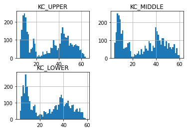
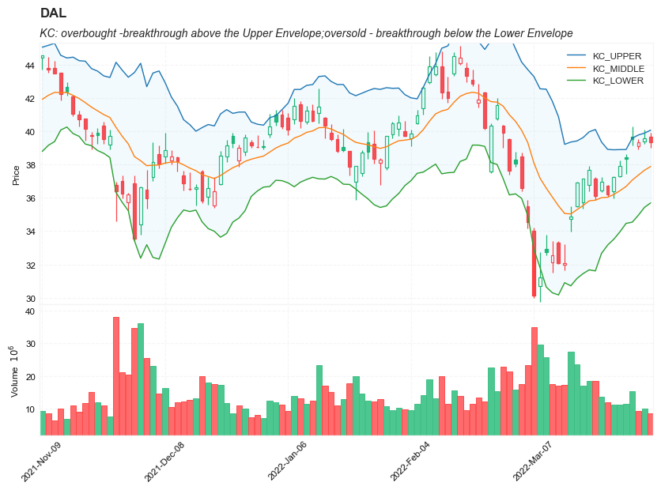
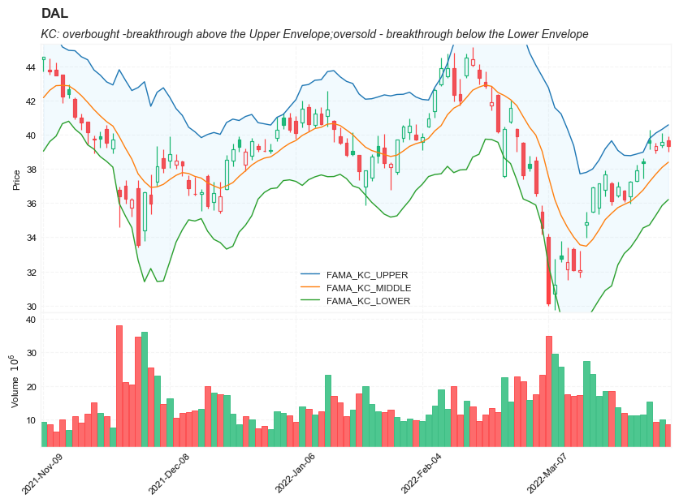

## Keltner Channels (KC)

**References**

- [tradingview: Keltner Channels (KC)](https://www.tradingview.com/support/solutions/43000502266-keltner-channels-kc/)
- [fidelity: Keltner Bands](https://www.fidelity.com/learning-center/trading-investing/technical-analysis/technical-indicator-guide/keltner-bands)


**Definition**


- The Keltner Channels (KC) indicator is a banded indicator similar to Bollinger Bands and Moving Average Envelopes. 
- They consist of an Upper Envelope above a Middle Line as well as a Lower Envelope below the Middle Line. 
    - The Middle Line is a moving average of price over a user-defined time period. Either a simple moving average or an exponential moving average are typically used. 
    - The Upper and Lower Envelopes are set a (user-defined multiple) of a range away from the Middle Line. This can be a multiple of the daily high/low range, or more commonly a multiple of the Average True Range.


**Calculation**

---

20 Period EMA with Envelopes using Average True Range and a multiplier of 2 as example:

- Basis = 20 Period EMA
- Upper Envelope = 20 Period EMA + (2 X ATR)
- Lower Envelope = 20 Period EMA - (2 X ATR)

---


**Read the indicator**


- The Keltner Channels (KC) indicator is a lagging indicator. 
- The main occurrences to look for when using Keltner Channels are breakthroughs above the Upper Envelope or below the Lower Envelope. A breakthrough above the Upper Envelope signifies overbought conditions. A breakthrough below the Lower Envelope signifies oversold conditions.
- Keep in mind however when using Keltner Channels, that overbought and oversold conditions are oftentimes a sign of strength. During a clearly defined trend, overbought and oversold conditions can signify strength. In this case, the current trend would strengthen and ultimately continue. It works a little bit different in a sideways market. When the market is trending sideways, overbought and oversold readings are frequently followed by price moving back towards the moving average (Middle Line).

- Trend Confirmation
    - during a clearly defined trend, breakthrough above or below the envelopes can be a sign of underlying strength of the trend.
    - During a Bullish Trend, a breakthrough above the upper envelope can be seen as a sign of strength and the uptrend is likely to continue.
    - During a Bearish Trend, a breakthrough below the lower envelope can be seen as a sign of strength and the downtrend is likely to continue.


- Overbought and Oversold
    - When a market is choppy or trading sideways, Keltner Channels can be useful for identifying overbought and oversold conditions. These conditions can typically lead to price corrections where price moves back towards the moving average (Middle Line).


In terms of trend identification and determining overbought and oversold levels, the Keltner Channels indicator does this effectively. 

While Keltner Channels can be used independently, it is best to use them with additional technical analysis tools. Historical analysis may also be helpful when trying to determine the correct parameters when setting up the indicator. Different securities may require a different multiplier to adjust the width of the bands or envelopes.

##### Load basic packages 


```python
import pandas as pd
import numpy as np
import os
import gc
import copy
from pathlib import Path
from datetime import datetime, timedelta, time, date
```


```python
#this package is to download equity price data from yahoo finance
#the source code of this package can be found here: https://github.com/ranaroussi/yfinance/blob/main
import yfinance as yf
```


```python
pd.options.display.max_rows = 100
pd.options.display.max_columns = 100

import warnings
warnings.filterwarnings("ignore")

import pytorch_lightning as pl
random_seed=1234
pl.seed_everything(random_seed)
```

    Global seed set to 1234
    


    1234


```python
#S&P 500 (^GSPC),  Dow Jones Industrial Average (^DJI), NASDAQ Composite (^IXIC)
#Russell 2000 (^RUT), Crude Oil Nov 21 (CL=F), Gold Dec 21 (GC=F)
#Treasury Yield 10 Years (^TNX)

#benchmark_tickers = ['^GSPC', '^DJI', '^IXIC', '^RUT',  'CL=F', 'GC=F', '^TNX']

benchmark_tickers = ['^GSPC']
tickers = benchmark_tickers + ['GSK', 'NVO', 'AROC', 'DAL']
```


```python
#https://github.com/ranaroussi/yfinance/blob/main/yfinance/base.py
#     def history(self, period="1mo", interval="1d",
#                 start=None, end=None, prepost=False, actions=True,
#                 auto_adjust=True, back_adjust=False,
#                 proxy=None, rounding=False, tz=None, timeout=None, **kwargs):

dfs = {}

for ticker in tickers:
    cur_data = yf.Ticker(ticker)
    hist = cur_data.history(period="max", start='2000-01-01')
    print(datetime.now(), ticker, hist.shape, hist.index.min(), hist.index.max())
    dfs[ticker] = hist
```

    2022-08-26 00:28:36.746272 ^GSPC (5700, 7) 1999-12-31 00:00:00 2022-08-25 00:00:00
    2022-08-26 00:28:37.078984 GSK (5700, 7) 1999-12-31 00:00:00 2022-08-25 00:00:00
    2022-08-26 00:28:37.360578 NVO (5700, 7) 1999-12-31 00:00:00 2022-08-25 00:00:00
    2022-08-26 00:28:37.649839 AROC (3781, 7) 2007-08-21 00:00:00 2022-08-25 00:00:00
    2022-08-26 00:28:37.954032 DAL (3857, 7) 2007-05-03 00:00:00 2022-08-25 00:00:00
    


```python
ticker = 'DAL'
dfs[ticker].tail(5)
```


<div>
<style scoped>
    .dataframe tbody tr th:only-of-type {
        vertical-align: middle;
    }

    .dataframe tbody tr th {
        vertical-align: top;
    }

    .dataframe thead th {
        text-align: right;
    }
</style>
<table border="1" class="dataframe">
  <thead>
    <tr style="text-align: right;">
      <th></th>
      <th>Open</th>
      <th>High</th>
      <th>Low</th>
      <th>Close</th>
      <th>Volume</th>
      <th>Dividends</th>
      <th>Stock Splits</th>
    </tr>
    <tr>
      <th>Date</th>
      <th></th>
      <th></th>
      <th></th>
      <th></th>
      <th></th>
      <th></th>
      <th></th>
    </tr>
  </thead>
  <tbody>
    <tr>
      <th>2022-08-19</th>
      <td>33.880001</td>
      <td>34.060001</td>
      <td>33.060001</td>
      <td>33.250000</td>
      <td>9860900</td>
      <td>0.0</td>
      <td>0</td>
    </tr>
    <tr>
      <th>2022-08-22</th>
      <td>32.500000</td>
      <td>32.500000</td>
      <td>31.850000</td>
      <td>32.380001</td>
      <td>9246500</td>
      <td>0.0</td>
      <td>0</td>
    </tr>
    <tr>
      <th>2022-08-23</th>
      <td>32.389999</td>
      <td>33.020000</td>
      <td>32.270000</td>
      <td>32.869999</td>
      <td>7974300</td>
      <td>0.0</td>
      <td>0</td>
    </tr>
    <tr>
      <th>2022-08-24</th>
      <td>32.880001</td>
      <td>33.410000</td>
      <td>32.669998</td>
      <td>33.310001</td>
      <td>5739500</td>
      <td>0.0</td>
      <td>0</td>
    </tr>
    <tr>
      <th>2022-08-25</th>
      <td>33.580002</td>
      <td>34.160000</td>
      <td>33.520699</td>
      <td>33.660000</td>
      <td>3562483</td>
      <td>0.0</td>
      <td>0</td>
    </tr>
  </tbody>
</table>
</div>


##### Define Keltner Channels (KC) calculation function


```python
#https://www.tradingview.com/support/solutions/43000501980-choppiness-index-chop/
def cal_tr(ohlc: pd.DataFrame) -> pd.Series:
    """True Range is the maximum of three price ranges.
    Most recent period's high minus the most recent period's low.
    Absolute value of the most recent period's high minus the previous close.
    Absolute value of the most recent period's low minus the previous close."""

    TR1 = pd.Series(ohlc["high"] - ohlc["low"]).abs()  # True Range = High less Low

    TR2 = pd.Series(
        ohlc["high"] - ohlc["close"].shift()
    ).abs()  # True Range = High less Previous Close

    TR3 = pd.Series(
        ohlc["close"].shift() - ohlc["low"]
    ).abs()  # True Range = Previous Close less Low

    _TR = pd.concat([TR1, TR2, TR3], axis=1)

    _TR["TR"] = _TR.max(axis=1)

    return pd.Series(_TR["TR"], name="TR")


def cal_atr(ohlc: pd.DataFrame, period: int = 14) -> pd.Series:
    """Average True Range is moving average of True Range."""

    TR = cal_tr(ohlc)
    return pd.Series(
        TR.rolling(center=False, window=period).mean(),
        name=f"ATR{period}",
    )
    


def cal_kc(
        ohlc: pd.DataFrame,
        period: int = 20,
        atr_period: int = 10,
        MA: pd.Series = None,
        kc_mult: float = 2,
    ) -> pd.DataFrame:
    
    """
    Keltner Channels (KC) are volatility-based envelopes set above and below an exponential moving average.
    This indicator is similar to Bollinger Bands, which use the standard deviation to set the bands.
    Instead of using the standard deviation, Keltner Channels use the Average True Range (ATR) to set channel distance.
    The channels are typically set two Average True Range values above and below the 20-day EMA.
    The exponential moving average dictates direction and the Average True Range sets channel width.
    Keltner Channels are a trend following indicator used to identify reversals with channel breakouts and channel direction.
    Channels can also be used to identify overbought and oversold levels when the trend is flat.
    """

    ohlc = ohlc.copy(deep=True)
    ohlc.columns = [c.lower() for c in ohlc.columns]
    
    
    if not isinstance(MA, pd.core.series.Series):
        middle = pd.Series(ohlc["close"].ewm(span=period).mean(), name="KC_MIDDLE")
    else:
        middle = pd.Series(MA, name="KC_MIDDLE")
    
    atr = cal_atr(ohlc, period=atr_period)
  
    up = pd.Series(middle + (kc_mult * atr), name="KC_UPPER")
    down = pd.Series( middle - (kc_mult * atr), name="KC_LOWER")

    return pd.concat([up, middle, down], axis=1)

```

##### Calculate Keltner Channels (KC)


```python
df = dfs[ticker][['Open', 'High', 'Low', 'Close', 'Volume']]
```


```python
df = df.round(2)
```


```python
cal_kc
```


    <function __main__.cal_kc(ohlc: pandas.core.frame.DataFrame, period: int = 20, atr_period: int = 10, MA: pandas.core.series.Series = None, kc_mult: float = 2) -> pandas.core.frame.DataFrame>


```python
df_ta = cal_kc(df, period=14, atr_period=5, kc_mult=2)
df = df.merge(df_ta, left_index = True, right_index = True, how='inner' )

del df_ta
gc.collect()
```


    122


```python
from core.finta import TA
```


```python
TA.MAMA
```


    <function core.finta.TA.MAMA(ohlc: pandas.core.frame.DataFrame, fast_limit: float = 0.5, slow_limit: float = 0.05, column: str = 'close') -> pandas.core.series.Series>


```python
df_ta = TA.MAMA(df, column='close')
df = df.merge(df_ta, left_index = True, right_index = True, how='inner' )

del df_ta
gc.collect()
```


    42


```python
df_ta = cal_kc(df, period=14, atr_period=5, MA=df['MAMA'],  kc_mult=2)
df_ta.columns = [f'MAMA_{c}' for c in df_ta.columns]
df = df.merge(df_ta, left_index = True, right_index = True, how='inner' )

df_ta = cal_kc(df, period=14, atr_period=5, MA=df['FAMA'],  kc_mult=2)
df_ta.columns = [f'FAMA_{c}' for c in df_ta.columns]
df = df.merge(df_ta, left_index = True, right_index = True, how='inner' )

del df_ta
gc.collect()
```


    0


```python
display(df.head(5))
display(df.tail(5))
```


<div>
<style scoped>
    .dataframe tbody tr th:only-of-type {
        vertical-align: middle;
    }

    .dataframe tbody tr th {
        vertical-align: top;
    }

    .dataframe thead th {
        text-align: right;
    }
</style>
<table border="1" class="dataframe">
  <thead>
    <tr style="text-align: right;">
      <th></th>
      <th>Open</th>
      <th>High</th>
      <th>Low</th>
      <th>Close</th>
      <th>Volume</th>
      <th>KC_UPPER</th>
      <th>KC_MIDDLE</th>
      <th>KC_LOWER</th>
      <th>MAMA</th>
      <th>FAMA</th>
      <th>MAMA_KC_UPPER</th>
      <th>MAMA_KC_MIDDLE</th>
      <th>MAMA_KC_LOWER</th>
      <th>FAMA_KC_UPPER</th>
      <th>FAMA_KC_MIDDLE</th>
      <th>FAMA_KC_LOWER</th>
    </tr>
    <tr>
      <th>Date</th>
      <th></th>
      <th></th>
      <th></th>
      <th></th>
      <th></th>
      <th></th>
      <th></th>
      <th></th>
      <th></th>
      <th></th>
      <th></th>
      <th></th>
      <th></th>
      <th></th>
      <th></th>
      <th></th>
    </tr>
  </thead>
  <tbody>
    <tr>
      <th>2007-05-03</th>
      <td>19.32</td>
      <td>19.50</td>
      <td>18.25</td>
      <td>18.40</td>
      <td>8052800</td>
      <td>NaN</td>
      <td>18.400000</td>
      <td>NaN</td>
      <td>18.40</td>
      <td>18.40</td>
      <td>NaN</td>
      <td>18.40</td>
      <td>NaN</td>
      <td>NaN</td>
      <td>18.40</td>
      <td>NaN</td>
    </tr>
    <tr>
      <th>2007-05-04</th>
      <td>18.88</td>
      <td>18.96</td>
      <td>18.39</td>
      <td>18.64</td>
      <td>5437300</td>
      <td>NaN</td>
      <td>18.528571</td>
      <td>NaN</td>
      <td>18.64</td>
      <td>18.64</td>
      <td>NaN</td>
      <td>18.64</td>
      <td>NaN</td>
      <td>NaN</td>
      <td>18.64</td>
      <td>NaN</td>
    </tr>
    <tr>
      <th>2007-05-07</th>
      <td>18.83</td>
      <td>18.91</td>
      <td>17.94</td>
      <td>18.08</td>
      <td>2646300</td>
      <td>NaN</td>
      <td>18.357216</td>
      <td>NaN</td>
      <td>18.08</td>
      <td>18.08</td>
      <td>NaN</td>
      <td>18.08</td>
      <td>NaN</td>
      <td>NaN</td>
      <td>18.08</td>
      <td>NaN</td>
    </tr>
    <tr>
      <th>2007-05-08</th>
      <td>17.76</td>
      <td>17.76</td>
      <td>17.14</td>
      <td>17.44</td>
      <td>4166100</td>
      <td>NaN</td>
      <td>18.076613</td>
      <td>NaN</td>
      <td>17.44</td>
      <td>17.44</td>
      <td>NaN</td>
      <td>17.44</td>
      <td>NaN</td>
      <td>NaN</td>
      <td>17.44</td>
      <td>NaN</td>
    </tr>
    <tr>
      <th>2007-05-09</th>
      <td>17.54</td>
      <td>17.94</td>
      <td>17.44</td>
      <td>17.58</td>
      <td>7541100</td>
      <td>19.639048</td>
      <td>17.947048</td>
      <td>16.255048</td>
      <td>17.58</td>
      <td>17.58</td>
      <td>19.272</td>
      <td>17.58</td>
      <td>15.888</td>
      <td>19.272</td>
      <td>17.58</td>
      <td>15.888</td>
    </tr>
  </tbody>
</table>
</div>


<div>
<style scoped>
    .dataframe tbody tr th:only-of-type {
        vertical-align: middle;
    }

    .dataframe tbody tr th {
        vertical-align: top;
    }

    .dataframe thead th {
        text-align: right;
    }
</style>
<table border="1" class="dataframe">
  <thead>
    <tr style="text-align: right;">
      <th></th>
      <th>Open</th>
      <th>High</th>
      <th>Low</th>
      <th>Close</th>
      <th>Volume</th>
      <th>KC_UPPER</th>
      <th>KC_MIDDLE</th>
      <th>KC_LOWER</th>
      <th>MAMA</th>
      <th>FAMA</th>
      <th>MAMA_KC_UPPER</th>
      <th>MAMA_KC_MIDDLE</th>
      <th>MAMA_KC_LOWER</th>
      <th>FAMA_KC_UPPER</th>
      <th>FAMA_KC_MIDDLE</th>
      <th>FAMA_KC_LOWER</th>
    </tr>
    <tr>
      <th>Date</th>
      <th></th>
      <th></th>
      <th></th>
      <th></th>
      <th></th>
      <th></th>
      <th></th>
      <th></th>
      <th></th>
      <th></th>
      <th></th>
      <th></th>
      <th></th>
      <th></th>
      <th></th>
      <th></th>
    </tr>
  </thead>
  <tbody>
    <tr>
      <th>2022-08-19</th>
      <td>33.88</td>
      <td>34.06</td>
      <td>33.06</td>
      <td>33.25</td>
      <td>9860900</td>
      <td>35.871887</td>
      <td>33.723887</td>
      <td>31.575887</td>
      <td>33.933994</td>
      <td>34.197449</td>
      <td>36.081994</td>
      <td>33.933994</td>
      <td>31.785994</td>
      <td>36.345449</td>
      <td>34.197449</td>
      <td>32.049449</td>
    </tr>
    <tr>
      <th>2022-08-22</th>
      <td>32.50</td>
      <td>32.50</td>
      <td>31.85</td>
      <td>32.38</td>
      <td>9246500</td>
      <td>35.852702</td>
      <td>33.544702</td>
      <td>31.236702</td>
      <td>33.156997</td>
      <td>33.937336</td>
      <td>35.464997</td>
      <td>33.156997</td>
      <td>30.848997</td>
      <td>36.245336</td>
      <td>33.937336</td>
      <td>31.629336</td>
    </tr>
    <tr>
      <th>2022-08-23</th>
      <td>32.39</td>
      <td>33.02</td>
      <td>32.27</td>
      <td>32.87</td>
      <td>7974300</td>
      <td>35.630742</td>
      <td>33.454742</td>
      <td>31.278742</td>
      <td>33.058943</td>
      <td>33.787283</td>
      <td>35.234943</td>
      <td>33.058943</td>
      <td>30.882943</td>
      <td>35.963283</td>
      <td>33.787283</td>
      <td>31.611283</td>
    </tr>
    <tr>
      <th>2022-08-24</th>
      <td>32.88</td>
      <td>33.41</td>
      <td>32.67</td>
      <td>33.31</td>
      <td>5739500</td>
      <td>35.395443</td>
      <td>33.435443</td>
      <td>31.475443</td>
      <td>33.184472</td>
      <td>33.636580</td>
      <td>35.144472</td>
      <td>33.184472</td>
      <td>31.224472</td>
      <td>35.596580</td>
      <td>33.636580</td>
      <td>31.676580</td>
    </tr>
    <tr>
      <th>2022-08-25</th>
      <td>33.58</td>
      <td>34.16</td>
      <td>33.52</td>
      <td>33.66</td>
      <td>3562483</td>
      <td>35.533384</td>
      <td>33.465384</td>
      <td>31.397384</td>
      <td>33.422236</td>
      <td>33.582994</td>
      <td>35.490236</td>
      <td>33.422236</td>
      <td>31.354236</td>
      <td>35.650994</td>
      <td>33.582994</td>
      <td>31.514994</td>
    </tr>
  </tbody>
</table>
</div>


```python
df[['KC_UPPER', 'KC_MIDDLE' , 'KC_LOWER']].hist(bins=50)
```


    array([[<AxesSubplot:title={'center':'KC_UPPER'}>,
            <AxesSubplot:title={'center':'KC_MIDDLE'}>],
           [<AxesSubplot:title={'center':'KC_LOWER'}>, <AxesSubplot:>]],
          dtype=object)


    

    


```python
#https://github.com/matplotlib/mplfinance
#this package help visualize financial data
import mplfinance as mpf
import matplotlib.colors as mcolors

# all_colors = list(mcolors.CSS4_COLORS.keys())#"CSS Colors"
# all_colors = list(mcolors.TABLEAU_COLORS.keys()) # "Tableau Palette",
# all_colors = list(mcolors.BASE_COLORS.keys()) #"Base Colors",
all_colors = ['dodgerblue', 'firebrick','limegreen','skyblue','lightgreen',  'navy','yellow','plum',  'yellowgreen']
#https://github.com/matplotlib/mplfinance/issues/181#issuecomment-667252575
#list of colors: https://matplotlib.org/stable/gallery/color/named_colors.html
#https://github.com/matplotlib/mplfinance/blob/master/examples/styles.ipynb

def make_3panels2(main_data, add_data, mid_panel=None, chart_type='candle', names=None, figratio=(14,9)):
    """
    main chart type: default is candle. alternatives: ohlc, line

    example:
    start = 200

    names = {'main_title': 'MAMA: MESA Adaptive Moving Average', 
             'sub_tile': 'S&P 500 (^GSPC)', 'y_tiles': ['price', 'Volume [$10^{6}$]']}


    make_candle(df.iloc[-start:, :5], df.iloc[-start:][['MAMA', 'FAMA']], names = names)
    
    """

    style = mpf.make_mpf_style(base_mpf_style='yahoo',  #charles
                               base_mpl_style = 'seaborn-whitegrid',
#                                marketcolors=mpf.make_marketcolors(up="r", down="#0000CC",inherit=True),
                               gridcolor="whitesmoke", 
                               gridstyle="--", #or None, or - for solid
                               gridaxis="both", 
                               edgecolor = 'whitesmoke',
                               facecolor = 'white', #background color within the graph edge
                               figcolor = 'white', #background color outside of the graph edge
                               y_on_right = False,
                               rc =  {'legend.fontsize': 'small',#or number
                                      #'figure.figsize': (14, 9),
                                     'axes.labelsize': 'small',
                                     'axes.titlesize':'small',
                                     'xtick.labelsize':'small',#'x-small', 'small','medium','large'
                                     'ytick.labelsize':'small'
                                     }, 
                              )   

    if (chart_type is None) or (chart_type not in ['ohlc', 'line', 'candle', 'hollow_and_filled']):
        chart_type = 'candle'
    len_dict = {'candle':2, 'ohlc':3, 'line':1, 'hollow_and_filled':2}    
        
    kwargs = dict(type=chart_type, figratio=figratio, volume=True, volume_panel=1, 
                  panel_ratios=(4,2), tight_layout=True, style=style, returnfig=True)
    
    if names is None:
        names = {'main_title': '', 'sub_tile': ''}
    


    added_plots = { }
    for name_, data_ in add_data.iteritems():
        added_plots[name_] = mpf.make_addplot(data_, panel=0, width=1, secondary_y=False)
    
    fb_bbands_ = dict(y1=add_data.iloc[:, 0].values,
                      y2=add_data.iloc[:, 2].values,color="lightskyblue",alpha=0.1,interpolate=True)
    fb_bbands_['panel'] = 0
    

    fb_bbands= [fb_bbands_]
    
    
    if mid_panel is not None:
        i = 0
        for name_, data_ in mid_panel.iteritems():
            added_plots[name_] = mpf.make_addplot(data_, panel=1, color=all_colors[i])
            i = i + 1
        fb_bbands2_ = dict(y1=np.zeros(mid_panel.shape[0]),
                      y2=0.8+np.zeros(mid_panel.shape[0]),color="lightskyblue",alpha=0.1,interpolate=True)
        fb_bbands2_['panel'] = 1
        fb_bbands.append(fb_bbands2_)


    fig, axes = mpf.plot(main_data,  **kwargs,
                         addplot=list(added_plots.values()), 
                         fill_between=fb_bbands)
    # add a new suptitle
    fig.suptitle(names['main_title'], y=1.05, fontsize=12, x=0.1285)

    axes[0].legend([None]*5)
    handles = axes[0].get_legend().legendHandles
    axes[0].legend(handles=handles[2:],labels=list(added_plots.keys()))
    axes[0].set_title(names['sub_tile'], fontsize=10, style='italic',  loc='left')
    

#     axes[0].set_ylabel(names['y_tiles'][0])
#     axes[2].set_ylabel(names['y_tiles'][1])
    return fig, axes
   
```


```python

start = -200
end = -100#df.shape[0]

names = {'main_title': f'{ticker}', 
         'sub_tile': 'KC: overbought -breakthrough above the Upper Envelope;oversold - breakthrough below the Lower Envelope'}


aa_, bb_ = make_3panels2(df.iloc[start:end][['Open', 'High', 'Low', 'Close', 'Volume']], 
            df.iloc[start:end][['KC_UPPER', 'KC_MIDDLE','KC_LOWER']],
             chart_type='hollow_and_filled',names = names)
```


    

    


```python

start = -200
end = -100#df.shape[0]

names = {'main_title': f'{ticker}', 
         'sub_tile': 'KC: overbought -breakthrough above the Upper Envelope;oversold - breakthrough below the Lower Envelope'}


aa_, bb_ = make_3panels2(df.iloc[start:end][['Open', 'High', 'Low', 'Close', 'Volume']], 
            df.iloc[start:end][['MAMA_KC_UPPER', 'MAMA_KC_MIDDLE','MAMA_KC_LOWER']],
             chart_type='hollow_and_filled',names = names)
```


    

    


```python

start = -200
end = -100#df.shape[0]

names = {'main_title': f'{ticker}', 
         'sub_tile': 'KC: overbought -breakthrough above the Upper Envelope;oversold - breakthrough below the Lower Envelope'}


aa_, bb_ = make_3panels2(df.iloc[start:end][['Open', 'High', 'Low', 'Close', 'Volume']], 
            df.iloc[start:end][['FAMA_KC_UPPER', 'FAMA_KC_MIDDLE', 'FAMA_KC_LOWER']],
             chart_type='hollow_and_filled',names = names)
```


    

    

