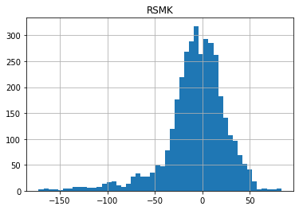
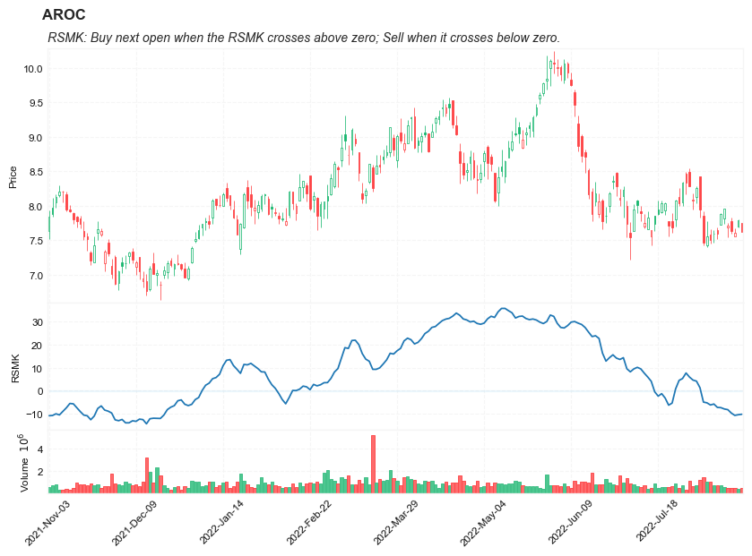

## RSMK

**References**

- [traders.com: TradersTips 2020-03](https://traders.com/Documentation/FEEDbk_docs/2020/03/TradersTips.html)

    
**Definition**

In “Using Relative Strength To Outperform The Market” in this issue, author Markos Katsanos presents a trading system based on a new relative strength indicator he calls RSMK. The indicator improves on the traditional relative strength indicator by separating periods of strong or weak relative strength.


**Calculation**

---

`RSMK = Mul2( ExpAvg( Momentum( Ln( Divide( Close, S&P500 Close) ), 90), 3), 100)`

- Mul2: multiply
- ExpAvg: Exponential moving average
- Momentum: Xt - Xt-n, day t value minus the value on t-n
- Ln: natual log

---

**Read the indicator**

	
RSMK can be put to use in both entries and different kinds of exits:

- Entry
    - Buy next open when the RSMK crosses above zero
- Exit
    - Sell when the RSMK falls by a certain amount of indicator points (20) off its 20-day high
    - Sell when the indicator crosses below its 20-day exponential moving average
    - Sell when it crosses below zero.


##### Load basic packages 


```python
import pandas as pd
import numpy as np
import os
import gc
import copy
from pathlib import Path
from datetime import datetime, timedelta, time, date
```


```python
#this package is to download equity price data from yahoo finance
#the source code of this package can be found here: https://github.com/ranaroussi/yfinance/blob/main
import yfinance as yf
```


```python
pd.options.display.max_rows = 100
pd.options.display.max_columns = 100

import warnings
warnings.filterwarnings("ignore")

import pytorch_lightning as pl
random_seed=1234
pl.seed_everything(random_seed)
```

    Global seed set to 1234
    


    1234


```python
#S&P 500 (^GSPC),  Dow Jones Industrial Average (^DJI), NASDAQ Composite (^IXIC)
#Russell 2000 (^RUT), Crude Oil Nov 21 (CL=F), Gold Dec 21 (GC=F)
#Treasury Yield 10 Years (^TNX)

#benchmark_tickers = ['^GSPC', '^DJI', '^IXIC', '^RUT',  'CL=F', 'GC=F', '^TNX']

benchmark_tickers = ['^GSPC']
tickers = benchmark_tickers + ['GSK', 'NVO', 'AROC']
```


```python
#https://github.com/ranaroussi/yfinance/blob/main/yfinance/base.py
#     def history(self, period="1mo", interval="1d",
#                 start=None, end=None, prepost=False, actions=True,
#                 auto_adjust=True, back_adjust=False,
#                 proxy=None, rounding=False, tz=None, timeout=None, **kwargs):

dfs = {}

for ticker in tickers:
    cur_data = yf.Ticker(ticker)
    hist = cur_data.history(period="max", start='2000-01-01')
    print(datetime.now(), ticker, hist.shape, hist.index.min(), hist.index.max())
    dfs[ticker] = hist
```

    2022-08-20 20:12:53.208007 ^GSPC (5696, 7) 1999-12-31 00:00:00 2022-08-19 00:00:00
    2022-08-20 20:12:53.630098 GSK (5696, 7) 1999-12-31 00:00:00 2022-08-19 00:00:00
    2022-08-20 20:12:54.050280 NVO (5696, 7) 1999-12-31 00:00:00 2022-08-19 00:00:00
    2022-08-20 20:12:54.373812 AROC (3777, 7) 2007-08-21 00:00:00 2022-08-19 00:00:00
    


```python
ticker = 'AROC'
ref_ticker = '^GSPC'
dfs[ticker].tail(5)
```


<div>
<style scoped>
    .dataframe tbody tr th:only-of-type {
        vertical-align: middle;
    }

    .dataframe tbody tr th {
        vertical-align: top;
    }

    .dataframe thead th {
        text-align: right;
    }
</style>
<table border="1" class="dataframe">
  <thead>
    <tr style="text-align: right;">
      <th></th>
      <th>Open</th>
      <th>High</th>
      <th>Low</th>
      <th>Close</th>
      <th>Volume</th>
      <th>Dividends</th>
      <th>Stock Splits</th>
    </tr>
    <tr>
      <th>Date</th>
      <th></th>
      <th></th>
      <th></th>
      <th></th>
      <th></th>
      <th></th>
      <th></th>
    </tr>
  </thead>
  <tbody>
    <tr>
      <th>2022-08-15</th>
      <td>7.69</td>
      <td>7.75</td>
      <td>7.54</td>
      <td>7.71</td>
      <td>589800</td>
      <td>0.0</td>
      <td>0</td>
    </tr>
    <tr>
      <th>2022-08-16</th>
      <td>7.77</td>
      <td>7.83</td>
      <td>7.60</td>
      <td>7.63</td>
      <td>543400</td>
      <td>0.0</td>
      <td>0</td>
    </tr>
    <tr>
      <th>2022-08-17</th>
      <td>7.56</td>
      <td>7.67</td>
      <td>7.56</td>
      <td>7.61</td>
      <td>527500</td>
      <td>0.0</td>
      <td>0</td>
    </tr>
    <tr>
      <th>2022-08-18</th>
      <td>7.70</td>
      <td>7.80</td>
      <td>7.68</td>
      <td>7.79</td>
      <td>457700</td>
      <td>0.0</td>
      <td>0</td>
    </tr>
    <tr>
      <th>2022-08-19</th>
      <td>7.75</td>
      <td>7.75</td>
      <td>7.62</td>
      <td>7.62</td>
      <td>569100</td>
      <td>0.0</td>
      <td>0</td>
    </tr>
  </tbody>
</table>
</div>


##### Define RSMK calculation function


```python
#https://github.com/peerchemist/finta/blob/af01fa594995de78f5ada5c336e61cd87c46b151/finta/finta.py


def cal_rsmk(ohlc: pd.DataFrame, 
             rsmk_period: int = 90, ema_period: int = 3, 
             column: str = "close", ref_column: str = "ref_close") -> pd.Series:
    """
    RSMK
    reference: https://traders.com/Documentation/FEEDbk_docs/2020/03/TradersTips.html
    RSMK: Mul2( ExpAvg( Momentum( Ln( Divide( Close, S&P500 Close) ), 90), 3), 100)
    
    """
    rs = ohlc[column]/ohlc[ref_column]
    rs1 = np.log(rs)
    mom_ = pd.Series(data = rs1, index=ohlc.index).diff(rsmk_period)
    ema_mom_ = mom_.ewm(span=ema_period).mean()
    
    return pd.Series(data=100*ema_mom_, name=f"RSMK")
```

##### Calculate RSMK


```python
df = dfs[ticker][['Open', 'High', 'Low', 'Close', 'Volume']]
df_ref = dfs[ref_ticker][['Open', 'High', 'Low', 'Close', 'Volume']]
df_ref.columns = [f'ref_{c}' for c in df_ref.columns]
```


```python
col='Close'
df = df.merge(df_ref[[f'ref_{col}']], left_index=True, right_index=True, how='left')
df.isna().sum()
```


    Open         0
    High         0
    Low          0
    Close        0
    Volume       0
    ref_Close    0
    dtype: int64


```python
df = df.round(2)
```


```python
cal_rsmk
```


    <function __main__.cal_rsmk(ohlc: pandas.core.frame.DataFrame, rsmk_period: int = 90, ema_period: int = 3, column: str = 'close', ref_column: str = 'ref_close') -> pandas.core.series.Series>


```python
df_ta = cal_rsmk(df, rsmk_period = 90, ema_period = 3, column = col, ref_column = f'ref_{col}')
df = df.merge(df_ta, left_index = True, right_index = True, how='inner' )

del df_ta
gc.collect()
```


    106


```python
display(df.head(5))
display(df.tail(5))
```


<div>
<style scoped>
    .dataframe tbody tr th:only-of-type {
        vertical-align: middle;
    }

    .dataframe tbody tr th {
        vertical-align: top;
    }

    .dataframe thead th {
        text-align: right;
    }
</style>
<table border="1" class="dataframe">
  <thead>
    <tr style="text-align: right;">
      <th></th>
      <th>Open</th>
      <th>High</th>
      <th>Low</th>
      <th>Close</th>
      <th>Volume</th>
      <th>ref_Close</th>
      <th>RSMK</th>
    </tr>
    <tr>
      <th>Date</th>
      <th></th>
      <th></th>
      <th></th>
      <th></th>
      <th></th>
      <th></th>
      <th></th>
    </tr>
  </thead>
  <tbody>
    <tr>
      <th>2007-08-21</th>
      <td>50.01</td>
      <td>50.86</td>
      <td>49.13</td>
      <td>49.44</td>
      <td>1029100</td>
      <td>1447.12</td>
      <td>NaN</td>
    </tr>
    <tr>
      <th>2007-08-22</th>
      <td>48.50</td>
      <td>50.70</td>
      <td>47.78</td>
      <td>49.29</td>
      <td>996500</td>
      <td>1464.07</td>
      <td>NaN</td>
    </tr>
    <tr>
      <th>2007-08-23</th>
      <td>49.76</td>
      <td>49.82</td>
      <td>47.56</td>
      <td>48.03</td>
      <td>742700</td>
      <td>1462.50</td>
      <td>NaN</td>
    </tr>
    <tr>
      <th>2007-08-24</th>
      <td>47.93</td>
      <td>48.77</td>
      <td>47.87</td>
      <td>48.58</td>
      <td>416000</td>
      <td>1479.37</td>
      <td>NaN</td>
    </tr>
    <tr>
      <th>2007-08-27</th>
      <td>48.56</td>
      <td>48.81</td>
      <td>46.85</td>
      <td>47.47</td>
      <td>447000</td>
      <td>1466.79</td>
      <td>NaN</td>
    </tr>
  </tbody>
</table>
</div>


<div>
<style scoped>
    .dataframe tbody tr th:only-of-type {
        vertical-align: middle;
    }

    .dataframe tbody tr th {
        vertical-align: top;
    }

    .dataframe thead th {
        text-align: right;
    }
</style>
<table border="1" class="dataframe">
  <thead>
    <tr style="text-align: right;">
      <th></th>
      <th>Open</th>
      <th>High</th>
      <th>Low</th>
      <th>Close</th>
      <th>Volume</th>
      <th>ref_Close</th>
      <th>RSMK</th>
    </tr>
    <tr>
      <th>Date</th>
      <th></th>
      <th></th>
      <th></th>
      <th></th>
      <th></th>
      <th></th>
      <th></th>
    </tr>
  </thead>
  <tbody>
    <tr>
      <th>2022-08-15</th>
      <td>7.69</td>
      <td>7.75</td>
      <td>7.54</td>
      <td>7.71</td>
      <td>589800</td>
      <td>4297.14</td>
      <td>-8.214588</td>
    </tr>
    <tr>
      <th>2022-08-16</th>
      <td>7.77</td>
      <td>7.83</td>
      <td>7.60</td>
      <td>7.63</td>
      <td>543400</td>
      <td>4305.20</td>
      <td>-9.690174</td>
    </tr>
    <tr>
      <th>2022-08-17</th>
      <td>7.56</td>
      <td>7.67</td>
      <td>7.56</td>
      <td>7.61</td>
      <td>527500</td>
      <td>4274.04</td>
      <td>-10.710454</td>
    </tr>
    <tr>
      <th>2022-08-18</th>
      <td>7.70</td>
      <td>7.80</td>
      <td>7.68</td>
      <td>7.79</td>
      <td>457700</td>
      <td>4283.74</td>
      <td>-10.408648</td>
    </tr>
    <tr>
      <th>2022-08-19</th>
      <td>7.75</td>
      <td>7.75</td>
      <td>7.62</td>
      <td>7.62</td>
      <td>569100</td>
      <td>4228.48</td>
      <td>-10.215959</td>
    </tr>
  </tbody>
</table>
</div>


```python
df[['RSMK']].hist(bins=50)
```


    array([[<AxesSubplot:title={'center':'RSMK'}>]], dtype=object)


    

    


```python
#https://github.com/matplotlib/mplfinance
#this package help visualize financial data
import mplfinance as mpf
import matplotlib.colors as mcolors

# all_colors = list(mcolors.CSS4_COLORS.keys())#"CSS Colors"
all_colors = list(mcolors.TABLEAU_COLORS.keys()) # "Tableau Palette",
# all_colors = list(mcolors.BASE_COLORS.keys()) #"Base Colors",


#https://github.com/matplotlib/mplfinance/issues/181#issuecomment-667252575
#list of colors: https://matplotlib.org/stable/gallery/color/named_colors.html
#https://github.com/matplotlib/mplfinance/blob/master/examples/styles.ipynb

def make_3panels2(main_data, mid_panel, chart_type='candle', names=None, 
                  figratio=(14,9), fill_weights = (0, 0)):
    """
    main chart type: default is candle. alternatives: ohlc, line

    example:
    start = 200

    names = {'main_title': 'MAMA: MESA Adaptive Moving Average', 
             'sub_tile': 'S&P 500 (^GSPC)', 'y_tiles': ['price', 'Volume [$10^{6}$]']}


    make_candle(df.iloc[-start:, :5], df.iloc[-start:][['MAMA', 'FAMA']], names = names)
    
    """

    style = mpf.make_mpf_style(base_mpf_style='yahoo',  #charles
                               base_mpl_style = 'seaborn-whitegrid',
#                                marketcolors=mpf.make_marketcolors(up="r", down="#0000CC",inherit=True),
                               gridcolor="whitesmoke", 
                               gridstyle="--", #or None, or - for solid
                               gridaxis="both", 
                               edgecolor = 'whitesmoke',
                               facecolor = 'white', #background color within the graph edge
                               figcolor = 'white', #background color outside of the graph edge
                               y_on_right = False,
                               rc =  {'legend.fontsize': 'small',#or number
                                      #'figure.figsize': (14, 9),
                                     'axes.labelsize': 'small',
                                     'axes.titlesize':'small',
                                     'xtick.labelsize':'small',#'x-small', 'small','medium','large'
                                     'ytick.labelsize':'small'
                                     }, 
                              )   

    if (chart_type is None) or (chart_type not in ['ohlc', 'line', 'candle', 'hollow_and_filled']):
        chart_type = 'candle'
    len_dict = {'candle':2, 'ohlc':3, 'line':1, 'hollow_and_filled':2}    
        
    kwargs = dict(type=chart_type, figratio=figratio, volume=True, volume_panel=2, 
                  panel_ratios=(4,2,1), tight_layout=True, style=style, returnfig=True)
    
    if names is None:
        names = {'main_title': '', 'sub_tile': ''}
    


    added_plots = { }
  
    fb_bbands2_ = dict(y1=fill_weights[0]*np.ones(mid_panel.shape[0]),
                      y2=fill_weights[1]*np.ones(mid_panel.shape[0]),color="lightskyblue",alpha=0.1,interpolate=True)
    fb_bbands2_['panel'] = 1

    fb_bbands= [fb_bbands2_]
    
    
    i = 0
    for name_, data_ in mid_panel.iteritems():
        added_plots[name_] = mpf.make_addplot(data_, panel=1, color=all_colors[i])
        i = i + 1
    

    fig, axes = mpf.plot(main_data,  **kwargs,
                         addplot=list(added_plots.values()), 
                         fill_between=fb_bbands)
    # add a new suptitle
    fig.suptitle(names['main_title'], y=1.05, fontsize=12, x=0.1285)

    axes[0].set_title(names['sub_tile'], fontsize=10, style='italic',  loc='left')
    axes[2].set_ylabel('RSMK')

#     axes[0].set_ylabel(names['y_tiles'][0])
#     axes[2].set_ylabel(names['y_tiles'][1])
    return fig, axes
   
```


```python

start = -200
end = df.shape[0]

names = {'main_title': f'{ticker}', 
         'sub_tile': 'RSMK: Buy next open when the RSMK crosses above zero; Sell when it crosses below zero.'}


aa_, bb_ = make_3panels2(df.iloc[start:end][['Open', 'High', 'Low', 'Close', 'Volume']], 
             df.iloc[start:end][['RSMK']], 
             chart_type='hollow_and_filled',names = names, 
                         fill_weights = (-0.1, 0.1))
```


    

    

