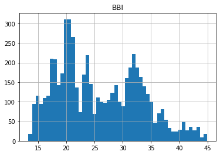
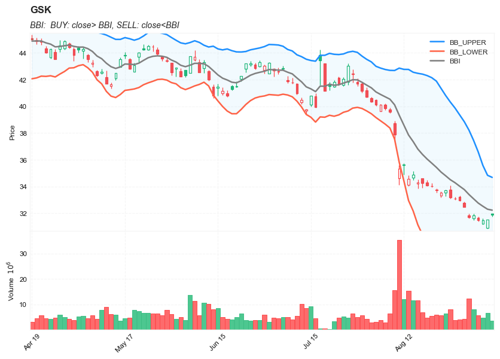

## BBI

**References**

- [tradingview: BBI-Bollinger-Bands](https://www.tradingview.com/script/hKQvERLU-BBI-Bollinger-Bands/)
- [MyTT](https://github.com/mpquant/MyTT/blob/ea4f14857ecc46a3739a75ce2e6974b9057a6102/MyTT.py)


**Definition**

BBI (Bull and Bear Index) is an indicator aims on measuring the general short/mid-term (< 1 month) trend and sentiment of the stock/market. It used an average of 4 SMAs (3, 6, 12, 24) as a cut-off of a bullish / bearish trend . 

BBI Bollinger Bands uses BBI as "basis" and calculates variations (Stdev) of BBI during the past several days. In general, BBI Boll band is more volatile than the traditional Boll Band.


**Read the indicator**

- BUY: close> BBI 
- SELL: close < BBI

##### Load basic packages 


```python
import pandas as pd
import numpy as np
import os
import gc
import copy
from pathlib import Path
from datetime import datetime, timedelta, time, date
```


```python
#this package is to download equity price data from yahoo finance
#the source code of this package can be found here: https://github.com/ranaroussi/yfinance/blob/main
import yfinance as yf
```


```python
pd.options.display.max_rows = 100
pd.options.display.max_columns = 100

import warnings
warnings.filterwarnings("ignore")

import pytorch_lightning as pl
random_seed=1234
pl.seed_everything(random_seed)
```

    Global seed set to 1234
    


    1234


```python
#S&P 500 (^GSPC),  Dow Jones Industrial Average (^DJI), NASDAQ Composite (^IXIC)
#Russell 2000 (^RUT), Crude Oil Nov 21 (CL=F), Gold Dec 21 (GC=F)
#Treasury Yield 10 Years (^TNX)

#benchmark_tickers = ['^GSPC', '^DJI', '^IXIC', '^RUT',  'CL=F', 'GC=F', '^TNX']

benchmark_tickers = ['^GSPC']
tickers = benchmark_tickers + ['GSK', 'NVO', 'AROC']
```


```python
#https://github.com/ranaroussi/yfinance/blob/main/yfinance/base.py
#     def history(self, period="1mo", interval="1d",
#                 start=None, end=None, prepost=False, actions=True,
#                 auto_adjust=True, back_adjust=False,
#                 proxy=None, rounding=False, tz=None, timeout=None, **kwargs):

dfs = {}

for ticker in tickers:
    cur_data = yf.Ticker(ticker)
    hist = cur_data.history(period="max", start='2000-01-01')
    print(datetime.now(), ticker, hist.shape, hist.index.min(), hist.index.max())
    dfs[ticker] = hist
```

    2022-09-10 21:34:31.097535 ^GSPC (5710, 7) 1999-12-31 00:00:00 2022-09-09 00:00:00
    2022-09-10 21:34:31.431293 GSK (5710, 7) 1999-12-31 00:00:00 2022-09-09 00:00:00
    2022-09-10 21:34:31.831783 NVO (5710, 7) 1999-12-31 00:00:00 2022-09-09 00:00:00
    2022-09-10 21:34:32.114387 AROC (3791, 7) 2007-08-21 00:00:00 2022-09-09 00:00:00
    


```python
ticker = 'GSK'
dfs[ticker].tail(5)
```


<div>
<style scoped>
    .dataframe tbody tr th:only-of-type {
        vertical-align: middle;
    }

    .dataframe tbody tr th {
        vertical-align: top;
    }

    .dataframe thead th {
        text-align: right;
    }
</style>
<table border="1" class="dataframe">
  <thead>
    <tr style="text-align: right;">
      <th></th>
      <th>Open</th>
      <th>High</th>
      <th>Low</th>
      <th>Close</th>
      <th>Volume</th>
      <th>Dividends</th>
      <th>Stock Splits</th>
    </tr>
    <tr>
      <th>Date</th>
      <th></th>
      <th></th>
      <th></th>
      <th></th>
      <th></th>
      <th></th>
      <th></th>
    </tr>
  </thead>
  <tbody>
    <tr>
      <th>2022-09-02</th>
      <td>31.600000</td>
      <td>31.969999</td>
      <td>31.469999</td>
      <td>31.850000</td>
      <td>8152600</td>
      <td>0.0</td>
      <td>0.0</td>
    </tr>
    <tr>
      <th>2022-09-06</th>
      <td>31.650000</td>
      <td>31.760000</td>
      <td>31.370001</td>
      <td>31.469999</td>
      <td>5613900</td>
      <td>0.0</td>
      <td>0.0</td>
    </tr>
    <tr>
      <th>2022-09-07</th>
      <td>31.209999</td>
      <td>31.590000</td>
      <td>31.160000</td>
      <td>31.490000</td>
      <td>4822000</td>
      <td>0.0</td>
      <td>0.0</td>
    </tr>
    <tr>
      <th>2022-09-08</th>
      <td>30.910000</td>
      <td>31.540001</td>
      <td>30.830000</td>
      <td>31.510000</td>
      <td>6620900</td>
      <td>0.0</td>
      <td>0.0</td>
    </tr>
    <tr>
      <th>2022-09-09</th>
      <td>31.950001</td>
      <td>31.969999</td>
      <td>31.730000</td>
      <td>31.889999</td>
      <td>3556800</td>
      <td>0.0</td>
      <td>0.0</td>
    </tr>
  </tbody>
</table>
</div>


##### Define BBI calculation function

    def BBI(CLOSE,M1=3,M2=6,M3=12,M4=20):             #BBI多空指标   
        return (MA(CLOSE,M1)+MA(CLOSE,M2)+MA(CLOSE,M3)+MA(CLOSE,M4))/4    
        


```python
def cal_bbi(ohlc: pd.DataFrame, 
            m1_period: int = 3,
            m2_period: int = 6,
            m3_period: int = 12,
            m4_period: int = 20,
            column: str = "close") -> pd.Series:
    """
    BBI (Bull and Bear Index) is an indicator aims on measuring the general short/mid-term (< 1 month) trend 
    and sentiment of the stock/market. 
    It used an average of 4 SMAs (3, 6, 12, 24) as a cut-off of a bullish / bearish trend .
    
    BUY: close> BBI 
    SELL: close<BBI
    """
    
    
    c = ohlc[column]
    m1 = c.rolling(m1_period).mean()
    m2 = c.rolling(m2_period).mean()
    m3 = c.rolling(m3_period).mean()
    m4 = c.rolling(m4_period).mean()

    return pd.Series((m1+m2+m3+m4)/4, name='BBI')
```

##### Calculate BBI


```python
df = dfs[ticker][['Open', 'High', 'Low', 'Close', 'Volume']]
```


```python
df = df.round(2)
```


```python
help(cal_bbi)
```

    Help on function cal_bbi in module __main__:
    
    cal_bbi(ohlc: pandas.core.frame.DataFrame, m1_period: int = 3, m2_period: int = 6, m3_period: int = 12, m4_period: int = 20, column: str = 'close') -> pandas.core.series.Series
        BBI (Bull and Bear Index) is an indicator aims on measuring the general short/mid-term (< 1 month) trend 
        and sentiment of the stock/market. 
        It used an average of 4 SMAs (3, 6, 12, 24) as a cut-off of a bullish / bearish trend .
        
        BUY: close> BBI 
        SELL: close<BBI
    
    


```python
df_ta = cal_bbi(df, column="Close")
df = df.merge(df_ta, left_index = True, right_index = True, how='inner' )

del df_ta
gc.collect()
```


    80


```python
from core.finta import TA
```


```python
help(TA.BBANDS)
```

    Help on function BBANDS in module core.finta:
    
    BBANDS(ohlc: pandas.core.frame.DataFrame, period: int = 20, MA: pandas.core.series.Series = None, column: str = 'close', std_multiplier: float = 2) -> pandas.core.frame.DataFrame
         Developed by John Bollinger, Bollinger Bands® are volatility bands placed above and below a moving average.
         Volatility is based on the standard deviation, which changes as volatility increases and decreases.
         The bands automatically widen when volatility increases and narrow when volatility decreases.
        
         This method allows input of some other form of moving average like EMA or KAMA around which BBAND will be formed.
         Pass desired moving average as <MA> argument. For example BBANDS(MA=TA.KAMA(20)).
         
         "MOBO bands are based on a zone of 0.80 standard deviation with a 10 period look-back"
        If the price breaks out of the MOBO band it can signify a trend move or price spike
        Contains 42% of price movements(noise) within bands.
        
        edit on 2022-09-09: remove MOBO function; add BBWIDTH and PERCENT_B to output
    
    


```python
df_ta = TA.BBANDS(df, MA=df['BBI'], period = 20, column="close", std_multiplier=1.95)
df = df.merge(df_ta, left_index = True, right_index = True, how='inner' )

del df_ta
gc.collect()
```


    21


```python
#     BUY: close> BBI 
#     SELL: close<BBI

df['B'] = (df["BBI"]<df["Close"]).astype(int)*(df['High']+df['Low'])/2
df['S'] = (df["BBI"]>df["Close"]).astype(int)*(df['High']+df['Low'])/2
```


```python
display(df.head(5))
display(df.tail(5))
```


<div>
<style scoped>
    .dataframe tbody tr th:only-of-type {
        vertical-align: middle;
    }

    .dataframe tbody tr th {
        vertical-align: top;
    }

    .dataframe thead th {
        text-align: right;
    }
</style>
<table border="1" class="dataframe">
  <thead>
    <tr style="text-align: right;">
      <th></th>
      <th>Open</th>
      <th>High</th>
      <th>Low</th>
      <th>Close</th>
      <th>Volume</th>
      <th>BBI</th>
      <th>BB_UPPER</th>
      <th>BB_MIDDLE</th>
      <th>BB_LOWER</th>
      <th>BBWIDTH</th>
      <th>PERCENT_B</th>
      <th>B</th>
      <th>S</th>
    </tr>
    <tr>
      <th>Date</th>
      <th></th>
      <th></th>
      <th></th>
      <th></th>
      <th></th>
      <th></th>
      <th></th>
      <th></th>
      <th></th>
      <th></th>
      <th></th>
      <th></th>
      <th></th>
    </tr>
  </thead>
  <tbody>
    <tr>
      <th>1999-12-31</th>
      <td>19.60</td>
      <td>19.67</td>
      <td>19.52</td>
      <td>19.56</td>
      <td>139400</td>
      <td>NaN</td>
      <td>NaN</td>
      <td>NaN</td>
      <td>NaN</td>
      <td>NaN</td>
      <td>NaN</td>
      <td>0.0</td>
      <td>0.0</td>
    </tr>
    <tr>
      <th>2000-01-03</th>
      <td>19.58</td>
      <td>19.71</td>
      <td>19.25</td>
      <td>19.45</td>
      <td>556100</td>
      <td>NaN</td>
      <td>NaN</td>
      <td>NaN</td>
      <td>NaN</td>
      <td>NaN</td>
      <td>NaN</td>
      <td>0.0</td>
      <td>0.0</td>
    </tr>
    <tr>
      <th>2000-01-04</th>
      <td>19.45</td>
      <td>19.45</td>
      <td>18.90</td>
      <td>18.95</td>
      <td>367200</td>
      <td>NaN</td>
      <td>NaN</td>
      <td>NaN</td>
      <td>NaN</td>
      <td>NaN</td>
      <td>NaN</td>
      <td>0.0</td>
      <td>0.0</td>
    </tr>
    <tr>
      <th>2000-01-05</th>
      <td>19.21</td>
      <td>19.58</td>
      <td>19.08</td>
      <td>19.58</td>
      <td>481700</td>
      <td>NaN</td>
      <td>NaN</td>
      <td>NaN</td>
      <td>NaN</td>
      <td>NaN</td>
      <td>NaN</td>
      <td>0.0</td>
      <td>0.0</td>
    </tr>
    <tr>
      <th>2000-01-06</th>
      <td>19.38</td>
      <td>19.43</td>
      <td>18.90</td>
      <td>19.30</td>
      <td>853800</td>
      <td>NaN</td>
      <td>NaN</td>
      <td>NaN</td>
      <td>NaN</td>
      <td>NaN</td>
      <td>NaN</td>
      <td>0.0</td>
      <td>0.0</td>
    </tr>
  </tbody>
</table>
</div>


<div>
<style scoped>
    .dataframe tbody tr th:only-of-type {
        vertical-align: middle;
    }

    .dataframe tbody tr th {
        vertical-align: top;
    }

    .dataframe thead th {
        text-align: right;
    }
</style>
<table border="1" class="dataframe">
  <thead>
    <tr style="text-align: right;">
      <th></th>
      <th>Open</th>
      <th>High</th>
      <th>Low</th>
      <th>Close</th>
      <th>Volume</th>
      <th>BBI</th>
      <th>BB_UPPER</th>
      <th>BB_MIDDLE</th>
      <th>BB_LOWER</th>
      <th>BBWIDTH</th>
      <th>PERCENT_B</th>
      <th>B</th>
      <th>S</th>
    </tr>
    <tr>
      <th>Date</th>
      <th></th>
      <th></th>
      <th></th>
      <th></th>
      <th></th>
      <th></th>
      <th></th>
      <th></th>
      <th></th>
      <th></th>
      <th></th>
      <th></th>
      <th></th>
    </tr>
  </thead>
  <tbody>
    <tr>
      <th>2022-09-02</th>
      <td>31.60</td>
      <td>31.97</td>
      <td>31.47</td>
      <td>31.85</td>
      <td>8152600</td>
      <td>33.075875</td>
      <td>37.449735</td>
      <td>33.075875</td>
      <td>28.702015</td>
      <td>0.264474</td>
      <td>0.359863</td>
      <td>0.0</td>
      <td>31.720</td>
    </tr>
    <tr>
      <th>2022-09-06</th>
      <td>31.65</td>
      <td>31.76</td>
      <td>31.37</td>
      <td>31.47</td>
      <td>5613900</td>
      <td>32.757250</td>
      <td>36.580607</td>
      <td>32.757250</td>
      <td>28.933893</td>
      <td>0.233436</td>
      <td>0.331660</td>
      <td>0.0</td>
      <td>31.565</td>
    </tr>
    <tr>
      <th>2022-09-07</th>
      <td>31.21</td>
      <td>31.59</td>
      <td>31.16</td>
      <td>31.49</td>
      <td>4822000</td>
      <td>32.518417</td>
      <td>35.576794</td>
      <td>32.518417</td>
      <td>29.460039</td>
      <td>0.188101</td>
      <td>0.331869</td>
      <td>0.0</td>
      <td>31.375</td>
    </tr>
    <tr>
      <th>2022-09-08</th>
      <td>30.91</td>
      <td>31.54</td>
      <td>30.83</td>
      <td>31.51</td>
      <td>6620900</td>
      <td>32.297250</td>
      <td>34.836249</td>
      <td>32.297250</td>
      <td>29.758251</td>
      <td>0.157227</td>
      <td>0.344968</td>
      <td>0.0</td>
      <td>31.185</td>
    </tr>
    <tr>
      <th>2022-09-09</th>
      <td>31.95</td>
      <td>31.97</td>
      <td>31.73</td>
      <td>31.89</td>
      <td>3556800</td>
      <td>32.226333</td>
      <td>34.680677</td>
      <td>32.226333</td>
      <td>29.771989</td>
      <td>0.152319</td>
      <td>0.431482</td>
      <td>0.0</td>
      <td>31.850</td>
    </tr>
  </tbody>
</table>
</div>


```python
df[['BBI']].hist(bins=50)
```


    array([[<AxesSubplot:title={'center':'BBI'}>]], dtype=object)


    

    


```python
#https://github.com/matplotlib/mplfinance
#this package help visualize financial data
import mplfinance as mpf
import matplotlib.colors as mcolors

# all_colors = list(mcolors.CSS4_COLORS.keys())#"CSS Colors"
# all_colors = list(mcolors.TABLEAU_COLORS.keys()) # "Tableau Palette",
# all_colors = list(mcolors.BASE_COLORS.keys()) #"Base Colors",
all_colors = ['dodgerblue', 'firebrick','limegreen','skyblue','lightgreen',  'navy','yellow','plum',  'yellowgreen']
#https://github.com/matplotlib/mplfinance/issues/181#issuecomment-667252575
#list of colors: https://matplotlib.org/stable/gallery/color/named_colors.html
#https://github.com/matplotlib/mplfinance/blob/master/examples/styles.ipynb

def make_3panels2(main_data, add_data, mid_panel=None, chart_type='candle', names=None, figratio=(14,9)):

    style = mpf.make_mpf_style(base_mpf_style='yahoo',  #charles
                               base_mpl_style = 'seaborn-whitegrid',
#                                marketcolors=mpf.make_marketcolors(up="r", down="#0000CC",inherit=True),
                               gridcolor="whitesmoke", 
                               gridstyle="--", #or None, or - for solid
                               gridaxis="both", 
                               edgecolor = 'whitesmoke',
                               facecolor = 'white', #background color within the graph edge
                               figcolor = 'white', #background color outside of the graph edge
                               y_on_right = False,
                               rc =  {'legend.fontsize': 'small',#or number
                                      #'figure.figsize': (14, 9),
                                     'axes.labelsize': 'small',
                                     'axes.titlesize':'small',
                                     'xtick.labelsize':'small',#'x-small', 'small','medium','large'
                                     'ytick.labelsize':'small'
                                     }, 
                              )   

    if (chart_type is None) or (chart_type not in ['ohlc', 'line', 'candle', 'hollow_and_filled']):
        chart_type = 'candle'
    len_dict = {'candle':2, 'ohlc':3, 'line':1, 'hollow_and_filled':2}    
        
    kwargs = dict(type=chart_type, figratio=figratio, volume=True, volume_panel=1, 
                  panel_ratios=(4,2), tight_layout=True, style=style, returnfig=True)
    
    if names is None:
        names = {'main_title': '', 'sub_tile': ''}
    
    added_plots = { 
        #'S':  mpf.make_addplot(add_data['S'], panel=0, color='blue', type='scatter', marker=r'${S}$' , markersize=100, secondary_y=False),   
        #'B':  mpf.make_addplot(add_data['B'], panel=0, color='blue', type='scatter', marker=r'${B}$' , markersize=100, secondary_y=False), 
        
        'BB_UPPER': mpf.make_addplot(add_data['BB_UPPER'], panel=0, color='dodgerblue', secondary_y=False), 
        'BB_LOWER': mpf.make_addplot(add_data['BB_LOWER'], panel=0, color='tomato', secondary_y=False), 
        'BBI': mpf.make_addplot(add_data['BBI'], panel=0, color='gray', secondary_y=False), 
    }

        
      
    fb_bbands_ = dict(y1=add_data.iloc[:, 0].values,
                      y2=add_data.iloc[:, 2].values,color="lightskyblue",alpha=0.1,interpolate=True)
    fb_bbands_['panel'] = 0
    

    fb_bbands= [fb_bbands_]
    
    
    if mid_panel is not None:
        i = 0
        for name_, data_ in mid_panel.iteritems():
            added_plots[name_] = mpf.make_addplot(data_, panel=1, color=all_colors[i])
            i = i + 1
        fb_bbands2_ = dict(y1=np.zeros(mid_panel.shape[0]),
                      y2=0.8+np.zeros(mid_panel.shape[0]),color="lightskyblue",alpha=0.1,interpolate=True)
        fb_bbands2_['panel'] = 1
        fb_bbands.append(fb_bbands2_)


    fig, axes = mpf.plot(main_data,  **kwargs,
                         addplot=list(added_plots.values()), 
                         fill_between=fb_bbands)
    # add a new suptitle
    fig.suptitle(names['main_title'], y=1.05, fontsize=12, x=0.1285)

    axes[0].legend([None]*7)
    handles = axes[0].get_legend().legendHandles
    axes[0].legend(handles=handles[2:],labels=['BB_UPPER','BB_LOWER', 'BBI'])
    axes[0].set_title(names['sub_tile'], fontsize=10, style='italic',  loc='left')
    

#     axes[0].set_ylabel(names['y_tiles'][0])
#     axes[2].set_ylabel(names['y_tiles'][1])
    return fig, axes
   
```


```python

start = -100
end = df.shape[0]

names = {'main_title': f'{ticker}', 
         'sub_tile': 'BBI:  BUY: close> BBI, SELL: close<BBI'}


aa_, bb_ = make_3panels2(df.iloc[start:end][['Open', 'High', 'Low', 'Close', 'Volume']], 
            df.iloc[start:end][['BB_UPPER', 'BBI','BB_LOWER', 'B', 'S']],
             chart_type='hollow_and_filled',names = names)
```


    

    

