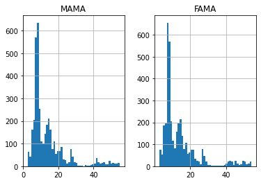
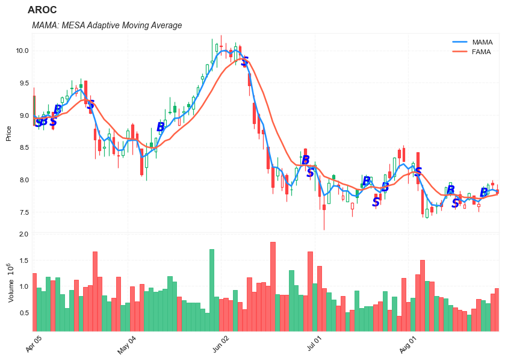

## MAMA: MESA Adaptive Moving Average


#### Reference: 
- [John Ehlers: MESA Adaptive Moving Average](https://www.mesasoftware.com/papers/MAMA.pdf)


#### MAMA: MESA Adaptive Moving Average


The MESA Adaptive Moving Average (MAMA) adapts to price movement based on the rate change of phase as 
measured by the Hilbert Transform Discriminator.  

The advantage of this method of adaptation is that it features a fast attack average and a slow decay 
average so that composite average rapidly ratchets behind price changes and holds the average value 
until the next ratchet occurs.


##### Load basic packages 


```python
import pandas as pd
import numpy as np
import os
import gc
import copy
from pathlib import Path
from datetime import datetime, timedelta, time, date
```


```python
#this package is to download equity price data from yahoo finance
#the source code of this package can be found here: https://github.com/ranaroussi/yfinance/blob/main
import yfinance as yf
```


```python
pd.options.display.max_rows = 100
pd.options.display.max_columns = 100

import warnings
warnings.filterwarnings("ignore")

import pytorch_lightning as pl
random_seed=1234
pl.seed_everything(random_seed)
```

    Global seed set to 1234
    


    1234


```python
#S&P 500 (^GSPC),  Dow Jones Industrial Average (^DJI), NASDAQ Composite (^IXIC)
#Russell 2000 (^RUT), Crude Oil Nov 21 (CL=F), Gold Dec 21 (GC=F)
#Treasury Yield 10 Years (^TNX)

#benchmark_tickers = ['^GSPC', '^DJI', '^IXIC', '^RUT',  'CL=F', 'GC=F', '^TNX']

benchmark_tickers = ['^GSPC']
tickers = benchmark_tickers + ['GSK', 'NVO', 'AROC']
```


```python
#https://github.com/ranaroussi/yfinance/blob/main/yfinance/base.py
#     def history(self, period="1mo", interval="1d",
#                 start=None, end=None, prepost=False, actions=True,
#                 auto_adjust=True, back_adjust=False,
#                 proxy=None, rounding=False, tz=None, timeout=None, **kwargs):

dfs = {}

for ticker in tickers:
    cur_data = yf.Ticker(ticker)
    hist = cur_data.history(period="max", start='2000-01-01')
    print(datetime.now(), ticker, hist.shape, hist.index.min(), hist.index.max())
    dfs[ticker] = hist
```

    2022-08-27 13:58:24.342430 ^GSPC (5701, 7) 1999-12-31 00:00:00 2022-08-26 00:00:00
    2022-08-27 13:58:24.638344 GSK (5701, 7) 1999-12-31 00:00:00 2022-08-26 00:00:00
    2022-08-27 13:58:24.982461 NVO (5701, 7) 1999-12-31 00:00:00 2022-08-26 00:00:00
    2022-08-27 13:58:25.208361 AROC (3782, 7) 2007-08-21 00:00:00 2022-08-26 00:00:00
    


```python
ticker = 'AROC'
dfs[ticker].tail(5)
```


<div>
<style scoped>
    .dataframe tbody tr th:only-of-type {
        vertical-align: middle;
    }

    .dataframe tbody tr th {
        vertical-align: top;
    }

    .dataframe thead th {
        text-align: right;
    }
</style>
<table border="1" class="dataframe">
  <thead>
    <tr style="text-align: right;">
      <th></th>
      <th>Open</th>
      <th>High</th>
      <th>Low</th>
      <th>Close</th>
      <th>Volume</th>
      <th>Dividends</th>
      <th>Stock Splits</th>
    </tr>
    <tr>
      <th>Date</th>
      <th></th>
      <th></th>
      <th></th>
      <th></th>
      <th></th>
      <th></th>
      <th></th>
    </tr>
  </thead>
  <tbody>
    <tr>
      <th>2022-08-22</th>
      <td>7.59</td>
      <td>7.68</td>
      <td>7.50</td>
      <td>7.62</td>
      <td>753700</td>
      <td>0.0</td>
      <td>0</td>
    </tr>
    <tr>
      <th>2022-08-23</th>
      <td>7.74</td>
      <td>7.90</td>
      <td>7.71</td>
      <td>7.80</td>
      <td>732200</td>
      <td>0.0</td>
      <td>0</td>
    </tr>
    <tr>
      <th>2022-08-24</th>
      <td>7.78</td>
      <td>7.95</td>
      <td>7.74</td>
      <td>7.92</td>
      <td>673800</td>
      <td>0.0</td>
      <td>0</td>
    </tr>
    <tr>
      <th>2022-08-25</th>
      <td>7.95</td>
      <td>8.00</td>
      <td>7.84</td>
      <td>7.92</td>
      <td>857000</td>
      <td>0.0</td>
      <td>0</td>
    </tr>
    <tr>
      <th>2022-08-26</th>
      <td>7.85</td>
      <td>7.93</td>
      <td>7.76</td>
      <td>7.79</td>
      <td>962900</td>
      <td>0.0</td>
      <td>0</td>
    </tr>
  </tbody>
</table>
</div>


##### Define MAMA calculation function


```python
def cal_mama(ohlc: pd.DataFrame, fast_limit: float = 0.5, slow_limit: float = 0.05, column: str = "close",) -> pd.DataFrame:
    """
    MESA Adaptive Moving Average

    The MESA Adaptive Moving Average (MAMA) adapts to price movement based on the rate change of phase as 
    measured by the Hilbert Transform Discriminator.  

    The advantage of this method of adaptation is that it features a fast attack average and a slow decay 
    average so that composite average rapidly ratchets behind price changes and holds the average value 
    until the next ratchet occurs.


    source: https://www.mesasoftware.com/papers/MAMA.pdf

    adapted from: https://github.com/mathiswellmann/go_ehlers_indicators/blob/bdc7bd10003c/mama.go#L110


    """
    series = ohlc[column]
    smooth = np.zeros(len(series))
    period = np.zeros(len(series))
    detrender = np.zeros(len(series))
    i1 = np.zeros(len(series))
    q1 = np.zeros(len(series))
    ji = np.zeros(len(series))
    jq = np.zeros(len(series))
    i2 = np.zeros(len(series))
    q2 = np.zeros(len(series))
    re = np.zeros(len(series))
    im = np.zeros(len(series))

    smooth_period = np.zeros(len(series))
    phase = np.zeros(len(series))
    fama = np.zeros(len(series))
    mama = np.zeros(len(series))

    delta_phase = np.zeros(len(series))    
    alpha = np.zeros(len(series))

    vals = series.values

    for i in range(len(vals)):
        if i<6:
            mama[i] = vals[i]
            fama[i] = vals[i]
            continue

        smooth[i] = (4*vals[i] + 3*vals[i-1] + 2*vals[i-2] + vals[i-3]) / 10
        detrender[i] = (0.0962*smooth[i] + 0.5769*smooth[i-2] - 0.5769*smooth[i-4] - 0.0962*smooth[i-6]) * (0.075*period[i-1] + 0.54)

        ## compute InPhase and Quadrature components
        q1[i] = (0.0962*detrender[i] + 0.5769*detrender[i-2] - 0.5769*detrender[i-4] - 0.0962*detrender[i-6]) * (0.075*period[i-1] + 0.54)
        i1[i] = detrender[i-3]


        ##Advance the phase of detrender and q1 by 90 Degrees
        ji[i] = (0.0962*i1[i] + 0.05769*i1[i-2] - 0.5769*i1[i-4] - 0.0962*i1[i-6]) * (0.075*period[i-1] + 0.54)
        jq[i] = (0.0962*q1[i] + 0.5769*q1[i-2] - 0.5769*q1[i-4] - 0.0962*q1[i-6]) * (0.075*period[i-1] + 0.54)

        ##Phasor addition for 3 bar averaging
        i2[i] = i1[i] - jq[i]
        q2[i] = q1[i] + ji[i]

        ##smooth the I and Q components befor applying the discriminator
        i2[i] = 0.2*i2[i] + 0.8*i2[i-1]
        q2[i] = 0.2*q2[i] + 0.8*q2[i-1]

        ##Homodyne Discriminator
        re[i] = i2[i]*i2[i-1] + q2[i]*q2[i-1]
        im[i] = i2[i]*q2[i-1] - q2[i]*i2[i-1]

        re[i] = 0.2*re[i] + 0.8*re[i-1]
        im[i] = 0.2*im[i] + 0.8*im[i-1]

        if (im[i] != 0)& (re[i] != 0):
            period[i] = 360 / np.arctan(im[i]/re[i])

        if (period[i] > 1.5*period[i-1]):
            period[i] = 1.5 * period[i-1]

        if (period[i] < 0.67*period[i-1]):
            period[i] = 0.67 * period[i-1]

        if (period[i] < 6):
            period[i] = 6

        if (period[i] > 50):
            period[i] = 50

        period[i] = 0.2*period[i] + 0.8*period[i-1]
        smooth_period[i] = 0.33*period[i] + 0.67*smooth_period[i-1]

        if (i1[i]!= 0):
            phase[i] = np.arctan(q1[i] / i1[i])

        delta_phase[i] = phase[i-1] - phase[i]
        if (delta_phase[i] < 1):
            delta_phase[i] = 1

        alpha[i] = fast_limit / delta_phase[i]
        if alpha[i] < slow_limit:
            alpha[i] = slow_limit

        mama[i] = alpha[i]*vals[i] + (1-alpha[i])*mama[i-1]
        fama[i] = 0.5*alpha[i]*mama[i] + (1-0.5*alpha[i])*fama[i-1]

    mama_ = pd.Series(index=series.index, data=mama, name="MAMA")
    fama_ = pd.Series(index=series.index, data=fama, name="FAMA")


    return pd.concat([mama_, fama_], axis=1)

```


```python
def get_MAMA_signal(df):
    signals = []
    df.sort_index(ascending=True, inplace=True)
    M_F = df['MAMA']-df['FAMA']
    MAMA = df['MAMA']  
    
    for i in range(df.shape[0]):
        val = 0 #not a crossing point
        
        if M_F[i]==0:
            if i<2:
                val = 0
            else:
                if (M_F[i-1]<0):
                    val = 1 #from MAMA<FAMA to MAMA>FAMA
                elif (M_F[i-1]>0):
                    val = -1 #from MAMA>FAMA to MAMA<FAMA
                else:
                    val = 0
        else:
            if (i<2)|(i>=df.shape[0]-2):
                val = 0
            else:
                if (M_F[i-1]<0) & (M_F[i]>0):
                    val = 2
                elif (M_F[i-1]>0) & (M_F[i]<0):
                    val = -2
                else:
                    val = 0

        signals.append(val)
        
    return signals
```

##### Calculate MAMA


```python
df = dfs[ticker][['Open', 'High', 'Low', 'Close', 'Volume']]
```


```python
df = df.round(2)
```


```python
help(cal_mama)
```

    Help on function cal_mama in module __main__:
    
    cal_mama(ohlc: pandas.core.frame.DataFrame, fast_limit: float = 0.5, slow_limit: float = 0.05, column: str = 'close') -> pandas.core.frame.DataFrame
        MESA Adaptive Moving Average
        
        The MESA Adaptive Moving Average (MAMA) adapts to price movement based on the rate change of phase as 
        measured by the Hilbert Transform Discriminator.  
        
        The advantage of this method of adaptation is that it features a fast attack average and a slow decay 
        average so that composite average rapidly ratchets behind price changes and holds the average value 
        until the next ratchet occurs.
        
        
        source: https://www.mesasoftware.com/papers/MAMA.pdf
        
        adapted from: https://github.com/mathiswellmann/go_ehlers_indicators/blob/bdc7bd10003c/mama.go#L110
    
    


```python
df_ta = cal_mama(df, column="Close")
df = df.merge(df_ta, left_index = True, right_index = True, how='inner' )

del df_ta
gc.collect()
```


    143


```python
signals = get_MAMA_signal(df)
df['MAMA_signal'] = signals
df['B'] = (df["MAMA_signal"]>0) .astype(int)*(df['High']+df['Low'])/2
df['S'] = (df["MAMA_signal"]<0).astype(int)*(df['High']+df['Low'])/2
```


```python
display(df.head(5))
display(df.tail(5))
```


<div>
<style scoped>
    .dataframe tbody tr th:only-of-type {
        vertical-align: middle;
    }

    .dataframe tbody tr th {
        vertical-align: top;
    }

    .dataframe thead th {
        text-align: right;
    }
</style>
<table border="1" class="dataframe">
  <thead>
    <tr style="text-align: right;">
      <th></th>
      <th>Open</th>
      <th>High</th>
      <th>Low</th>
      <th>Close</th>
      <th>Volume</th>
      <th>MAMA</th>
      <th>FAMA</th>
      <th>MAMA_signal</th>
      <th>B</th>
      <th>S</th>
    </tr>
    <tr>
      <th>Date</th>
      <th></th>
      <th></th>
      <th></th>
      <th></th>
      <th></th>
      <th></th>
      <th></th>
      <th></th>
      <th></th>
      <th></th>
    </tr>
  </thead>
  <tbody>
    <tr>
      <th>2007-08-21</th>
      <td>50.01</td>
      <td>50.86</td>
      <td>49.13</td>
      <td>49.44</td>
      <td>1029100</td>
      <td>49.44</td>
      <td>49.44</td>
      <td>0</td>
      <td>0.0</td>
      <td>0.0</td>
    </tr>
    <tr>
      <th>2007-08-22</th>
      <td>48.50</td>
      <td>50.70</td>
      <td>47.78</td>
      <td>49.29</td>
      <td>996500</td>
      <td>49.29</td>
      <td>49.29</td>
      <td>0</td>
      <td>0.0</td>
      <td>0.0</td>
    </tr>
    <tr>
      <th>2007-08-23</th>
      <td>49.76</td>
      <td>49.82</td>
      <td>47.56</td>
      <td>48.03</td>
      <td>742700</td>
      <td>48.03</td>
      <td>48.03</td>
      <td>0</td>
      <td>0.0</td>
      <td>0.0</td>
    </tr>
    <tr>
      <th>2007-08-24</th>
      <td>47.93</td>
      <td>48.77</td>
      <td>47.87</td>
      <td>48.58</td>
      <td>416000</td>
      <td>48.58</td>
      <td>48.58</td>
      <td>0</td>
      <td>0.0</td>
      <td>0.0</td>
    </tr>
    <tr>
      <th>2007-08-27</th>
      <td>48.56</td>
      <td>48.81</td>
      <td>46.85</td>
      <td>47.47</td>
      <td>447000</td>
      <td>47.47</td>
      <td>47.47</td>
      <td>0</td>
      <td>0.0</td>
      <td>0.0</td>
    </tr>
  </tbody>
</table>
</div>


<div>
<style scoped>
    .dataframe tbody tr th:only-of-type {
        vertical-align: middle;
    }

    .dataframe tbody tr th {
        vertical-align: top;
    }

    .dataframe thead th {
        text-align: right;
    }
</style>
<table border="1" class="dataframe">
  <thead>
    <tr style="text-align: right;">
      <th></th>
      <th>Open</th>
      <th>High</th>
      <th>Low</th>
      <th>Close</th>
      <th>Volume</th>
      <th>MAMA</th>
      <th>FAMA</th>
      <th>MAMA_signal</th>
      <th>B</th>
      <th>S</th>
    </tr>
    <tr>
      <th>Date</th>
      <th></th>
      <th></th>
      <th></th>
      <th></th>
      <th></th>
      <th></th>
      <th></th>
      <th></th>
      <th></th>
      <th></th>
    </tr>
  </thead>
  <tbody>
    <tr>
      <th>2022-08-22</th>
      <td>7.59</td>
      <td>7.68</td>
      <td>7.50</td>
      <td>7.62</td>
      <td>753700</td>
      <td>7.659967</td>
      <td>7.706288</td>
      <td>0</td>
      <td>0.000</td>
      <td>0.0</td>
    </tr>
    <tr>
      <th>2022-08-23</th>
      <td>7.74</td>
      <td>7.90</td>
      <td>7.71</td>
      <td>7.80</td>
      <td>732200</td>
      <td>7.729984</td>
      <td>7.712212</td>
      <td>2</td>
      <td>7.805</td>
      <td>0.0</td>
    </tr>
    <tr>
      <th>2022-08-24</th>
      <td>7.78</td>
      <td>7.95</td>
      <td>7.74</td>
      <td>7.92</td>
      <td>673800</td>
      <td>7.824992</td>
      <td>7.740407</td>
      <td>0</td>
      <td>0.000</td>
      <td>0.0</td>
    </tr>
    <tr>
      <th>2022-08-25</th>
      <td>7.95</td>
      <td>8.00</td>
      <td>7.84</td>
      <td>7.92</td>
      <td>857000</td>
      <td>7.846852</td>
      <td>7.752653</td>
      <td>0</td>
      <td>0.000</td>
      <td>0.0</td>
    </tr>
    <tr>
      <th>2022-08-26</th>
      <td>7.85</td>
      <td>7.93</td>
      <td>7.76</td>
      <td>7.79</td>
      <td>962900</td>
      <td>7.818426</td>
      <td>7.769096</td>
      <td>0</td>
      <td>0.000</td>
      <td>0.0</td>
    </tr>
  </tbody>
</table>
</div>


```python
df[['MAMA','FAMA']].hist(bins=50)
```


    array([[<AxesSubplot:title={'center':'MAMA'}>,
            <AxesSubplot:title={'center':'FAMA'}>]], dtype=object)


    

    


```python
#https://github.com/matplotlib/mplfinance
#this package help visualize financial data
import mplfinance as mpf
import matplotlib.colors as mcolors

# all_colors = list(mcolors.CSS4_COLORS.keys())#"CSS Colors"
all_colors = list(mcolors.TABLEAU_COLORS.keys()) # "Tableau Palette",
# all_colors = list(mcolors.BASE_COLORS.keys()) #"Base Colors",


#https://github.com/matplotlib/mplfinance/issues/181#issuecomment-667252575
#list of colors: https://matplotlib.org/stable/gallery/color/named_colors.html
#https://github.com/matplotlib/mplfinance/blob/master/examples/styles.ipynb

def plot_3panels(main_data, add_data=None, mid_panel=None, chart_type='candle', names=None, 
                  figratio=(14,9)):


    style = mpf.make_mpf_style(base_mpf_style='yahoo',  #charles
                               base_mpl_style = 'seaborn-whitegrid',
#                                marketcolors=mpf.make_marketcolors(up="r", down="#0000CC",inherit=True),
                               gridcolor="whitesmoke", 
                               gridstyle="--", #or None, or - for solid
                               gridaxis="both", 
                               edgecolor = 'whitesmoke',
                               facecolor = 'white', #background color within the graph edge
                               figcolor = 'white', #background color outside of the graph edge
                               y_on_right = False,
                               rc =  {'legend.fontsize': 'small',#or number
                                      #'figure.figsize': (14, 9),
                                     'axes.labelsize': 'small',
                                     'axes.titlesize':'small',
                                     'xtick.labelsize':'small',#'x-small', 'small','medium','large'
                                     'ytick.labelsize':'small'
                                     }, 
                              )   

    if (chart_type is None) or (chart_type not in ['ohlc', 'line', 'candle', 'hollow_and_filled']):
        chart_type = 'candle'
    len_dict = {'candle':2, 'ohlc':3, 'line':1, 'hollow_and_filled':2}    
        
    kwargs = dict(type=chart_type, figratio=figratio, volume=True, volume_panel=1, 
                  panel_ratios=(4,2), tight_layout=True, style=style, returnfig=True)
    
    if names is None:
        names = {'main_title': '', 'sub_tile': ''}
    


    added_plots = { 
        'S':  mpf.make_addplot(add_data['S'], panel=0, color='blue', type='scatter', marker=r'${S}$' , markersize=100, secondary_y=False),   
        'B':  mpf.make_addplot(add_data['B'], panel=0, color='blue', type='scatter', marker=r'${B}$' , markersize=100, secondary_y=False), 
        
        'MAMA': mpf.make_addplot(add_data['MAMA'], panel=0, color='dodgerblue', secondary_y=False), 
        'FAMA': mpf.make_addplot(add_data['FAMA'], panel=0, color='tomato', secondary_y=False), 
#         'AO-SIGNAL': mpf.make_addplot(mid_panel['AO']-mid_panel['SIGNAL'], type='bar',width=0.7,panel=1, color="pink",alpha=0.65,secondary_y=False),
    }

                         

    fig, axes = mpf.plot(main_data,  **kwargs,
                         addplot=list(added_plots.values()),
                        )
    # add a new suptitle
    fig.suptitle(names['main_title'], y=1.05, fontsize=12, x=0.128)

    axes[0].set_title(names['sub_tile'], fontsize=10, style='italic',  loc='left')
    
    

    
    #set legend

    axes[0].legend([None]*6)
    handles = axes[0].get_legend().legendHandles
#     print(handles)
    axes[0].legend(handles=handles[4:],labels=['MAMA', 'FAMA'])
    #axes[2].set_title('AO', fontsize=10, style='italic',  loc='left')
#     axes[0].set_ylabel('MAMA')
    
    

#     axes[0].set_ylabel(names['y_tiles'][0])
    return fig, axes
   
```


```python

start = -100
end = df.shape[0]

names = {'main_title': f'{ticker}', 
         'sub_tile': 'MAMA: MESA Adaptive Moving Average'}


aa_, bb_ = plot_3panels(df.iloc[start:end][['Open', 'High', 'Low', 'Close', 'Volume']], 
             df.iloc[start:end][['B', 'S', 'MAMA', 'FAMA']],
             None, 
             chart_type='hollow_and_filled',
                     names = names, 
                    )
```


    

    

