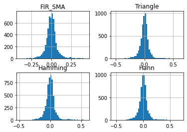
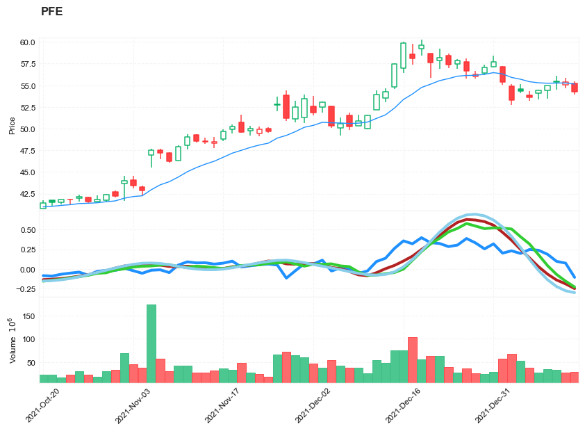

## Hann windowed finite impulse response filter (FIR) Windowing

**References**

- [traders.com: TradersTips 2021-09](http://traders.com/Documentation/FEEDbk_docs/2021/09/TradersTips.html)


**█ OVERVIEW**


In his article “Windowing” in September 2021 Traders’ Tips issue, author John Ehlers presents several window functions and explains how they can be applied to simple moving averages to enhance their functionality for trading. Afterwards, he discusses how he uses the rate of change (ROC) to further assist in trading decisions.


##### Load basic packages 


```python
import pandas as pd
import numpy as np
import os
import gc
import copy
from pathlib import Path
from datetime import datetime, timedelta, time, date
```


```python
#this package is to download equity price data from yahoo finance
#the source code of this package can be found here: https://github.com/ranaroussi/yfinance/blob/main
import yfinance as yf
```


```python
pd.options.display.max_rows = 100
pd.options.display.max_columns = 100

import warnings
warnings.filterwarnings("ignore")

import pytorch_lightning as pl
random_seed=1234
pl.seed_everything(random_seed)
```

    Global seed set to 1234
    


    1234


```python
#S&P 500 (^GSPC),  Dow Jones Industrial Average (^DJI), NASDAQ Composite (^IXIC)
#Russell 2000 (^RUT), Crude Oil Nov 21 (CL=F), Gold Dec 21 (GC=F)
#Treasury Yield 10 Years (^TNX)

#benchmark_tickers = ['^GSPC', '^DJI', '^IXIC', '^RUT',  'CL=F', 'GC=F', '^TNX']

benchmark_tickers = ['^GSPC']
tickers = benchmark_tickers + ['GSK', 'BST', 'PFE']
```


```python
#https://github.com/ranaroussi/yfinance/blob/main/yfinance/base.py
#     def history(self, period="1mo", interval="1d",
#                 start=None, end=None, prepost=False, actions=True,
#                 auto_adjust=True, back_adjust=False,
#                 proxy=None, rounding=False, tz=None, timeout=None, **kwargs):

dfs = {}

for ticker in tickers:
    cur_data = yf.Ticker(ticker)
    hist = cur_data.history(period="max", start='2000-01-01')
    print(datetime.now(), ticker, hist.shape, hist.index.min(), hist.index.max())
    dfs[ticker] = hist
```

    2022-09-04 17:25:20.348908 ^GSPC (5706, 7) 1999-12-31 00:00:00 2022-09-02 00:00:00
    2022-09-04 17:25:20.627231 GSK (5706, 7) 1999-12-31 00:00:00 2022-09-02 00:00:00
    2022-09-04 17:25:20.866030 BST (1976, 7) 2014-10-29 00:00:00 2022-09-02 00:00:00
    2022-09-04 17:25:21.241181 PFE (5706, 7) 1999-12-31 00:00:00 2022-09-02 00:00:00
    


```python
ticker = 'PFE'
dfs[ticker].tail(5)
```


<div>
<style scoped>
    .dataframe tbody tr th:only-of-type {
        vertical-align: middle;
    }

    .dataframe tbody tr th {
        vertical-align: top;
    }

    .dataframe thead th {
        text-align: right;
    }
</style>
<table border="1" class="dataframe">
  <thead>
    <tr style="text-align: right;">
      <th></th>
      <th>Open</th>
      <th>High</th>
      <th>Low</th>
      <th>Close</th>
      <th>Volume</th>
      <th>Dividends</th>
      <th>Stock Splits</th>
    </tr>
    <tr>
      <th>Date</th>
      <th></th>
      <th></th>
      <th></th>
      <th></th>
      <th></th>
      <th></th>
      <th></th>
    </tr>
  </thead>
  <tbody>
    <tr>
      <th>2022-08-29</th>
      <td>46.380001</td>
      <td>46.689999</td>
      <td>46.119999</td>
      <td>46.230000</td>
      <td>13400500</td>
      <td>0.0</td>
      <td>0.0</td>
    </tr>
    <tr>
      <th>2022-08-30</th>
      <td>46.340000</td>
      <td>46.349998</td>
      <td>45.799999</td>
      <td>45.849998</td>
      <td>16303000</td>
      <td>0.0</td>
      <td>0.0</td>
    </tr>
    <tr>
      <th>2022-08-31</th>
      <td>46.009998</td>
      <td>46.290001</td>
      <td>45.130001</td>
      <td>45.230000</td>
      <td>26416800</td>
      <td>0.0</td>
      <td>0.0</td>
    </tr>
    <tr>
      <th>2022-09-01</th>
      <td>45.139999</td>
      <td>46.650002</td>
      <td>45.139999</td>
      <td>46.630001</td>
      <td>19947600</td>
      <td>0.0</td>
      <td>0.0</td>
    </tr>
    <tr>
      <th>2022-09-02</th>
      <td>46.740002</td>
      <td>46.799999</td>
      <td>45.529999</td>
      <td>45.700001</td>
      <td>14662700</td>
      <td>0.0</td>
      <td>0.0</td>
    </tr>
  </tbody>
</table>
</div>


##### Define Hann windowed finite impulse response filter (FIR) Windowing calculation function


```python
import math
def cal_fir_window(ohlc: pd.DataFrame, 
                   period: int = 20,
                  ) -> pd.DataFrame:
    """
    source: http://traders.com/Documentation/FEEDbk_docs/2021/09/TradersTips.html
    Indicators can be improved by preprocessing their input data. John Ehlers, in his article in this issue, proposes using the windowing technique to preprocess data—that is, multiplying the input data by an array of factors. In his article, he demonstrates implementing triangle, Hamming, and Hann windowing to the simple moving average (SMA) indicator.

    """
    
    #Smooth Directional Movements with Hann Windowed FIR filter
    def _hann(_data, _len):
        pi_ = 2.0*math.pi/(_len + 1)
        dm_sum = 0.0
        coef_sum = 0.0

        for i in range(_len):
            j = i + 1
            coef = 1 - math.cos(pi_*j)
            dm_sum = dm_sum + coef*_data[i]
            coef_sum = coef_sum + coef 

        _dmh = 0 
        if coef_sum != 0:
            _dmh = dm_sum / coef_sum
        return _dmh      
        
 
    def _hamming(_data, _len, _ped):
        pi2_ = (math.pi-2*_ped)/(_len-1)
        dm_sum = 0.0
        coef_sum = 0.0
        
        for i in range(_len):
            coef = math.sin(_ped+pi2_*(i+1))
            coef_sum = coef_sum + coef
            dm_sum = dm_sum + _data[i]*coef

        _dmh = 0 
        if coef_sum != 0:
            _dmh = dm_sum / coef_sum
        return _dmh     
        
    #Smooth Directional Movements with Hann Windowed FIR filter
    def _triangle(_data, _len):
        dm_sum = 0.0
        coef_sum = 0.0
        for i in range(_len):
            if i < _len/2:
                j = i + 1
            else:
                j = _len - i
            coef = j
            dm_sum = dm_sum + coef*_data[i]
            coef_sum = coef_sum + coef 

        _dmh = 0 
        if coef_sum != 0:
            _dmh = dm_sum / coef_sum
        return _dmh      
    
       
    
    ohlc = ohlc.copy()
    ohlc.columns = [c.lower() for c in ohlc.columns]
    
    co = ohlc["close"] - ohlc["open"]

    FIR_SMA = co.rolling(window=period).mean()
    #FIR_SMA_ROC = (period/6.28)*ma.diff()
    Triangle = co.rolling(window=period, min_periods=period).apply(lambda x: _triangle(x, period))
    Hamming = co.rolling(window=period, min_periods=period).apply(lambda x: _hamming(x, period, 10*math.pi/360))
    Hann = co.rolling(window=period, min_periods=period).apply(lambda x: _hann(x, period))


    return pd.DataFrame(data = {'FIR_SMA': FIR_SMA.values, 
                                'Triangle': Triangle.values, 
                                'Hamming': Hamming.values, 
                                'Hann': Hann.values, 
                               }, 
                        index = ohlc.index
                       )
```

    """
    source: http://traders.com/Documentation/FEEDbk_docs/2021/09/TradersTips.html
    Indicators can be improved by preprocessing their input data. John Ehlers, in his article in this issue, proposes using the windowing technique to preprocess data—that is, multiplying the input data by an array of factors. In his article, he demonstrates implementing triangle, Hamming, and Hann windowing to the simple moving average (SMA) indicator.
    
    """
  
    """
    vars triangle(vars Data, int Length)
    {
      vars Out = series(0,Length);
      int i;
      for(i=0; i<Length; i++)
        Out[i] = Data[i] * ifelse(i<Length/2,i+1,Length-i);
      return Out;
    }

    """
    def _triangle(_data, _len):
        out_ = np.zeros(_len)
        for i in range(_len):
            if i < _len/2:
                j = i + 1
            else:
                j = _len - i
            out_[i] = _data[i]*j

        return out_

    """
    vars hamming(vars Data, int Length, var Pedestal)
    {
      vars Out = series(0,Length);
      int i;
      for(i=0; i<Length; i++)
        Out[i] = Data[i] * sin(Pedestal+(PI-2*Pedestal)*(i+1)/(Length-1));
      return Out;
    }

    """
    def _hamming(_data, _len, _ped):
        pi2_ = (math.pi-2*_ped)/(_len-1)

        out_ = np.zeros(_len)
        for i in range(_len):
            out_[i] = _data[i]*math.sin(_ped+pi2_*(i+1))

        return out_


    """
    vars hann(vars Data, int Length)
    {
      vars Out = series(0,Length);
      int i;
      for(i=0; i<Length; i++)
        Out[i] = Data[i] * (1-cos(2*PI*(i+1)/(Length+1)));
      return Out;
    }

    """
    def _hann(_data, _len):
        pi2_ = 2*math.pi/(_len + 1)

        out_ = np.zeros(_len)
        for i in range(_len):
            out_[i] = _data[i]*(1-math.cos(pi2_*(i+1)))

        return out_    
    
    
    """
    void run()
    {
      StartDate = 20191101;
      EndDate = 20210101;
      BarPeriod = 1440;

      assetAdd("SPY","STOOQ:*"); // load data from STOOQ
      asset("SPY");

      vars Deriv = series(priceClose() - priceOpen());
      plot("FIR_SMA",SMA(Deriv,20),NEW,RED);
      plot("Triangle",SMA(triangle(Deriv,20),20),NEW,RED);
      plot("Hamming",SMA(hamming(Deriv,20,10*PI/360),20),NEW,RED);
      plot("Hann",SMA(hann(Deriv,20),20),NEW,RED);
    }
    """    

##### Calculate Hann windowed finite impulse response filter (FIR) Windowing


```python
df = dfs[ticker][['Open', 'High', 'Low', 'Close', 'Volume']]
```


```python
df = df.round(2)
```


```python
cal_fir_window
```


    <function __main__.cal_fir_window(ohlc: pandas.core.frame.DataFrame, period: int = 20) -> pandas.core.frame.DataFrame>


```python
df_ta = cal_fir_window(df, period=20)
df = df.merge(df_ta, left_index = True, right_index = True, how='inner' )

del df_ta
gc.collect()
```


    122


```python
from core.finta import TA
```


```python
df_ta = TA.EMA(df, period = 14, column="close")
df_ta.name='EMA'
df = df.merge(df_ta, left_index = True, right_index = True, how='inner' )

del df_ta
gc.collect()
```


    21


```python
display(df.head(5))
display(df.tail(5))
```


<div>
<style scoped>
    .dataframe tbody tr th:only-of-type {
        vertical-align: middle;
    }

    .dataframe tbody tr th {
        vertical-align: top;
    }

    .dataframe thead th {
        text-align: right;
    }
</style>
<table border="1" class="dataframe">
  <thead>
    <tr style="text-align: right;">
      <th></th>
      <th>Open</th>
      <th>High</th>
      <th>Low</th>
      <th>Close</th>
      <th>Volume</th>
      <th>FIR_SMA</th>
      <th>Triangle</th>
      <th>Hamming</th>
      <th>Hann</th>
      <th>EMA</th>
    </tr>
    <tr>
      <th>Date</th>
      <th></th>
      <th></th>
      <th></th>
      <th></th>
      <th></th>
      <th></th>
      <th></th>
      <th></th>
      <th></th>
      <th></th>
    </tr>
  </thead>
  <tbody>
    <tr>
      <th>1999-12-31</th>
      <td>14.25</td>
      <td>14.31</td>
      <td>14.11</td>
      <td>14.22</td>
      <td>5939817</td>
      <td>NaN</td>
      <td>NaN</td>
      <td>NaN</td>
      <td>NaN</td>
      <td>14.220000</td>
    </tr>
    <tr>
      <th>2000-01-03</th>
      <td>14.06</td>
      <td>14.20</td>
      <td>13.87</td>
      <td>13.98</td>
      <td>12873345</td>
      <td>NaN</td>
      <td>NaN</td>
      <td>NaN</td>
      <td>NaN</td>
      <td>14.091429</td>
    </tr>
    <tr>
      <th>2000-01-04</th>
      <td>13.70</td>
      <td>13.81</td>
      <td>13.16</td>
      <td>13.46</td>
      <td>14208974</td>
      <td>NaN</td>
      <td>NaN</td>
      <td>NaN</td>
      <td>NaN</td>
      <td>13.850221</td>
    </tr>
    <tr>
      <th>2000-01-05</th>
      <td>13.54</td>
      <td>13.98</td>
      <td>13.51</td>
      <td>13.68</td>
      <td>12981591</td>
      <td>NaN</td>
      <td>NaN</td>
      <td>NaN</td>
      <td>NaN</td>
      <td>13.798145</td>
    </tr>
    <tr>
      <th>2000-01-06</th>
      <td>13.70</td>
      <td>14.36</td>
      <td>13.68</td>
      <td>14.17</td>
      <td>11115273</td>
      <td>NaN</td>
      <td>NaN</td>
      <td>NaN</td>
      <td>NaN</td>
      <td>13.895162</td>
    </tr>
  </tbody>
</table>
</div>


<div>
<style scoped>
    .dataframe tbody tr th:only-of-type {
        vertical-align: middle;
    }

    .dataframe tbody tr th {
        vertical-align: top;
    }

    .dataframe thead th {
        text-align: right;
    }
</style>
<table border="1" class="dataframe">
  <thead>
    <tr style="text-align: right;">
      <th></th>
      <th>Open</th>
      <th>High</th>
      <th>Low</th>
      <th>Close</th>
      <th>Volume</th>
      <th>FIR_SMA</th>
      <th>Triangle</th>
      <th>Hamming</th>
      <th>Hann</th>
      <th>EMA</th>
    </tr>
    <tr>
      <th>Date</th>
      <th></th>
      <th></th>
      <th></th>
      <th></th>
      <th></th>
      <th></th>
      <th></th>
      <th></th>
      <th></th>
      <th></th>
    </tr>
  </thead>
  <tbody>
    <tr>
      <th>2022-08-29</th>
      <td>46.38</td>
      <td>46.69</td>
      <td>46.12</td>
      <td>46.23</td>
      <td>13400500</td>
      <td>-0.1035</td>
      <td>0.014727</td>
      <td>0.011751</td>
      <td>0.039300</td>
      <td>48.306377</td>
    </tr>
    <tr>
      <th>2022-08-30</th>
      <td>46.34</td>
      <td>46.35</td>
      <td>45.80</td>
      <td>45.85</td>
      <td>16303000</td>
      <td>-0.0675</td>
      <td>-0.014545</td>
      <td>0.013778</td>
      <td>0.004810</td>
      <td>47.978860</td>
    </tr>
    <tr>
      <th>2022-08-31</th>
      <td>46.01</td>
      <td>46.29</td>
      <td>45.13</td>
      <td>45.23</td>
      <td>26416800</td>
      <td>-0.1100</td>
      <td>-0.062818</td>
      <td>-0.012437</td>
      <td>-0.040029</td>
      <td>47.612345</td>
    </tr>
    <tr>
      <th>2022-09-01</th>
      <td>45.14</td>
      <td>46.65</td>
      <td>45.14</td>
      <td>46.63</td>
      <td>19947600</td>
      <td>-0.0335</td>
      <td>-0.086091</td>
      <td>-0.058587</td>
      <td>-0.087320</td>
      <td>47.481366</td>
    </tr>
    <tr>
      <th>2022-09-02</th>
      <td>46.74</td>
      <td>46.80</td>
      <td>45.53</td>
      <td>45.70</td>
      <td>14662700</td>
      <td>-0.0670</td>
      <td>-0.114636</td>
      <td>-0.069616</td>
      <td>-0.131972</td>
      <td>47.243850</td>
    </tr>
  </tbody>
</table>
</div>


```python
df[['FIR_SMA', 'Triangle', 'Hamming', 'Hann']].hist(bins=50)
```


    array([[<AxesSubplot:title={'center':'FIR_SMA'}>,
            <AxesSubplot:title={'center':'Triangle'}>],
           [<AxesSubplot:title={'center':'Hamming'}>,
            <AxesSubplot:title={'center':'Hann'}>]], dtype=object)


    

    


```python
#https://github.com/matplotlib/mplfinance
#this package help visualize financial data
import mplfinance as mpf
import matplotlib.colors as mcolors

# all_colors = list(mcolors.CSS4_COLORS.keys())#"CSS Colors"
# all_colors = list(mcolors.TABLEAU_COLORS.keys()) # "Tableau Palette",
# all_colors = list(mcolors.BASE_COLORS.keys()) #"Base Colors",
all_colors = ['dodgerblue', 'firebrick','limegreen','skyblue','lightgreen',  'navy','yellow','plum',  'yellowgreen']
#https://github.com/matplotlib/mplfinance/issues/181#issuecomment-667252575
#list of colors: https://matplotlib.org/stable/gallery/color/named_colors.html
#https://github.com/matplotlib/mplfinance/blob/master/examples/styles.ipynb

def make_3panels2(main_data, add_data, mid_panel=None, chart_type='candle', names=None, figratio=(14,9)):

    style = mpf.make_mpf_style(base_mpf_style='yahoo',  #charles
                               base_mpl_style = 'seaborn-whitegrid',
#                                marketcolors=mpf.make_marketcolors(up="r", down="#0000CC",inherit=True),
                               gridcolor="whitesmoke", 
                               gridstyle="--", #or None, or - for solid
                               gridaxis="both", 
                               edgecolor = 'whitesmoke',
                               facecolor = 'white', #background color within the graph edge
                               figcolor = 'white', #background color outside of the graph edge
                               y_on_right = False,
                               rc =  {'legend.fontsize': 'small',#or number
                                      #'figure.figsize': (14, 9),
                                     'axes.labelsize': 'small',
                                     'axes.titlesize':'small',
                                     'xtick.labelsize':'small',#'x-small', 'small','medium','large'
                                     'ytick.labelsize':'small'
                                     }, 
                              )   

    if (chart_type is None) or (chart_type not in ['ohlc', 'line', 'candle', 'hollow_and_filled']):
        chart_type = 'candle'
    len_dict = {'candle':2, 'ohlc':3, 'line':1, 'hollow_and_filled':2}    
        
    kwargs = dict(type=chart_type, figratio=figratio, volume=True, volume_panel=2, 
                  panel_ratios=(4,2, 2), tight_layout=True, style=style, returnfig=True)
    
    if names is None:
        names = {'main_title': '', 'sub_tile': ''}
    
    added_plots = { 
#         'S':  mpf.make_addplot(add_data['S'], panel=0, color='blue', type='scatter', marker=r'${S}$' , markersize=100, secondary_y=False),   
#         'B':  mpf.make_addplot(add_data['B'], panel=0, color='blue', type='scatter', marker=r'${B}$' , markersize=100, secondary_y=False), 
        
        'EMA': mpf.make_addplot(add_data['EMA'], panel=0, color='dodgerblue', width=1 ,secondary_y=False), 
    }

        
    
    fb_bbands = []
    if mid_panel is not None:
        i = 0
        for name_, data_ in mid_panel.iteritems():
            added_plots[name_] = mpf.make_addplot(data_, panel=1, color=all_colors[i],secondary_y=False)
            i = i + 1
        fb_bbands2_ = dict(y1=np.zeros(mid_panel.shape[0]),
                      y2=0.8+np.zeros(mid_panel.shape[0]),color="lightskyblue",alpha=0.1,interpolate=True)
        fb_bbands2_['panel'] = 1
        fb_bbands.append(fb_bbands2_)


    fig, axes = mpf.plot(main_data,  **kwargs,
                         addplot=list(added_plots.values()), 
                        )
    # add a new suptitle
    fig.suptitle(names['main_title'], y=1.05, fontsize=12, x=0.1285)

#     axes[0].legend([None]*4)
#     handles = axes[0].get_legend().legendHandles
#     axes[0].legend(handles=handles[2:],labels=['RS_EMA', 'EMA'])
#     axes[0].set_title(names['sub_tile'], fontsize=10, style='italic',  loc='left')
    

#     axes[0].set_ylabel(names['y_tiles'][0])
#     axes[2].set_ylabel(names['y_tiles'][1])
    return fig, axes
   
```


```python
df.columns
```


    Index(['Open', 'High', 'Low', 'Close', 'Volume', 'FIR_SMA', 'Triangle',
           'Hamming', 'Hann', 'EMA'],
          dtype='object')


```python

start = -220
end = -160#df.shape[0]

names = {'main_title': f'{ticker}', 
         'sub_tile': 'FIR Windowing'}


aa_, bb_ = make_3panels2(df.iloc[start:end][['Open', 'High', 'Low', 'Close', 'Volume']], 
            df.iloc[start:end][['EMA']],
            df.iloc[start:end][[ 'FIR_SMA', 'Triangle','Hamming', 'Hann',]],
             chart_type='hollow_and_filled',names = names)
```


    

    

