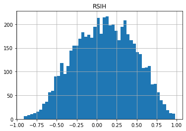
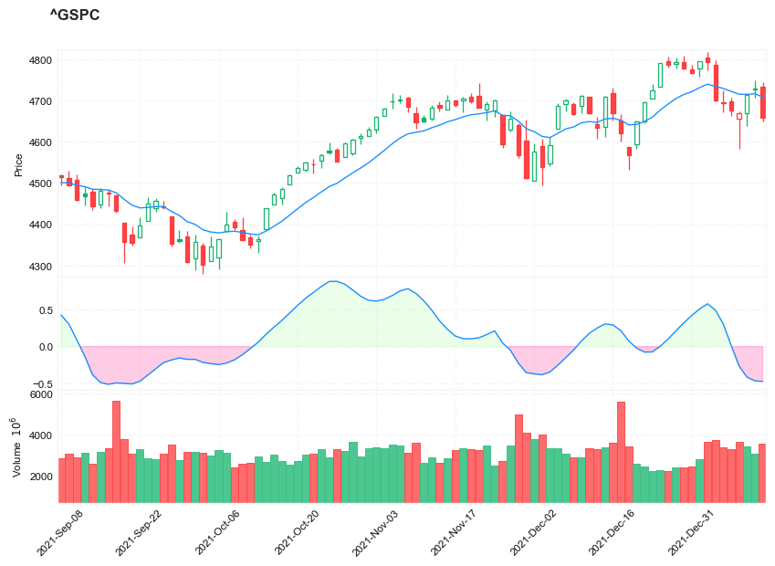

## Relative Strength Moving Averages With Hann Windowing (RSIH)

**References**

- [tradingview: TASC 2022.01 Improved RSI w/Hann](https://www.tradingview.com/script/Mk8Tcbmk-TASC-2022-01-Improved-RSI-w-Hann/)
- [traders.com: TradersTips 2022-01](https://traders.com/Documentation/FEEDbk_docs/2022/01/TradersTips.html)


**█ OVERVIEW**


In his article in TASC's January 2022 edition Traders' Tips, “(Yet Another) Improved RSI,” John Ehlers explains how he enhances the RSI by taking advantage of Hann windowing. The RSIH indicator provides a smoother calculation than the classic RSI and has a zero mean. The inherent smoothing in the computation removes the need for supplemental filtering. The best length to use for the RSIH is described to be one that is on the order of the dominant cycle period in the data.


**█ CONCEPTS**

By employing a Hann windowed finite impulse response filter (FIR), John Ehlers has enhanced the "Relative Strength Indicator" (RSI) to provide an improved oscillator with exceptional smoothness.


**█ CALCULATIONS**

The method of calculations using "closes up" and "closes down" from Welles Wilder's RSI described in his 1978 book is still inherent to Ehlers enhanced formula. However, a finite impulse response (FIR) Hann windowing technique is employed following the closes up/down calculations instead of the original Wilder infinite impulse response averaging filter. The resulting oscillator waveform is confined between +/-1.0 with a 0.0 centerline regardless of chart interval, as opposed to Wilder's original formulation, which was confined between 0 and 100 with a centerline of 50. On any given trading timeframe, the value of Ehlers' enhanced RSI found above the centerline typically represents an overvalued region, while undervalued regions are typically found below the centerline.


##### Load basic packages 


```python
import pandas as pd
import numpy as np
import os
import gc
import copy
from pathlib import Path
from datetime import datetime, timedelta, time, date
```


```python
#this package is to download equity price data from yahoo finance
#the source code of this package can be found here: https://github.com/ranaroussi/yfinance/blob/main
import yfinance as yf
```


```python
pd.options.display.max_rows = 100
pd.options.display.max_columns = 100

import warnings
warnings.filterwarnings("ignore")

import pytorch_lightning as pl
random_seed=1234
pl.seed_everything(random_seed)
```

    Global seed set to 1234
    


    1234


```python
#S&P 500 (^GSPC),  Dow Jones Industrial Average (^DJI), NASDAQ Composite (^IXIC)
#Russell 2000 (^RUT), Crude Oil Nov 21 (CL=F), Gold Dec 21 (GC=F)
#Treasury Yield 10 Years (^TNX)

#benchmark_tickers = ['^GSPC', '^DJI', '^IXIC', '^RUT',  'CL=F', 'GC=F', '^TNX']

benchmark_tickers = ['^GSPC']
tickers = benchmark_tickers + ['GSK', 'BST', 'PFE']
```


```python
#https://github.com/ranaroussi/yfinance/blob/main/yfinance/base.py
#     def history(self, period="1mo", interval="1d",
#                 start=None, end=None, prepost=False, actions=True,
#                 auto_adjust=True, back_adjust=False,
#                 proxy=None, rounding=False, tz=None, timeout=None, **kwargs):

dfs = {}

for ticker in tickers:
    cur_data = yf.Ticker(ticker)
    hist = cur_data.history(period="max", start='2000-01-01')
    print(datetime.now(), ticker, hist.shape, hist.index.min(), hist.index.max())
    dfs[ticker] = hist
```

    2022-09-04 15:36:33.419826 ^GSPC (5706, 7) 1999-12-31 00:00:00 2022-09-02 00:00:00
    2022-09-04 15:36:33.792559 GSK (5706, 7) 1999-12-31 00:00:00 2022-09-02 00:00:00
    2022-09-04 15:36:33.966659 BST (1976, 7) 2014-10-29 00:00:00 2022-09-02 00:00:00
    2022-09-04 15:36:34.294939 PFE (5706, 7) 1999-12-31 00:00:00 2022-09-02 00:00:00
    


```python
ticker = '^GSPC'
dfs[ticker].tail(5)
```


<div>
<style scoped>
    .dataframe tbody tr th:only-of-type {
        vertical-align: middle;
    }

    .dataframe tbody tr th {
        vertical-align: top;
    }

    .dataframe thead th {
        text-align: right;
    }
</style>
<table border="1" class="dataframe">
  <thead>
    <tr style="text-align: right;">
      <th></th>
      <th>Open</th>
      <th>High</th>
      <th>Low</th>
      <th>Close</th>
      <th>Volume</th>
      <th>Dividends</th>
      <th>Stock Splits</th>
    </tr>
    <tr>
      <th>Date</th>
      <th></th>
      <th></th>
      <th></th>
      <th></th>
      <th></th>
      <th></th>
      <th></th>
    </tr>
  </thead>
  <tbody>
    <tr>
      <th>2022-08-29</th>
      <td>4034.580078</td>
      <td>4062.989990</td>
      <td>4017.419922</td>
      <td>4030.610107</td>
      <td>2963020000</td>
      <td>0</td>
      <td>0</td>
    </tr>
    <tr>
      <th>2022-08-30</th>
      <td>4041.250000</td>
      <td>4044.979980</td>
      <td>3965.209961</td>
      <td>3986.159912</td>
      <td>3190580000</td>
      <td>0</td>
      <td>0</td>
    </tr>
    <tr>
      <th>2022-08-31</th>
      <td>4000.669922</td>
      <td>4015.370117</td>
      <td>3954.530029</td>
      <td>3955.000000</td>
      <td>3797860000</td>
      <td>0</td>
      <td>0</td>
    </tr>
    <tr>
      <th>2022-09-01</th>
      <td>3936.729980</td>
      <td>3970.229980</td>
      <td>3903.649902</td>
      <td>3966.850098</td>
      <td>3754570000</td>
      <td>0</td>
      <td>0</td>
    </tr>
    <tr>
      <th>2022-09-02</th>
      <td>3994.659912</td>
      <td>4018.429932</td>
      <td>3906.209961</td>
      <td>3924.260010</td>
      <td>4134920000</td>
      <td>0</td>
      <td>0</td>
    </tr>
  </tbody>
</table>
</div>


##### Define (Yet Another) Improved RSI Enhanced With Hann Windowing calculation function


```python
import math
def cal_rsih(ohlc: pd.DataFrame, 
               period: int = 14,
               column: str = "close") -> pd.Series:
    """
    source: https://traders.com/Documentation/FEEDbk_docs/2022/01/TradersTips.html
    // TASC JAN 2022, RSIH - RSI with Hann Windowing, John F. Ehlers

    inputs:
        RSILength(14);

    // Accumulate "Closes Up" and "Closes Down"
    CU = 0;
    CD = 0;

    for count = 1 to RSILength begin
        if Close[count - 1] - Close[count] > 0 then 
         CU = CU + (1 - Cosine(360*count / (RSILength + 1)))
         *(Close[count - 1] - Close[count]);
        if Close[count] - Close[count - 1] > 0 then 
         CD = CD + (1 - Cosine(360*count / (RSILength + 1)))
         *(Close[count] - Close[count - 1]);
    end;

    if CU + CD <> 0 then 
        MyRSI = (CU - CD) / (CU + CD);

    """
    
    def _hann(c, rsi_len):
        cu = 0
        cd = 0
    
        for i in range(1, rsi_len):
            j = i + 1
            delta = c[i] - c[i-1] #e.g. i=1, delta = c[0] - c[-1] => current close minus previous close. 
            if delta>0:
                cu = cu + (1 - math.cos(360*j/(rsi_len + 1)))*delta
            else:
                cd = cd - (1 - math.cos(360*j/(rsi_len + 1)))*delta
        re = 0
        if (cu + cd) != 0:
            re = (cu - cd)/(cu + cd)
        return re
    
    
    c = ohlc[column]
    rsi_ = c.rolling(window=period, min_periods=period).apply(lambda x: _hann(x, period))
    
    return pd.Series(rsi_,index=ohlc.index, name=f"RSIH")    

```


```python
import math
def cal_rsih(ohlc: pd.DataFrame, 
               period: int = 14,
               column: str = "close") -> pd.Series:
    """
    source: https://traders.com/Documentation/FEEDbk_docs/2022/01/TradersTips.html
    
    lengthInput = input.int(14, "Length:", minval = 2)

    rsih(length) =>
        var float PIx2 = 2 * math.pi
        // Accumulate "Closes Up" and "Closes Down"
        cu = 0.0
        cd = 0.0
        for count = 1 to length
            change = close[count] - close[count - 1]
            absChange = math.abs(change)
            cosPart = math.cos(PIx2 * count / (length + 1))

            if change < 0
                cu := cu + (1 - cosPart) * absChange
            else if change > 0
                cd := cd + (1 - cosPart) * absChange

        result = nz((cu - cd) / (cu + cd))
    """
 
    def _hann(_data, _len):
        pi_ = 2*math.pi
        
        #Accumulate "Closes Up" and "Closes Down"
        cu = 0.0
        cd = 0.0
    
        for i in range(1, _len):
            delta = _data[i] - _data[i-1] 
            delta_abs = np.abs(delta)
            cos_ = math.cos(pi_*i/(_len + 1))
            
            if delta>0:
                cu = cu + (1 - cos_)*delta_abs
            else:
                cd = cd + (1 - cos_)*delta_abs
        re = 0
        if (cu + cd) != 0:
            re = (cu - cd)/(cu + cd)
        return re
    
    
    c = ohlc[column]
    rsi_ = c.rolling(window=period, min_periods=period).apply(lambda x: _hann(x, period))
    

    return pd.Series(rsi_,index=ohlc.index, name=f"RSIH")    
    
    
```


```python

def _hann(_data, _len):
    out_ = np.zeros(_len)
    for i in range(_len):
        out_[i] = _data[i]*(1-math.cos(2*math.pi*(i+1)/(_len + 1)))
```

##### Calculate (Yet Another) Improved RSI Enhanced With Hann Windowing

the 2 functions in above cells render very different results. use the 2nd function


```python
df = dfs[ticker][['Open', 'High', 'Low', 'Close', 'Volume']]
```


```python
df = df.round(2)
```


```python
cal_rsih
```


    <function __main__.cal_rsih(ohlc: pandas.core.frame.DataFrame, period: int = 14, column: str = 'close') -> pandas.core.series.Series>


```python
df_ta = cal_rsih(df, period=14, column="Close")
df = df.merge(df_ta, left_index = True, right_index = True, how='inner' )

del df_ta
gc.collect()
```


    164


```python
from core.finta import TA
```


```python
df_ta = TA.EMA(df, period = 14, column="close")
df_ta.name='EMA'
df = df.merge(df_ta, left_index = True, right_index = True, how='inner' )

del df_ta
gc.collect()
```


    21


```python
display(df.head(5))
display(df.tail(5))
```


<div>
<style scoped>
    .dataframe tbody tr th:only-of-type {
        vertical-align: middle;
    }

    .dataframe tbody tr th {
        vertical-align: top;
    }

    .dataframe thead th {
        text-align: right;
    }
</style>
<table border="1" class="dataframe">
  <thead>
    <tr style="text-align: right;">
      <th></th>
      <th>Open</th>
      <th>High</th>
      <th>Low</th>
      <th>Close</th>
      <th>Volume</th>
      <th>RSIH</th>
      <th>EMA</th>
    </tr>
    <tr>
      <th>Date</th>
      <th></th>
      <th></th>
      <th></th>
      <th></th>
      <th></th>
      <th></th>
      <th></th>
    </tr>
  </thead>
  <tbody>
    <tr>
      <th>1999-12-31</th>
      <td>1464.47</td>
      <td>1472.42</td>
      <td>1458.19</td>
      <td>1469.25</td>
      <td>374050000</td>
      <td>NaN</td>
      <td>1469.250000</td>
    </tr>
    <tr>
      <th>2000-01-03</th>
      <td>1469.25</td>
      <td>1478.00</td>
      <td>1438.36</td>
      <td>1455.22</td>
      <td>931800000</td>
      <td>NaN</td>
      <td>1461.733929</td>
    </tr>
    <tr>
      <th>2000-01-04</th>
      <td>1455.22</td>
      <td>1455.22</td>
      <td>1397.43</td>
      <td>1399.42</td>
      <td>1009000000</td>
      <td>NaN</td>
      <td>1437.929796</td>
    </tr>
    <tr>
      <th>2000-01-05</th>
      <td>1399.42</td>
      <td>1413.27</td>
      <td>1377.68</td>
      <td>1402.11</td>
      <td>1085500000</td>
      <td>NaN</td>
      <td>1426.971510</td>
    </tr>
    <tr>
      <th>2000-01-06</th>
      <td>1402.11</td>
      <td>1411.90</td>
      <td>1392.10</td>
      <td>1403.45</td>
      <td>1092300000</td>
      <td>NaN</td>
      <td>1420.834784</td>
    </tr>
  </tbody>
</table>
</div>


<div>
<style scoped>
    .dataframe tbody tr th:only-of-type {
        vertical-align: middle;
    }

    .dataframe tbody tr th {
        vertical-align: top;
    }

    .dataframe thead th {
        text-align: right;
    }
</style>
<table border="1" class="dataframe">
  <thead>
    <tr style="text-align: right;">
      <th></th>
      <th>Open</th>
      <th>High</th>
      <th>Low</th>
      <th>Close</th>
      <th>Volume</th>
      <th>RSIH</th>
      <th>EMA</th>
    </tr>
    <tr>
      <th>Date</th>
      <th></th>
      <th></th>
      <th></th>
      <th></th>
      <th></th>
      <th></th>
      <th></th>
    </tr>
  </thead>
  <tbody>
    <tr>
      <th>2022-08-29</th>
      <td>4034.58</td>
      <td>4062.99</td>
      <td>4017.42</td>
      <td>4030.61</td>
      <td>2963020000</td>
      <td>-0.520148</td>
      <td>4147.551970</td>
    </tr>
    <tr>
      <th>2022-08-30</th>
      <td>4041.25</td>
      <td>4044.98</td>
      <td>3965.21</td>
      <td>3986.16</td>
      <td>3190580000</td>
      <td>-0.573418</td>
      <td>4126.033040</td>
    </tr>
    <tr>
      <th>2022-08-31</th>
      <td>4000.67</td>
      <td>4015.37</td>
      <td>3954.53</td>
      <td>3955.00</td>
      <td>3797860000</td>
      <td>-0.595874</td>
      <td>4103.228635</td>
    </tr>
    <tr>
      <th>2022-09-01</th>
      <td>3936.73</td>
      <td>3970.23</td>
      <td>3903.65</td>
      <td>3966.85</td>
      <td>3754570000</td>
      <td>-0.593899</td>
      <td>4085.044817</td>
    </tr>
    <tr>
      <th>2022-09-02</th>
      <td>3994.66</td>
      <td>4018.43</td>
      <td>3906.21</td>
      <td>3924.26</td>
      <td>4134920000</td>
      <td>-0.602275</td>
      <td>4063.606841</td>
    </tr>
  </tbody>
</table>
</div>


```python
df[['RSIH']].hist(bins=50)
```


    array([[<AxesSubplot:title={'center':'RSIH'}>]], dtype=object)


    

    


```python
#https://github.com/matplotlib/mplfinance
#this package help visualize financial data
import mplfinance as mpf
import matplotlib.colors as mcolors

# all_colors = list(mcolors.CSS4_COLORS.keys())#"CSS Colors"
# all_colors = list(mcolors.TABLEAU_COLORS.keys()) # "Tableau Palette",
# all_colors = list(mcolors.BASE_COLORS.keys()) #"Base Colors",
all_colors = ['dodgerblue', 'firebrick','limegreen','skyblue','lightgreen',  'navy','yellow','plum',  'yellowgreen']
#https://github.com/matplotlib/mplfinance/issues/181#issuecomment-667252575
#list of colors: https://matplotlib.org/stable/gallery/color/named_colors.html
#https://github.com/matplotlib/mplfinance/blob/master/examples/styles.ipynb

def make_3panels2(main_data, add_data, mid_panel=None, chart_type='candle', names=None, figratio=(14,9)):

    style = mpf.make_mpf_style(base_mpf_style='yahoo',  #charles
                               base_mpl_style = 'seaborn-whitegrid',
#                                marketcolors=mpf.make_marketcolors(up="r", down="#0000CC",inherit=True),
                               gridcolor="whitesmoke", 
                               gridstyle="--", #or None, or - for solid
                               gridaxis="both", 
                               edgecolor = 'whitesmoke',
                               facecolor = 'white', #background color within the graph edge
                               figcolor = 'white', #background color outside of the graph edge
                               y_on_right = False,
                               rc =  {'legend.fontsize': 'small',#or number
                                      #'figure.figsize': (14, 9),
                                     'axes.labelsize': 'small',
                                     'axes.titlesize':'small',
                                     'xtick.labelsize':'small',#'x-small', 'small','medium','large'
                                     'ytick.labelsize':'small'
                                     }, 
                              )   

    if (chart_type is None) or (chart_type not in ['ohlc', 'line', 'candle', 'hollow_and_filled']):
        chart_type = 'candle'
    len_dict = {'candle':2, 'ohlc':3, 'line':1, 'hollow_and_filled':2}    
        
    kwargs = dict(type=chart_type, figratio=figratio, volume=True, volume_panel=2, 
                  panel_ratios=(4,2, 2), tight_layout=True, style=style, returnfig=True)
    
    if names is None:
        names = {'main_title': '', 'sub_tile': ''}
    
    added_plots = { 
#         'S':  mpf.make_addplot(add_data['S'], panel=0, color='blue', type='scatter', marker=r'${S}$' , markersize=100, secondary_y=False),   
#         'B':  mpf.make_addplot(add_data['B'], panel=0, color='blue', type='scatter', marker=r'${B}$' , markersize=100, secondary_y=False), 
        
        'EMA': mpf.make_addplot(add_data['EMA'], panel=0, color='dodgerblue', width=1 ,secondary_y=False), 
    }

        

    if mid_panel is not None:
        i = 0
        for name_, data_ in mid_panel.iteritems():
            added_plots[name_] = mpf.make_addplot(data_, panel=1, width=1,color=all_colors[i])
            i = i + 1
#         fb_bbands2_ = dict(y1=-0.5*np.ones(mid_panel.shape[0]),
#                       y2=0.5*np.ones(mid_panel.shape[0]),color="lightskyblue",alpha=0.1,interpolate=True)
#         fb_bbands2_['panel'] = 1
#         fb_bbands.append(fb_bbands2_)
     
        
    fb_bbands = []
    fb_span_up = dict(y1=np.zeros(mid_panel.shape[0]),y2=mid_panel['RSIH'].values,where=mid_panel['RSIH']<0,color="#FF008055",alpha=0.2, panel=1, interpolate=True)
    fb_span_dn = dict(y1=np.zeros(mid_panel.shape[0]),y2=mid_panel['RSIH'].values,where=mid_panel['RSIH']>0,color="palegreen",alpha=0.2, panel=1, interpolate=True)


    fb_bbands= [fb_span_up, fb_span_dn]
    

    fig, axes = mpf.plot(main_data,  **kwargs,
                         addplot=list(added_plots.values()), 
                         fill_between = fb_bbands,
                        )
    # add a new suptitle
    fig.suptitle(names['main_title'], y=1.05, fontsize=12, x=0.1285)

#     axes[0].legend([None]*4)
#     handles = axes[0].get_legend().legendHandles
#     axes[0].legend(handles=handles[2:],labels=['RS_EMA', 'EMA'])
#     axes[0].set_title(names['sub_tile'], fontsize=10, style='italic',  loc='left')
    

#     axes[0].set_ylabel(names['y_tiles'][0])
#     axes[2].set_ylabel(names['y_tiles'][1])
    return fig, axes
   
```


```python

start = -250
end = -160#df.shape[0]

names = {'main_title': f'{ticker}', 
         'sub_tile': 'RSI with Hann'}


aa_, bb_ = make_3panels2(df.iloc[start:end][['Open', 'High', 'Low', 'Close', 'Volume']], 
            df.iloc[start:end][['EMA']],
            df.iloc[start:end][['RSIH']],
             chart_type='hollow_and_filled',names = names)
```


    

    

