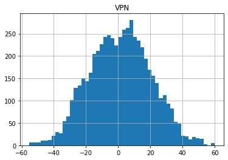
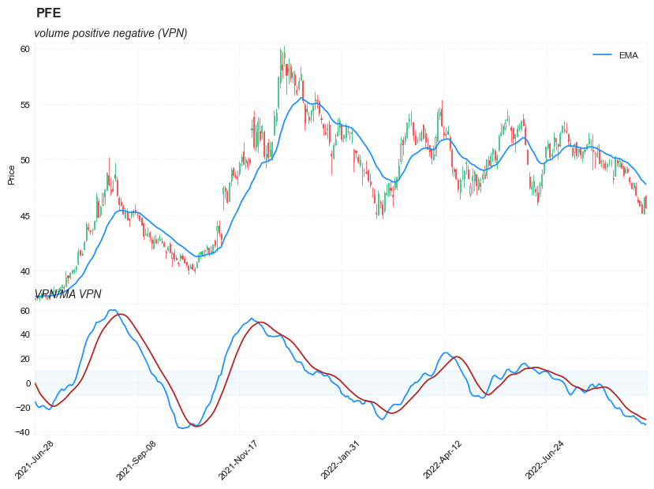

## Detecting High-Volume Breakouts: volume positive negative (VPN)

**References**


- [traders.com: TradersTips 2021-04](https://traders.com/Documentation/FEEDbk_docs/2021/04/TradersTips.html)


**█ OVERVIEW**

For this month’s Traders’ Tips, the focus is Markos Katsanos’ article in this issue, “Detecting High-Volume Breakouts.” Here, we present the April 2021 Traders’ Tips code with possible implementations in various software.


In his article in this issue, “Detecting High-Volume Breakouts,” author Markos Katsanos introduces an indicator called volume positive negative (VPN) that attempts to minimize entries in false breakouts. The indicator compares volume on “up” days versus the volume on “down” days and is normalized to oscillate between 100 and -100. 


##### Load basic packages 


```python
import pandas as pd
import numpy as np
import os
import gc
import copy
from pathlib import Path
from datetime import datetime, timedelta, time, date
```


```python
#this package is to download equity price data from yahoo finance
#the source code of this package can be found here: https://github.com/ranaroussi/yfinance/blob/main
import yfinance as yf
```


```python
pd.options.display.max_rows = 100
pd.options.display.max_columns = 100

import warnings
warnings.filterwarnings("ignore")

import pytorch_lightning as pl
random_seed=1234
pl.seed_everything(random_seed)
```

    Global seed set to 1234
    


    1234


```python
#S&P 500 (^GSPC),  Dow Jones Industrial Average (^DJI), NASDAQ Composite (^IXIC)
#Russell 2000 (^RUT), Crude Oil Nov 21 (CL=F), Gold Dec 21 (GC=F)
#Treasury Yield 10 Years (^TNX)
#CBOE Volatility Index (^VIX) Chicago Options - Chicago Options Delayed Price. Currency in USD

#benchmark_tickers = ['^GSPC', '^DJI', '^IXIC', '^RUT',  'CL=F', 'GC=F', '^TNX']

benchmark_tickers = ['^GSPC', '^VIX']
tickers = benchmark_tickers + ['GSK', 'BST', 'PFE']
```


```python
#https://github.com/ranaroussi/yfinance/blob/main/yfinance/base.py
#     def history(self, period="1mo", interval="1d",
#                 start=None, end=None, prepost=False, actions=True,
#                 auto_adjust=True, back_adjust=False,
#                 proxy=None, rounding=False, tz=None, timeout=None, **kwargs):

dfs = {}

for ticker in tickers:
    cur_data = yf.Ticker(ticker)
    hist = cur_data.history(period="max", start='2000-01-01')
    print(datetime.now(), ticker, hist.shape, hist.index.min(), hist.index.max())
    dfs[ticker] = hist
```

    2022-09-04 13:00:04.892846 ^GSPC (5706, 7) 1999-12-31 00:00:00 2022-09-02 00:00:00
    2022-09-04 13:00:05.222089 ^VIX (5706, 7) 1999-12-31 00:00:00 2022-09-02 00:00:00
    2022-09-04 13:00:05.642901 GSK (5706, 7) 1999-12-31 00:00:00 2022-09-02 00:00:00
    2022-09-04 13:00:05.906042 BST (1976, 7) 2014-10-29 00:00:00 2022-09-02 00:00:00
    2022-09-04 13:00:06.314786 PFE (5706, 7) 1999-12-31 00:00:00 2022-09-02 00:00:00
    


```python
ticker = 'PFE'
dfs[ticker].tail(5)
```


<div>
<style scoped>
    .dataframe tbody tr th:only-of-type {
        vertical-align: middle;
    }

    .dataframe tbody tr th {
        vertical-align: top;
    }

    .dataframe thead th {
        text-align: right;
    }
</style>
<table border="1" class="dataframe">
  <thead>
    <tr style="text-align: right;">
      <th></th>
      <th>Open</th>
      <th>High</th>
      <th>Low</th>
      <th>Close</th>
      <th>Volume</th>
      <th>Dividends</th>
      <th>Stock Splits</th>
    </tr>
    <tr>
      <th>Date</th>
      <th></th>
      <th></th>
      <th></th>
      <th></th>
      <th></th>
      <th></th>
      <th></th>
    </tr>
  </thead>
  <tbody>
    <tr>
      <th>2022-08-29</th>
      <td>46.380001</td>
      <td>46.689999</td>
      <td>46.119999</td>
      <td>46.230000</td>
      <td>13400500</td>
      <td>0.0</td>
      <td>0.0</td>
    </tr>
    <tr>
      <th>2022-08-30</th>
      <td>46.340000</td>
      <td>46.349998</td>
      <td>45.799999</td>
      <td>45.849998</td>
      <td>16303000</td>
      <td>0.0</td>
      <td>0.0</td>
    </tr>
    <tr>
      <th>2022-08-31</th>
      <td>46.009998</td>
      <td>46.290001</td>
      <td>45.130001</td>
      <td>45.230000</td>
      <td>26416800</td>
      <td>0.0</td>
      <td>0.0</td>
    </tr>
    <tr>
      <th>2022-09-01</th>
      <td>45.139999</td>
      <td>46.650002</td>
      <td>45.139999</td>
      <td>46.630001</td>
      <td>19947600</td>
      <td>0.0</td>
      <td>0.0</td>
    </tr>
    <tr>
      <th>2022-09-02</th>
      <td>46.740002</td>
      <td>46.799999</td>
      <td>45.529999</td>
      <td>45.700001</td>
      <td>14662700</td>
      <td>0.0</td>
      <td>0.0</td>
    </tr>
  </tbody>
</table>
</div>


##### Define volume positive negative (VPN)  calculation function


```python
from core.finta import TA
```


```python
def cal_vpn(ohlc: pd.DataFrame, 
            period: int = 30,
            ema_period: int = 3,
            mav_period: int = 30,
            adjust: bool = True 
            ) -> pd.Series:
    """
    source: https://traders.com/Documentation/FEEDbk_docs/2021/04/TradersTips.html

    Volume Positive Negative:

    pds:= Input( "Periods", 5, 100, 30);
    apr:= Typical();
    at:= ATR(pds) * 0.1;
    vpd:= If( apr >= Ref(apr, -1) + at, V, 0);
    vnd:= If( apr <= Ref(apr, -1) - at, V, 0);
    VP:= Sum(vpd, pds);
    VN:= Sum(vnd, pds);
    VPN:= (((VP - VN)/Mov(V, pds, S))/pds) * 100;
    VPN;
    Mov(VPN, 3, E)
    
    #------------------------------------------
    MF	Momentum( Avg3( High, Low, Close ), 1)
    MC	Mul2( 0.1, ATR( High, Low, Close, 30 ) )
    VP	Sum( IfThenElse( A>B( MF,  MC ), Volume, 0 ), 30 )
    VN	Sum( IfThenElse( A<B( MF, Neg(MC) ), Volume, 0), 30 )
    VPN	ExpAvg( Mul2( Divide( Divide( Sub( VP, VN ), Avg( Volume, 30 ) ), 30), 100 ), 3 )
    MAVPN	Avg( VPN, 30 )
   
"""      

    ohlc = ohlc.copy()
    ohlc.columns = [c.lower() for c in ohlc.columns]

    v = ohlc['volume']
    mav_ = v.rolling(period).mean()

    tp_ = TA.TP(ohlc) #typical price: (high + low + close)/3
    atr_ =  TA.ATR(ohlc, period = period)#Average True Range is moving average of True Range
    mf_ = tp_.diff(1) #momentum of typical price
    mc_ = atr_*0.1
    vol_up = (mf_ > mc_).astype(int)*v
    vol_down = (mf_ < (-1*mc_)).astype(int)*v
    vp_ = vol_up.rolling(period).sum()
    vn_ = vol_down.rolling(period).sum()
    
    mav_[mav_<=0] = 1
    vpn_ = ((vp_ - vn_)/mav_/period*100).ewm(span=ema_period, adjust=adjust).mean()
    ma_vpn_ = vpn_.rolling(mav_period).mean()   

    return pd.DataFrame(data = {'VPN': vpn_.values, 
                                'MA_VPN': ma_vpn_.values, 
                               },
                        index=ohlc.index, )    

```

##### Calculate volume positive negative (VPN)


```python
df = dfs[ticker][['Open', 'High', 'Low', 'Close', 'Volume']]
```


```python
df = df.round(2)
```


```python
cal_vpn
```


    <function __main__.cal_vpn(ohlc: pandas.core.frame.DataFrame, period: int = 30, ema_period: int = 3, mav_period: int = 30, adjust: bool = True) -> pandas.core.series.Series>


```python
df_ta = cal_vpn(df,  period=30, ema_period=5, mav_period=10)
df = df.merge(df_ta, left_index = True, right_index = True, how='inner' )

del df_ta
gc.collect()
```


    38


```python
from core.finta import TA
```


```python
df_ta = TA.EMA(df, period = 20, column="close")
df_ta.name='EMA'
df = df.merge(df_ta, left_index = True, right_index = True, how='inner' )

del df_ta
gc.collect()
```


    42


```python
display(df.head(5))
display(df.tail(5))
```


<div>
<style scoped>
    .dataframe tbody tr th:only-of-type {
        vertical-align: middle;
    }

    .dataframe tbody tr th {
        vertical-align: top;
    }

    .dataframe thead th {
        text-align: right;
    }
</style>
<table border="1" class="dataframe">
  <thead>
    <tr style="text-align: right;">
      <th></th>
      <th>Open</th>
      <th>High</th>
      <th>Low</th>
      <th>Close</th>
      <th>Volume</th>
      <th>VPN</th>
      <th>MA_VPN</th>
      <th>EMA</th>
    </tr>
    <tr>
      <th>Date</th>
      <th></th>
      <th></th>
      <th></th>
      <th></th>
      <th></th>
      <th></th>
      <th></th>
      <th></th>
    </tr>
  </thead>
  <tbody>
    <tr>
      <th>1999-12-31</th>
      <td>14.25</td>
      <td>14.31</td>
      <td>14.11</td>
      <td>14.22</td>
      <td>5939817</td>
      <td>NaN</td>
      <td>NaN</td>
      <td>14.220000</td>
    </tr>
    <tr>
      <th>2000-01-03</th>
      <td>14.06</td>
      <td>14.20</td>
      <td>13.87</td>
      <td>13.98</td>
      <td>12873345</td>
      <td>NaN</td>
      <td>NaN</td>
      <td>14.094000</td>
    </tr>
    <tr>
      <th>2000-01-04</th>
      <td>13.70</td>
      <td>13.81</td>
      <td>13.16</td>
      <td>13.46</td>
      <td>14208974</td>
      <td>NaN</td>
      <td>NaN</td>
      <td>13.861199</td>
    </tr>
    <tr>
      <th>2000-01-05</th>
      <td>13.54</td>
      <td>13.98</td>
      <td>13.51</td>
      <td>13.68</td>
      <td>12981591</td>
      <td>NaN</td>
      <td>NaN</td>
      <td>13.808890</td>
    </tr>
    <tr>
      <th>2000-01-06</th>
      <td>13.70</td>
      <td>14.36</td>
      <td>13.68</td>
      <td>14.17</td>
      <td>11115273</td>
      <td>NaN</td>
      <td>NaN</td>
      <td>13.896239</td>
    </tr>
  </tbody>
</table>
</div>


<div>
<style scoped>
    .dataframe tbody tr th:only-of-type {
        vertical-align: middle;
    }

    .dataframe tbody tr th {
        vertical-align: top;
    }

    .dataframe thead th {
        text-align: right;
    }
</style>
<table border="1" class="dataframe">
  <thead>
    <tr style="text-align: right;">
      <th></th>
      <th>Open</th>
      <th>High</th>
      <th>Low</th>
      <th>Close</th>
      <th>Volume</th>
      <th>VPN</th>
      <th>MA_VPN</th>
      <th>EMA</th>
    </tr>
    <tr>
      <th>Date</th>
      <th></th>
      <th></th>
      <th></th>
      <th></th>
      <th></th>
      <th></th>
      <th></th>
      <th></th>
    </tr>
  </thead>
  <tbody>
    <tr>
      <th>2022-08-29</th>
      <td>46.38</td>
      <td>46.69</td>
      <td>46.12</td>
      <td>46.23</td>
      <td>13400500</td>
      <td>-29.861533</td>
      <td>-26.409703</td>
      <td>48.728796</td>
    </tr>
    <tr>
      <th>2022-08-30</th>
      <td>46.34</td>
      <td>46.35</td>
      <td>45.80</td>
      <td>45.85</td>
      <td>16303000</td>
      <td>-31.559215</td>
      <td>-27.517568</td>
      <td>48.454625</td>
    </tr>
    <tr>
      <th>2022-08-31</th>
      <td>46.01</td>
      <td>46.29</td>
      <td>45.13</td>
      <td>45.23</td>
      <td>26416800</td>
      <td>-33.228053</td>
      <td>-28.602111</td>
      <td>48.147518</td>
    </tr>
    <tr>
      <th>2022-09-01</th>
      <td>45.14</td>
      <td>46.65</td>
      <td>45.14</td>
      <td>46.63</td>
      <td>19947600</td>
      <td>-33.037627</td>
      <td>-29.311578</td>
      <td>48.002992</td>
    </tr>
    <tr>
      <th>2022-09-02</th>
      <td>46.74</td>
      <td>46.80</td>
      <td>45.53</td>
      <td>45.70</td>
      <td>14662700</td>
      <td>-34.363353</td>
      <td>-30.020268</td>
      <td>47.783659</td>
    </tr>
  </tbody>
</table>
</div>


```python
df[['VPN']].hist(bins=50)
```


    array([[<AxesSubplot:title={'center':'VPN'}>]], dtype=object)


    

    


```python
#https://github.com/matplotlib/mplfinance
#this package help visualize financial data
import mplfinance as mpf
import matplotlib.colors as mcolors

# all_colors = list(mcolors.CSS4_COLORS.keys())#"CSS Colors"
# all_colors = list(mcolors.TABLEAU_COLORS.keys()) # "Tableau Palette",
# all_colors = list(mcolors.BASE_COLORS.keys()) #"Base Colors",
all_colors = ['dodgerblue', 'firebrick','limegreen','skyblue','lightgreen',  'navy','yellow','plum',  'yellowgreen']
#https://github.com/matplotlib/mplfinance/issues/181#issuecomment-667252575
#list of colors: https://matplotlib.org/stable/gallery/color/named_colors.html
#https://github.com/matplotlib/mplfinance/blob/master/examples/styles.ipynb

def make_3panels2(main_data, add_data, mid_panel=None, chart_type='candle', names=None, figratio=(14,9)):

    style = mpf.make_mpf_style(base_mpf_style='yahoo',  #charles
                               base_mpl_style = 'seaborn-whitegrid',
#                                marketcolors=mpf.make_marketcolors(up="r", down="#0000CC",inherit=True),
                               gridcolor="whitesmoke", 
                               gridstyle="--", #or None, or - for solid
                               gridaxis="both", 
                               edgecolor = 'whitesmoke',
                               facecolor = 'white', #background color within the graph edge
                               figcolor = 'white', #background color outside of the graph edge
                               y_on_right = False,
                               rc =  {'legend.fontsize': 'small',#or number
                                      #'figure.figsize': (14, 9),
                                     'axes.labelsize': 'small',
                                     'axes.titlesize':'small',
                                     'xtick.labelsize':'small',#'x-small', 'small','medium','large'
                                     'ytick.labelsize':'small'
                                     }, 
                              )   

    if (chart_type is None) or (chart_type not in ['ohlc', 'line', 'candle', 'hollow_and_filled']):
        chart_type = 'candle'
    len_dict = {'candle':2, 'ohlc':3, 'line':1, 'hollow_and_filled':2}    
        
    kwargs = dict(type=chart_type, figratio=figratio, volume=False, volume_panel=1, 
                  panel_ratios=(4,2), tight_layout=True, style=style, returnfig=True)
    
    if names is None:
        names = {'main_title': '', 'sub_tile': ''}
    
    added_plots = { 
#         'S':  mpf.make_addplot(add_data['S'], panel=0, color='blue', type='scatter', marker=r'${S}$' , markersize=100, secondary_y=False),   
#         'B':  mpf.make_addplot(add_data['B'], panel=0, color='blue', type='scatter', marker=r'${B}$' , markersize=100, secondary_y=False), 
        
        'EMA': mpf.make_addplot(add_data['EMA'], panel=0, color='dodgerblue', secondary_y=False), 
    }


      

    fb_bbands= []
    
    
    if mid_panel is not None:
        i = 0
        for name_, data_ in mid_panel.iteritems():
            added_plots[name_] = mpf.make_addplot(data_, panel=1, color=all_colors[i], secondary_y=False)
            i = i + 1
        fb_bbands2_ = dict(y1=-10*np.ones(mid_panel.shape[0]),
                      y2=10*np.ones(mid_panel.shape[0]),color="lightskyblue",alpha=0.1,interpolate=True)
        fb_bbands2_['panel'] = 1
        fb_bbands.append(fb_bbands2_)


    fig, axes = mpf.plot(main_data,  **kwargs,
                         addplot=list(added_plots.values()), 
                         fill_between=fb_bbands)
    # add a new suptitle
    fig.suptitle(names['main_title'], y=1.05, fontsize=12, x=0.1285)

    axes[0].legend([None]*4)
    handles = axes[0].get_legend().legendHandles
    axes[0].legend(handles=handles[2:],labels=['EMA'])
    axes[0].set_title(names['sub_tile'], fontsize=10, style='italic',  loc='left')
    axes[2].set_title('VPN/MA VPN', fontsize=10, style='italic',  loc='left')
    

#     axes[0].set_ylabel(names['y_tiles'][0])
#     axes[2].set_ylabel(names['y_tiles'][1])
    return fig, axes
   
```


```python

start = -300
end = df.shape[0]

names = {'main_title': f'{ticker}', 
         'sub_tile': 'volume positive negative (VPN) '}


aa_, bb_ = make_3panels2(df.iloc[start:end][['Open', 'High', 'Low', 'Close', 'Volume']], 
            df.iloc[start:end][['EMA']],
            df.iloc[start:end][['VPN', 'MA_VPN']],
             chart_type='hollow_and_filled',names = names)
```


    

    

